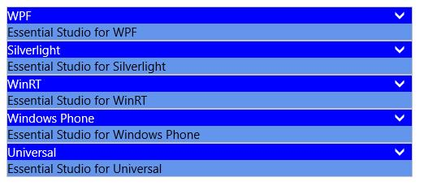

# Appearance and Styling in UWP Accordion (SfAccordion)

`AccentBrush` property is used to decorate the hot spots of a control with a solid color





<layout:SfAccordion HorizontalAlignment="Center"

VerticalAlignment="Center"            

DisplayMemberPath="Name" 

AccentBrush="Green"

ItemsSource="{Binding Employees}" />









accordion.AccentBrush = new SolidColorBrush() { Color = Windows.UI.Colors.Red };





accordion.AccentBrush = New SolidColorBrush() With {.Color = Windows.UI.Colors.Red}





## Customizing SfAccordion Item

`ItemContainerStyle` property is used to define the style for SfAccordionItems.





<layout:SfAccordion SelectionMode="OneOrMore">

<layout:SfAccordion.ItemContainerStyle>

</layout:SfAccordion.ItemContainerStyle>

<layout:SfAccordionItem Header="WPF"
                        Content="Essential Studio for WPF"/>

<layout:SfAccordionItem Header="Silverlight"
                        Content="Essential Studio for Silverlight"/>
						
<layout:SfAccordionItem Header="WinRT"
                        Content="Essential Studio for WinRT"/>
						
<layout:SfAccordionItem Header="Windows Phone"
                        Content="Essential Studio for Windows Phone"/>
						
<layout:SfAccordionItem Header="Universal"
                        Content="Essential Studio for Universal"/>
						
</layout:SfAccordion>





## Customizing Accordion Button

`AccordionButtonStyle` property is used to style the expander button which contains the header and expander button.

