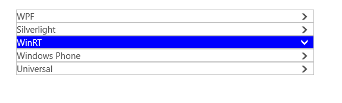
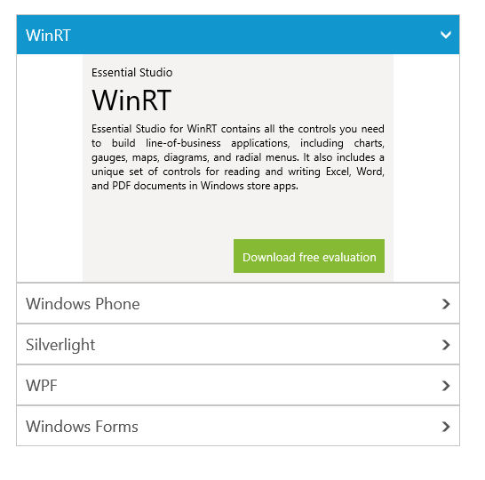

# Getting Started with UWP Accordion (SfAccordion)

This section explains how to create a long list of expandable items using SfAccordion control.

## Adding SfAccordion Control

Create a Universal Windows Platform project in Visual Studio and refer to the following assemblies.

* Syncfusion.SfAccordion.UWP

* Syncfusion.SfShared.UWP

1.Include the namespace for Syncfusion.SfAccordion.UWP assembly in MainPage.xaml





<Page xmlns="http://schemas.microsoft.com/winfx/2006/xaml/presentation"

xmlns:x="http://schemas.microsoft.com/winfx/2006/xaml"

xmlns:layout="using:Syncfusion.UI.Xaml.Controls.Layout">





2.Now add the `SfAccordion` control with a required optimal name using the included namespace





<layout:SfAccordion x:Name="accordion">





 SfAccordion accordion = new SfAccordion();





 Dim accordion As New SfAccordion()





## Adding Children to SfAccordion Control

`SfAccordion` accepts `SfAccordionItem` as its children when added directly. Here five SfAccordionItems are added as the children of the SfAccordion.





<layout:SfAccordion x:Name="accordion">

<layout:SfAccordionItem/>

<layout:SfAccordionItem/>

<layout:SfAccordionItem/>

<layout:SfAccordionItem/>

<layout:SfAccordionItem/>

</layout:SfAccordion>









  SfAccordion accordion = new SfAccordion();

  accordion.Items.Add(new SfAccordionItem());

  accordion.Items.Add(new SfAccordionItem());

  accordion.Items.Add(new SfAccordionItem());

  accordion.Items.Add(new SfAccordionItem());

  accordion.Items.Add(new SfAccordionItem());





  Dim accordion As New SfAccordion()

  accordion.Items.Add(New SfAccordionItem())

  accordion.Items.Add(New SfAccordionItem())

  accordion.Items.Add(New SfAccordionItem())

  accordion.Items.Add(New SfAccordionItem())

  accordion.Items.Add(New SfAccordionItem())





## Setting Header for Accordion Items

SfAccordionItem has `Header` property to set header for the accordion items. Set the header as “WinRT” and repeat the same procedure for remaining children with the value as “Windows Phone”, “Silverlight”, “WPF” and “Windows Forms”.





<layout:SfAccordion x:Name="accordion">

<layout:SfAccordionItem Header="WPF"/>

<layout:SfAccordionItem Header="Silverlight"/>

<layout:SfAccordionItem Header="WinRT"/>

<layout:SfAccordionItem Header="Windows Phone"/>

<layout:SfAccordionItem Header="Universal"/>

</layout:SfAccordion>









SfAccordion accordion = new SfAccordion();

accordion.Items.Add(new SfAccordionItem() { Header = "WPF" });

accordion.Items.Add(new SfAccordionItem() { Header = "Silverlight" });

accordion.Items.Add(new SfAccordionItem() { Header = "WinRT" });

accordion.Items.Add(new SfAccordionItem() { Header = "Windows Phone" });

accordion.Items.Add(new SfAccordionItem() { Header = "Universal" });





Dim accordion As New SfAccordion()

accordion.Items.Add(New SfAccordionItem() With {.Header = "WPF"})

accordion.Items.Add(New SfAccordionItem() With {.Header = "Silverlight"})

accordion.Items.Add(New SfAccordionItem() With {.Header = "WinRT"})

accordion.Items.Add(New SfAccordionItem() With {.Header = "Windows Phone"})

accordion.Items.Add(New SfAccordionItem() With {.Header = "Universal"})





## Applying Template for Item Header

SfAccordion provides `HeaderTemplate` property that allows to apply a common data template for all accordion items header.





<layout:SfAccordion x:Name="accordion">

<layout:SfAccordion.HeaderTemplate>

<DataTemplate>

<Grid>

<TextBlock Text="{Binding}" Margin="10" FontSize="18"/>

</Grid>

</DataTemplate>

</layout:SfAccordion.HeaderTemplate>





## Setting Content for Children

Any object can be set as the content of `SfAccordionItem`. SfAccordionItem.Content property helps to set the content.





<layout:SfAccordion x:Name="accordion" SelectedIndex="0"
                                           AccentBrush="#FF1196CD">
<layout:SfAccordion.HeaderTemplate>

<DataTemplate>

<Grid>

<TextBlock Text="{Binding}" Margin="10" FontSize="18"/>

</Grid>

</DataTemplate>

</layout:SfAccordion.HeaderTemplate>

<layout:SfAccordionItem Header="WinRT">

<Grid Height="256" Background="#FFF4F3F2" Width="350">

<Grid.RowDefinitions>

<RowDefinition Height="Auto"/>

<RowDefinition Height="Auto"/>

<RowDefinition />

<RowDefinition Height="Auto"/>

<RowDefinition Height="Auto"/>

</Grid.RowDefinitions>

<TextBlock Text="Essential Studio" Margin="10,10,10,2" FontSize="13.333"/>

<TextBlock Text="WinRT" Grid.Row="1" Margin="10,-2,10,10" FontSize="32" />

<RichTextBlock Margin="10,-6,10,10" Grid.Row="2" TextAlignment="Justify">

<Paragraph>

<Run Text="Essential Studio for WinRT contains all the controls you need to build line-of-business applications, including charts, gauges, maps, diagrams, and radial menus. It also includes a unique set of controls for reading and writing Excel, Word, and PDF documents in Windows store apps."
FontSize="12"/>

</Paragraph>

<Paragraph />

<Paragraph>

<Run Text="All WinRT controls are optimized for touch, supporting common gestures: zooming, panning, selecting, double-tapping, rotating, resizing. Interaction feels natural, letting you build a native user interface to delight your users."
FontSize="12"/>

</Paragraph>

</RichTextBlock>

<Border Grid.Row="3" Padding="10" Margin="10" Width="170"
        HorizontalAlignment="Right" Background="#FF86BA35">
		
<TextBlock Text="Download free evaluation"
           Foreground="White" FontSize="13.333"/>
		   
</Border>

</Grid>

</layout:SfAccordionItem>

<layout:SfAccordionItem Header="Windows Phone">

<Grid Height="256" Background="#FFF4F3F2" Width="350">

<Grid.RowDefinitions>

<RowDefinition Height="Auto"/>

<RowDefinition Height="Auto"/>

<RowDefinition />

<RowDefinition Height="Auto"/>

<RowDefinition Height="Auto"/>

</Grid.RowDefinitions>

<TextBlock Text="Essential Studio" Margin="10,10,10,2"
                                   FontSize="13.333"/>
								   
<TextBlock Text="Windows Phone" Grid.Row="1"
           Margin="10,-2,10,10" FontSize="32" />
		   
<RichTextBlock Margin="10,-6,10,10" Grid.Row="2"
               TextAlignment="Justify">
			   
<Paragraph>

<Run Text="Essential Studio for Windows Phone 7 contains all the controls you need to build line-of-business mobile applications including charts, gauges, maps, editors, and much more."
FontSize="12"/>

</Paragraph>

<Paragraph />

<Paragraph>

<Run Text="All components in the toolkit solve real problems; we never include controls just to increase the total count. Every component has been built as a solution to a real problem that developers face when creating enterprise applications."
FontSize="12"/>

</Paragraph>

</RichTextBlock>

<Border Grid.Row="3" Padding="10" Margin="10"
        Width="170" HorizontalAlignment="Right"
		Background="#FF86BA35">
		
<TextBlock Text="Download free evaluation"
           Foreground="White" FontSize="13.333"/>
		   
</Border>

</Grid>

</layout:SfAccordionItem>

<layout:SfAccordionItem Header="Silverlight">

<Grid Height="256" Background="#FFF4F3F2" Width="350">

<Grid.RowDefinitions>

<RowDefinition Height="Auto"/>

<RowDefinition Height="Auto"/>

<RowDefinition />

<RowDefinition Height="Auto"/>

<RowDefinition Height="Auto"/>

</Grid.RowDefinitions>

<TextBlock Text="Essential Studio" Margin="10,10,10,2"
                                   FontSize="13.333"/>
								   
<TextBlock Text="Silverlight" Grid.Row="1"
           Margin="10,-2,10,10" FontSize="32" />
		   
<RichTextBlock Margin="10,-6,10,10" Grid.Row="2"
               TextAlignment="Justify">
			   
<Paragraph>

<Run Text="Essential Studio for Silverlight contains all the controls you need for building typical line-of-business web applications including grids, charts, gauges, menus, calendars, editors, and much more. It also includes some unique controls that enable your applications to read and write Excel, Word, and PDF documents." FontSize="12"/>

</Paragraph>

<Paragraph />

<Paragraph>

<Run Text="All components in the toolkit solve real problems; we never include controls just to increase the total count. Every component has been built as a solution to a real problem that developers face when creating enterprise applications."
FontSize="12"/>

</Paragraph>

</RichTextBlock>

<Border Grid.Row="3" Padding="10" Margin="10" Width="170"
        HorizontalAlignment="Right" Background="#FF86BA35">
		
<TextBlock Text="Download free evaluation"
           Foreground="White" FontSize="13.333"/>
		   
</Border>

</Grid>

</layout:SfAccordionItem>

<layout:SfAccordionItem Header="WPF">

<Grid Height="256" Background="#FFF4F3F2" Width="350">

<Grid.RowDefinitions>

<RowDefinition Height="Auto"/>

<RowDefinition Height="Auto"/>

<RowDefinition />

<RowDefinition Height="Auto"/>

<RowDefinition Height="Auto"/>

</Grid.RowDefinitions>

<TextBlock Text="Essential Studio"
           Margin="10,10,10,2" FontSize="13.333"/>

<TextBlock Text="WPF" Grid.Row="1"
           Margin="10,-2,10,10" FontSize="32" />

<RichTextBlock Margin="10,-6,10,10"
               Grid.Row="2" TextAlignment="Justify">
			   
<Paragraph>

<Run Text="Essential Studio for WPF contains all the controls that you need for building typical line-of-business web applications including grids, charts, gauges, menus, calendars, editors, and much more. It also includes some unique controls that enable your applications to read and write Excel, Word, and PDF documents." FontSize="12"/>

</Paragraph>

<Paragraph />

<Paragraph>

<Run Text="All components in the toolkit solve real problems; we never include controls just to increase the total count. Every component has been built as a solution to a real problem that developers face when creating enterprise applications."
FontSize="12"/>

</Paragraph>

</RichTextBlock>

<Border Grid.Row="3" Padding="10" Margin="10"
        Width="170" HorizontalAlignment="Right"
		Background="#FF86BA35">
		
<TextBlock Text="Download free evaluation"
           Foreground="White" FontSize="13.333"/>
		   
</Border>

</Grid>

</layout:SfAccordionItem>

<layout:SfAccordionItem Header="Windows Forms">

<Grid Height="256" Background="#FFF4F3F2" Width="350">

<Grid.RowDefinitions>

<RowDefinition Height="Auto"/>

<RowDefinition Height="Auto"/>

<RowDefinition />

<RowDefinition Height="Auto"/>

<RowDefinition Height="Auto"/>

</Grid.RowDefinitions>

<TextBlock Text="Essential Studio"
           Margin="10,10,10,2" FontSize="13.333"/>
		   
<TextBlock Text="Windows Forms" Grid.Row="1"
           Margin="10,-2,10,10" FontSize="32" />
		   
<RichTextBlock Margin="10,-6,10,10" Grid.Row="2"
               TextAlignment="Justify">
			   
<Paragraph>

<Run Text="Essential Studio for Windows Forms contains all the controls that you need for building typical line-of-business web applications including grids, charts, gauges, menus, calendars, editors, and much more. It also includes some unique controls that enable your applications to read and write Excel, Word, and PDF documents." FontSize="12"/>

</Paragraph>

<Paragraph />

<Paragraph>

<Run Text="All components in the toolkit solve real problems; we never include controls just to increase the total count. Every component has been built as a solution to a real problem that developers face when creating enterprise applications."
FontSize="12"/>

</Paragraph>

</RichTextBlock>

<Border Grid.Row="3" Padding="10" Margin="10"
        Width="170" HorizontalAlignment="Right"
		Background="#FF86BA35">
		
<TextBlock Text="Download free evaluation"
           Foreground="White" FontSize="13.333"/>
		   
</Border>

</Grid>

</layout:SfAccordionItem>

</layout:SfAccordion>





