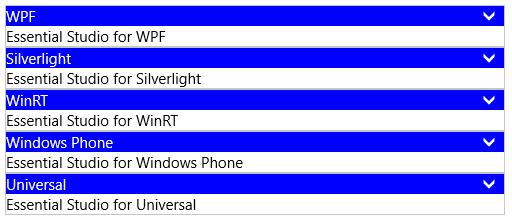

# Selection Mode in UWP Accordion (SfAccordion)

`SfAccordion` provides a property `SelectionMode` that helps to decide the number of items that can be expanded or selected at a time. The values of SelectionMode's are

1. One
2. OneOrMore
3. ZeroOrOne
4. ZeroOrMore

The default selection mode is One. 

## SelectionMode - One

* Only one item can be in expanded/selected state.
* One item must be in expanded/selected state.
* Does not allows to unselect all the items. 

## SelectionMode - OneOrMore

* More than one items can be in expanded/selected state. 
* One item must be in expanded/selected state.
* Does not allows to unselect all the items. 

## SelectionMode - ZeroOrOne

* Only one item can be in expanded/selected state.
* Allows to unselect all the items. 

## SelectionMode - ZeroOrMore

* More than one items can be in expanded/selected state.
* Allows to unselect all the items. 

Here is an example showing OneOrMore `SelectionMode`:





<layout:SfAccordion SelectionMode="OneOrMore">

<layout:SfAccordionItem Header="WPF" Content="Essential Studio for WPF"/>

<layout:SfAccordionItem Header="Silverlight" Content="Essential Studio for Silverlight"/>

<layout:SfAccordionItem Header="WinRT" Content="Essential Studio for WinRT"/>

<layout:SfAccordionItem Header="Windows Phone" Content="Essential Studio for Windows Phone"/>

<layout:SfAccordionItem Header="Universal" Content="Essential Studio for Universal"/>

</layout:SfAccordion>









accordion.SelectionMode = AccordionSelectionMode.OneOrMore;





accordion.SelectionMode = AccordionSelectionMode.OneOrMore





