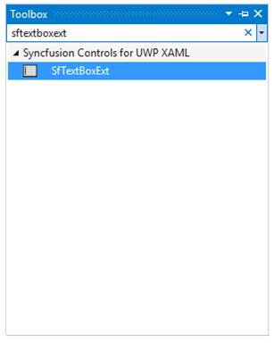
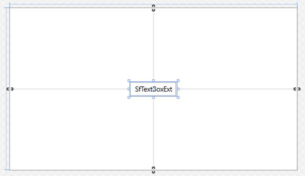
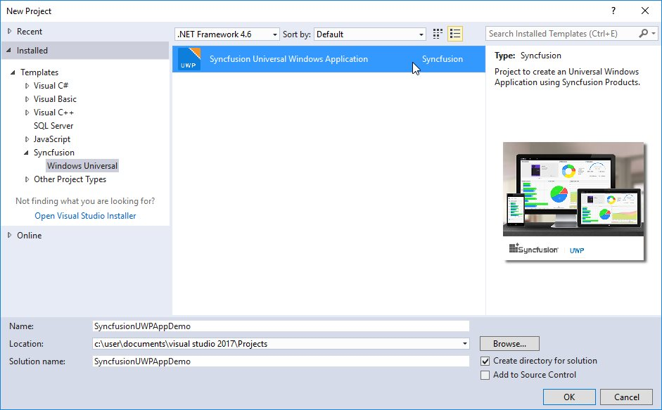
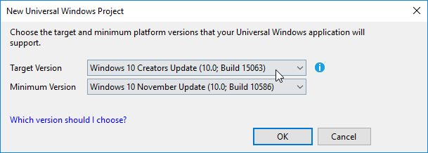
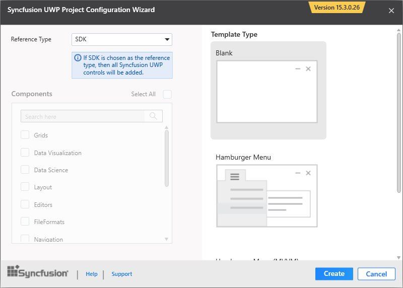

# Add Syncfusion Controls

The Syncfusion UWP controls can be added in a Visual Studio projects by using either of the following ways,

* Through Designer
* Through Code-Behind
* Through Project Templates

## Through Designer

Syncfusion UI for UWP are added automatically to the Visual Studio Toolbox during installation. The following steps helps to add required Essential UWP control through drag and drop from Toolbox. For example: SfTextBoxExt 

1. Create a Universal Windows Platform project in Visual Studio.

2. Find `SfTextBoxExt` by typing the text “SfTextBoxExt” in search box.

3.Drag `SfTextBoxExt` and drop it in the designer.

## Through XAML

The following steps helps to add a required Essential UWP control through XAML Code, for example: SfTextBoxExt.

1.Create a Universal Windows Platform project in Visual Studio and refer the following assemblies.

 * Syncfusion.SfInput.UWP.dll
 * Syncfusion.SfShared.UWP.dll

2.Include XML namespace for the above assemblies in MainPage.xaml.


	


<Page xmlns="(http://schemas.microsoft.com/winfx/2006/xaml/presentation"

xmlns:x="http://schemas.microsoft.com/winfx/2006/xaml"

xmlns:input="using:Syncfusion.UI.Xaml.Controls.Input">





3.Now, Add the `SfTextBoxExt` control with a required optimal name, using the included namespace.





<input:SfTextBoxExt x:Name="sftextboxExt">





## Through Code-Behind

Syncfusion UI for UWP can added at runtime using C# / VB. The following steps helps to add required Essential UWP control through code. For example: SfTextBoxExt.

1.Create a Universal Windows Platform project in Visual Studio and refer to the following assemblies.

 * Syncfusion.SfInput.UWP.dll
 * Syncfusion.SfShared.UWP.dll

2.Create an instance of `SfTextBoxExt` using its namespace and set the required properties.





Syncfusion.UI.Xaml.Controls.Input.SfTextBoxExt textBoxExt1 = new Syncfusion.UI.Xaml.Controls.Input.SfTextBoxExt();

textBoxExt1.Height = 20;

textBoxExt1.Width = 120;

textBoxExt1.Margin = new Thickness(10, 10, 10, 10);

textBoxExt1.VerticalAlignment = VerticalAlignment.Center;

textBoxExt1.HorizontalAlignment = HorizontalAlignment.Center;




 
Dim textBoxExt1 As New Syncfusion.UI.Xaml.Controls.Input.SfTextBoxExt()

textBoxExt1.Height = 20

textBoxExt1.Width = 120

textBoxExt1.Margin = New Thickness(10, 10, 10, 10)

textBoxExt1.VerticalAlignment = VerticalAlignment.Center

textBoxExt1.HorizontalAlignment = HorizontalAlignment.Center





3.Add the created instance to MainPage.





this.Content = textBoxExt1;





Me.Content = textBoxExt1





N> Syncfusion controls for UWP package can be added (available under Universal Windows Platform => Extensions tab in Add reference dialog) in the cases of using most of the controls from Syncfusion toolkit.

## Through Project Templates

Syncfusion provides the **Visual** **Studio** **Project** **Templates** for the Syncfusion UWP platform to create Syncfusion UWP Applications.  

I> The Syncfusion UWP project templates are available from Essential Studio v15.3.0.26.  

### Create Syncfusion UWP Application

The following steps direct you to create the **Syncfusion** **UWP** **Application** through the **Visual** **Studio** **Project** **Template**.

1. To create a Syncfusion UWP project, choose **New** **Project****->** **Syncfusion****->****Universal** **Windows****->****Syncfusion** **Universal** **Windows** **Application** from **Visual** **Studio**.

   

2. Name the **Project** and choose the destination location if required, then click **OK**. 

3. The Target platform version selection wizard appears. Choose the target and minimum platform versions that your UWP application will support and click OK.

   

4. Then Project Configuration Wizard appears. Choose the options to configure the Syncfusion UWP Application by using the following Project Configuration dialog.

   #### Project configurations:

   **Reference Type:** Select the reference type of UWP Project, either Assemblies or SDK.

   **Template Type:** Select the template type of UWP Project, either Blank or Hamburger Menu or Hamburger Menu (MVVM).

   **Components:** Choose the required Syncfusion components to configure.
   
   
   
   N> If SDK is chosen as the reference type, then all the Syncfusion UWP controls will be added. So, you no need to select any components.

   
   
5. Once you click Create button, the Syncfusion UWP Application is created.

6. Once the Project Configuration Wizard is done, the Syncfusion UWP Application is created with required SDK/references and pages.

   