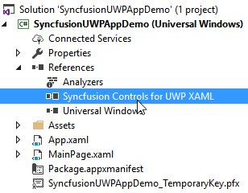
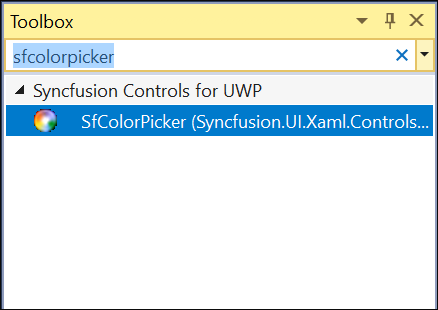

# Add Syncfusion UWP Controls

The Syncfusion&reg; UWP controls can be added in a Visual Studio projects by using either of the following ways,

* Through Designer
* Through Code-Behind
* Through Project Templates
* Through NuGet Packages

## Through Designer

Syncfusion&reg; UI for UWP are added automatically to the Visual Studio Toolbox during installation. The following steps helps to add required Essential UWP control through drag and drop from Toolbox. For example: SfTextBoxExt 

1. Create a Universal Windows Platform project in Visual Studio.

2. Find `SfTextBoxExt` by typing the text “SfTextBoxExt” in search box.

3.Drag `SfTextBoxExt` and drop it in the designer.

## Through XAML

The following steps helps to add a required Essential UWP control through XAML Code, for example: SfTextBoxExt.

1.Create a Universal Windows Platform project in Visual Studio and refer the following assemblies.

 * Syncfusion.SfInput.UWP.dll
 * Syncfusion.SfShared.UWP.dll

2.Include XML namespace for the above assemblies in MainPage.xaml.


	


<Page xmlns="(http://schemas.microsoft.com/winfx/2006/xaml/presentation"

xmlns:x="http://schemas.microsoft.com/winfx/2006/xaml"

xmlns:input="using:Syncfusion.UI.Xaml.Controls.Input">





3.Now, Add the `SfTextBoxExt` control with a required optimal name, using the included namespace.





<input:SfTextBoxExt x:Name="sftextboxExt">





## Through Code-Behind

Syncfusion&reg; UI for UWP can added at runtime using C# / VB. The following steps helps to add required Essential UWP control through code. For example: SfTextBoxExt.

1.Create a Universal Windows Platform project in Visual Studio and refer to the following assemblies.

 * Syncfusion.SfInput.UWP.dll
 * Syncfusion.SfShared.UWP.dll

2.Create an instance of `SfTextBoxExt` using its namespace and set the required properties.





Syncfusion.UI.Xaml.Controls.Input.SfTextBoxExt textBoxExt1 = new Syncfusion.UI.Xaml.Controls.Input.SfTextBoxExt();

textBoxExt1.Height = 20;

textBoxExt1.Width = 120;

textBoxExt1.Margin = new Thickness(10, 10, 10, 10);

textBoxExt1.VerticalAlignment = VerticalAlignment.Center;

textBoxExt1.HorizontalAlignment = HorizontalAlignment.Center;




 
Dim textBoxExt1 As New Syncfusion.UI.Xaml.Controls.Input.SfTextBoxExt()

textBoxExt1.Height = 20

textBoxExt1.Width = 120

textBoxExt1.Margin = New Thickness(10, 10, 10, 10)

textBoxExt1.VerticalAlignment = VerticalAlignment.Center

textBoxExt1.HorizontalAlignment = HorizontalAlignment.Center





3.Add the created instance to MainPage.





this.Content = textBoxExt1;





Me.Content = textBoxExt1





N> Syncfusion&reg; controls for UWP package can be added (available under Universal Windows Platform => Extensions tab in Add reference dialog) in the cases of using most of the controls from Syncfusion&reg; toolkit.

## Through Project Templates

Syncfusion&reg; provides the **Visual** **Studio** **Project** **Templates** for the Syncfusion&reg; UWP platform to create Syncfusion&reg; UWP Applications.  

I> The Syncfusion&reg; UWP project templates are available from Essential Studio v15.3.0.26.  

### Create Syncfusion&reg; UWP Application

The following steps direct you to create the **Syncfusion** **UWP** **Application** through the **Visual** **Studio** **Project** **Template**.

1. To create a Syncfusion&reg; UWP project, choose **New** **Project****->** **Syncfusion****->****Universal** **Windows****->****Syncfusion** **Universal** **Windows** **Application** from **Visual** **Studio**.

   

2. Name the **Project** and choose the destination location if required, then click **OK**. 

3. Then Project Configuration Wizard appears. Choose the options to configure the Syncfusion&reg; UWP Application by using the following Project Configuration dialog.

   #### Project configurations:

   **Language:** Select the language, either Visual C# or Visual Basic.

   **Reference Type:** Select the reference type of UWP Project, either Assemblies or SDK.

   **Target Version:** Choose the Target Version of the UWP platform that your project is targeting. This sets the **TargetPlatformVersion** setting in your project file.

   **Minimum Version:** Choose the Minimum Version of the UWP platform that your project can work with. This sets the **TargetPlatformMinVersion** setting in your project file.

   **Template Type:** Select the template type of UWP Project, either Blank or Hamburger Menu or Hamburger Menu (MVVM).

   **Components:** Choose the required Syncfusion&reg; components to configure.
   
   
   
   N> If SDK is chosen as the reference type, then all the Syncfusion&reg; UWP controls will be added. So, you no need to select any components.
   
4. Once you click Create button, the Syncfusion&reg; UWP Application is created.

5. Once the Project Configuration Wizard is done, the Syncfusion&reg; UWP Application is created with required SDK/references and pages.

   

6. Then, Syncfusion&reg; licensing registration required message box will be shown as follow, if you are installed the trial setup or NuGet packages since Syncfusion introduced the licensing system from 2018 Volume 2 (v16.2.0.41) Essential Studio release. Please navigate to the [help topic](https://help.syncfusion.com/common/essential-studio/licensing/license-key#how-to-generate-syncfusion-license-key) which is shown in the licensing message box to generate and register the Syncfusion&reg; license key to your project. Refer to this [blog](https://blog.syncfusion.com/post/Whats-New-in-2018-Volume-2-Licensing-Changes-in-the-1620x-Version-of-Essential-Studio.aspx) post for understanding the licensing changes introduced in Essential Studio.

   

## Through NuGet Packages

Syncfusion&reg; UI for UWP are added automatically to the specific Visual Studio UWP application Toolbox during Syncfusion&reg; NuGet package installation. Please refer below topic to configure and install the Syncfusion&reg; UWP NuGet packages in UWP application from Visual Studio.

[Configuring Syncfusion NuGet packages in Visual Studio](https://help.syncfusion.com/uwp/visual-studio-integration/nuget-packages)

After Installed required Syncfusion&reg; UWP NuGet packages in your application, we can utilize the Syncfusion&reg; UWP controls by following ways. 

* Through Designer
* Through XMAL
* Through Code-Behind

1.Syncfusion&reg; UI for UWP are added automatically to the specific Visual Studio UWP application Toolbox during Syncfusion&reg; NuGet package installation. We can add required Syncfusion&reg; UWP control through drag and drop from ToolBox. Toolbox configured from Syncfusion&reg; UWP NuGet package, controls will be listed under “Syncfusion&reg; controls for UWP” category. For example: SfColorPicker

   
    
   

   N> Toolbox configuration by installing UWP NuGet packages support available from v15.4.0.17.

2.The following steps helps to add a required Essential UWP control through XAML code, for example: SfColorPicker

a. Include the namespace for Syncfusion.SfColorPickers.UWP assembly from Syncfusion.SfColorPickers.UWP NuGet package in MainPage.xaml.

        

        

        <Page xmlns="http://schemas.microsoft.com/winfx/2006/xaml/presentation"

        xmlns:x="http://schemas.microsoft.com/winfx/2006/xaml"

        xmlns:media="using:Syncfusion.UI.Xaml.Controls.Media">

        

        

b. Now add the `SfColorPicker` control with a required optimal name using the included namespace

        

        

        <media:SfColorPicker x:Name="colorPicker">

        

        

3.The following steps helps to add a required Essential UWP control through code, for example: SfColorPicker
        
a. Include the namespace for Syncfusion. SfColorPickers.UWP assembly in MainPage.xaml.cs

        

        

        using Syncfusion.UI.Xaml.Controls.Media;

        

        

        Imports Syncfusion.UI.Xaml.Controls.Media

        

        

b. Now add the SfColorPicker control with a required optimal name 

        

        

        SfColorPicker colorPicker = new SfColorPicker();

        

        

        Dim colorPicker As New SfColorPicker()

        

        

