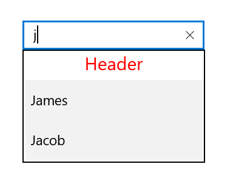
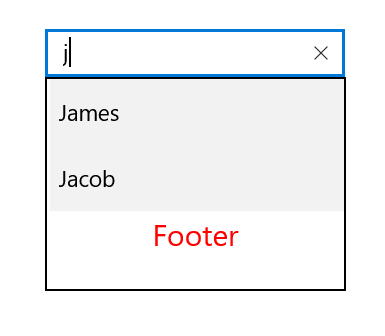

# Header and Footer in UWP AutoComplete (SfTextBoxExt)

You can provide header and footer views in a suggestion list in AutoComplete by enabling the `ShowDropDownHeaderView` and `ShowDropDownFooterView` properties. 

## Header content

You can provide the header content at the top of the suggestion box. The `DropDownHeaderView` property is used to set content to the header. The height of the header in the AutoComplete can be adjusted using the `DropDownHeaderViewHeight` property.





<Page
    x:Class="TextBoxExtSample.MainPage"
    xmlns="http://schemas.microsoft.com/winfx/2006/xaml/presentation"
    xmlns:x="http://schemas.microsoft.com/winfx/2006/xaml"
    xmlns:local="using:TextBoxExtSample"
    xmlns:d="http://schemas.microsoft.com/expression/blend/2008"
    xmlns:mc="http://schemas.openxmlformats.org/markup-compatibility/2006"
    mc:Ignorable="d"
    xmlns:editors="using:Syncfusion.UI.Xaml.Controls.Input"
    Background="{ThemeResource ApplicationPageBackgroundThemeBrush}">

    <Grid Background="{StaticResource ApplicationPageBackgroundThemeBrush}">

        <editors:SfTextBoxExt x:Name="textBoxExt" 
                              HorizontalAlignment="Center" 
                              VerticalAlignment="Center" 
                              AutoCompleteMode="Suggest"
                              Width="200"
                              ShowDropDownHeaderView="True"
                              DropDownHeaderViewHeight="50">
            <editors:SfTextBoxExt.DropDownHeaderView>
                <StackPanel>
                    <TextBlock x:Name="SearchLabel" 
                               Text="Header"
                               FontSize="20" 
                               VerticalAlignment="Center" 
                               HorizontalTextAlignment="Center" 
                               Foreground="Red"/>
                </StackPanel>
            </editors:SfTextBoxExt.DropDownHeaderView>
        </editors:SfTextBoxExt>
    </Grid>
</Page>





using Syncfusion.UI.Xaml.Controls.Input;
using System.Collections.Generic;
using Windows.UI;
using Windows.UI.Xaml;
using Windows.UI.Xaml.Controls;
using Windows.UI.Xaml.Media;

// The Blank Page item template is documented at https://go.microsoft.com/fwlink/?LinkId=402352&clcid=0x409

namespace TextBoxExtSample
{
    /// 

    /// An empty page that can be used on its own or navigated to within a Frame.
    /// 

    public sealed partial class MainPage : Page
    {
        public MainPage()
        {
            this.InitializeComponent();
            SfTextBoxExt textBoxExt = new SfTextBoxExt()
            {
                HorizontalAlignment = HorizontalAlignment.Center,
                VerticalAlignment = VerticalAlignment.Center,
                Width = 200,
                AutoCompleteMode = AutoCompleteMode.Suggest,
                ShowDropDownHeaderView = true,
                DropDownHeaderViewHeight = 50
            };

            List<string> list = new List<string>()
            {
                 "Lucas",
                 "James",
                 "Jacob"
            };

            textBoxExt.AutoCompleteSource = list;

            StackPanel stackPanel = new StackPanel();
            SearchLabel = new TextBlock()
            {
                Text = "Header",
                FontSize = 20,
                VerticalAlignment = VerticalAlignment.Center,
                HorizontalTextAlignment = TextAlignment.Center,
                Foreground = new SolidColorBrush(Colors.Red)
            };

            stackPanel.Children.Add(SearchLabel);
            textBoxExt.DropDownHeaderView = stackPanel;
            this.Content = textBoxExt;
        }
    }
}





## Footer content

You can provide the footer content at the bottom of the suggestion box. The `DropDownFooterView` property is used to set the content of the footer. The height of the header in the AutoComplete can be adjusted using the `DropDownFooterViewHeight` property.

The following code example demonstrates how to set the footer content in AutoComplete.





<Page
    x:Class="TextBoxExtSample.MainPage"
    xmlns="http://schemas.microsoft.com/winfx/2006/xaml/presentation"
    xmlns:x="http://schemas.microsoft.com/winfx/2006/xaml"
    xmlns:local="using:TextBoxExtSample"
    xmlns:d="http://schemas.microsoft.com/expression/blend/2008"
    xmlns:mc="http://schemas.openxmlformats.org/markup-compatibility/2006"
    mc:Ignorable="d"
    xmlns:editors="using:Syncfusion.UI.Xaml.Controls.Input"
    Background="{ThemeResource ApplicationPageBackgroundThemeBrush}">

    <Grid Background="{StaticResource ApplicationPageBackgroundThemeBrush}">

        <editors:SfTextBoxExt x:Name="textBoxExt" 
                              HorizontalAlignment="Center" 
                              VerticalAlignment="Center" 
                              AutoCompleteMode="Suggest"
                              Width="200"
                              ShowDropDownFooterView="True"
                              DropDownFooterViewHeight="50">
            <editors:SfTextBoxExt.DropDownFooterView>
                <StackPanel>
                    <TextBlock x:Name="SearchLabel" 
                               Text="Header"
                               FontSize="20" 
                               VerticalAlignment="Center" 
                               HorizontalTextAlignment="Center" 
                               Foreground="Red"/>
                </StackPanel>
            </editors:SfTextBoxExt.DropDownFooterView>
        </editors:SfTextBoxExt>
    </Grid>
</Page>





using Syncfusion.UI.Xaml.Controls.Input;
using System.Collections.Generic;
using Windows.UI;
using Windows.UI.Xaml;
using Windows.UI.Xaml.Controls;
using Windows.UI.Xaml.Media;

// The Blank Page item template is documented at https://go.microsoft.com/fwlink/?LinkId=402352&clcid=0x409

namespace TextBoxExtSample
{
    /// 

    /// An empty page that can be used on its own or navigated to within a Frame.
    /// 

    public sealed partial class MainPage : Page
    {
        public MainPage()
        {
            this.InitializeComponent();
            SfTextBoxExt textBoxExt = new SfTextBoxExt()
            {
                HorizontalAlignment = HorizontalAlignment.Center,
                VerticalAlignment = VerticalAlignment.Center,
                Width = 200,
                AutoCompleteMode = AutoCompleteMode.Suggest,
                ShowDropDownFooterView = true,
                DropDownFooterViewHeight = 50
            };

            List<string> list = new List<string>()
            {
                 "Lucas",
                 "James",
                 "Jacob"
            };

            textBoxExt.AutoCompleteSource = list;

            StackPanel stackPanel = new StackPanel();
            SearchLabel = new TextBlock()
            {
                Text = "Footer",
                FontSize = 20,
                VerticalAlignment = VerticalAlignment.Center,
                HorizontalTextAlignment = TextAlignment.Center,
                Foreground = new SolidColorBrush(Colors.Red)
            };

            stackPanel.Children.Add(SearchLabel);
            textBoxExt.DropDownFooterView = stackPanel;
            this.Content = textBoxExt;
        }
    }
}





