# AutoComplete in UWP AutoComplete (SfTextBoxExt)

AutoComplete functionality provides suggestions to the user while typing. There are several modes of suggestions. The suggested text can be appended to the original text or it can be displayed in a drop-down list so that user can choose from different options.

## AutoComplete Source

The SfTextBoxExt control can be populated with a predefined list of items, which will assist the user while typing. Users can choose one item from the filtered list.

For illustration, let us create a SfTextBoxExt, which will populate a list of employees.

The Employee model looks as shown below:



 

   public class Employee

    {

        public string Name { get; set; }

        public string Email { get; set; }

    }



 

   Public Class Employee

		Public Property Name() As String

		Public Property Email() As String

End Class





Create a collection attribute.





     private List<Employee> employees;

     public List<Employee> Employees

     {

         get { return employees; }

         set { employees = value; }

     }





 Private employees_Renamed As List(Of Employee)

 Public Property Employees() As List(Of Employee)

		 Get
			 Return employees_Renamed
		 End Get

		 Set(ByVal value As List(Of Employee))
			 employees_Renamed = value
		 End Set

 End Property





Populate the collection with items.





Employees = new List<Employee>();

Employees.Add(new Employee{Name = "Lucas", Email = "lucas@syncfusion.com"});

Employees.Add(new Employee { Name = "James", Email = "james@syncfusion.com" });

Employees.Add(new Employee { Name = "Jacob", Email = "jacob@syncfusion.com" });





Employees = New List(Of Employee)()

Employees.Add(New Employee With {
	.Name = "Lucas",
	.Email = "lucas@syncfusion.com"
})

Employees.Add(New Employee With {
	.Name = "James",
	.Email = "james@syncfusion.com"
})

Employees.Add(New Employee With {
	.Name = "Jacob",
	.Email = "jacob@syncfusion.com"
})





Bind the Employees collection to the AutoCompleteSource property of SfTextBoxExt.





<editors:SfTextBoxExt HorizontalAlignment="Center" 

                            VerticalAlignment="Center" 

                            Width="400"

AutoCompleteSource="{Binding Employees}" />





At this point, the control is populated with the list of employees. But the Employee model contains two properties Name and Email so we should tell the control, by which property, it has to provide suggestions. In this case, let us make the control to provide suggestions based on Name.

SearchItemPath property specifies the property path by which the filtering has to be done.





<editors:SfTextBoxExt HorizontalAlignment="Center" 

                            VerticalAlignment="Center" 

                            Width="400"

SearchItemPath="Name"

                            AutoCompleteMode="Suggest"

                            AutoCompleteSource="{Binding Employees}" />





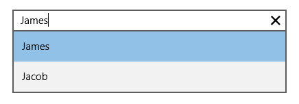

N>  Default value of AutoCompleteMode property is None. So running the control without specifying this property will not show any suggestions. Detailed information about Auto Complete modes will be provided in next section.

## AutoComplete Mode

The suggestions can be displayed in several ways. SfTextBoxExt supports the following modes of auto complete,

1. None
2. Suggest
3. Append
4. SuggestAppend

The default value of AutoCompleteMode is None.

### Suggest

The filtered suggestions are displayed in a drop-down list.  Users can pick an item from the list.





<editors:SfTextBoxExt x:Name="textBoxExt" HorizontalAlignment="Center" 

                            VerticalAlignment="Center" 

                            Width="400"

                            SearchItemPath="Name"

AutoCompleteMode="Suggest"

                            AutoCompleteSource="{Binding Employees}" />









textBoxExt.AutoCompleteMode = Syncfusion.UI.Xaml.Controls.Input.AutoCompleteMode.Suggest;





textBoxExt.AutoCompleteMode = Syncfusion.UI.Xaml.Controls.Input.AutoCompleteMode.Suggest





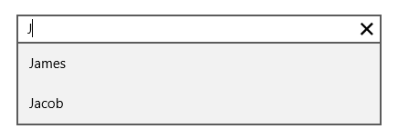

### Append

The text will be appended to the first matched item in the suggestions collection without opening the drop-down list.





<editors:SfTextBoxExt x:Name="textBoxExt" HorizontalAlignment="Center" 

                            VerticalAlignment="Center" 

                            Width="400"

                            SearchItemPath="Name"

AutoCompleteMode="Append"

                            AutoCompleteSource="{Binding Employees}" />









textBoxExt.AutoCompleteMode = Syncfusion.UI.Xaml.Controls.Input.AutoCompleteMode.Append;





textBoxExt.AutoCompleteMode = Syncfusion.UI.Xaml.Controls.Input.AutoCompleteMode.Append





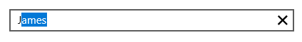

N>  By default the text will be appended to first matched item. But still user can browse to other items through up and down keys from keyboard.

### SuggestAppend

The text will be appended to the first matched item in the suggestions collection, in addition to opening the drop-down list.





<editors:SfTextBoxExt x:Name="textBoxExt" HorizontalAlignment="Center" 

                            VerticalAlignment="Center" 

                            Width="400"

                            SearchItemPath="Name"

AutoCompleteMode="SuggestAppend"

                            AutoCompleteSource="{Binding Employees}" />









textBoxExt.AutoCompleteMode = Syncfusion.UI.Xaml.Controls.Input.AutoCompleteMode.SuggestAppend;





 textBoxExt.AutoCompleteMode = Syncfusion.UI.Xaml.Controls.Input.AutoCompleteMode.SuggestAppend





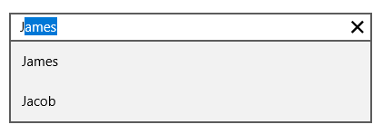

### None

This option neither appends text nor opens the drop-down list of suggestions. 

### AutoComplete Item Template

The AutoCompleteItemTemplate helps to decorate the suggested item with visual elements. The following code block explains how to add an image to the drop-down list item.





  <editors:SfTextBoxExt HorizontalAlignment="Center" 

                            VerticalAlignment="Center" 

                            Width="400"

                            SearchItemPath="Name"

                            AutoCompleteMode="SuggestAppend"

                            AutoCompleteSource="{Binding Employees}" >

<editors:SfTextBoxExt.AutoCompleteItemTemplate>

                <DataTemplate>

                    <StackPanel Orientation="Horizontal">

                        <Image Source="User.png" Margin="2" Stretch="Uniform" Width="12"/>

                        <TextBlock Text="{Binding Name}" Margin="5 2"/>

                    </StackPanel>

                </DataTemplate>

            </editors:SfTextBoxExt.AutoCompleteItemTemplate>

        </editors:SfTextBoxExt>





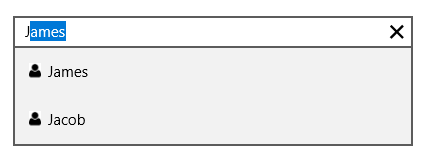

### Filtering Customization

The way that the control filters the suggestions can be customized in several ways.

## Suggestion Mode

The property SuggestionMode helps to specify how to compare the string. It contains two built-in modes. 

1. None
2. StartsWith
3. StartsWithCaseSensitive
4. StartsWithOrdinal
5. StartsWithOrdinalCaseSensitive
6. Contains
7. ContainsCaseSensitive
8. ContainsOrdinal
9. ContainsOrdinalCaseSensitive
10. Equals
11. EqualsCaseSensitive
12. EqualsOrdinal
13. EqualsOrdinalCaseSensitive
14. Custom

The default value is StartsWith.

### None

The controls returns the entire collection without filtering when the user types text.





<editors:SfTextBoxExt x:Name="textBoxExt" HorizontalAlignment="Center" 

                            VerticalAlignment="Center" 

                            Width="400"

                            SearchItemPath="Name"

SuggestionMode="None"

                            AutoCompleteMode="Suggest"

                            AutoCompleteSource="{Binding Employees}"/>









 textBoxExt.SuggestionMode = Syncfusion.UI.Xaml.Controls.Input.SuggestionMode.None;





  textBoxExt.SuggestionMode = Syncfusion.UI.Xaml.Controls.Input.SuggestionMode.None




						
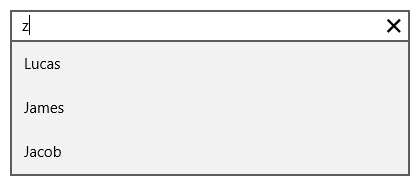

### StartsWith

The control returns all possible matches which start with the text typed by the user.





<editors:SfTextBoxExt  x:Name="textBoxExt" HorizontalAlignment="Center" 

                            VerticalAlignment="Center" 

                            Width="400"

                            SearchItemPath="Name"

SuggestionMode="StartsWith"

                            AutoCompleteMode="Suggest"

                            AutoCompleteSource="{Binding Employees}"/>









 textBoxExt.SuggestionMode = Syncfusion.UI.Xaml.Controls.Input.SuggestionMode.StartsWith;





 textBoxExt.SuggestionMode = Syncfusion.UI.Xaml.Controls.Input.SuggestionMode.StartsWith





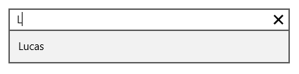

### StartsWithCaseSensitive

The control returns all possible matches which start with the text typed by the user which is culture and case sensitive.





<editors:SfTextBoxExt x:Name="textBoxExt" HorizontalAlignment="Center" 

                            VerticalAlignment="Center" 

                            Width="400"

                            SearchItemPath="Name"

SuggestionMode="StartsWithCaseSensitive"

                            AutoCompleteMode="Suggest"

                            AutoCompleteSource="{Binding Employees}"/>









textBoxExt.SuggestionMode = Syncfusion.UI.Xaml.Controls.Input.SuggestionMode.StartsWithCaseSensitive;





textBoxExt.SuggestionMode = Syncfusion.UI.Xaml.Controls.Input.SuggestionMode.StartsWithCaseSensitive





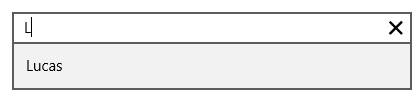

### StartsWithOrdinal

The control returns all possible matches which start with the text typed by the user based on OrdinalIgnoreCase.





<editors:SfTextBoxExt x:Name="textBoxExt" HorizontalAlignment="Center" 

                            VerticalAlignment="Center" 

                            Width="400"

                            SearchItemPath="Name"

SuggestionMode="StartsWithOrdinal"

                            AutoCompleteMode="Suggest"

                            AutoCompleteSource="{Binding Employees}"/>









 textBoxExt.SuggestionMode = Syncfusion.UI.Xaml.Controls.Input.SuggestionMode.StartsWithOrdinal;





 textBoxExt.SuggestionMode = Syncfusion.UI.Xaml.Controls.Input.SuggestionMode.StartsWithOrdinal





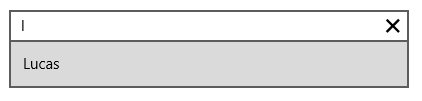

### StartsWithOrdinalCaseSensitive

The control returns all possible matches which start with the text typed by the user by Ordinal which is case sensitive.





<editors:SfTextBoxExt x:Name="textBoxExt" HorizontalAlignment="Center" 

                            VerticalAlignment="Center" 

                            Width="400"

                            SearchItemPath="Name"

SuggestionMode="StartsWithOrdinalCaseSensitive"

                            AutoCompleteMode="Suggest"

                            AutoCompleteSource="{Binding Employees}"/>









 textBoxExt.SuggestionMode = Syncfusion.UI.Xaml.Controls.Input.SuggestionMode.StartsWithOrdinalCaseSensitive;





 textBoxExt.SuggestionMode = Syncfusion.UI.Xaml.Controls.Input.SuggestionMode.StartsWithOrdinalCaseSensitive





### Contains

The control return all possible matches which contains the text typed by the user.





<editors:SfTextBoxExt x:Name="textBoxExt" HorizontalAlignment="Center" 

                            VerticalAlignment="Center" 

                            Width="400"

                            SearchItemPath="Name"

SuggestionMode="Contains"

                            AutoCompleteMode="Suggest"

                            AutoCompleteSource="{Binding Employees}"/>









 textBoxExt.SuggestionMode = Syncfusion.UI.Xaml.Controls.Input.SuggestionMode.Contains;





 textBoxExt.SuggestionMode = Syncfusion.UI.Xaml.Controls.Input.SuggestionMode.Contains





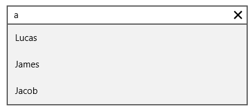

### ContainsCaseSensitive

The control return all possible matches which contains the text typed by the user which is culture and case sensitive.





<editors:SfTextBoxExt x:Name="textBoxExt" HorizontalAlignment="Center" 

                            VerticalAlignment="Center" 

                            Width="400"

                            SearchItemPath="Name"

SuggestionMode="ContainsCaseSensitive"

                            AutoCompleteMode="Suggest"

                            AutoCompleteSource="{Binding Employees}"/>









 textBoxExt.SuggestionMode = Syncfusion.UI.Xaml.Controls.Input.SuggestionMode.ContainsCaseSensitive;





 textBoxExt.SuggestionMode = Syncfusion.UI.Xaml.Controls.Input.SuggestionMode.ContainsCaseSensitive





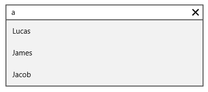

### ContainsOrdinal

The control return all possible matches which contains the text typed by the user based on OrdinalIgnoreCase.





<editors:SfTextBoxExt x:Name="textBoxExt" HorizontalAlignment="Center" 

                            VerticalAlignment="Center" 

                            Width="400"

                            SearchItemPath="Name"

SuggestionMode="ContainsOrdinal"

                            AutoCompleteMode="Suggest"

                            AutoCompleteSource="{Binding Employees}"/>









 textBoxExt.SuggestionMode = Syncfusion.UI.Xaml.Controls.Input.SuggestionMode.ContainsOrdinal;





 textBoxExt.SuggestionMode = Syncfusion.UI.Xaml.Controls.Input.SuggestionMode.ContainsOrdinal





### ContainsOrdinalCaseSensitive

The control return all possible matches which contains the text typed by the user based on Ordinal which is case sensitive.





<editors:SfTextBoxExt x:Name="textBoxExt" HorizontalAlignment="Center" 

                            VerticalAlignment="Center" 

                            Width="400"

                            SearchItemPath="Name"

SuggestionMode="ContainsOrdinalCaseSensitive"

                            AutoCompleteMode="Suggest"

                            AutoCompleteSource="{Binding Employees}"/>









 textBoxExt.SuggestionMode = Syncfusion.UI.Xaml.Controls.Input.SuggestionMode.ContainsOrdinalCaseSensitive;





 textBoxExt.SuggestionMode = Syncfusion.UI.Xaml.Controls.Input.SuggestionMode.ContainsOrdinalCaseSensitive





### Equals

The control return all possible matches which equals the text typed by the user.





<editors:SfTextBoxExt x:Name="textBoxExt" HorizontalAlignment="Center" 

                            VerticalAlignment="Center" 

                            Width="400"

                            SearchItemPath="Name"

SuggestionMode="Equals"

                            AutoCompleteMode="Suggest"

                            AutoCompleteSource="{Binding Employees}"/>









 textBoxExt.SuggestionMode = Syncfusion.UI.Xaml.Controls.Input.SuggestionMode.Equals;





 textBoxExt.SuggestionMode = Syncfusion.UI.Xaml.Controls.Input.SuggestionMode.Equals





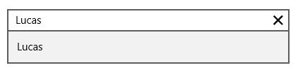

### EqualsCaseSensitive

The control return all possible matches which equals the text typed by the user which is culture and case sensitive.





<editors:SfTextBoxExt x:Name="textBoxExt" HorizontalAlignment="Center" 

                            VerticalAlignment="Center" 

                            Width="400"

                            SearchItemPath="Name"

SuggestionMode="EqualsCaseSensitive"

                            AutoCompleteMode="Suggest"

                            AutoCompleteSource="{Binding Employees}"/>









 textBoxExt.SuggestionMode = Syncfusion.UI.Xaml.Controls.Input.SuggestionMode.EqualsCaseSensitive;





 textBoxExt.SuggestionMode = Syncfusion.UI.Xaml.Controls.Input.SuggestionMode.EqualsCaseSensitive





### EqualsOrdinal

The control return all possible matches which equals the text typed by the user based on OrdinalIgnoreCase.





<editors:SfTextBoxExt x:Name="textBoxExt" HorizontalAlignment="Center" 

                            VerticalAlignment="Center" 

                            Width="400"

                            SearchItemPath="Name"

SuggestionMode="EqualsOrdinal"

                            AutoCompleteMode="Suggest"

                            AutoCompleteSource="{Binding Employees}"/>









 textBoxExt.SuggestionMode = Syncfusion.UI.Xaml.Controls.Input.SuggestionMode.EqualsOrdinal;





 textBoxExt.SuggestionMode = Syncfusion.UI.Xaml.Controls.Input.SuggestionMode.EqualsOrdinal





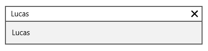

### EqualsOrdinalCaseSensitive

The control return all possible matches which equals the text typed by the user based on Ordinal which is case sensitive.





<editors:SfTextBoxExt x:Name="textBoxExt" HorizontalAlignment="Center" 

                            VerticalAlignment="Center" 

                            Width="400"

                            SearchItemPath="Name"

SuggestionMode="EqualsOrdinalCaseSensitive"

                            AutoCompleteMode="Suggest"

                            AutoCompleteSource="{Binding Employees}"/>









 textBoxExt.SuggestionMode = Syncfusion.UI.Xaml.Controls.Input.SuggestionMode.EqualsOrdinalCaseSensitive;





 textBoxExt.SuggestionMode = Syncfusion.UI.Xaml.Controls.Input.SuggestionMode.EqualsOrdinalCaseSensitive





### Custom

The control return all possible matches based on the Filter property. Filter is of type SuggestionPredicate. In the MyFilter method, filtration is done by checking whether the collection contains the typed text.





<editors:SfTextBoxExt x:Name="autoComplete" HorizontalAlignment="Center" 

                            VerticalAlignment="Center" 

                            Width="400"

                            SearchItemPath="Name"

SuggestionMode="Custom"

                            AutoCompleteMode="Suggest"

                            AutoCompleteSource="{Binding Employees}"/>







    

     public bool MyFilter(string search, object item)

        {

            Employee model = item as Employee;

            if (model != null)

            {

                if (model.Name.ToLower().Contains(search))

                {

                    return true;

                }

                else

                    return false;

            }

            else

                return false;

        }

autoComplete.Filter = MyFilter;



    

    Public Function MyFilter(ByVal search As String, ByVal item As Object) As Boolean

			Dim model As Person = TryCast(item, Person)

			If model IsNot Nothing Then

				If model.Name.ToLower().Contains(search) Then

					Return True

				Else

					Return False
				End If

			Else

				Return False
			End If

End Function

autoComplete.Filter = AddressOf MyFilter





N>  Append mode always works only with StartsWith behavior. If the typed text is not the same as the start text of any items, it will not append anything even when the auto complete mode is set to Append or SuggestAppend.

### Popup Delay

PopupDelay specifies the delay after which the suggestion popup should open. 





<editors:SfTextBoxExt x:Name="textBoxExt" HorizontalAlignment="Center" 

                            VerticalAlignment="Center" 

                            Width="400"

                            SearchItemPath="Name"

PopupDelay="00:00:02"

                            AutoCompleteMode="Suggest"

                            AutoCompleteSource="{Binding Employees}"/>









 textBoxExt.PopupDelay=new TimeSpan(00,00,02);





 textBoxExt.PopupDelay = New TimeSpan(00,00,02)





