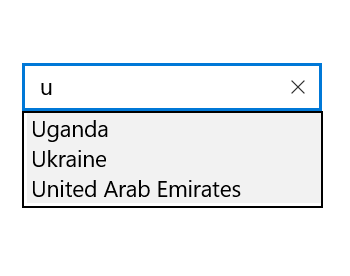
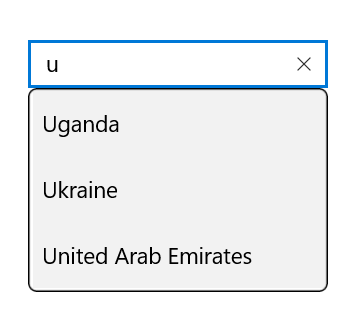
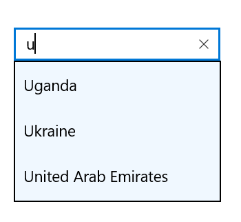
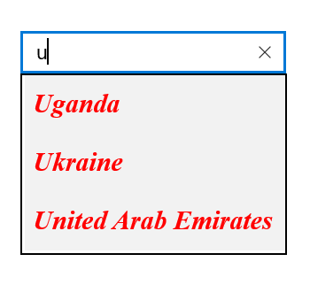
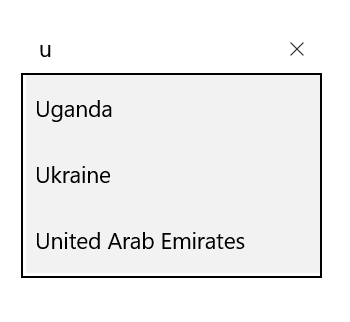

# Customizing AutoComplete in UWP AutoComplete (SfTextBoxExt)

AutoComplete provides user-friendly customizing options for both text box and drop-down. This section explains how to customize the entire AutoComplete control.

## Customizing the text box

The `Text`, `FontSize`, `FontWeight`, and `FontFamily` properties are used to customize the text box.





<Page
    x:Class="TextBoxExtSample.MainPage"
    xmlns="http://schemas.microsoft.com/winfx/2006/xaml/presentation"
    xmlns:x="http://schemas.microsoft.com/winfx/2006/xaml"
    xmlns:local="using:TextBoxExtSample"
    xmlns:d="http://schemas.microsoft.com/expression/blend/2008"
    xmlns:mc="http://schemas.openxmlformats.org/markup-compatibility/2006"
    mc:Ignorable="d"
    xmlns:editors="using:Syncfusion.UI.Xaml.Controls.Input"
    Background="{ThemeResource ApplicationPageBackgroundThemeBrush}">

    <Grid Background="{StaticResource ApplicationPageBackgroundThemeBrush}">

        <editors:SfTextBoxExt x:Name="textBoxExt" 
                              Text="TextBox"
                              FontSize="20"
                              FontWeight="Bold"
                              FontFamily="Times New Roman"
                              HorizontalAlignment="Center" 
                              VerticalAlignment="Center" 
                              Width="200">
        </editors:SfTextBoxExt>
    </Grid>
</Page>





using Syncfusion.UI.Xaml.Controls.Input;
using Windows.UI.Xaml;
using Windows.UI.Xaml.Controls;
using Windows.UI.Xaml.Media;

// The BlankPage item template is documented at https://go.microsoft.com/fwlink/?LinkId=402352&clcid=0x409.

namespace TextBoxExtSample
{
    /// 

    /// An empty page that can be used on its own or navigated within a frame.
    /// 

    public sealed partial class MainPage : Page
    {
        public MainPage()
        {
            this.InitializeComponent();
            SfTextBoxExt textBoxExt = new SfTextBoxExt()
            {
                Text = "TextBox",
                FontSize = 20,
                FontWeight = Windows.UI.Text.FontWeights.Bold,
                FontFamily = new FontFamily("Time New Roman"),
                HorizontalAlignment = HorizontalAlignment.Center,
                VerticalAlignment = VerticalAlignment.Center,
                Width = 200
            };

            this.Content = textBoxExt;
        }
    }
}





## Customizing the suggestion box

### Changing suggestion item height

The `SuggestionItemHeight` property is used to modify the height of suggestion items in the drop-down list.





<Page
    x:Class="TextBoxExtSample.MainPage"
    xmlns="http://schemas.microsoft.com/winfx/2006/xaml/presentation"
    xmlns:x="http://schemas.microsoft.com/winfx/2006/xaml"
    xmlns:local="using:TextBoxExtSample"
    xmlns:d="http://schemas.microsoft.com/expression/blend/2008"
    xmlns:mc="http://schemas.openxmlformats.org/markup-compatibility/2006"
    mc:Ignorable="d"
    xmlns:editors="using:Syncfusion.UI.Xaml.Controls.Input"
    Background="{ThemeResource ApplicationPageBackgroundThemeBrush}">

    <Grid Background="{StaticResource ApplicationPageBackgroundThemeBrush}">

        <editors:SfTextBoxExt x:Name="textBoxExt" 
                              HorizontalAlignment="Center" 
                              VerticalAlignment="Center" 
                              AutoCompleteMode="Suggest"
                              SuggestionItemHeight="20"
                              Width="200">
        </editors:SfTextBoxExt>
    </Grid>
</Page>





using Syncfusion.UI.Xaml.Controls.Input;
using System.Collections.Generic;
using Windows.UI.Xaml;
using Windows.UI.Xaml.Controls;

// The BlankPage item template is documented at https://go.microsoft.com/fwlink/?LinkId=402352&clcid=0x409.

namespace TextBoxExtSample
{
    /// 

    /// An empty page that can be used on its own or navigated within a frame.
    /// 

    public sealed partial class MainPage : Page
    {
        public MainPage()
        {
            this.InitializeComponent();
            SfTextBoxExt textBoxExt = new SfTextBoxExt()
            {
                HorizontalAlignment = HorizontalAlignment.Center,
                VerticalAlignment = VerticalAlignment.Center,
                Width = 200,
                AutoCompleteMode = AutoCompleteMode.Suggest,
                SuggestionItemHeight = 20
            };

            List<string> list = new List<string>()
            {
                 "India",
                 "Uganda",
                 "Ukraine",
                 "Canada",
                 "United Arab Emirates"
            };

            textBoxExt.AutoCompleteSource = list;
            this.Content = textBoxExt;
        }
    }
}





### Changing the corner radius of suggestion box

The `DropDownCornerRadius` property is used to modify the corner radius of suggestion box. The following code example demonstrates how to change the corner radius of  suggestion box.





<Page
    x:Class="TextBoxExtSample.MainPage"
    xmlns="http://schemas.microsoft.com/winfx/2006/xaml/presentation"
    xmlns:x="http://schemas.microsoft.com/winfx/2006/xaml"
    xmlns:local="using:TextBoxExtSample"
    xmlns:d="http://schemas.microsoft.com/expression/blend/2008"
    xmlns:mc="http://schemas.openxmlformats.org/markup-compatibility/2006"
    mc:Ignorable="d"
    xmlns:editors="using:Syncfusion.UI.Xaml.Controls.Input"
    Background="{ThemeResource ApplicationPageBackgroundThemeBrush}">

    <Grid Background="{StaticResource ApplicationPageBackgroundThemeBrush}">

        <editors:SfTextBoxExt x:Name="textBoxExt" 
                              HorizontalAlignment="Center" 
                              VerticalAlignment="Center" 
                              AutoCompleteMode="Suggest"
                              DropDownCornerRadius="5"
                              Width="200">
        </editors:SfTextBoxExt>
    </Grid>
</Page>





using Syncfusion.UI.Xaml.Controls.Input;
using System.Collections.Generic;
using Windows.UI.Xaml;
using Windows.UI.Xaml.Controls;

// The BlankPage item template is documented at https://go.microsoft.com/fwlink/?LinkId=402352&clcid=0x409.

namespace TextBoxExtSample
{
    /// 

    /// An empty page that can be used on its own or navigated within a frame.
    /// 

    public sealed partial class MainPage : Page
    {
        public MainPage()
        {
            this.InitializeComponent();
            SfTextBoxExt textBoxExt = new SfTextBoxExt()
            {
                HorizontalAlignment = HorizontalAlignment.Center,
                VerticalAlignment = VerticalAlignment.Center,
                Width = 200,
                AutoCompleteMode = AutoCompleteMode.Suggest,
                DropDownCornerRadius = 5
            };

            List<string> list = new List<string>()
            {
                 "India",
                 "Uganda",
                 "Ukraine",
                 "Canada",
                 "United Arab Emirates"
            };

            textBoxExt.AutoCompleteSource = list;
            this.Content = textBoxExt;
        }
    }
}





### Changing the background color of suggestion box

The `DropDownBackground` property is used to modify the background color of suggestion box. The following code example demonstrates how to change the background color of  suggestion box.





<Page
    x:Class="TextBoxExtSample.MainPage"
    xmlns="http://schemas.microsoft.com/winfx/2006/xaml/presentation"
    xmlns:x="http://schemas.microsoft.com/winfx/2006/xaml"
    xmlns:local="using:TextBoxExtSample"
    xmlns:d="http://schemas.microsoft.com/expression/blend/2008"
    xmlns:mc="http://schemas.openxmlformats.org/markup-compatibility/2006"
    mc:Ignorable="d"
    xmlns:editors="using:Syncfusion.UI.Xaml.Controls.Input"
    Background="{ThemeResource ApplicationPageBackgroundThemeBrush}">

    <Grid Background="{StaticResource ApplicationPageBackgroundThemeBrush}">

        <editors:SfTextBoxExt x:Name="textBoxExt" 
                              HorizontalAlignment="Center" 
                              VerticalAlignment="Center" 
                              AutoCompleteMode="Suggest"
                              DropDownBackground="AliceBlue"
                              Width="200">
        </editors:SfTextBoxExt>
    </Grid>
</Page>





using System.Collections.Generic;
using Syncfusion.UI.Xaml.Controls.Input;
using Windows.UI.Xaml;
using Windows.UI.Xaml.Controls;

// The BlankPage item template is documented at https://go.microsoft.com/fwlink/?LinkId=402352&clcid=0x409.

namespace TextBoxExtSample
{
    /// 

    /// An empty page that can be used on its own or navigated within a frame.
    /// 

    public sealed partial class MainPage : Page
    {
        public MainPage()
        {
            this.InitializeComponent();
            SfTextBoxExt textBoxExt = new SfTextBoxExt()
            {
                HorizontalAlignment = HorizontalAlignment.Center,
                VerticalAlignment = VerticalAlignment.Center,
                Width = 200,
                AutoCompleteMode = AutoCompleteMode.Suggest,
                DropDownBackground = new Windows.UI.Xaml.Media.SolidColorBrush(Windows.UI.Colors.AliceBlue)
            };

            List<string> list = new List<string>()
            {
                 "India",
                 "Uganda",
                 "Ukraine",
                 "Canada",
                 "United Arab Emirates"
            };

            textBoxExt.AutoCompleteSource = list;
            this.Content = textBoxExt;
        }
    }
}





### Customizing suggestion items

The suggestion box items can be customized using the `SuggestionItemFontWeight`, `SuggestionItemFontStyle`, `SuggestionItemForeground`, `SuggestionItemFontSize`, and `SuggestionItemFontFamily` properties.





<Page
    x:Class="TextBoxExtSample.MainPage"
    xmlns="http://schemas.microsoft.com/winfx/2006/xaml/presentation"
    xmlns:x="http://schemas.microsoft.com/winfx/2006/xaml"
    xmlns:local="using:TextBoxExtSample"
    xmlns:d="http://schemas.microsoft.com/expression/blend/2008"
    xmlns:mc="http://schemas.openxmlformats.org/markup-compatibility/2006"
    mc:Ignorable="d"
    xmlns:editors="using:Syncfusion.UI.Xaml.Controls.Input"
    Background="{ThemeResource ApplicationPageBackgroundThemeBrush}">

    <Grid Background="{StaticResource ApplicationPageBackgroundThemeBrush}">

        <editors:SfTextBoxExt x:Name="textBoxExt" 
                              HorizontalAlignment="Center" 
                              VerticalAlignment="Center" 
                              AutoCompleteMode="Suggest"
                              SuggestionItemFontWeight="Bold"
                              SuggestionItemFontStyle="Italic"
                              SuggestionItemFontFamily="Times New Roman"
                              SuggestionItemFontSize="20"
                              SuggestionItemForeground="Red"
                              Width="200">
        </editors:SfTextBoxExt>
    </Grid>
</Page>





using Syncfusion.UI.Xaml.Controls.Input;
using System.Collections.Generic;
using Windows.UI.Xaml;
using Windows.UI.Xaml.Controls;

// The BlankPage item template is documented at https://go.microsoft.com/fwlink/?LinkId=402352&clcid=0x409.

namespace TextBoxExtSample
{
    /// 

    /// An empty page that can be used on its own or navigated within a frame.
    /// 

    public sealed partial class MainPage : Page
    {
        public MainPage()
        {
            this.InitializeComponent();
            SfTextBoxExt textBoxExt = new SfTextBoxExt()
            {
                HorizontalAlignment = HorizontalAlignment.Center,
                VerticalAlignment = VerticalAlignment.Center,
                Width = 200,
                AutoCompleteMode = AutoCompleteMode.Suggest,
                SuggestionItemFontWeight = Windows.UI.Text.FontWeights.Bold,
                SuggestionItemFontStyle = Windows.UI.Text.FontStyle.Italic,
                SuggestionItemForeground = new Windows.UI.Xaml.Media.SolidColorBrush(Windows.UI.Colors.Red),
                SuggestionItemFontSize = 20,
                SuggestionItemFontFamily = new Windows.UI.Xaml.Media.FontFamily("Times New Roman")
            };

            List<string> list = new List<string>()
            {
                 "India",
                 "Uganda",
                 "Ukraine",
                 "Canada",
                 "United Arab Emirates"
            };

            textBoxExt.AutoCompleteSource = list;
            this.Content = textBoxExt;
        }
    }
}





### Show Clear button

The AutoComplete allows users to show or hide the Clear button using the `ShowClearButton` property.





<Page
    x:Class="TextBoxExtSample.MainPage"
    xmlns="http://schemas.microsoft.com/winfx/2006/xaml/presentation"
    xmlns:x="http://schemas.microsoft.com/winfx/2006/xaml"
    xmlns:local="using:TextBoxExtSample"
    xmlns:d="http://schemas.microsoft.com/expression/blend/2008"
    xmlns:mc="http://schemas.openxmlformats.org/markup-compatibility/2006"
    mc:Ignorable="d"
    xmlns:editors="using:Syncfusion.UI.Xaml.Controls.Input"
    Background="{ThemeResource ApplicationPageBackgroundThemeBrush}">

    <Grid Background="{StaticResource ApplicationPageBackgroundThemeBrush}">

        <editors:SfTextBoxExt x:Name="textBoxExt" 
                              HorizontalAlignment="Center" 
                              VerticalAlignment="Center" 
                              AutoCompleteMode="Suggest"
                              ShowClearButton="False"
                              Width="200">
        </editors:SfTextBoxExt>
    </Grid>
</Page>





using Syncfusion.UI.Xaml.Controls.Input;
using System.Collections.Generic;
using Windows.UI.Xaml;
using Windows.UI.Xaml.Controls;

// The BlankPage item template is documented at https://go.microsoft.com/fwlink/?LinkId=402352&clcid=0x409.

namespace TextBoxExtSample
{
    /// 

    /// An empty page that can be used on its own or navigated within a frame.
    /// 

    public sealed partial class MainPage : Page
    {
        public MainPage()
        {
            this.InitializeComponent();
            SfTextBoxExt textBoxExt = new SfTextBoxExt()
            {
                HorizontalAlignment = HorizontalAlignment.Center,
                VerticalAlignment = VerticalAlignment.Center,
                Width = 200,
                AutoCompleteMode = AutoCompleteMode.Suggest,
                ShowClearButton = false
            };

            List<string> list = new List<string>()
            {
                 "India",
                 "Uganda",
                 "Ukraine",
                 "Canada",
                 "United Arab Emirates"
            };

            textBoxExt.AutoCompleteSource = list;
            this.Content = textBoxExt;
        }
    }
}





### Changing border visibility

The `ShowBorder` property is used to modify the visibility of border. The following code example demonstrates how to change the border visibility. 





<Page
    x:Class="TextBoxExtSample.MainPage"
    xmlns="http://schemas.microsoft.com/winfx/2006/xaml/presentation"
    xmlns:x="http://schemas.microsoft.com/winfx/2006/xaml"
    xmlns:local="using:TextBoxExtSample"
    xmlns:d="http://schemas.microsoft.com/expression/blend/2008"
    xmlns:mc="http://schemas.openxmlformats.org/markup-compatibility/2006"
    mc:Ignorable="d"
    xmlns:editors="using:Syncfusion.UI.Xaml.Controls.Input"
    Background="{ThemeResource ApplicationPageBackgroundThemeBrush}">

    <Grid Background="{StaticResource ApplicationPageBackgroundThemeBrush}">

        <editors:SfTextBoxExt x:Name="textBoxExt" 
                              HorizontalAlignment="Center" 
                              VerticalAlignment="Center" 
                              AutoCompleteMode="Suggest"
                              ShowBorder="False"
                              Width="200">
        </editors:SfTextBoxExt>
    </Grid>
</Page>





using Syncfusion.UI.Xaml.Controls.Input;
using System.Collections.Generic;
using Windows.UI.Xaml;
using Windows.UI.Xaml.Controls;

// The BlankPage item template is documented at https://go.microsoft.com/fwlink/?LinkId=402352&clcid=0x409.

namespace TextBoxExtSample
{
    /// 

    /// An empty page that can be used on its own or navigated within a frame.
    /// 

    public sealed partial class MainPage : Page
    {
        public MainPage()
        {
            this.InitializeComponent();
            SfTextBoxExt textBoxExt = new SfTextBoxExt()
            {
                HorizontalAlignment = HorizontalAlignment.Center,
                VerticalAlignment = VerticalAlignment.Center,
                Width = 200,
                AutoCompleteMode = AutoCompleteMode.Suggest,
                ShowBorder=false
            };

            List<string> list = new List<string>()
            {
                 "India",
                 "Uganda",
                 "Ukraine",
                 "Canada",
                 "United Arab Emirates"
            };

            textBoxExt.AutoCompleteSource = list;
            this.Content = textBoxExt;
        }
    }
}





