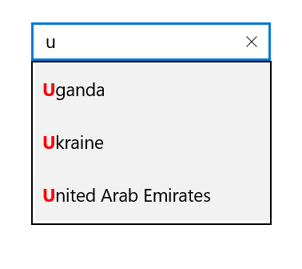
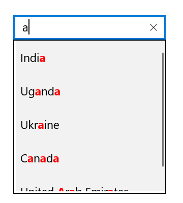

# Highlighting MatchedText in UWP AutoComplete (SfTextBoxExt)

You can highlight matching characters in a suggestion list to pick an item with more clarity. The matching text can be highlighted in the following two ways:

* First occurrence
* Multiple occurrence

The text highlight can be indicated with various customizing styles by enabling the following properties:

* HighlightedTextColor: Sets the color of the highlighted text for differentiating the highlighted characters.
* HighlightTextFontAttributes: Sets the FontAttributes of the highlighted text.

## First occurrence

It highlights the first position of the matching characters in the suggestion list.





<Page
    x:Class="TextBoxExtSample.MainPage"
    xmlns="http://schemas.microsoft.com/winfx/2006/xaml/presentation"
    xmlns:x="http://schemas.microsoft.com/winfx/2006/xaml"
    xmlns:local="using:TextBoxExtSample"
    xmlns:d="http://schemas.microsoft.com/expression/blend/2008"
    xmlns:mc="http://schemas.openxmlformats.org/markup-compatibility/2006"
    mc:Ignorable="d"
    xmlns:editors="using:Syncfusion.UI.Xaml.Controls.Input"
    Background="{ThemeResource ApplicationPageBackgroundThemeBrush}">

    <Grid Background="{StaticResource ApplicationPageBackgroundThemeBrush}">

        <editors:SfTextBoxExt x:Name="textBoxExt" 
                              HorizontalAlignment="Center" 
                              VerticalAlignment="Center" 
                              AutoCompleteMode="Suggest"
                              SuggestionMode="StartsWith"
                              HighlightedTextColor="Red"
                              TextHighlightMode="FirstOccurence"
                              HighlightedTextFontWeight="Bold"
                              Width="200">
        </editors:SfTextBoxExt>
    </Grid>
</Page>





using Syncfusion.UI.Xaml.Controls.Input;
using System.Collections.Generic;
using Windows.UI;
using Windows.UI.Xaml;
using Windows.UI.Xaml.Controls;
using Windows.UI.Xaml.Media;

// The BlankPage item template is documented at https://go.microsoft.com/fwlink/?LinkId=402352&clcid=0x409.

namespace TextBoxExtSample
{
    /// 

    /// An empty page that can be used on its own or navigated within a frame.
    /// 

    public sealed partial class MainPage : Page
    {
        public MainPage()
        {
            this.InitializeComponent();
            SfTextBoxExt textBoxExt = new SfTextBoxExt()
            {
                HorizontalAlignment = HorizontalAlignment.Center,
                VerticalAlignment = VerticalAlignment.Center,
                Width = 200,
                AutoCompleteMode = AutoCompleteMode.Suggest,
                SuggestionMode = SuggestionMode.StartsWith,
                TextHighlightMode = OccurenceMode.FirstOccurence,
                HighlightedTextColor = new SolidColorBrush(Colors.Red),
                HighlightedTextFontWeight = Windows.UI.Text.FontWeights.Bold
            };

            List<string> list = new List<string>()
            {
                 "India",
                 "Uganda",
                 "Ukraine",
                 "Canada",
                 "United Arab Emirates"
            };

            textBoxExt.AutoCompleteSource = list;
            this.Content = textBoxExt;
        }
    }
}





## Multiple occurrence

It highlights the matching character that presents everywhere in the suggestion list for Contains case in SuggestionMode.





<Page
    x:Class="TextBoxExtSample.MainPage"
    xmlns="http://schemas.microsoft.com/winfx/2006/xaml/presentation"
    xmlns:x="http://schemas.microsoft.com/winfx/2006/xaml"
    xmlns:local="using:TextBoxExtSample"
    xmlns:d="http://schemas.microsoft.com/expression/blend/2008"
    xmlns:mc="http://schemas.openxmlformats.org/markup-compatibility/2006"
    mc:Ignorable="d"
    xmlns:editors="using:Syncfusion.UI.Xaml.Controls.Input"
    Background="{ThemeResource ApplicationPageBackgroundThemeBrush}">

    <Grid Background="{StaticResource ApplicationPageBackgroundThemeBrush}">

        <editors:SfTextBoxExt x:Name="textBoxExt" 
                              HorizontalAlignment="Center" 
                              VerticalAlignment="Center" 
                              AutoCompleteMode="Suggest"
                              SuggestionMode="Contains"
                              HighlightedTextColor="Red"
                              HighlightedTextFontWeight="Bold"
                              TextHighlightMode="MultipleOccurence"
                              Width="200">
        </editors:SfTextBoxExt>
    </Grid>
</Page>





using Syncfusion.UI.Xaml.Controls.Input;
using System.Collections.Generic;
using Windows.UI;
using Windows.UI.Xaml;
using Windows.UI.Xaml.Controls;
using Windows.UI.Xaml.Media;

// The BlankPage item template is documented at https://go.microsoft.com/fwlink/?LinkId=402352&clcid=0x409.

namespace TextBoxExtSample
{
    /// 

    /// An empty page that can be used on its own or navigated within a frame.
    /// 

    public sealed partial class MainPage : Page
    {
        public MainPage()
        {
            this.InitializeComponent();
            SfTextBoxExt textBoxExt = new SfTextBoxExt()
            {
                HorizontalAlignment = HorizontalAlignment.Center,
                VerticalAlignment = VerticalAlignment.Center,
                Width = 200,
                AutoCompleteMode = AutoCompleteMode.Suggest,
                SuggestionMode = SuggestionMode.Contains,
                TextHighlightMode = OccurenceMode.MultipleOccurence,
                HighlightedTextColor = new SolidColorBrush(Colors.Red),
                HighlightedTextFontWeight = Windows.UI.Text.FontWeights.Bold
            };

            List<string> list = new List<string>()
            {
                 "India",
                 "Uganda",
                 "Ukraine",
                 "Canada",
                 "United Arab Emirates"
            };

            textBoxExt.AutoCompleteSource = list;
            this.Content = textBoxExt;
        }
    }
}





