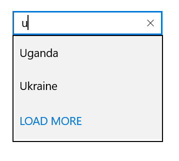

# Maximum DisplayItem with Expander in UWP AutoComplete (SfTextBoxExt)

You can restrict the number of suggestions displayed and load the remaining items by selecting LoadMore. The maximum suggestion to be displayed can be restricted using the `MaximumSuggestion` property. You can set the desire text for the displaying the Load More text using the `LoadMoreText` property.





<Page
    x:Class="TextBoxExtSample.MainPage"
    xmlns="http://schemas.microsoft.com/winfx/2006/xaml/presentation"
    xmlns:x="http://schemas.microsoft.com/winfx/2006/xaml"
    xmlns:local="using:TextBoxExtSample"
    xmlns:d="http://schemas.microsoft.com/expression/blend/2008"
    xmlns:mc="http://schemas.openxmlformats.org/markup-compatibility/2006"
    mc:Ignorable="d"
    xmlns:editors="using:Syncfusion.UI.Xaml.Controls.Input"
    Background="{ThemeResource ApplicationPageBackgroundThemeBrush}">

    <Grid Background="{StaticResource ApplicationPageBackgroundThemeBrush}">

        <editors:SfTextBoxExt x:Name="textBoxExt" 
                              HorizontalAlignment="Center" 
                              VerticalAlignment="Center" 
                              AutoCompleteMode="Suggest"
                              LoadMoreText="LoadMore"
                              MaximumSuggestion="2"
                              Width="200">
        </editors:SfTextBoxExt>
    </Grid>
</Page>





using Syncfusion.UI.Xaml.Controls.Input;
using System.Collections.Generic;
using Windows.UI.Xaml;
using Windows.UI.Xaml.Controls;

// The BlankPage item template is documented at https://go.microsoft.com/fwlink/?LinkId=402352&clcid=0x409.

namespace TextBoxExtSample
{
    /// 

    /// An empty page that can be used on its own or navigated within a frame.
    /// 

    public sealed partial class MainPage : Page
    {
        public MainPage()
        {
            this.InitializeComponent();
            SfTextBoxExt textBoxExt = new SfTextBoxExt()
            {
                HorizontalAlignment = HorizontalAlignment.Center,
                VerticalAlignment = VerticalAlignment.Center,
                Width = 200,
                AutoCompleteMode = AutoCompleteMode.Suggest,
                MaximumSuggestion = 2,
                LoadMoreText = "LOAD MORE"
            };

            List<string> list = new List<string>()
            {
                 "India",
                 "Uganda",
                 "Ukraine",
                 "Canada",
                 "United Arab Emirates"
            };

            textBoxExt.AutoCompleteSource = list;
            this.Content = textBoxExt;
        }
    }
}





