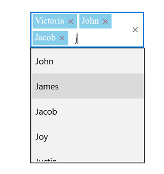
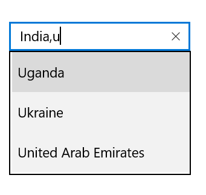

# Multiple Selection in UWP AutoComplete (SfTextBoxExt)

You can select multiple items from a suggestion list. Multiple selection can be performed in the following two ways in AutoComplete:

* Token representation
* Delimiter

## Token representation

The selected items will be displayed with a customizable token representation, and the users can remove each tokenized item using the Close button.





<Page
    x:Class="TextBoxExtSample.MainPage"
    xmlns="http://schemas.microsoft.com/winfx/2006/xaml/presentation"
    xmlns:x="http://schemas.microsoft.com/winfx/2006/xaml"
    xmlns:local="using:TextBoxExtSample"
    xmlns:d="http://schemas.microsoft.com/expression/blend/2008"
    xmlns:mc="http://schemas.openxmlformats.org/markup-compatibility/2006"
    xmlns:editors="using:Syncfusion.UI.Xaml.Controls.Input"
    mc:Ignorable="d"
    xmlns:ListCollection="using:System.Collections.Generic"
    Background="{ThemeResource ApplicationPageBackgroundThemeBrush}">
    <Grid Background="{StaticResource ApplicationPageBackgroundThemeBrush}">

        <editors:SfTextBoxExt x:Name="textBoxExt" 
                              HorizontalAlignment="Center" 
                              VerticalAlignment="Center" 
                              AutoCompleteMode="Suggest"
                              Width="200"
                              MultiSelectMode="Token"
                              TokensWrapMode="Wrap">
        </editors:SfTextBoxExt>
    </Grid>
</Page>





using Syncfusion.UI.Xaml.Controls.Input;
using System.Collections.Generic;
using Windows.UI.Xaml;
using Windows.UI.Xaml.Controls;

// The BlankPage item template is documented at https://go.microsoft.com/fwlink/?LinkId=402352&clcid=0x409.

namespace TextBoxExtSample
{
    /// 

    /// An empty page that can be used on its own or navigated within a frame.
    /// 

    public sealed partial class MainPage : Page
    {
        //TextBlock SearchLabel;
        public MainPage()
        {
            this.InitializeComponent();
            SfTextBoxExt textBoxExt = new SfTextBoxExt()
            {
                HorizontalAlignment = HorizontalAlignment.Center,
                VerticalAlignment = VerticalAlignment.Center,
                Width = 200,
                AutoCompleteMode = AutoCompleteMode.Suggest,
                MultiSelectMode = MultiSelectMode.Token,
                TokensWrapMode = TokensWrapMode.Wrap
            };

            List<string> list = new List<string>()
            {
                "India",
                "Ukanda",
                "Ukraine",
                "Canada",
                "United Arab Emirates"
            };

            textBoxExt.AutoCompleteSource = list;
            this.Content = textBoxExt;
        }
    }
}





### Wrap mode of token

The selected item can be displayed as token inside AutoComplete in the following two ways:

* `Wrap` - When `TokensWrapMode` is set to `Wrap`, the selected items will be wrapped to the next line of AutoComplete.
* `None` - When `TokensWrapMode` is set to `None`, the selected item will be wrapped in horizontal orientation.





<Page
    x:Class="TextBoxExtSample.MainPage"
    xmlns="http://schemas.microsoft.com/winfx/2006/xaml/presentation"
    xmlns:x="http://schemas.microsoft.com/winfx/2006/xaml"
    xmlns:local="using:TextBoxExtSample"
    xmlns:d="http://schemas.microsoft.com/expression/blend/2008"
    xmlns:mc="http://schemas.openxmlformats.org/markup-compatibility/2006"
    xmlns:editors="using:Syncfusion.UI.Xaml.Controls.Input"
    mc:Ignorable="d"
    Background="{ThemeResource ApplicationPageBackgroundThemeBrush}">
    <Page.DataContext>
        <local:EmployeeViewModel/>
    </Page.DataContext>
    <Grid Background="{StaticResource ApplicationPageBackgroundThemeBrush}">

        <editors:SfTextBoxExt x:Name="textBoxExt" 
                              HorizontalAlignment="Center" 
                              VerticalAlignment="Center" 
                              AutoCompleteMode="Suggest"
                              Width="200"
                              SearchItemPath="Name"
                              MultiSelectMode="Token"
                              TokensWrapMode="Wrap"
                              AutoCompleteSource="{Binding EmployeeCollection}">
        </editors:SfTextBoxExt>
    </Grid>
</Page>





using Syncfusion.UI.Xaml.Controls.Input;
using System.Collections.Generic;
using System.Collections.ObjectModel;
using Windows.UI;
using Windows.UI.Xaml;
using Windows.UI.Xaml.Controls;
using Windows.UI.Xaml.Media;

// The BlankPage item template is documented at https://go.microsoft.com/fwlink/?LinkId=402352&clcid=0x409.

namespace TextBoxExtSample
{
    /// 

    /// An empty page that can be used on its own or navigated within a frame.
    /// 

    public sealed partial class MainPage : Page
    {
        public MainPage()
        {
            this.InitializeComponent();
            EmployeeViewModel employeeCollection = new EmployeeViewModel();
            this.DataContext = employeeCollection;
            SfTextBoxExt textBoxExt = new SfTextBoxExt()
            {
                HorizontalAlignment = HorizontalAlignment.Center,
                VerticalAlignment = VerticalAlignment.Center,
                Width = 200,
                AutoCompleteMode = AutoCompleteMode.Suggest,
                SearchItemPath = "Name",
                MultiSelectMode = MultiSelectMode.Token,
                TokensWrapMode = TokensWrapMode.Wrap
            };

            textBoxExt.AutoCompleteSource = employeeCollection.EmployeeCollection;

            this.Content = textBoxExt;
        }
    }

    public class Employee
    {
        private string image;

        private string name;

        public string Image
        {
            get
            {
                return image;
            }

            set
            {
                image = value;
            }
        }

        public string Name
        {
            get
            {
                return name;
            }

            set
            {
                name = value;
            }
        }
    }

    public class EmployeeViewModel
    {
        private ObservableCollection<Employee> employeeCollection;

        public ObservableCollection<Employee> EmployeeCollection
        {
            get
            {
                return employeeCollection;
            }

            set
            {
                employeeCollection = value;
            }
        }
        public EmployeeViewModel()
        {
            EmployeeCollection = new ObservableCollection<Employee>();
            EmployeeCollection.Add(new Employee() { Image = "John.png", Name = "John" });
            EmployeeCollection.Add(new Employee() { Image = "James.png", Name = "James" });
            EmployeeCollection.Add(new Employee() { Image = "Jacob.png", Name = "Jacob" });
            EmployeeCollection.Add(new Employee() { Image = "Joy.png", Name = "Joy" });
            EmployeeCollection.Add(new Employee() { Image = "Justin.png", Name = "Justin" });
            EmployeeCollection.Add(new Employee() { Image = "Jerome.png", Name = "Jerome" });
            EmployeeCollection.Add(new Employee() { Image = "Jessica.png", Name = "Jessica" });
            EmployeeCollection.Add(new Employee() { Image = "Victoria.png", Name = "Victoria" });
        }
    }
}





 
### Token customization

Tokens can be customized in the following ways:

* `Foreground`: Sets the color of the text inside the token.

* `FontSize`: Sets the size of the font inside the token.

* `FontFamily`: Sets the font family for the text inside the token.

* `Background`: Sets the background color of the token.

* `ShowDeleteButton`: Enables and disables the Close button inside AutoComplete.

* `DeleteButtonColor`: Sets the color of the Close button inside AutoComplete.

* `DeleteButtonAlignment`: Sets the placement of the delete button to `Left` or `Right`. By default, it is placed at the right side of the token.

N> The SelectedBackgroundColor and CornerRadius supports have been enhanced in only on the iOS and Android platforms.





<Page
    x:Class="TextBoxExtSample.MainPage"
    xmlns="http://schemas.microsoft.com/winfx/2006/xaml/presentation"
    xmlns:x="http://schemas.microsoft.com/winfx/2006/xaml"
    xmlns:local="using:TextBoxExtSample"
    xmlns:d="http://schemas.microsoft.com/expression/blend/2008"
    xmlns:mc="http://schemas.openxmlformats.org/markup-compatibility/2006"
    xmlns:editors="using:Syncfusion.UI.Xaml.Controls.Input"
    mc:Ignorable="d"
    Background="{ThemeResource ApplicationPageBackgroundThemeBrush}">
    <Page.DataContext>
        <local:EmployeeViewModel/>
    </Page.DataContext>
    <Grid Background="{StaticResource ApplicationPageBackgroundThemeBrush}">

        <editors:SfTextBoxExt x:Name="textBoxExt" 
                              HorizontalAlignment="Center" 
                              VerticalAlignment="Center" 
                              AutoCompleteMode="Suggest"
                              Width="200"
                              SearchItemPath="Name"
                              MultiSelectMode="Token"
                              TokensWrapMode="Wrap"
                              AutoCompleteSource="{Binding EmployeeCollection}">
            <editors:SfTextBoxExt.TokenSettings>
                <editors:TokenSettings  
                    FontSize="16"
                    Background="SkyBlue"
                    Foreground="White" 
                    DeleteButtonColor="Brown"
                    FontFamily="Times New Roman"
                    DeleteButtonAlignment="Right"
                    ShowDeleteButton="true"/>
            </editors:SfTextBoxExt.TokenSettings>
        </editors:SfTextBoxExt>
    </Grid>
</Page>





using Syncfusion.UI.Xaml.Controls.Input;
using System.Collections.Generic;
using System.Collections.ObjectModel;
using Windows.UI;
using Windows.UI.Xaml;
using Windows.UI.Xaml.Controls;
using Windows.UI.Xaml.Media;

// The BlankPage item template is documented at https://go.microsoft.com/fwlink/?LinkId=402352&clcid=0x409.

namespace TextBoxExtSample
{
    /// 

    /// An empty page that can be used on its own or navigated within a frame.
    /// 

    public sealed partial class MainPage : Page
    {
        public MainPage()
        {
            this.InitializeComponent();
            EmployeeViewModel employeeCollection = new EmployeeViewModel();
            this.DataContext = employeeCollection;
            SfTextBoxExt textBoxExt = new SfTextBoxExt()
            {
                HorizontalAlignment = HorizontalAlignment.Center,
                VerticalAlignment = VerticalAlignment.Center,
                Width = 200,
                AutoCompleteMode = AutoCompleteMode.Suggest,
                SearchItemPath = "Name",
                MultiSelectMode = MultiSelectMode.Token,
                TokensWrapMode = TokensWrapMode.Wrap
            };

            TokenSettings tokenSettings = new TokenSettings()
            {
                FontSize = 16,
                Background = new SolidColorBrush(Colors.SkyBlue),
                Foreground = new SolidColorBrush(Colors.White),
                DeleteButtonColor = new SolidColorBrush(Colors.Brown),
                FontFamily = new FontFamily("Times New Roman"),
                DeleteButtonAlignment = DeleteButtonAlignment.Right,
                ShowDeleteButton = true
            };

            textBoxExt.TokenSettings = tokenSettings;
            textBoxExt.AutoCompleteSource = employeeCollection.EmployeeCollection;

            this.Content = textBoxExt;
        }
    }

    public class Employee
    {
        private string image;

        private string name;

        public string Image
        {
            get
            {
                return image;
            }

            set
            {
                image = value;
            }
        }

        public string Name
        {
            get
            {
                return name;
            }

            set
            {
                name = value;
            }
        }
    }

    public class EmployeeViewModel
    {
        private ObservableCollection<Employee> employeeCollection;

        public ObservableCollection<Employee> EmployeeCollection
        {
            get
            {
                return employeeCollection;
            }

            set
            {
                employeeCollection = value;
            }
        }
        public EmployeeViewModel()
        {
            EmployeeCollection = new ObservableCollection<Employee>();
            EmployeeCollection.Add(new Employee() { Image = "John.png", Name = "John" });
            EmployeeCollection.Add(new Employee() { Image = "James.png", Name = "James" });
            EmployeeCollection.Add(new Employee() { Image = "Jacob.png", Name = "Jacob" });
            EmployeeCollection.Add(new Employee() { Image = "Joy.png", Name = "Joy" });
            EmployeeCollection.Add(new Employee() { Image = "Justin.png", Name = "Justin" });
            EmployeeCollection.Add(new Employee() { Image = "Jerome.png", Name = "Jerome" });
            EmployeeCollection.Add(new Employee() { Image = "Jessica.png", Name = "Jessica" });
            EmployeeCollection.Add(new Employee() { Image = "Victoria.png", Name = "Victoria" });
        }
    }
}





## Delimiter

When selecting the multiple items, the selected items can be divided with a desired character given for a delimiter. You can set delimiter character using the `Delimiter` property.





<Page
    x:Class="TextBoxExtSample.MainPage"
    xmlns="http://schemas.microsoft.com/winfx/2006/xaml/presentation"
    xmlns:x="http://schemas.microsoft.com/winfx/2006/xaml"
    xmlns:local="using:TextBoxExtSample"
    xmlns:d="http://schemas.microsoft.com/expression/blend/2008"
    xmlns:mc="http://schemas.openxmlformats.org/markup-compatibility/2006"
    xmlns:editors="using:Syncfusion.UI.Xaml.Controls.Input"
    mc:Ignorable="d"
    Background="{ThemeResource ApplicationPageBackgroundThemeBrush}">
    <Grid Background="{StaticResource ApplicationPageBackgroundThemeBrush}">

        <editors:SfTextBoxExt x:Name="textBoxExt" 
                              HorizontalAlignment="Center" 
                              VerticalAlignment="Center" 
                              AutoCompleteMode="Suggest"
                              Width="200"
                              MultiSelectMode="Delimiter"
                              Delimiter=",">
        </editors:SfTextBoxExt>
    </Grid>
</Page>





using Syncfusion.UI.Xaml.Controls.Input;
using System.Collections.Generic;
using Windows.UI.Xaml;
using Windows.UI.Xaml.Controls;

namespace TextBoxExtSample
{
    /// 

    /// An empty page that can be used on its own or navigated within a frame.
    /// 

    public sealed partial class MainPage : Page
    {
        //TextBlock SearchLabel;
        public MainPage()
        {
            this.InitializeComponent();
            SfTextBoxExt textBoxExt = new SfTextBoxExt()
            {
                HorizontalAlignment = HorizontalAlignment.Center,
                VerticalAlignment = VerticalAlignment.Center,
                Width = 200,
                AutoCompleteMode = AutoCompleteMode.Suggest,
                MultiSelectMode = MultiSelectMode.Delimiter,
                Delimiter = ","
            };

            List<string> list = new List<string>()
            {
                "India",
                "Uganda",
                "Ukraine",
                "Canada",
                "United Arab Emirates"
            };

            textBoxExt.AutoCompleteSource = list;
            this.Content = textBoxExt;
        }
    }
}





