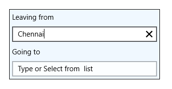

# UWP AutoComplete (SfTextBoxExt) Overview

SfTextBoxExt is an extended version of TextBox control. Most of the functionality of SfTextBoxExt is inherited from the [TextBox](https://learn.microsoft.com/en-us/uwp/api/Windows.UI.Xaml.Controls.TextBox?redirectedfrom=MSDN&view=winrt-19041) class.

### Key Features

* Auto Complete mode – The control provides suggestions to end users based on a predefined collection while typing.
* Watermark – The control will prompt the user with some information, when it is not in focus and contains an empty string.
