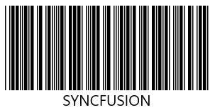
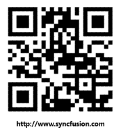
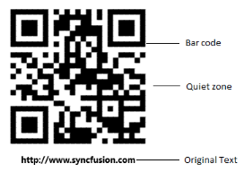

# UWP Barcode (SfBarcode) Overview

The Barcode control helps render barcodes in UWP desktop applications. The control can be integrated into any desktop application and makes it easy to encode text using the supported symbol types. The basic structure of a barcode consists of a leading and trailing quiet zone, a start pattern, one or more data characters, optionally one or two check characters, and a stop pattern.

Barcode control rendering 1D bar code
{:.caption}

Barcode control rendering 2D bar code
{:.caption}

## Structure of the Control

Structure of Barcode control
{:.caption}
