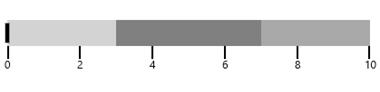

### Flow Direction

By default the flow direction of SfBulletGraph is forward (LTR). It can be customized by using **FlowDirection** property respectively.

>Note:-When the Orientation of **SfBulletGraph** is **Horizontal** the default Flow direction will be Left to Right like when the Orientation of **SfBulletGraph** is **Vertical** the default Flow Direction will be Top to Bottom.




    <syncfusion:SfBulletGraph  FlowDirection="Forward">
    </syncfusion:SfBulletGraph>





     SfBulletGraph bullet = new SfBulletGraph();
     bullet.FlowDirection = BulletGraphFlowDirection.Forward;
     this.Grid.Children.Add(bullet);




<table>
<tr>
<td>
{{''| markdownify }}
</td>
<td>
{{''| markdownify }}
{{'____'| markdownify }}
</td></tr>
</table>