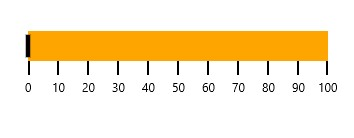
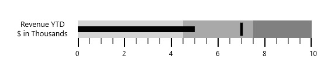
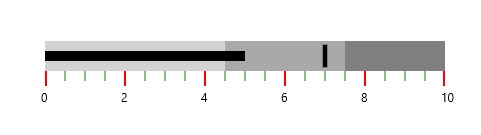
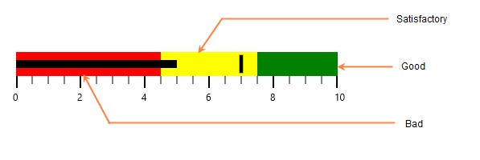

# Getting Started with SfBulletGraph

This section explains you the steps required to configure the **SfBulletGraph** and also explains the steps to add basic elements of **SfBulletGraph** through various API’s available within it.

## Configuring SfBulletGraph

**SfBulletGraph** is available in the following assembly and namespace:

**Assembly**: Syncfusion.SfBulletGraph.UWP

**Namespace**: Syncfusion.UI.Xaml.BulletGraph




    <syncfusion:SfBulletGraph/>





    SfBulletGraph bullet = new SfBulletGraph();
    this.Grid.Children.Add(bullet);




As you can see now in the above image, the SfBulletGraph displays its default elements. To customize its element, you have to add respective elements to SfBulletGraph, following section contains the steps to add the basic elements to SfBulletGraph.

## Adding Caption

You can assign a caption to **SfBulletGraph** by making use of “Caption” property and also you can position it either near or far using “**CaptionPosition**” property.




    <syncfusion:SfBulletGraph CaptionPosition="Far" Caption="Revenue YTD"
    </syncfusion:SfBulletGraph>





    SfBulletGraph bullet = new SfBulletGraph();
    bullet.Caption = Revenue YTD;
    bullet.CaptionPosition  = BulletGraphCaptionPosition.Far;
    this.Grid.Children.Add(bullet);
    



## Configuring Ticks and Labels 

You can configure Ticks and Labels of Quantitative Scale by making use of following API’s available in SfBulletGraph.

They are:

* Minimum
* Maximum
* Interval
* MinorTicksPerInterval
* MajorTickSize
* MinorTickSize
* MajorTickStroke
* LabelStroke
* MinorTickStroke




    <syncfusion:SfBulletGraph Minimum="0" Maximum="10" Interval="2"   
                                  QualitativeRangesSize="30" 
                                  QuantitativeScaleLength="300"    
                                  MinorTicksPerInterval="3"
                                  MajorTickSize="15" MinorTickSize="10"
                                  MajorTickStroke="Red" LabelStroke="Black" MinorTickStroke="Green">
        </syncfusion:SfBulletGraph>





    SfBulletGraph bullet = new SfBulletGraph();
      bullet.FlowDirection = BulletGraphFlowDirection.Forward;
      bullet.Orientation = Orientation.Horizontal;
      bullet.QualitativeRangesSize = 30;
      bullet.QuantitativeScaleLength = 300;
      bullet.Minimum = 0;
      bullet.Maximum = 10;
      bullet.Interval = 2;
      bullet.MinorTicksPerInterval = 3;
      bullet.MajorTickSize = 15;
      bullet.MinorTickSize = 10;
      bullet.MajorTickStroke = new SolidColorBrush(Colors.Red);
      bullet.LabelStroke = new SolidColorBrush(Colors.Black);
      bullet.MinorTickStroke = new SolidColorBrush(Colors.Green);
      this.Grid.Children.Add(bullet);




## Adding Ranges 

You can add ranges to **SfBulletGraph** by creating ranges collection using **QualitativeRanges**. 




          <syncfusion:SfBulletGraph Orientation="Horizontal" Minimum="0" Maximum="10" Interval="2"  FlowDirection="Forward"
                                  QualitativeRangesSize="30" 
                                  QuantitativeScaleLength="300">
            <syncfusion:SfBulletGraph.QualitativeRanges>
                <syncfusion:QualitativeRange RangeEnd="4.5" 
                                             RangeStroke="Red"
                                             RangeOpacity="1">
                </syncfusion:QualitativeRange>
                <syncfusion:QualitativeRange RangeEnd="7.5" 
                                             RangeStroke="Yellow"
                                             RangeOpacity="1">
                </syncfusion:QualitativeRange>
                <syncfusion:QualitativeRange RangeEnd="10" 
                                             RangeStroke="Green"
                                             RangeOpacity="1">
                </syncfusion:QualitativeRange>
            </syncfusion:SfBulletGraph.QualitativeRanges>
        </syncfusion:SfBulletGraph>





           SfBulletGraph bullet = new SfBulletGraph();
            bullet.QualitativeRangesSize = 30;
            bullet.QuantitativeScaleLength = 300;
            bullet.FlowDirection = BulletGraphFlowDirection.Forward;
            bullet.Orientation = Orientation.Horizontal;
            bullet.Minimum = 0;
            bullet.Maximum = 10;
            bullet.Interval = 2;
            bullet.QualitativeRanges.Add(new QualitativeRange()
            {
                RangeEnd = 4.5,
                RangeOpacity = 1,
                RangeStroke = new SolidColorBrush(Colors.Red)
            });
            bullet.QualitativeRanges.Add(new QualitativeRange()
            {
                RangeEnd = 7.5,
                RangeOpacity = 1,
                RangeStroke = new SolidColorBrush(Colors.Yellow)
            });
            bullet.QualitativeRanges.Add(new QualitativeRange()
            {
                RangeEnd = 10,
                RangeOpacity = 1,
                RangeStroke = new SolidColorBrush(Colors.Green)
            });
            this.Grid.Children.Add(bullet);
            



SfBulletGraph ranges are displayed as follows.

## See also

[How to refresh bullet graph with dynamic data](https://www.syncfusion.com/kb/9996/how-to-refresh-bulletgraph-with-dynamic-data)
