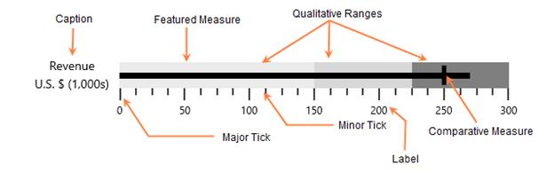

# Key Features in UWP Bullet Graph (SfBulletGraph)

**SfBulletGraph** is a composite UI element with the following sub-parts:

* Ticks
* Label
* Caption
* Range
* Feature Measure

**Ticks**

Ticks are scale indicators which are used to specify the values on the quantitative scale.

**Label**

A quantitative scale label specifies the numeric value according to the major ticks in the range of the scale.

**Caption**

The Caption for a bullet graph is used to specify a unique label describing the value represented in the bullet graph. 

**Range**

A qualitative range is a visual element which ends at a specified RangeEnd at the start of the previous range's RangeEnd. The qualitative ranges are arranged according to each RangeEnd value.

**Performance measure**

*Featured measure*

The featured measure is used to display the primary data, or the current value of the data that you are measuring. It should usually be encoded as a bar, like the bar on a bar graph, and be prominent.

*Comparative measure*

The comparative measure should be less visually dominant than the featured measure. It should always be encoded as a short line that runs perpendicular to the orientation of the graph. A good example would be a target for YTD revenue. Whenever the featured measure intersects a comparative measure, the comparative measure should appear behind the featured measure.

**Bullet graphs type**

The Bullet Graph types can be differentiated by their orientation of the control. The control direction may be **horizontal** or **vertical**.

**Easy to use**

SfBulletGraph is available in the Visual Studio toolbox itself; you can easily drag and drop the control from the toolbox.

**Data binding support** 

The control can be bound to your application data from a variety of data sources in the form of binding declaration or by setting its properties directly.

**MVVM support**

The Model-View-ViewModel (MVVM) pattern is followed to get better control customization.

**SfBulletGraph Elements**

