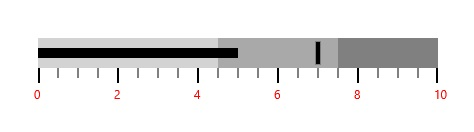
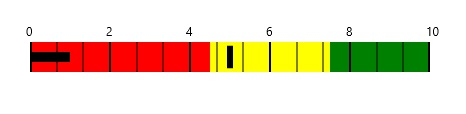

# Labels in UWP Bullet Graph (SfBulletGraph)

A quantitative scale label specifies the numeric value according to the major ticks in the range of the scale.

## Customizing Labels

The Labels can be positioned far away from the Quantitative scale by using the **LabelOffset** property and the default value of this **LabelOffset** property value is 0.The foreground of the label is customized by setting **LabelStroke**. By setting **LabelSize**, the font size of the labels is modified. The label content can be formatted by using **LabelFormat** property.




    <syncfusion:SfBulletGraph  LabelSize="20"
                              LabelOffset="5" 
                              LabelStroke="Red"
                              LabelFormat="" >
        </syncfusion:SfBulletGraph>





      SfBulletGraph bullet = new SfBulletGraph();
      bullet.LabelOffset = 5;
      bullet.LabelSize = 10;
      bullet.LabelFormat = "";
      bullet.LabelStroke = new SolidColorBrush(Colors.Red);
      this.Grid.Children.Add(bullet);




## Label Position

The labels in the scale can be placed above or below the qualitative ranges by choosing the following options available in the **LabelPosition** property. 

1. Below (Default)
2. Above




    <syncfusion:SfBulletGraph LabelPosition="Above">
    </syncfusion:SfBulletGraph>





    SfBulletGraph bullet = new SfBulletGraph();
    bullet.LabelPosition = BulletGraphLabelsPosition.Above;
    this.Grid.Children.Add(bullet);




