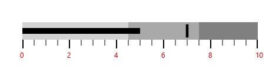
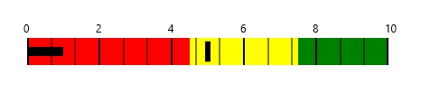

# Labels in UWP Bullet Graph (SfBulletGraph)

A quantitative scale label specifies the numeric value according to the major ticks in the range of the scale.

## Customizing labels

The labels can be positioned far away from the Quantitative scale by using the [`LabelOffset`](https://help.syncfusion.com/cr/uwp/Syncfusion.UI.Xaml.BulletGraph.SfBulletGraph.html#Syncfusion_UI_Xaml_BulletGraph_SfBulletGraph_LabelOffset) property and the default value of this [`LabelOffset`](https://help.syncfusion.com/cr/uwp/Syncfusion.UI.Xaml.BulletGraph.SfBulletGraph.html#Syncfusion_UI_Xaml_BulletGraph_SfBulletGraph_LabelOffset) property value is 0. The foreground of the label is customized by setting [`LabelStroke`](https://help.syncfusion.com/cr/uwp/Syncfusion.UI.Xaml.BulletGraph.SfBulletGraph.html#Syncfusion_UI_Xaml_BulletGraph_SfBulletGraph_LabelStroke). By setting [`LabelSize`](https://help.syncfusion.com/cr/uwp/Syncfusion.UI.Xaml.BulletGraph.SfBulletGraph.html#Syncfusion_UI_Xaml_BulletGraph_SfBulletGraph_LabelSize), the font size of the labels is modified. The label content can be formatted by using the [`LabelFormat`](https://help.syncfusion.com/cr/uwp/Syncfusion.UI.Xaml.BulletGraph.SfBulletGraph.html#Syncfusion_UI_Xaml_BulletGraph_SfBulletGraph_LabelFormat) property.




<syncfusion:SfBulletGraph LabelSize="20"
                          LabelOffset="5" 
                          LabelStroke="Red"
                          LabelFormat="" />





SfBulletGraph bullet = new SfBulletGraph();
bullet.LabelOffset = 5;
bullet.LabelSize = 20;
bullet.LabelFormat = "";
bullet.LabelStroke = new SolidColorBrush(Colors.Red);
this.Grid.Children.Add(bullet);




## Label position

The labels in the scale can be placed above or below the qualitative ranges by choosing the following options available in the [`LabelPosition`](https://help.syncfusion.com/cr/uwp/Syncfusion.UI.Xaml.BulletGraph.SfBulletGraph.html#Syncfusion_UI_Xaml_BulletGraph_SfBulletGraph_LabelPosition) property. 

1. Below (Default)
2. Above




<syncfusion:SfBulletGraph LabelPosition="Above" />





SfBulletGraph bullet = new SfBulletGraph();
bullet.LabelPosition = BulletGraphLabelsPosition.Above;
this.Grid.Children.Add(bullet);




