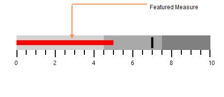
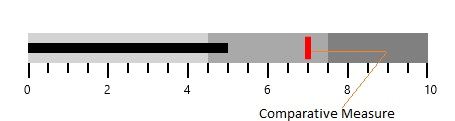

# Measures in UWP Bullet Graph (SfBulletGraph)

## Featured measure

The featured measure is used to display the primary data, or the current value of the data that you are measuring. It should usually be encoded as a bar.

**Customizing featured measure**

The value of the featured measure of the bullet graph is set by the [`FeaturedMeasure`](https://help.syncfusion.com/cr/uwp/Syncfusion.UI.Xaml.BulletGraph.SfBulletGraph.html#Syncfusion_UI_Xaml_BulletGraph_SfBulletGraph_FeaturedMeasure) property. By setting the [`FeaturedMeasureBarStroke`](https://help.syncfusion.com/cr/uwp/Syncfusion.UI.Xaml.BulletGraph.SfBulletGraph.html#Syncfusion_UI_Xaml_BulletGraph_SfBulletGraph_FeaturedMeasureBarStroke) property, the stroke of the featured measure bar can be customized. The thickness of the featured measure bar is modified by using [`FeaturedMeasureBarStrokeThickness`](https://help.syncfusion.com/cr/uwp/Syncfusion.UI.Xaml.BulletGraph.SfBulletGraph.html#Syncfusion_UI_Xaml_BulletGraph_SfBulletGraph_FeaturedMeasureBarStrokeThickness). 




<syncfusion:SfBulletGraph FeaturedMeasure="5" FeaturedMeasureBarStroke="Red"
                          FeaturedMeasureBarStrokeThickness="10" />




 
SfBulletGraph bullet = new SfBulletGraph();
bullet.FeaturedMeasure = 5;
bullet.FeaturedMeasureBarStroke = new SolidColorBrush(Colors.Red);
bullet.FeaturedMeasureBarStrokeThickness = 10;
this.Grid.Children.Add(bullet);




## Comparative measure

The comparative measure should be less visually dominant than the featured measure. It should always be encoded as a short line that runs perpendicular to the orientation of the graph. A good example would be a target for YTD revenue. Whenever the featured measure intersects a comparative measure, the comparative measure should appear behind the featured measure.

**Customizing comparative measure**

The value of the comparative measure is set by using the [`ComparativeMeasure`](https://help.syncfusion.com/cr/uwp/Syncfusion.UI.Xaml.BulletGraph.SfBulletGraph.html#Syncfusion_UI_Xaml_BulletGraph_SfBulletGraph_ComparativeMeasure) property. By setting the [`ComparativeMeasureSymbolStroke`](https://help.syncfusion.com/cr/uwp/Syncfusion.UI.Xaml.BulletGraph.SfBulletGraph.html#Syncfusion_UI_Xaml_BulletGraph_SfBulletGraph_ComparativeMeasureSymbolStroke) property, the stroke of the comparative measure symbol is customized. The thickness of the comparative measure symbol is modified by using [`ComparativeMeasureSymbolStrokeThickness`](https://help.syncfusion.com/cr/uwp/Syncfusion.UI.Xaml.BulletGraph.SfBulletGraph.html#Syncfusion_UI_Xaml_BulletGraph_SfBulletGraph_ComparativeMeasureSymbolStrokeThickness). 




<syncfusion:SfBulletGraph ComparativeMeasure="7"
                          ComparativeMeasureSymbolStroke="Red" 
                          ComparativeMeasureSymbolStrokeThickness="6" />





SfBulletGraph bullet = new SfBulletGraph();
bullet.ComparativeMeasure = 7;
bullet.ComparativeMeasureSymbolStroke = new SolidColorBrush(Colors.Red);
bullet.ComparativeMeasureSymbolStrokeThickness = 6;
this.Grid.Children.Add(bullet);




