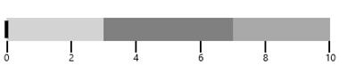

# Orientation in UWP Bullet Graph (SfBulletGraph)

By default orientation of SfBulletGraph is horizontal. It can be customized by using **Orientation** property respectively.




    <syncfusion:SfBulletGraph Orientation="Vertical">
    </syncfusion:SfBulletGraph>





     SfBulletGraph bullet = new SfBulletGraph();
     bullet.Orientation = Orientation.Vertical;
     this.Grid.Children.Add(bullet);




<table>
<tr>
<td>
{{''| markdownify }}
</td><td>
{{''| markdownify }}
</td></tr>
</table>
