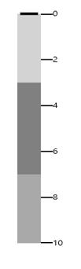
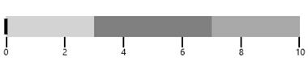

# Orientation in UWP Bullet Graph (SfBulletGraph)

By default, the orientation of SfBulletGraph is horizontal. It can be customized by using the **Orientation** property respectively.




<syncfusion:SfBulletGraph Orientation="Vertical" />





SfBulletGraph bullet = new SfBulletGraph();
bullet.Orientation = Orientation.Vertical;
this.Grid.Children.Add(bullet);




<table>
<tr>
<td>
{{''| markdownify }}
</td><td>
{{''| markdownify }}
</td></tr>
</table>
