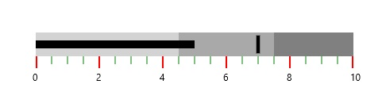
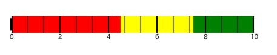

# Ticks in UWP Bullet Graph (SfBulletGraph)

Quantitative scale is displayed with two types of ticks: 

* Major ticks, the primary scale indicators.
* Minor ticks, the secondary scale indicators that fall in between the major ticks.

## Customizing ticks

The Interval property is used to calculate the major tick count for a SfBulletGraph. Similarly, minor ticks are calculated using the MinorTicksPerInterval property.

The stroke of the major and minor ticks is customized by setting the [`MajorTickStroke`](https://help.syncfusion.com/cr/uwp/Syncfusion.UI.Xaml.BulletGraph.SfBulletGraph.html#Syncfusion_UI_Xaml_BulletGraph_SfBulletGraph_MajorTickStroke) and [`MinorTickStroke`](https://help.syncfusion.com/cr/uwp/Syncfusion.UI.Xaml.BulletGraph.SfBulletGraph.html#Syncfusion_UI_Xaml_BulletGraph_SfBulletGraph_MinorTickStroke) properties. The size can be modified by using the [`MajorTickSize`](https://help.syncfusion.com/cr/uwp/Syncfusion.UI.Xaml.BulletGraph.SfBulletGraph.html#Syncfusion_UI_Xaml_BulletGraph_SfBulletGraph_MajorTickSize) and [`MinorTickSize`](https://help.syncfusion.com/cr/uwp/Syncfusion.UI.Xaml.BulletGraph.SfBulletGraph.html#Syncfusion_UI_Xaml_BulletGraph_SfBulletGraph_MinorTickSize) properties. By setting [`MajorTickStrokeThickness`](https://help.syncfusion.com/cr/uwp/Syncfusion.UI.Xaml.BulletGraph.SfBulletGraph.html#Syncfusion_UI_Xaml_BulletGraph_SfBulletGraph_MajorTickStrokeThickness) and [`MinorTickStrokeThickness`](https://help.syncfusion.com/cr/uwp/Syncfusion.UI.Xaml.BulletGraph.SfBulletGraph.html#Syncfusion_UI_Xaml_BulletGraph_SfBulletGraph_MinorTickStrokeThickness), the stroke's thickness can be customized.




<syncfusion:SfBulletGraph Interval="2"
                          MinorTicksPerInterval="3"
                          MajorTickSize="15"
                          MinorTickSize="10"
                          MajorTickStroke="Red"      
                          MinorTickStroke="Green" />





SfBulletGraph bullet = new SfBulletGraph();
bullet.MinorTicksPerInterval = 3;
bullet.MajorTickSize = 15;
bullet.MinorTickSize = 10;
bullet.MajorTickStroke = new SolidColorBrush(Colors.Red);
bullet.MinorTickStroke = new SolidColorBrush(Colors.Green);
this.Grid.Children.Add(bullet);




## Tick position

The ticks in the scale can be placed above or below the ranges of the quantitative scale by choosing the options available in the [`TickPosition`](https://help.syncfusion.com/cr/uwp/Syncfusion.UI.Xaml.BulletGraph.SfBulletGraph.html#Syncfusion_UI_Xaml_BulletGraph_SfBulletGraph_TickPosition) property. 

They are:

1. Below (Default)
2. Above
3. Cross




<syncfusion:SfBulletGraph TickPosition="Cross" />





SfBulletGraph bullet = new SfBulletGraph();
bullet.TickPosition = BulletGraphTicksPosition.Cross; 
this.Grid.Children.Add(bullet);




