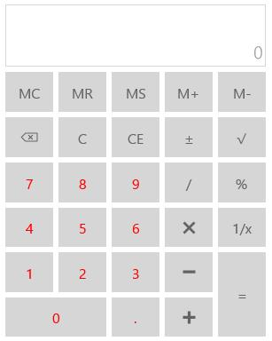

# Appearance and Styling in UWP Calculator (SfCalculator) control

All the panes in SfCalculator can be customized easily. The panes can be styled as follows:

* FunctionsPaneStyle 
* DisplayPaneStyle
* InputPane Style

## Customizing functions panel

Function pane is the panel containing number buttons and mathematical symbols. It can be styled using FunctionsPaneStyle property.





       





## Customizing display panel

Display pane is the panel that contain elements displaying value and expression. It can be styled as follows.









## Customizing input panel

Input pane is a panel in SfCalculator that contains number buttons. It can be styled as follows.









