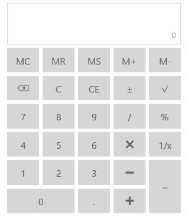

# Getting Started with UWP Calculator (SfCalculator)

This section explains how to create a standalone calculator control that provide options to perform basic arithmetic operations.

## Adding SfCalculator Control

Create a Universal Windows Platform project in Visual Studio and refer to the following assemblies.

* Syncfusion. SfInput.UWP

* Syncfusion.SfShared.UWP

1.Include the namespace for Syncfusion.SfInput.UWP assembly in MainPage.xaml




 
<Page xmlns="http://schemas.microsoft.com/winfx/2006/xaml/presentation"

xmlns:x="http://schemas.microsoft.com/winfx/2006/xaml"

xmlns:input="using:Syncfusion.UI.Xaml.Controls.Input">





2.Now add the `SfCalculator` control with a required optimal name using the included namespace





<input:SfCalculator x:Name="calculator">





 SfCalculator calculator = new SfCalculator();





  Dim calculator As New SfCalculator()





Above code example creates the calculator as follows and perform mathematical arithmetic operations using the provided buttons:

