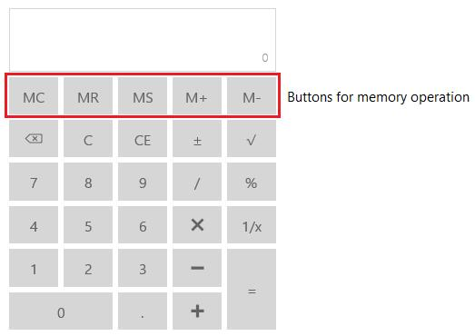

# Memory in UWP Calculator (SfCalculator)

`Memory` property in the `SfCalculator` control is used to retrieve the value stored in memory. The following buttons are available in `SfCalculator` control that are needed for memory operations. `Memory` property is a read-only decimal property.

## Storing Value to Memory

* Performs memory storage. 
* Clicking the button, stores the current value in memory. 
* The value can be retrieved whenever required.

## Retrieving Value from Memory

* Performs memory restore. 
* Clicking the button, retrieves the value from memory for further usage.
* Retrieved value is displayed in display pane.

## Increment Memory Value

Clicking the button, increments the stored value by the incremental value (i.e., current value). 
The incremented value is then stored in memory.

## Decrement Memory Value

Clicking the button, decrements the stored value from decrement value (i.e., current value). 
The decremented value is then stored in memory. 

## Clear Memory Value

Performs memory clear. 
Clicking the button, clears the value stored in the memory and reset it to 0.

