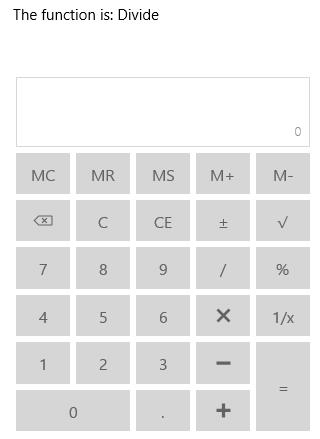
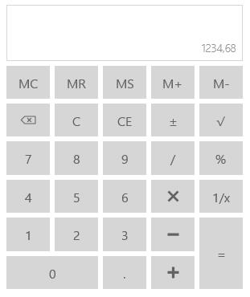

# Utilities in UWP Calculator (SfCalculator)

Several utility functions are available in `SfCalculator` control.

## Identifying the Operation

This method is used to identify the mathematical operation based on the input string.





<StackPanel>

<TextBlock x:Name="functionText"/>

<input:SfCalculator x:Name="calculator"/>

</StackPanel>









CalculatorFunctions function = calculator.CheckFunction("/");

functionText.Text = "The function is: " + function.ToString();





Dim [function] As CalculatorFunctions = calculator.CheckFunction("/")

functionText.Text = "The function is: " & [function].ToString()





## Clear the Expression

`Clear` function is used to clear both the expression and value in `SfCalculator`.





calculator.Clear();





calculator.Clear()





## Clear the Value

`ClearEntry` function is used to clear the entered/computed value in `SfCalculator`.





calculator.ClearEntry();





calculator.ClearEntry()





## Clear and Reset the Expression

`Reset` function is used to clear and reset the expression.





calculator.Reset();





calculator.Reset()





## Removing Trailing Zeros

`TrailingZeros` method is used to remove the trailing zeros at the end of value.





calculator.TrailingZeros();





calculator.TrailingZeros()





## Change Separators based on Culture

`SfCalculator` has Culture support that allows to have decimal separator symbols based on the culture.





<input:SfCalculator x:Name="calculator"/>









calculator.Culture = new System.Globalization.CultureInfo("de-DE");





calculator.Culture = New System.Globalization.CultureInfo("de-DE")





