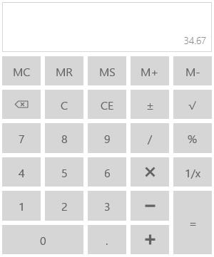

# Value in UWP Calculator (SfCalculator)

## Retrieving Computed Value

`Value` property in the `SfCalculator` control is used to retrieve the computed value from the expressions in Calculator. It is a read-only decimal property. It can also be set to display a decimal value as computed value.





<Grid>

<TextBlock Text="{Binding ElementName=calculator,Path=Value}"/>

<input:SfCalculator x:Name="calculator"/>

</Grid>









decimal value = calculator.Value;





 Dim calculator As New SfCalculator()





## Displaying a Default Value

`DefaultValue` property is set to display a default value in the input pane of `SfCalculator` control. It is a decimal property.  





calculator.DefaultValue = 34.67M;





calculator.DefaultValue = 34.67D





## Showing Text in Display Panel

`DisplayText` property is set to display a text in the display pane of `SfCalculator` control.





<input:SfCalculator x:Name="calculator" DisplayText="Display Text"/>









calculator.DisplayText = "DisplayText";





calculator.DisplayText = "DisplayText"





## Displaying an Expression

`Expression` property is used to get the mathematical expression that produced the evaluated value in `SfCalculator`. `Expression` can also set to any string property but it is not evaluated to produce result. It is just displayed in the pane.





<Grid>

<TextBlock Text="{Binding ElementName=calculator,Path=Expression}"/>

<input:SfCalculator x:Name="calculator" Expression="1+2+3+4"/>

</Grid>









calculator.Expression = "1+2+3+4";

string expression = calculator.Expression;





calculator.Expression = "1+2+3+4"

Dim expression As String = calculator.Expression





