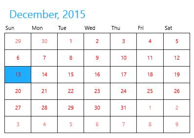
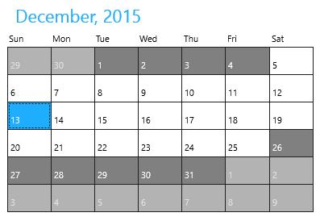
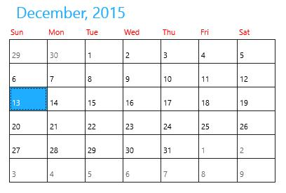
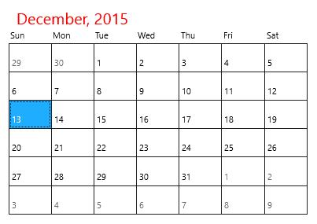
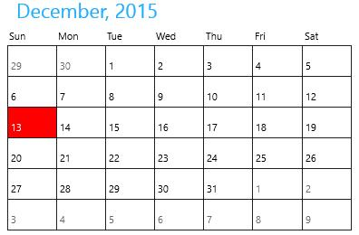
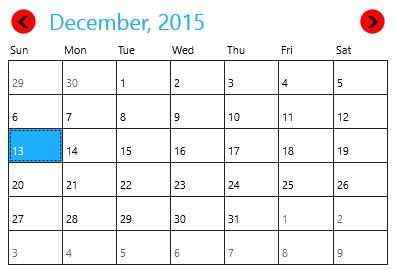

# Appearance and Styling in UWP Calendar (SfCalendar)

Each and every part in SfCalendar can be customizable. And it can be customized as follows:

## Customizing the Active Date Cell

The active calendar day button template can be modified using `CellTemplate` property. It also provided `CellTemplateSelector` property for applying selective templates by a logic.





<input:SfCalendar x:Name="calendar">

<input:SfCalendar.CellTemplate>

<DataTemplate>

<TextBlock Text="{Binding Day}" VerticalAlignment="Center"
           HorizontalAlignment="Center" Foreground="Red"/>
           
</DataTemplate>

</input:SfCalendar.CellTemplate>

</input:SfCalendar>





## Customizing the Disabled Date Cell

The inactive/disabled calendar day button template can be modified using `DisabledCellTemplate` property.





<input:SfCalendar x:Name="calendar">

<input:SfCalendar.DisabledCellTemplate>

<DataTemplate>

<Grid Background="Gray">

<TextBlock Text="{Binding Day}" VerticalAlignment="Bottom"
           Foreground="White" Opacity="1" Margin="3"/>
           
</Grid>

</DataTemplate>

</input:SfCalendar.DisabledCellTemplate>

</input:SfCalendar>









calendar.VisibleMinDate = new DateTime(2015, 12, 5);

calendar.VisibleMaxDate = new DateTime(2015, 12, 25);





calendar.VisibleMinDate = New Date(2015, 12, 5)

calendar.VisibleMaxDate = New Date(2015, 12, 25)





## Customizing Day Name Cell 

The template of day names can also be modified using `DayNameCellTemplate` property.





<input:SfCalendar x:Name="calendar">

<input:SfCalendar.DayNameCellTemplate>

<DataTemplate>

<TextBlock Text="{Binding}" Foreground="Red"/>

</DataTemplate>

</input:SfCalendar.DayNameCellTemplate>

</input:SfCalendar>





## Customizing Header

The template of header in SfCalendar can be modified using `HeaderTemplate` property.





<input:SfCalendar x:Name="calendar" >

<input:SfCalendar.HeaderTemplate>

<DataTemplate>

<TextBlock Text="{Binding}" FontSize="20" Foreground="Red"/>

</DataTemplate>

</input:SfCalendar.HeaderTemplate>

</input:SfCalendar>





## Changing Selected Date Background

The background of selected date can be set using `SelectedDateBackground` property.





<input:SfCalendar x:Name="calendar" SelectedDateBackground="Red"/>









calendar.SelectedDateBackground = new SolidColorBrush(Windows.UI.Colors.Red);





calendar.SelectedDateBackground = New SolidColorBrush(Windows.UI.Colors.Red)





## Customizing Scroll Button

The template of previous and next scroll buttons can be modified with `PreviousScrollButtonTemplate` and `NextScrollButtonTemplate` properties. ****





<input:SfCalendar x:Name="calendar" ShowNavigationButton="True" >
<input:SfCalendar.PreviousScrollButtonTemplate>
<ControlTemplate TargetType="Button">
<Grid>
<VisualStateManager.VisualStateGroups>
<VisualStateGroup x:Name="CommonStates">
<VisualState x:Name="Normal"/>
<VisualState x:Name="PointerOver">
<Storyboard>
<ObjectAnimationUsingKeyFrames Storyboard.TargetProperty="Fill" Storyboard.TargetName="ellipse">
<DiscreteObjectKeyFrame KeyTime="0" Value="#414242"/>
</ObjectAnimationUsingKeyFrames>
<ObjectAnimationUsingKeyFrames Storyboard.TargetProperty="Fill" Storyboard.TargetName="Triangle">
<DiscreteObjectKeyFrame KeyTime="0" Value="#2FA0D5"/>
</ObjectAnimationUsingKeyFrames>
</Storyboard>
</VisualState>
<VisualState x:Name="Pressed">
<Storyboard>
<ObjectAnimationUsingKeyFrames Storyboard.TargetProperty="Fill" Storyboard.TargetName="ellipse">
<DiscreteObjectKeyFrame KeyTime="0" Value="#2FA0D5"/>
</ObjectAnimationUsingKeyFrames>
<ObjectAnimationUsingKeyFrames Storyboard.TargetProperty="Fill" Storyboard.TargetName="Triangle">
<DiscreteObjectKeyFrame KeyTime="0" Value="#ECEEEE"/>
</ObjectAnimationUsingKeyFrames>
</Storyboard>
</VisualState>
<VisualState x:Name="Disabled">
<Storyboard>
<ObjectAnimationUsingKeyFrames Storyboard.TargetProperty="Fill" Storyboard.TargetName="ellipse">
<DiscreteObjectKeyFrame KeyTime="0" Value="{StaticResource ButtonDisabledBackgroundThemeBrush}"/>
</ObjectAnimationUsingKeyFrames>
<ObjectAnimationUsingKeyFrames Storyboard.TargetProperty="Fill" Storyboard.TargetName="Triangle">
<DiscreteObjectKeyFrame KeyTime="0" Value="{StaticResource ButtonDisabledForegroundThemeBrush}"/>
</ObjectAnimationUsingKeyFrames>
</Storyboard>
</VisualState>

</VisualStateGroup>
<VisualStateGroup x:Name="FocusStates">
<VisualState x:Name="Focused">
<Storyboard>
<DoubleAnimation Duration="0" To="1" Storyboard.TargetProperty="Opacity" Storyboard.TargetName="FocusVisualWhite"/>
<DoubleAnimation Duration="0" To="1" Storyboard.TargetProperty="Opacity" Storyboard.TargetName="FocusVisualBlack"/>
</Storyboard>
</VisualState>
<VisualState x:Name="Unfocused"/>
<VisualState x:Name="PointerFocused"/>
</VisualStateGroup>
</VisualStateManager.VisualStateGroups>
<Grid>
<Ellipse x:Name="ellipse"
Canvas.Top="50"
Canvas.Left="50"
Fill="Red"
Margin="3" Width="25" Height="25"
StrokeThickness="{TemplateBinding BorderThickness}"
Stroke="{TemplateBinding BorderBrush}">
</Ellipse>
<Border x:Name="Border" VerticalAlignment="Center" HorizontalAlignment="Center">
<Path x:Name="Triangle" 
Data="F1M646.688,13.5518L646.783,13.4593 646.965,13.639 668.383,35.0583 689.459,35.0583 665.155,10.751 657.503,3.10126 657.323,2.92023 664.876,-4.63837 689.184,-28.9417 668.109,-28.9417 646.688,-7.52637 636.15,3.01398 646.688,13.5518z" Stretch="Uniform" Fill="{TemplateBinding Foreground}" Width="12" Height="12"
Margin="-0.5,0,1.3,0" RenderTransformOrigin="0.5,0.5">
<Path.RenderTransform>
<TransformGroup>
<TransformGroup.Children>
<RotateTransform Angle="180" />
<ScaleTransform ScaleX="-1" ScaleY="-1" />
</TransformGroup.Children>
</TransformGroup>
</Path.RenderTransform>
</Path>
</Border>
</Grid>
<Rectangle x:Name="FocusVisualWhite" IsHitTestVisible="False" Opacity="0" StrokeDashOffset="1.5" StrokeEndLineCap="Square" Stroke="{StaticResource FocusVisualWhiteStrokeThemeBrush}" StrokeDashArray="1,1"/>
<Rectangle x:Name="FocusVisualBlack" IsHitTestVisible="False" Opacity="0" StrokeDashOffset="0.5" StrokeEndLineCap="Square" Stroke="{StaticResource FocusVisualBlackStrokeThemeBrush}" StrokeDashArray="1,1"/>
</Grid>
</ControlTemplate>
</input:SfCalendar.PreviousScrollButtonTemplate>
<input:SfCalendar.NextScrollButtonTemplate>
<ControlTemplate TargetType="Button">
<Grid>
<VisualStateManager.VisualStateGroups>
<VisualStateGroup x:Name="CommonStates">
<VisualState x:Name="Normal"/>
<VisualState x:Name="PointerOver">
<Storyboard>
<ObjectAnimationUsingKeyFrames Storyboard.TargetProperty="Fill" Storyboard.TargetName="ellipse">
<DiscreteObjectKeyFrame KeyTime="0" Value="#414242"/>
</ObjectAnimationUsingKeyFrames>
<ObjectAnimationUsingKeyFrames Storyboard.TargetProperty="Fill" Storyboard.TargetName="Triangle">
<DiscreteObjectKeyFrame KeyTime="0" Value="#2FA0D5"/>
</ObjectAnimationUsingKeyFrames>
</Storyboard>
</VisualState>
<VisualState x:Name="Pressed">
<Storyboard>
<ObjectAnimationUsingKeyFrames Storyboard.TargetProperty="Fill" Storyboard.TargetName="ellipse">
<DiscreteObjectKeyFrame KeyTime="0" Value="#2FA0D5"/>
</ObjectAnimationUsingKeyFrames>
<ObjectAnimationUsingKeyFrames Storyboard.TargetProperty="Fill" Storyboard.TargetName="Triangle">
<DiscreteObjectKeyFrame KeyTime="0" Value="#ECEEEE"/>
</ObjectAnimationUsingKeyFrames>
</Storyboard>
</VisualState>
<VisualState x:Name="Disabled">
<Storyboard>
<ObjectAnimationUsingKeyFrames Storyboard.TargetProperty="Fill" Storyboard.TargetName="ellipse">
<DiscreteObjectKeyFrame KeyTime="0" Value="{StaticResource ButtonDisabledBackgroundThemeBrush}"/>
</ObjectAnimationUsingKeyFrames>
<ObjectAnimationUsingKeyFrames Storyboard.TargetProperty="Fill" Storyboard.TargetName="Triangle">
<DiscreteObjectKeyFrame KeyTime="0" Value="{StaticResource ButtonDisabledForegroundThemeBrush}"/>
</ObjectAnimationUsingKeyFrames>
</Storyboard>
</VisualState>
</VisualStateGroup>
<VisualStateGroup x:Name="FocusStates">
<VisualState x:Name="Focused">
<Storyboard>
<DoubleAnimation Duration="0" To="1" Storyboard.TargetProperty="Opacity" Storyboard.TargetName="FocusVisualWhite"/>
<DoubleAnimation Duration="0" To="1" Storyboard.TargetProperty="Opacity" Storyboard.TargetName="FocusVisualBlack"/>
</Storyboard>
</VisualState>
<VisualState x:Name="Unfocused"/>
<VisualState x:Name="PointerFocused"/>
</VisualStateGroup>
</VisualStateManager.VisualStateGroups>
<Grid>
<Ellipse x:Name="ellipse"
Canvas.Top="50"
Canvas.Left="50"
Fill="Red"
Margin="3" Width="25" Height="25"
StrokeThickness="{TemplateBinding BorderThickness}"
Stroke="{TemplateBinding BorderBrush}">
</Ellipse>
<Border x:Name="Border" VerticalAlignment="Center" HorizontalAlignment="Center">
<Path x:Name="Triangle" 
Data="F1M646.688,13.5518L646.783,13.4593 646.965,13.639 668.383,35.0583 689.459,35.0583 665.155,10.751 657.503,3.10126 657.323,2.92023 664.876,-4.63837 689.184,-28.9417 668.109,-28.9417 646.688,-7.52637 636.15,3.01398 646.688,13.5518z" Stretch="Uniform" Fill="{TemplateBinding Foreground}" Width="12" Height="12" 
Margin="-1,0,-1,0" RenderTransformOrigin="0.5,0.5">
<Path.RenderTransform>
<TransformGroup>
<TransformGroup.Children>
<RotateTransform Angle="0" />
<ScaleTransform ScaleX="-1" ScaleY="-1" />
</TransformGroup.Children>
</TransformGroup>
</Path.RenderTransform>
</Path>
</Border>
</Grid>
<Rectangle x:Name="FocusVisualWhite" IsHitTestVisible="False" Opacity="0" StrokeDashOffset="1.5" StrokeEndLineCap="Square" Stroke="{StaticResource FocusVisualWhiteStrokeThemeBrush}" StrokeDashArray="1,1"/>
<Rectangle x:Name="FocusVisualBlack" IsHitTestVisible="False" Opacity="0" StrokeDashOffset="0.5" StrokeEndLineCap="Square" Stroke="{StaticResource FocusVisualBlackStrokeThemeBrush}" StrokeDashArray="1,1"/>
</Grid>
</ControlTemplate>

</input:SfCalendar.NextScrollButtonTemplate>
</input:SfCalendar>





## Refresh the Layout

`Refresh` method is used to refresh the layout of SfCalendar so that the cell templates are applied again.





calendar.Refresh();





calendar.Refresh()




