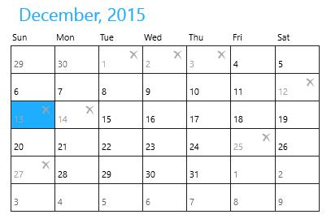
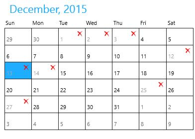

# Blocking Dates in UWP Calendar (SfCalendar)

`SfCalendar` allows to block out dates so that a blocked date will look disabled, skipped in key navigation and unable to select.

## Blocking out the Date Collection

`BlackOutDates` property is used to specify the collection of DateTime that are to be blocked.





<input:SfCalendar x:Name="calendar"/>









calendar.BlackOutDates.Add(new DateTime(2015, 12, 1));

calendar.BlackOutDates.Add(new DateTime(2015, 12, 2));

calendar.BlackOutDates.Add(new DateTime(2015, 12, 3));

calendar.BlackOutDates.Add(new DateTime(2015, 12, 12));

calendar.BlackOutDates.Add(new DateTime(2015, 12, 13));

calendar.BlackOutDates.Add(new DateTime(2015, 12, 14));

calendar.BlackOutDates.Add(new DateTime(2015, 12, 25));

calendar.BlackOutDates.Add(new DateTime(2015, 12, 27));





calendar.BlackOutDates.Add(New Date(2015, 12, 1))

calendar.BlackOutDates.Add(New Date(2015, 12, 2))

calendar.BlackOutDates.Add(New Date(2015, 12, 3))

calendar.BlackOutDates.Add(New Date(2015, 12, 12))

calendar.BlackOutDates.Add(New Date(2015, 12, 13))

calendar.BlackOutDates.Add(New Date(2015, 12, 14))

calendar.BlackOutDates.Add(New Date(2015, 12, 25))

calendar.BlackOutDates.Add(New Date(2015, 12, 27))





## Customize the Blocked Date Cell

The template of blocked cells can be customized using `BlackOutCellTemplate` property.





<input:SfCalendar x:Name="calendar">

<input:SfCalendar.BlackOutCellTemplate>

<DataTemplate>

<Grid>

<TextBlock Text="&#xE106;" Foreground="Red"
           VerticalAlignment="Top" FontFamily="Segoe UI Symbol"
		   Margin="3" HorizontalAlignment="Right"/>
		   
<TextBlock Text="{Binding Day}" Foreground="#FFA5A5A5"
           VerticalAlignment="Bottom" Margin="3"/>
</Grid>

</DataTemplate>

</input:SfCalendar.BlackOutCellTemplate>

</input:SfCalendar>









calendar.BlackOutDates.Add(new DateTime(2015, 12, 1));

calendar.BlackOutDates.Add(new DateTime(2015, 12, 2));

calendar.BlackOutDates.Add(new DateTime(2015, 12, 3));

calendar.BlackOutDates.Add(new DateTime(2015, 12, 12));

calendar.BlackOutDates.Add(new DateTime(2015, 12, 13));

calendar.BlackOutDates.Add(new DateTime(2015, 12, 14));

calendar.BlackOutDates.Add(new DateTime(2015, 12, 25));

calendar.BlackOutDates.Add(new DateTime(2015, 12, 27));





calendar.BlackOutDates.Add(New Date(2015, 12, 1))

calendar.BlackOutDates.Add(New Date(2015, 12, 2))

calendar.BlackOutDates.Add(New Date(2015, 12, 3))

calendar.BlackOutDates.Add(New Date(2015, 12, 12))

calendar.BlackOutDates.Add(New Date(2015, 12, 13))

calendar.BlackOutDates.Add(New Date(2015, 12, 14))

calendar.BlackOutDates.Add(New Date(2015, 12, 25))

calendar.BlackOutDates.Add(New Date(2015, 12, 27))





