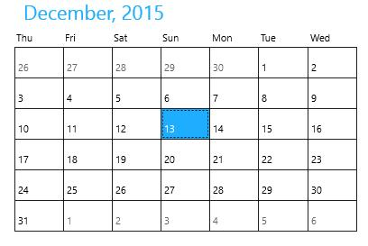
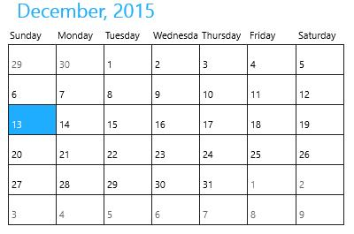

# Customize Display in UWP Calendar (SfCalendar)

`SfCalendar` allows to customize the first day of the week and Day name display mode.

## Customize First Day of Week

First day of week is changeable in SfCalendar. It is set using the property `FirstDayOfWeek`. Refresh method can be used to refresh the layout when setting it in run time doesn’t reflected in UI.





<input:SfCalendar x:Name="calendar" FirstDayofWeek="Thursday"/>









calendar.FirstDayofWeek = System.DayOfWeek.Thursday;





calendar.FirstDayofWeek = System.DayOfWeek.Thursday





## Customize Day Name Display Mode

Day names in SfCalendar can be set to either abbreviated or full names using `DayNameDisplayMode` property. 





<input:SfCalendar x:Name="calendar" DayNameDisplayMode="DayNames"/>









calendar.DayNameDisplayMode = Syncfusion.UI.Xaml.Controls.Input.DayNameDisplayMode.DayNames;





calendar.DayNameDisplayMode = Syncfusion.UI.Xaml.Controls.Input.DayNameDisplayMode.DayNames





