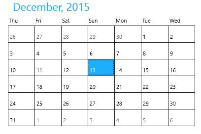
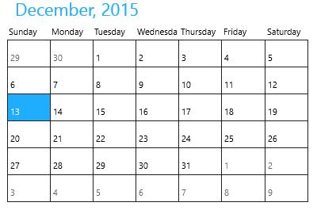

# Customize Display in UWP Calendar (SfCalendar)

`SfCalendar` allows customizing the first day of the week and the day name display mode.

## Customize First Day of Week

The first day of the week is changeable in SfCalendar. It is set using the `FirstDayofWeek` property. The Refresh method can be used to refresh the layout when setting it at run time doesn't reflect in the UI.





<Page
   ...
   xmlns:input="using:Syncfusion.UI.Xaml.Controls.Input">

    <input:SfCalendar x:Name="calendar" FirstDayofWeek="Thursday"/>
</Page>









using Syncfusion.UI.Xaml.Controls.Input;

calendar.FirstDayofWeek = System.DayOfWeek.Thursday;





Imports Syncfusion.UI.Xaml.Controls.Input;

calendar.FirstDayofWeek = System.DayOfWeek.Thursday





## Customize Day Name Display Mode

Day names in SfCalendar can be set to either abbreviated or full names using the `DayNameDisplayMode` property.





<Page
   ...
   xmlns:input="using:Syncfusion.UI.Xaml.Controls.Input">

    <input:SfCalendar x:Name="calendar" DayNameDisplayMode="DayNames"/>
</Page>









using Syncfusion.UI.Xaml.Controls.Input;

calendar.DayNameDisplayMode = Syncfusion.UI.Xaml.Controls.Input.DayNameDisplayMode.DayNames;





Imports Syncfusion.UI.Xaml.Controls.Input;

calendar.DayNameDisplayMode = Syncfusion.UI.Xaml.Controls.Input.DayNameDisplayMode.DayNames





