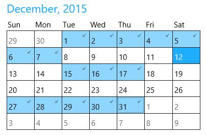
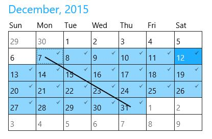

# Date Selection in UWP Calendar (SfCalendar)

Dates can be selected in `SfCalendar` in several ways

## Selecting a Single Date

`SelectedDate` property is used to select a date in SfCalendar. 





<input:SfCalendar SelectedDate="12/15/2015"/>









SfCalendar calendar = new SfCalendar();

calendar.SelectedDate = new DateTime(2015, 12, 15);





Dim calendar As New SfCalendar()

calendar.SelectedDate = New Date(2015, 12, 15)





## Selecting Multiple Dates

`SelectedDates` property is used to select one or more dates in SfCalendar. Several range of dates can be selected using this property.





<input:SfCalendar x:Name="calendar"/>









public MainPage()

{
    
   ObservableCollection<DateRange> dateCollection = new  ObservableCollection<DateRange>();
   
   dateCollection.Add(new DateRange(new DateTime(2015, 12, 1), new DateTime(2015, 12, 7)));
   
   dateCollection.Add(new DateRange(new DateTime(2015, 12, 15), new DateTime(2015, 12, 17)));
   
   dateCollection.Add(new DateRange(new DateTime(2015, 12, 27), new DateTime(2015, 12, 31)));
   
   calendar.SelectedDates = dateCollection;
   
}





Public Sub New()

   Dim dateCollection As New ObservableCollection(Of DateRange)()

   dateCollection.Add(New DateRange(New Date(2015, 12, 1), New Date(2015, 12, 7)))

   dateCollection.Add(New DateRange(New Date(2015, 12, 15), New Date(2015, 12, 17)))

   dateCollection.Add(New DateRange(New Date(2015, 12, 27), New Date(2015, 12, 31)))

   calendar.SelectedDates = dateCollection

End Sub





Multiple dates can be selected by

* Setting SelectedDates programmatically

* Clicking on start date and moving the pointer over end date by touch

## DateRange

`DateRange` represents a range of DateTime between a StartDate and EndDate. DateRange can also be a single date. 

### Creating DateRange with Single DateTime

Create an instance of DateRange with StartDate. So that it return a collection of DateTime with the StartDate.





DateRange dateRange = new DateRange(new DateTime(2015, 12, 15));





Dim dateRange As New DateRange(New Date(2015, 12, 15))





### Creating DateRange with Multiple DateTime

Create an instance of DateRange with `StartDate` and `EndDate`. So that it return a collection of DateTime between these two dates.





DateRange dateRange = new DateRange(new DateTime(2015, 12, 15), new DateTime(2015, 12, 17));





Dim dateRange As New DateRange(New Date(2015, 12, 15), New Date(2015, 12, 17))





## Date Selection Mode

`SelectionMode` property determines whether single or multiple dates can be selected in SfCalendar. The values of SelectionMode are 

* Single – Allows to select any one DateTime
* Multiple – Allows to select one or more DateTime
* None – Does not allow to select any DateTime





<input:SfCalendar SelectionMode="Single"/>









calendar.SelectionMode = Syncfusion.UI.Xaml.Controls.Input.SelectionMode.Single;





calendar.SelectionMode = Syncfusion.UI.Xaml.Controls.Input.SelectionMode.Single





## Setting Display Date

`DisplayDate` property is used highlight a date which is not a selected date.





<input:SfCalendar DisplayDate="12/19/2015"/>









SfCalendar calendar = new SfCalendar();

calendar.DisplayDate = new DateTime(2015, 12, 19);





Dim calendar As New SfCalendar()

calendar.DisplayDate = New Date(2015, 12, 19)





## Notifying Selected Date Changed

`SelectionChanged` event fires whenever a calendar day button is selected.





<input:SfCalendar x:Name="calendar" SelectionChanged="calendar_SelectionChanged"/>









private void calendar_SelectionChanged(object sender, SelectionChangedEventArgs e)

{

}





Private Sub calendar_SelectionChanged(ByVal sender As Object, ByVal e As SelectionChangedEventArgs)

End Sub





