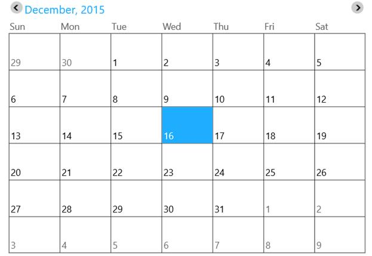
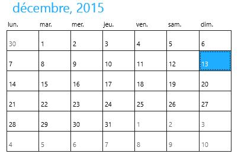

# Getting Started with UWP Calendar (SfCalendar)

This section explains how to create the SfCalendar control.

## Adding SfCalendar Control

Create a Universal Windows Platform project in Visual Studio and refer to the following assemblies.

* Syncfusion. SfInput.UWP

* Syncfusion.SfShared.UWP

1.Include the namespace for Syncfusion.SfInput.UWP assembly in MainPage.xaml




 
<Page xmlns="http://schemas.microsoft.com/winfx/2006/xaml/presentation"

xmlns:x="http://schemas.microsoft.com/winfx/2006/xaml"

xmlns:input="using:Syncfusion.UI.Xaml.Controls.Input">





2.Now add the SfCalendar control with a required optimal name using the included namespace





<input:SfCalendar x:Name="calendar">





SfCalendar calendar = new SfCalendar();





Dim calendar As New SfCalendar()





## Enabling Navigation Buttons

Set the property `ShowNavigationButton` to true for enabling the navigation buttons that allows switching between months.





<input:SfCalendar x:Name="calendar" ShowNavigationButton="True"/>









 calendar.ShowNavigationButton = true;





 calendar.ShowNavigationButton = True





## Culture Support

Month and day names of a region can be displayed in SfCalendar based on the Culture property.





<input:SfCalendar x:Name="calendar"/>









calendar.Culture = new System.Globalization.CultureInfo("fr-FR");





calendar.Culture = New System.Globalization.CultureInfo("fr-FR")





