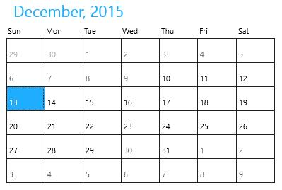
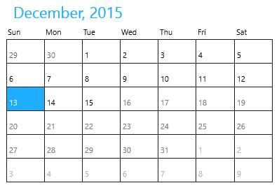
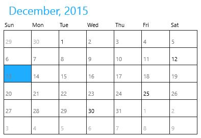

# Visible Dates in UWP Calendar (SfCalendar)

`SfCalendar` provides support for making dates inactive within a range (or) selective dates. It can be achieved by the properties `VisibleMinDate`, `VisibleMaxDate` and `VisibleDates`.

## Setting Minimum Visible Date

`VisibleMinDate` property is used to specify the minimum date in range.





<input:SfCalendar x:Name="calendar" VisibleMinDate="12/10/2015"/>









calendar.VisibleMinDate = new DateTime(2015, 12, 10);





calendar.VisibleMinDate = New Date(2015, 12, 10)





## Setting Maximum Visible Date

`VisibleMaxDate` property is used to specify the maximum date in range





<input:SfCalendar x:Name="calendar" VisibleMaxDate="12/15/2015"/>









calendar.VisibleMaxDate = new DateTime(2015, 12, 15);





calendar.VisibleMaxDate = New Date(2015, 12, 15)





## Setting Visible Dates

`VisibleDates` property is used to specify the active dates when they are not continuous and cannot be specified with a start and end date.





<input:SfCalendar x:Name="calendar"/>









calendar.VisibleDates.Add(new DateTime(2015, 12, 1));

calendar.VisibleDates.Add(new DateTime(2015, 12, 12));

calendar.VisibleDates.Add(new DateTime(2015, 12, 25));

calendar.VisibleDates.Add(new DateTime(2015, 12, 30));





calendar.VisibleDates.Add(New Date(2015, 12, 1))

calendar.VisibleDates.Add(New Date(2015, 12, 12))

calendar.VisibleDates.Add(New Date(2015, 12, 25))

calendar.VisibleDates.Add(New Date(2015, 12, 30))





