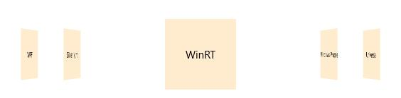

# Animation in UWP Carousel (SfCarousel)

The default animation used during the selection of carousel items can be customized using the following properties.

* Duration

* EasingFunction

* RotationAngle

## Change animation duration

The time taken to move a selected item from its position to center of the control is specified by `Duration` property.





<layout:SfCarousel x:Name="carousel" Duration="00:00:05.900">

</layout:SfCarousel>









carousel.Duration =  TimeSpan.FromSeconds(1.0);





carousel.Duration = TimeSpan.FromSeconds(1.0)





## Customizing the item selection animation

The animation effect on selecting items can be customized with `EasingFunction` property.





<layout:SfCarousel x:Name="carousel">

<layout:SfCarousel.EasingFunction>

<BackEase EasingMode="EaseInOut" Amplitude="0.3"/>

</layout:SfCarousel.EasingFunction>

</layout:SfCarousel>









using Windows.UI.Xaml.Media.Animation; 

public MainPage()

{
	
carousel.EasingFunction = new BackEase() { EasingMode = EasingMode.EaseInOut, Amplitude = 0.3 };

}





Imports Windows.UI.Xaml.Media.Animation

Public Sub New()

carousel.EasingFunction = New BackEase() With {
	.EasingMode = EasingMode.EaseInOut,
	.Amplitude = 0.3
}

End Sub





## Rotate items

`RotationAngle` property is used to rotate all the items in carousel control to a specified angle.





<layout:SfCarousel x:Name="carousel" RotationAngle="70">

</layout:SfCarousel>









carousel.RotationAngle = 70.0;





carousel.RotationAngle = 70.0





