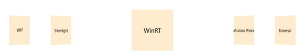
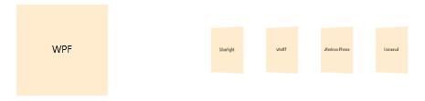
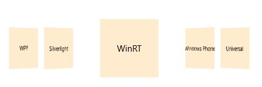

# Setting offset in UWP Carousel (SfCarousel)

`SfCarousalItem` can be displayed in different offset in `SfCarousel` and also can define the offset between selected item and other items in `SfCarousel`.

## Adjusting the distance between unselected items

`Offset` property is used to customize the distance between carousel items that are not selected.





<layout:SfCarousel x:Name="carousel" SelectedItem="item1" Offset="100">

<layout:SfCarouselItem x:Name="item1">

<Border Background="BlanchedAlmond" Height="100" Width="100">

<TextBlock Text="WPF" VerticalAlignment="Center" HorizontalAlignment="Center"/>

</Border>

</layout:SfCarouselItem>

<layout:SfCarouselItem x:Name="item2">

<Border Background="BlanchedAlmond" Height="100" Width="100">

<TextBlock Text="Silverlight" VerticalAlignment="Center" HorizontalAlignment="Center"/>

</Border>

</layout:SfCarouselItem>

<layout:SfCarouselItem x:Name="item3">

<Border Background="BlanchedAlmond" Height="100" Width="100">

<TextBlock Text="WinRT" VerticalAlignment="Center" HorizontalAlignment="Center"/>

</Border>

</layout:SfCarouselItem>

<layout:SfCarouselItem x:Name="item4">

<Border Background="BlanchedAlmond" Height="100" Width="100">

<TextBlock Text="Windows Phone" VerticalAlignment="Center" HorizontalAlignment="Center"/>

</Border>

</layout:SfCarouselItem>

<layout:SfCarouselItem x:Name="item5">

<Border Background="BlanchedAlmond" Height="100" Width="100">

<TextBlock Text="Universal" VerticalAlignment="Center" HorizontalAlignment="Center"/>

</Border>

</layout:SfCarouselItem>

</layout:SfCarousel>









carousel.Offset = 100.0;





carousel.Offset = 100.0





## Scaling the unselected items

`ScaleOffset` is used to scale the carousel items that are not selected.





<layout:SfCarousel x:Name="carousel" SelectedItem="item1" ScaleOffset="0.5">

<layout:SfCarouselItem x:Name="item1">

<Border Background="BlanchedAlmond" Height="100" Width="100">

<TextBlock Text="WPF" VerticalAlignment="Center" HorizontalAlignment="Center"/>

</Border>

</layout:SfCarouselItem>

<layout:SfCarouselItem x:Name="item2">

<Border Background="BlanchedAlmond" Height="100" Width="100">

<TextBlock Text="Silverlight" VerticalAlignment="Center" HorizontalAlignment="Center"/>

</Border>

</layout:SfCarouselItem>

<layout:SfCarouselItem x:Name="item3">

<Border Background="BlanchedAlmond" Height="100" Width="100">

<TextBlock Text="WinRT" VerticalAlignment="Center" HorizontalAlignment="Center"/>

</Border>

</layout:SfCarouselItem>

<layout:SfCarouselItem x:Name="item4">

<Border Background="BlanchedAlmond" Height="100" Width="100">

<TextBlock Text="Windows Phone" VerticalAlignment="Center" HorizontalAlignment="Center"/>

</Border>

</layout:SfCarouselItem>

<layout:SfCarouselItem x:Name="item5">

<Border Background="BlanchedAlmond" Height="100" Width="100">

<TextBlock Text="Universal" VerticalAlignment="Center" HorizontalAlignment="Center"/>

</Border>

</layout:SfCarouselItem>

</layout:SfCarousel>









carousel.ScaleOffset = 0.5;





carousel.ScaleOffset = 0.5





## Displacing the selected and unselected items

`SelectedItemOffset` is set to specify the distance of selected item from other carousel items.





<layout:SfCarousel x:Name="carousel" SelectedItem="item1" SelectedItemOffset="60">

<layout:SfCarouselItem x:Name="item1">

<Border Background="BlanchedAlmond" Height="100" Width="100">

<TextBlock Text="WPF" VerticalAlignment="Center" HorizontalAlignment="Center"/>

</Border>

</layout:SfCarouselItem>

<layout:SfCarouselItem x:Name="item2">

<Border Background="BlanchedAlmond" Height="100" Width="100">

<TextBlock Text="Silverlight" VerticalAlignment="Center" HorizontalAlignment="Center"/>

</Border>

</layout:SfCarouselItem>

<layout:SfCarouselItem x:Name="item3">

<Border Background="BlanchedAlmond" Height="100" Width="100">

<TextBlock Text="WinRT" VerticalAlignment="Center" HorizontalAlignment="Center"/>

</Border>

</layout:SfCarouselItem>

<layout:SfCarouselItem x:Name="item4">

<Border Background="BlanchedAlmond" Height="100" Width="100">

<TextBlock Text="Windows Phone" VerticalAlignment="Center" HorizontalAlignment="Center"/>

</Border>

</layout:SfCarouselItem>

<layout:SfCarouselItem x:Name="item5">

<Border Background="BlanchedAlmond" Height="100" Width="100">

<TextBlock Text="Universal" VerticalAlignment="Center" HorizontalAlignment="Center"/>

</Border>

</layout:SfCarouselItem>

</layout:SfCarousel>









carousel.SelectedItemOffset = 60.0;





carousel.SelectedItemOffset = 60.0





