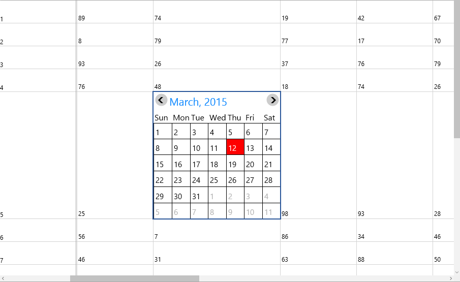

# Custom Cell Type in UWP CellGrid (SfCellGrid)

SfCellGrid provides support to customize the cell by loading any user control into the cell.

This requires a cell renderer class which creates the custom cell control and handles the UI requirements. The custom cell type can be created by registering the cell renderer to the SfCellGrid. It can be enabled by assigning its name to the `CellType` property of `GridStyleInfo` class.

In general, the built-in cell types are also constructed only in this way. Every such cell type has its own renderer classes in the code base which are inherited from `GridVirtualizingCellRenderer` class. This class defines the basic functionality for a cell type.

To customize the cell, please follow the below steps

* Create a Custom Cell Renderer class
* Associating the Custom Cell Renderer to SfCellGrid

## Creating a new Custom Cell Type(SfCalendar) 

### Create a Custom Cell Renderer class

Create a custom class "CalendarCellRenderer" by overriding the `GridVirtualizingCellRenderer` class to define the custom renderer element. Here the display element is `TextBlock` whereas the edit element is loaded as `SfCalendar`.




public class CalendarCellRenderer : GridVirtualizingCellRenderer<TextBlock, SfCalendar>
{
    public CalendarCellRenderer()
    {
           
    }
}
  



To load the `SfCalendar` in the edit mode of a cell, create a new `SfCalendar` control in `OnCreateEditUIElement` method.
In `OnInitializeDisplayElement` method, initialize the display UI element `TextBlock` which is to be loaded in the cell of SfCellGrid and in `OnInitializeEditElement` method,
initialize the edit UI element `SfCalendar` which is to be loaded in the cell of SfCellGrid while in edit mode.

When the edit UI element is loaded in the cell, `OnEditElementLoaded` event is invoked and focus is set to the UI element(SfCalendar). When the selected date in `SfCalendar` Control is changed, `SelectionChanged` event is invoked and set the selected date as value.
The `GetControlValue` and `GetFormattedText` methods returns/updates the value and formatted text of the current rendered element(SfCalendar/TextBlock) in the cell.




public class CalendarCellRenderer : GridVirtualizingCellRenderer<TextBlock, SfCalendar>
{
    public CalendarCellRenderer()
    {
           
    }
    
    //Occurs when the UIElement(SfCalendar) is loaded in SfCellGrid,
    protected override void OnEditElementLoaded(object sender, RoutedEventArgs e)
    {
        var uiElement = ((SfCalendar)sender);
        if (HasCurrentCellState)
            uiElement.Focus(FocusState.Programmatic);
        uiElement.SelectionChanged += UiElement_SelectionChanged;        
    }

    //Occurs when the selected date in SfCalendar is changed,
    private void UiElement_SelectionChanged(object sender, SelectionChangedEventArgs e)
    {
        base.CurrentCellValueChanged(e.AddedItems[0].ToString());
    }
    
    //Returns the value of the current rendered element(SfCalendar),
    public override object GetControlValue()
    {
        if (HasCurrentCellState && CurrentCellRendererElement != null && IsInEditing)
            return (CurrentCellRendererElement as SfCalendar).SelectedDate;
        else
            return (CurrentCellRendererElement as TextBlock).Text;
    }

    //Returns the formatted text of the cell,
    public override string GetFormattedText(GridStyleInfo style)
    {
        DateTime dateValue;

        if (style.CellValue == null || style.CellValue.ToString() == string.Empty)
            return string.Empty;

        DateTime.TryParse(style.CellValue.ToString(), out dateValue);

        if (dateValue < DateTime.MinValue)
            dateValue = DateTime.MinValue;
        if (dateValue > DateTime.MaxValue)
            dateValue = DateTime.MaxValue;

        double doubleValue;
        if (DateTime.TryParse(dateValue.ToString(), out dateValue))
            return dateValue.ToString("d");
        else if (double.TryParse(dateValue.ToString(), out doubleValue))
            return doubleValue.ToString(style.Format);
        return dateValue.ToString();
    }
    
    //Creates a UIElement for the edit mode of the cell.
    protected override SfCalendar OnCreateEditUIElement()
    {
        return new SfCalendar();
    }

    //Initializing the display element(TextBlock) while loading in SfCellGrid,
    protected override void OnInitializeDisplayElement(RowColumnIndex rowColumnIndex, TextBlock uiElement, GridStyleInfo style, string text)
    {
        base.OnInitializeDisplayElement(rowColumnIndex, uiElement, style, text);
     
        uiElement.Text = text;
    }

    //Initializing the edit element(SfCalendar) while loading in SfCellGrid,
    protected override void OnInitializeEditElement(RowColumnIndex rowColumnIndex, SfCalendar uiElement, GridStyleInfo style, string text)
    {
        base.OnInitializeEditElement(rowColumnIndex, uiElement, style, text);
        if ((style.CellValue != null && style.CellValue.ToString() != string.Empty))
            uiElement.SelectedDate = style.CellValue;
        else if (uiElement.SelectedDate != null)
            uiElement.SelectedDate = null;

        uiElement.Width = Grid.ColumnWidths[style.ColumnIndex];
        uiElement.Height = Grid.RowHeights[style.RowIndex];

        uiElement.SelectedDateBackground = new SolidColorBrush(Windows.UI.Colors.Red);
        uiElement.ShowNavigationButton = true;

        uiElement.VisibleMaxDate = DateTime.MaxValue;
        uiElement.VisibleMinDate = DateTime.MinValue;
        uiElement.ShowHeader = true;
           
    }
    
    //Unwire the events associated with edit UI Element,
    protected override void OnUnwireEditUIElement(SfCalendar uiElement)
    {
       uiElement.SelectionChanged -= UiElement_SelectionChanged;
       uiElement.Focus(FocusState.Programmatic);
       base.OnUnwireEditUIElement(uiElement);
    }

}




### Associating the Custom Cell Renderer to SfCellGrid
                                                                                                                     
To associate the custom cell renderer in SfCellGrid, initialize the **CalendarCellRenderer** class and add it to the `CellRenderers` property which is a collection of type `GridCellRendererCollection` class. 

To load the custom cell(SfCalendar) in the required range, assign its name "CalendarCell" to the `CellType` property of `GridStyleInfo` class. 




public MainPage()
{
  this.InitializeComponent();
  
  //Add the customized renderer
  var renderer = new CalendarCellRenderer();
  cellGrid.CellRenderers.Add("CalendarCell", renderer);
  cellGrid.Model.QueryCellInfo += Model_QueryCellInfo;
}

//To update the cell type
void Model_QueryCellInfo(object sender, GridQueryCellInfoEventArgs e)
{
  if (e.Cell.RowIndex == 5 && e.Cell.ColumnIndex == 5)
  {
    e.CellType = "CalendarCell";
    e.CellValue = new DateTime(2015,3,3);

  }
}




#### Output

The following output is generated using the code above while the Cell(5,5) is in Edit mode.

For more reference, please find the [customization](http://www.syncfusion.com/downloads/support/directtrac/general/ze/App2-57034699) sample.

## Modify the Existing Cell Type

Users can also change/modify the behavior of already existing cell type in SfCellGrid by creating a custom renderer class by overriding the existing cell renderer class.

### Create a Custom Cell Renderer class

To open the dropdown list of `ComboBox` cell with single click which is not a default behavior of `ComboBox` cell type in SfCellGrid, hence the users need to create a custom class **CustomComboRenderer** by overriding the already existing `GridComboBoxCellRenderer` class to modify the behavior of the default `ComboBox` cell type.

In the `OnEditElementLoaded` event, set the `IsDropDownOpen` property of `ComboBox` UI to `true` and this will open the combo box dropdown list when the edit element is loaded in the cell of SfCellGrid. 




public class CustomComboRenderer: GridComboBoxCellRenderer
{
    protected override void OnEditElementLoaded(object sender, RoutedEventArgs e)
    {
       base.OnEditElementLoaded(sender, e);
       var combo = sender as ComboBox;
       combo.IsDropDownOpen = true;
    }
}



 
### Associating the Custom Cell Renderer to SfCellGrid

To associate the custom cell renderer in SfCellGrid, initialize the **CustomComboRenderer** class and add it to the `CellRenderers` property which is a collection of type `GridCellRendererCollection` class and remove the existing cell type `ComboBox` from the collection.

To load the custom cell in the required range, assign its name **ComboCell** to the `CellType` property of `GridStyleInfo` class. 




public MainPage()
{
  this.InitializeComponent();
  
  //Remove the default renderer
  cellGrid.CellRenderers.Remove("ComboBox");

  //Add the customized renderer
  var renderer = new CustomComboRenderer();
  cellGrid.CellRenderers.Add("ComboCell", renderer);
  
  cellGrid.EditTrigger = EditTrigger.OnTap;
  cellGrid.Model.QueryCellInfo += Model_QueryCellInfo;
}

//To update the cell type
void Model_QueryCellInfo(object sender, GridQueryCellInfoEventArgs e)
{
  if (e.Cell.RowIndex == 5 && e.Cell.ColumnIndex == 5)
  {
    e.CellType = "ComboCell";
    e.ComboBoxEdit.ItemSource = new List<String> { "First ", "Second ", "Third " };
  }
}




For more reference, please find the [customization](http://www.syncfusion.com/downloads/support/directtrac/general/ze/App22-908684252) sample.
