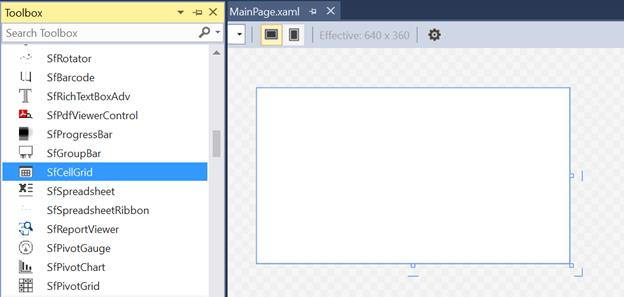
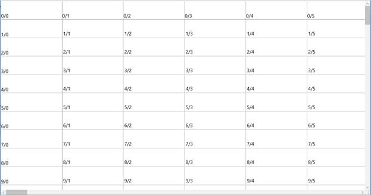

# Getting Started with UWP CellGrid (SfCellGrid)

This section helps you to get started with SfCellGrid.

## Assemblies Deployment

Below table describes, list of assemblies required to be added in project when the SfCellGrid control is used in your application.

<table>
<tr>
<th>
Assembly</th><th>
Description</th></tr>
<tr>
<td>
Syncfusion.SfCellGrid.UWP.dll</td><td>
Contains the base and fundamental classes which holds the underlying architecture for displaying cells with virtualized behavior and selection/interaction of cells.</td></tr>
<tr>
<td>
Syncfusion.SfGridCommon.UWP.dll</td><td>
Covers the classes which holds the properties of scroll viewer and disposable elements</td></tr>
<tr>
<td>
Syncfusion.SfShared.UWP.dll</td><td>
Contains the classes which holds the properties and operations of the controls like SfUpDown, SfNavigator, Looping control etc</td></tr>
<tr>
<td>
Syncfusion.SfInput.UWP.dll</td><td>
Contains the classes which holds the controls like SfDropDownButton, SfTextBoxExt,SfMaskedEdit etc.</td></tr>
</table>

### Optional Assemblies

Below Assembly can be added to enable the importing support in SfCellGrid. 

<table>
<tr>
<th>
Optional Assembly</th><th>
Description</th></tr>
<tr>
<td>
Syncfusion.XlsIO.UWP.dll</td><td>
Contains the base classes which is responsible for read and write in Excel files, Worksheet Manipulations, Formula calculations etc.</td></tr>
</table>

## Create Simple Application with SfCellGrid

SfCellGrid control can be added into the application either via designer or via coding.

### Adding control via designer

1. Create a new UWP application in Visual Studio.
2. Open the Visual Studio **Tool** **box**. Navigate to “Syncfusion Controls” tab, and find the SfCellGrid in toolbox items.
3. Drag **SfCellGrid** and drop in to the designer area from the toolbox.

### Adding control via coding

SfCellGrid is available in the following namespace “__Syncfusion__.__UI__.__Xaml__.__CellGrid__” and it can be created programmatically either by using __XAML__ or __C#__ code.

#### Through XAML





    <Page
	
	x:Class="CellGridDemo.MainPage"
	
	xmlns="http://schemas.microsoft.com/winfx/2006/xaml/presentation"
	
	xmlns:x="http://schemas.microsoft.com/winfx/2006/xaml"
	
	xmlns:d="http://schemas.microsoft.com/expression/blend/2008"
	
	xmlns:local="using:CellGridDemo"
	
	xmlns:cm="http://schemas.openxmlformats.org/markup-compatibility/2006"
	
	xmlns:syncfusion="using:Syncfusion.UI.Xaml.CellGrid"
	
	cm:Ignorable="d">
	
	<syncfusion:SfCellGrid x:Name="CellGrid" />
	
	</Page>





#### Through C#





SfCellGrid cellGrid = new SfCellGrid();

this.Grid.Children.Add(cellGrid);





## Generating Rows and Columns

To generate rows and columns in SfCellGrid, user need to specify the **RowCount** and **ColumnCount** either by using XAML or C# code.





    <Page
	
	x:Class="CellGridDemo.MainPage"
	
	xmlns="http://schemas.microsoft.com/winfx/2006/xaml/presentation"
	
	xmlns:x="http://schemas.microsoft.com/winfx/2006/xaml"
	
	xmlns:d="http://schemas.microsoft.com/expression/blend/2008"
	
	xmlns:local="using:CellGridDemo"
	
	xmlns:cm="http://schemas.openxmlformats.org/markup-compatibility/2006"
	
	xmlns:syncfusion="using:Syncfusion.UI.Xaml.CellGrid"
	
	cm:Ignorable="d">
	
	<syncfusion:SfCellGrid x:Name="CellGrid" RowCount="100" ColumnCount="100" />
	
	</Page>





SfCellGrid cellGrid = new SfCellGrid();

this.Grid.Children.Add(cellGrid);

cellGrid.RowCount = 100;

cellGrid.ColumnCount = 100;





## Populating the Data

To populate the data in SfCellGrid, **RowCount** and **ColumnCount** are mandatory. Once **RowCount** and **ColumnCount** are specified in SfCellGrid, data can be populated by using one of the following methods.

### Internal Storage

User can populate the grid by storing the cell style in its internal storage. SfCellGrid holds all the data and style related information in **GridStyleInfo**. Individual cells can be accessed using the **GridModel** indexer, which takes row and column indices.
Based on the row and column indices, the data can be populated by looping the cells.




// Specifying Row Count and Column Count

cellGrid.RowCount = 100;

cellGrid.ColumnCount = 100;

// Looping through the cells and assigning the values based on row and column index

for (int row = 0; row < 100; row++)
{
	for (int column = 0; column < 20; column++)
	{
		cellGrid.Model[row, column].CellValue = string.Format("{0}/{1}", row, column);  
	}
}




### Virtual Mode

User can also populate the data by on-demand using `QueryCellInfo` event. In this event, SfCellGrid does not store cell style in its internal storage, thus ensuring optimized performance.
`QueryCellInfo` event will be triggered for each cell when it comes into view.




// Specifying Row Count and Column Count

cellGrid.RowCount = 100;

cellGrid.ColumnCount = 100;

cellGrid.Model.QueryCellInfo += Model_QueryCellInfo;

//Assigning values by handling the QueryCellInfo event

private void Model_QueryCellInfo(object sender, Syncfusion.UI.Xaml.CellGrid.Styles.GridQueryCellInfoEventArgs e)
{
	e.Style.CellValue = string.Format("{0}/{1}", e.Cell.RowIndex, e.Cell.ColumnIndex);
}




You can get the following output while executing the application,

