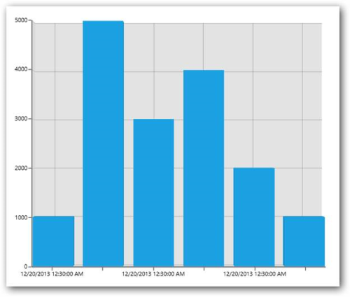
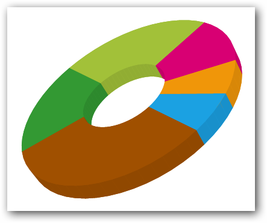
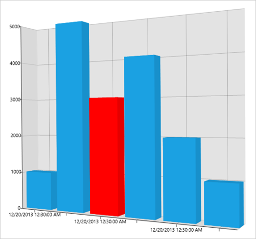
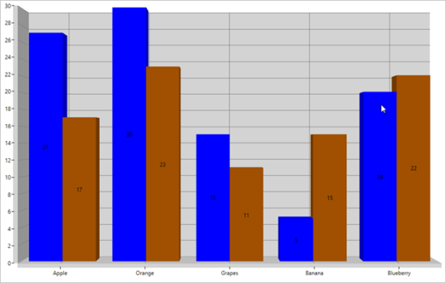
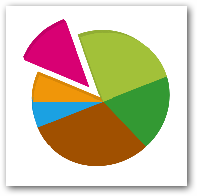

# 3D Charts in UWP Charts (SfChart)

3D charts are used to view two-dimensional data in a three-dimensional view, and can be rotated in all 3 dimensions to get the best possible view of the data.

## Key features

* Eight types of chart [`Series`](https://help.syncfusion.com/cr/uwp/Syncfusion.UI.Xaml.Charts.SfChart3D.html#Syncfusion_UI_Xaml_Charts_SfChart3D_Series).
* Perspective view.
* Data binding.
* Animations.
* Empty point support.
* Dynamic update.
* Dynamic rotation.
* Selection support.

## Creating 3D Charts

The following steps explain how to create 3D charts.

1. Open the Add Reference window from your project.
2. Choose Windows > Extensions > Syncfusion controls for UWP XAML.
3. Add the following namespace in your XAML page:



        xmlns:Syncfusion="using:Syncfusion.UI.Xaml.Charts"


   

4. Initialize the chart represented by the following class, Syncfusion.UI.Xaml.Charts.SfChart3D:



        <Syncfusion:SfChart3D>

		</Syncfusion:SfChart3D>


   

5. Next, declare the [`PrimaryAxis`](https://help.syncfusion.com/cr/uwp/Syncfusion.UI.Xaml.Charts.SfChart3D.html#Syncfusion_UI_Xaml_Charts_SfChart3D_PrimaryAxis) and [`SecondaryAxis`](https://help.syncfusion.com/cr/uwp/Syncfusion.UI.Xaml.Charts.SfChart3D.html#Syncfusion_UI_Xaml_Charts_SfChart3D_SecondaryAxis):



        <Syncfusion:SfChart3D>

		<Syncfusion:SfChart3D.PrimaryAxis>

		<Syncfusion:CategoryAxis3D/>

		</Syncfusion:SfChart3D.PrimaryAxis>

		<Syncfusion:SfChart3D.SecondaryAxis>

		<Syncfusion:NumericalAxis3D/>

		</Syncfusion:SfChart3D.SecondaryAxis>

		</Syncfusion:SfChart3D >


   

### Add Chart Series to Chart

To begin with plotting data choose from a wide variety of graphical representations available in the Chart library (e.g., 3DColumn series, 3D PieSeries). The graph selected will depend on the scenario of the user and the nature of the data.



<Syncfusion:SfChart3D x:Name="Chart">

  <Syncfusion:SfChart3D.PrimaryAxis>

    <Syncfusion:DateTimeAxis3D/>

  </Syncfusion:SfChart3D.PrimaryAxis>

  <Syncfusion:SfChart3D.SecondaryAxis>

   <Syncfusion:NumericalAxis3D/>

  </Syncfusion:SfChart3D.SecondaryAxis>

  <Syncfusion:ColumnSeries3D/>

</Syncfusion:SfChart3D>



### Create a Sample Data Source

Since the above step will produce only an empty column 3D chart, plotting data must be added to the chart. This step illustrates how to create a sample data source. The data source must implement the IEnumerable interface.



public class UserProfile

 {

   public DateTime TimeStamp { get; set; }

   public double NoOfUsers { get; set; }

 }

public class UsersViewModel

 {

 public UsersViewModel()

  {

   this.UsersList = new ObservableCollection<UserProfile>();

   DateTime date = DateTime.Today;

   UsersList.Add(new UserProfile { TimeStamp=date.AddHours(0.5),NoOfUsers=1000});

   UsersList.Add(new UserProfile { TimeStamp=date.AddHours(0.5),NoOfUsers = 5000 });

   UsersList.Add(new UserProfile { TimeStamp = date.AddHours(0.5), NoOfUsers = 3000 });

   UsersList.Add(new UserProfile { TimeStamp = date.AddHours(0.5), NoOfUsers = 4000 });

   UsersList.Add(new UserProfile { TimeStamp = date.AddHours(0.5), NoOfUsers = 2000 });

   UsersList.Add(new UserProfile { TimeStamp = date.AddHours(0.5), NoOfUsers = 1000 });

  }

 public ObservableCollection<UserProfile> UsersList

  {

    get; set;

  }

 }


### Binding Data to ChartSeries

Add the above UsersViewModel to the DataContext of the chart, bind the data source to the [`ItemsSource`](https://help.syncfusion.com/cr/uwp/Syncfusion.UI.Xaml.Charts.ChartSeriesBase.html#Syncfusion_UI_Xaml_Charts_ChartSeriesBase_ItemsSource) property of the 3D column series, and then map the data using [`XBindingPath`](https://help.syncfusion.com/cr/uwp/Syncfusion.UI.Xaml.Charts.ChartSeriesBase.html#Syncfusion_UI_Xaml_Charts_ChartSeriesBase_XBindingPath) and [`YBindingPath`](https://help.syncfusion.com/cr/uwp/Syncfusion.UI.Xaml.Charts.XyDataSeries3D.html#Syncfusion_UI_Xaml_Charts_XyDataSeries3D_YBindingPath) properties.



<Page.DataContext>

      <local:UsersViewModel/>

</ Page.DataContext>

<Syncfusion:SfChart3D x:Name="Chart" Height="500" Width="500">

        <Syncfusion:SfChart3D.PrimaryAxis>

            <Syncfusion:CategoryAxis3D/>

        </Syncfusion:SfChart3D.PrimaryAxis>

        <Syncfusion:SfChart3D.SecondaryAxis>

            <Syncfusion:NumericalAxis3D/>

        </Syncfusion:SfChart3D.SecondaryAxis>

        <Syncfusion:ColumnSeries3D

ItemsSource="{Binding UsersList}"

XBindingPath="TimeStamp"

YBindingPath="NoOfUsers">

        </Syncfusion:ColumnSeries3D>

    </Syncfusion:SfChart3D >

The following screenshot illustrates the result of the above code sample:

## Adornments

[`Adornments`](https://help.syncfusion.com/cr/uwp/Syncfusion.UI.Xaml.Charts.ChartSeriesBase.html#Syncfusion_UI_Xaml_Charts_ChartSeriesBase_Adornments) are used to indicate corresponding data point values and can be customized using the following properties:

<table>
<tr>
<th>
Property</th><th>
Description</th></tr>
<tr>
<td>
{{'[`ShowConnectorLine`](https://help.syncfusion.com/cr/uwp/Syncfusion.UI.Xaml.Charts.ChartAdornmentInfoBase.html#Syncfusion_UI_Xaml_Charts_ChartAdornmentInfoBase_ShowConnectorLine)'| markdownify }}</td><td>
Gets or sets ability to show and hide the connector line for adornments.</td></tr>
<tr>
<td>
{{'[`ConnectorLineStyle`](https://help.syncfusion.com/cr/uwp/Syncfusion.UI.Xaml.Charts.ChartAdornmentInfoBase.html#Syncfusion_UI_Xaml_Charts_ChartAdornmentInfoBase_ConnectorLineStyle)'| markdownify }}</td><td>
Gets or sets the connector line style.</td></tr>
<tr>
<td>
{{'[`ConnectorRotationAngle`](https://help.syncfusion.com/cr/uwp/Syncfusion.UI.Xaml.Charts.ChartAdornmentInfoBase.html#Syncfusion_UI_Xaml_Charts_ChartAdornmentInfoBase_ConnectorRotationAngle)'| markdownify }}</td><td>
Gets or sets the connector line rotate angle.</td></tr>
<tr>
<td>
{{'[`ConnectorHeight`](https://help.syncfusion.com/cr/uwp/Syncfusion.UI.Xaml.Charts.ChartAdornmentInfoBase.html#Syncfusion_UI_Xaml_Charts_ChartAdornmentInfoBase_ConnectorHeight)'| markdownify }}</td><td>
Gets or sets the connector height.</td></tr>
<tr>
<td>
{{'[`LabelTemplate`](https://help.syncfusion.com/cr/uwp/Syncfusion.UI.Xaml.Charts.ChartAdornmentInfoBase.html#Syncfusion_UI_Xaml_Charts_ChartAdornmentInfoBase_LabelTemplate)'| markdownify }}</td><td>
Gets or sets the adornments label template.</td></tr>
<tr>
<td>
{{'[`Symbol`](https://help.syncfusion.com/cr/uwp/Syncfusion.UI.Xaml.Charts.ChartAdornmentInfoBase.html#Syncfusion_UI_Xaml_Charts_ChartAdornmentInfoBase_Symbol)'| markdownify }}</td><td>
Enum property to get or set the symbol for adornments.</td></tr>
<tr>
<td>
{{'[`SymbolHeight`](https://help.syncfusion.com/cr/uwp/Syncfusion.UI.Xaml.Charts.ChartAdornmentInfoBase.html#Syncfusion_UI_Xaml_Charts_ChartAdornmentInfoBase_SymbolHeight)'| markdownify }}</td><td>
Gets or sets the height for the symbol.</td></tr>
<tr>
<td>
{{'[`SymbolWidth`](https://help.syncfusion.com/cr/uwp/Syncfusion.UI.Xaml.Charts.ChartAdornmentInfoBase.html#Syncfusion_UI_Xaml_Charts_ChartAdornmentInfoBase_SymbolWidth)'| markdownify }}</td><td>
Gets or sets the width for the symbol.</td></tr>
<tr>
<td>
{{'[`SymbolTemplate`](https://help.syncfusion.com/cr/uwp/Syncfusion.UI.Xaml.Charts.ChartAdornmentInfoBase.html#Syncfusion_UI_Xaml_Charts_ChartAdornmentInfoBase_SymbolTemplate)'| markdownify }}</td><td>
Gets or sets the symbol template.</td></tr>
<tr>
<td>
{{'[`SymbolInterior`](https://help.syncfusion.com/cr/uwp/Syncfusion.UI.Xaml.Charts.ChartAdornmentInfoBase.html#Syncfusion_UI_Xaml_Charts_ChartAdornmentInfoBase_SymbolInterior)'| markdownify }}</td><td>
Gets or sets the interior for the symbol.</td></tr>
<tr>
<td>
{{'[`SymbolStroke`](https://help.syncfusion.com/cr/uwp/Syncfusion.UI.Xaml.Charts.ChartAdornmentInfoBase.html#Syncfusion_UI_Xaml_Charts_ChartAdornmentInfoBase_SymbolStroke)'| markdownify }}</td><td>
Gets or sets the stroke for the symbol.</td></tr>
<tr>
<td>
{{'[`AdornmentsPosition`](https://help.syncfusion.com/cr/uwp/Syncfusion.UI.Xaml.Charts.ChartAdornmentInfoBase.html#Syncfusion_UI_Xaml_Charts_ChartAdornmentInfoBase_AdornmentsPosition)'| markdownify }}</td><td>
An enum property allowed to position the adornments TopAndBottom, Bottom and Top areas.</td></tr>
<tr>
<td>
{{'[`SegmentLabelContent`](https://help.syncfusion.com/cr/uwp/Syncfusion.UI.Xaml.Charts.ChartAdornmentInfoBase.html#Syncfusion_UI_Xaml_Charts_ChartAdornmentInfoBase_SegmentLabelContent)'| markdownify }}</td><td>
Gets or sets the actual label content to be displayed in the label.</td></tr>
<tr>
<td>
{{'[`SegmentLabelFormat`](https://help.syncfusion.com/cr/uwp/Syncfusion.UI.Xaml.Charts.ChartAdornmentInfoBase.html#Syncfusion_UI_Xaml_Charts_ChartAdornmentInfoBase_SegmentLabelFormat)'| markdownify }}</td><td>
Gets or sets the adornments label format.</td></tr>
<tr>
<td>
{{'[`ShowMarker`](https://help.syncfusion.com/cr/uwp/Syncfusion.UI.Xaml.Charts.ChartAdornmentInfoBase.html#Syncfusion_UI_Xaml_Charts_ChartAdornmentInfoBase_ShowMarker)'| markdownify }}</td><td>
A Boolean property to show or hide the markers.</td></tr>
<tr>
<td>
{{'[`ShowLabel`](https://help.syncfusion.com/cr/uwp/Syncfusion.UI.Xaml.Charts.ChartAdornmentInfoBase.html#Syncfusion_UI_Xaml_Charts_ChartAdornmentInfoBase_ShowLabel)'| markdownify }}</td><td>
A Boolean property to show or hide the labels</td></tr>
</table>

## Series

### Series Types

* Column
* Bar
* Stacking column 
* Stacking column 100 
* Stacking bar
* Stacking bar
* Pie
* Doughnut

### Create a simple chart series

The following code can be used to create a simple doughnut series:





<Page.DataContext>

      <local:UsersViewModel/>

</Page.DataContext>

<Syncfusion:SfChart3D x:Name="Chart" Height="500" Width="500">

        <Syncfusion:SfChart3D.PrimaryAxis>

            <Syncfusion:CategoryAxis3D/>

        </Syncfusion:SfChart3D.PrimaryAxis>

        <Syncfusion:SfChart3D.SecondaryAxis>

            <Syncfusion:NumericalAxis3D/>

        </Syncfusion:SfChart3D.SecondaryAxis>

         <Syncfusion:DoughnutSeries3D

ItemsSource="{Binding UsersList}"

XBindingPath="TimeStamp"

YBindingPath="NoOfUsers">

                </Syncfusion:DoughnutSeries3D>

    </Syncfusion:SfChart3D >





public class UserProfile

 {

   public DateTime TimeStamp { get; set; }

   public double NoOfUsers { get; set; }

 }

public class UsersViewModel

 {

 public UsersViewModel()

  {

   this.UsersList = new ObservableCollection<UserProfile>();

   DateTime date = DateTime.Today;

   UsersList.Add(new UserProfile { TimeStamp=date.AddHours(0.5),NoOfUsers=1000});

   UsersList.Add(new UserProfile { TimeStamp=date.AddHours(0.5),NoOfUsers = 5000 });

   UsersList.Add(new UserProfile { TimeStamp = date.AddHours(0.5), NoOfUsers = 3000 });

   UsersList.Add(new UserProfile { TimeStamp = date.AddHours(0.5), NoOfUsers = 4000 });

   UsersList.Add(new UserProfile { TimeStamp = date.AddHours(0.5), NoOfUsers = 2000 });

   UsersList.Add(new UserProfile { TimeStamp = date.AddHours(0.5), NoOfUsers = 1000 });

  }

 public ObservableCollection<UserProfile> UsersList

  {

    get; set;

  }

 }





The following image illustrates the result of the above code sample:

## Interactivity

3D charts provide interactive features such as dynamic rotation, segment selection, and dynamic segment explode for circular series.

### Dynamic rotation

3D charts allow us to view the best possible view of data dynamically using a mouse or touch device. To enable dynamic rotation, set the [`EnableRotation`](https://help.syncfusion.com/cr/uwp/Syncfusion.UI.Xaml.Charts.SfChart3D.html#Syncfusion_UI_Xaml_Charts_SfChart3D_EnableRotation) property to true.

The following code example illustrates how to enable the dynamic rotation:



<Syncfusion:SfChart3D EnableRotation="True" x:Name="Chart" Height="500" Width="600">


### SegmentSelection

To enable segment selection in a 3D chart, set the [`SegmentSelectionBrush`](https://help.syncfusion.com/cr/uwp/Syncfusion.UI.Xaml.Charts.ChartSeries3D.html#Syncfusion_UI_Xaml_Charts_ChartSeries3D_SegmentSelectionBrush) property in chart series.

The following code example illustrates how to set the selection brush for individual series. For data refer to the Series category in 3D charts.



  <Syncfusion:SfChart3D EnableRotation="True" x:Name="Chart" 

                       Height="500" Width="600">

  <Syncfusion:SfChart3D.PrimaryAxis>

       <Syncfusion:CategoryAxis3D/>

   </Syncfusion:SfChart3D.PrimaryAxis>

      <Syncfusion:SfChart3D.SecondaryAxis>

         <Syncfusion:NumericalAxis3D/>

      </Syncfusion:SfChart3D.SecondaryAxis>

  <Syncfusion:ColumnSeries3D

SegmentSelectionBrush="Red"

                ItemsSource="{Binding UsersList}"

                XBindingPath="TimeStamp"

                YBindingPath="NoOfUsers">

        </Syncfusion:ColumnSeries3D>

    </Syncfusion:SfChart3D >

The following screenshot illustrates the result of the above code example.

### SeriesSelection

Series selection support is used to highlight the series programmatically or by user interaction. Also you can get a [`SeriesSelectedIndex`](https://help.syncfusion.com/cr/uwp/Syncfusion.UI.Xaml.Charts.ChartBase.html#Syncfusion_UI_Xaml_Charts_ChartBase_SeriesSelectedIndex), [`PreviousSelectedIndex`](https://help.syncfusion.com/cr/uwp/Syncfusion.UI.Xaml.Charts.ChartSelectionChangedEventArgs.html#Syncfusion_UI_Xaml_Charts_ChartSelectionChangedEventArgs_PreviousSelectedIndex) value in [`SelectionChanged`](https://help.syncfusion.com/cr/uwp/Syncfusion.UI.Xaml.Charts.ChartBase.html) event arguments. 

The following code example can be used to set series selection in a [`SfChart3D`](https://help.syncfusion.com/cr/uwp/Syncfusion.UI.Xaml.Charts.SfChart3D.html).



<chart:SfChart3D EnableSeriesSelection="True" SeriesSelectedIndex="0">

<chart:ColumnSeries3D   XBindingPath="FruitName"  

                        SeriesSelectionBrush="Blue" 

                        YBindingPath="People1"

                        ItemsSource="{Binding Fruits}">

<chart:ColumnSeries3D.AdornmentsInfo>

<chart:ChartAdornmentInfo3D   AdornmentsPosition="TopAndBottom"

                              ShowLabel="true"

                              HighlightOnSelection="True"/>

</chart:ColumnSeries3D.AdornmentsInfo>

</chart:ColumnSeries3D >

<chart:ColumnSeries3D   XBindingPath="FruitName"

                        YBindingPath="People2"

                        SeriesSelectionBrush="Blue"

                        ItemsSource="{Binding Fruits}">

<chart:ColumnSeries3D.AdornmentsInfo>

<chart:ChartAdornmentInfo3D   AdornmentsPosition="TopAndBottom"

                              ShowLabel="true"                                                                        

                              HighlightOnSelection="True"/>

</chart:ColumnSeries3D.AdornmentsInfo>

</chart:ColumnSeries3D >

</chart:SfChart3D >

The following screenshot is an example of a [`SfChart3D`](https://help.syncfusion.com/cr/uwp/Syncfusion.UI.Xaml.Charts.SfChart3D.html) with series selection.

### Dynamic explode

This feature allows users to explode a particular segment in a circular series using [`ExplodeOnMouseClick`](https://help.syncfusion.com/cr/uwp/Syncfusion.UI.Xaml.Charts.PieSeries3D.html#Syncfusion_UI_Xaml_Charts_PieSeries3D_ExplodeOnMouseClick). This can also be achieved by setting the [`ExplodeIndex`](https://help.syncfusion.com/cr/uwp/Syncfusion.UI.Xaml.Charts.CircularSeriesBase3D.html#Syncfusion_UI_Xaml_Charts_CircularSeriesBase3D_ExplodeIndex) or [`ExplodeAll`](https://help.syncfusion.com/cr/uwp/Syncfusion.UI.Xaml.Charts.CircularSeriesBase3D.html#Syncfusion_UI_Xaml_Charts_CircularSeriesBase3D_ExplodeAll) property. 

The following code example illustrates how to enable dynamic explode for circular series, for data please refer series category in 3D charts.



  <Syncfusion:SfChart3D EnableRotation="True" x:Name="Chart" Height="500" Width="600">

        <Syncfusion:SfChart3D.PrimaryAxis>

            <Syncfusion:CategoryAxis3D/>

        </Syncfusion:SfChart3D.PrimaryAxis>

        <Syncfusion:SfChart3D.SecondaryAxis>

            <Syncfusion:NumericalAxis3D/>

        </Syncfusion:SfChart3D.SecondaryAxis>

        <Syncfusion:PieSeries3D

                       ExplodeOnMouseClick="True"

ItemsSource="{Binding UsersList}"

XBindingPath="TimeStamp"

YBindingPath="NoOfUsers">

        </Syncfusion:PieSeries3D>

    </Syncfusion:SfChart3D >

The following image illustrates the result of the above code sample:

