# Axis in UWP Charts (SfChart)

[`ChartAxis`](https://help.syncfusion.com/cr/uwp/Syncfusion.UI.Xaml.Charts.ChartAxis.html) is used to locate a data point inside the chart area. Generally, to locate a data point, you require two axes, along each direction, that is, horizontal and vertical, in a chart. The vertical axis, or y-axis, usually represents numerical values .The horizontal axis, or x-axis, represents categorical or numerical or date and time values. [`ChartAxis`](https://help.syncfusion.com/cr/uwp/Syncfusion.UI.Xaml.Charts.ChartAxis.html) supports the following types.

* Double                

* DateTime(Linear)

* DateTime(Category)

* String

* TimeSpan

* Logarithmic

You can choose any [`ChartAxis`](https://help.syncfusion.com/cr/uwp/Syncfusion.UI.Xaml.Charts.ChartAxis.html) derived types, like [`DateTimeAxis`](https://help.syncfusion.com/cr/uwp/Syncfusion.UI.Xaml.Charts.DateTimeAxis.html), [`NumericalAxis`](https://help.syncfusion.com/cr/uwp/Syncfusion.UI.Xaml.Charts.NumericalAxis.html), [`CategoryAxis`](https://help.syncfusion.com/cr/uwp/Syncfusion.UI.Xaml.Charts.CategoryAxis.html), [`LogarithmicAxis`](https://help.syncfusion.com/cr/uwp/Syncfusion.UI.Xaml.Charts.LogarithmicAxis.html) or [`TimeSpanAxis`](https://help.syncfusion.com/cr/uwp/Syncfusion.UI.Xaml.Charts.TimeSpanAxis.html) depending on the value type. [`DateTimeCategoryAxis`](https://help.syncfusion.com/cr/uwp/Syncfusion.UI.Xaml.Charts.DateTimeCategoryAxis.html) is a special type, used to plot date and time values for the given datapoints. 

## NumericAxis

[`NumericalAxis`](https://help.syncfusion.com/cr/uwp/Syncfusion.UI.Xaml.Charts.NumericalAxis.html) is used to plot numerical value to the chart. You can set [`NumericalAxis`](https://help.syncfusion.com/cr/uwp/Syncfusion.UI.Xaml.Charts.NumericalAxis.html) for both [`PrimaryAxis`](https://help.syncfusion.com/cr/uwp/Syncfusion.UI.Xaml.Charts.SfChart.html#Syncfusion_UI_Xaml_Charts_SfChart_PrimaryAxis) and [`SecondaryAxis`](https://help.syncfusion.com/cr/uwp/Syncfusion.UI.Xaml.Charts.SfChart.html#Syncfusion_UI_Xaml_Charts_SfChart_SecondaryAxis).

The following APIs are used to customize [`NumericalAxis`](https://help.syncfusion.com/cr/uwp/Syncfusion.UI.Xaml.Charts.NumericalAxis.html).

Properties

<table>
<tr>
<th>
Property</th><th>
Definition</th></tr>
<tr>
<td>
{{'[`Interval`](https://help.syncfusion.com/cr/uwp/Syncfusion.UI.Xaml.Charts.NumericalAxis.html#Syncfusion_UI_Xaml_Charts_NumericalAxis_Interval)'| markdownify }}</td><td>
Gets or sets the double that represents the interval between the labels.</td></tr>
<tr>
<td>
{{'[`Minimum`](https://help.syncfusion.com/cr/uwp/Syncfusion.UI.Xaml.Charts.NumericalAxis.html#Syncfusion_UI_Xaml_Charts_NumericalAxis_Minimum)'| markdownify }}</td><td>
Gets or sets the double that represents the Minimum value for the Axis.</td></tr>
<tr>
<td>
{{'[`Maximum`](https://help.syncfusion.com/cr/uwp/Syncfusion.UI.Xaml.Charts.NumericalAxis.html#Syncfusion_UI_Xaml_Charts_NumericalAxis_Maximum)'| markdownify }}</td><td>
Gets or sets the double that represents the Maximum value for the Axis.</td></tr>
<tr>
<td>
{{'[`RangePadding`](https://help.syncfusion.com/cr/uwp/Syncfusion.UI.Xaml.Charts.NumericalAxis.html#Syncfusion_UI_Xaml_Charts_NumericalAxis_RangePadding)'| markdownify }}</td><td>
Gets or sets the NumericalPadding that specifies how to render the segments in chart area.</td></tr>
<tr>
<td>
{{'[`StartRangeFromZero`](https://help.syncfusion.com/cr/uwp/Syncfusion.UI.Xaml.Charts.NumericalAxis.html#Syncfusion_UI_Xaml_Charts_NumericalAxis_StartRangeFromZero)'| markdownify }}</td><td>
Gets or sets the bool that represents a value to enable start the range from zero. </td></tr>
</table>


 


<syncfusion:SfChart x:Name="Chart"   Margin="5,0,10,0">

            <syncfusion:SfChart.DataContext>

                <local:ViewModel/>

            </syncfusion:SfChart.DataContext>

            <syncfusion:SfChart.PrimaryAxis>

                <syncfusion:CategoryAxis   Header="Company Name"/>

            </syncfusion:SfChart.PrimaryAxis>

            <syncfusion:SfChart.SecondaryAxis>

                <syncfusion:NumericalAxis Interval="100" Minimum="0" Maximum="1000" RangePadding="Round"   Header="Gross Revenue "/>

            </syncfusion:SfChart.SecondaryAxis>

            <syncfusion:ColumnSeries x:Name="series1" Label="Company Details"   XBindingPath="CompanyName" YBindingPath="CompanyTurnOver"   ItemsSource="{Binding CompanyDetails}">

            </syncfusion:ColumnSeries>

        </syncfusion:SfChart>





SfChart chart = new SfChart();

chart.Margin = new Thickness(5, 0, 10, 0);

chart.DataContext = new ViewModel();

chart.PrimaryAxis = new CategoryAxis() { Header = "Company Name" };

chart.SecondaryAxis = new NumericalAxis()
{

    Header = "Gross Revenue",

    Minimum = 0,

    Maximum = 1000,

    Interval = 100,

    RangePadding = NumericalPadding.Round

};

ColumnSeries series = new ColumnSeries()
{

    ItemsSource = new ViewModel().CompanyDetails,

    XBindingPath = "CompanyName",

    YBindingPath = "CompanyTurnOver"

};

chart.Series.Add(series);





## CategoryAxis

[`CategoryAxis`](https://help.syncfusion.com/cr/uwp/Syncfusion.UI.Xaml.Charts.CategoryAxis.html) is an index based axis that plots values based on the index of the data point collection. The points are equally spaced here.

The following APIs are used in [`CategoryAxis`](https://help.syncfusion.com/cr/uwp/Syncfusion.UI.Xaml.Charts.CategoryAxis.html).

CategoryAxis

<table>
<tr>
<th>
Property</th><th>
Definition</th></tr>
<tr>
<td>
{{'[`Interval`](https://help.syncfusion.com/cr/uwp/Syncfusion.UI.Xaml.Charts.CategoryAxis.html#Syncfusion_UI_Xaml_Charts_CategoryAxis_Interval)'| markdownify }}</td><td>
Gets or sets the double value that represents the interval between the labels.</td></tr>
<tr>
<td>
{{'[`LabelPlacement`](https://help.syncfusion.com/cr/uwp/Syncfusion.UI.Xaml.Charts.CategoryAxis.html#Syncfusion_UI_Xaml_Charts_CategoryAxis_LabelPlacement)'| markdownify }}</td><td>
Gets or sets the LabelPlacement that represents the position of the label in the axis.</td></tr>
</table>





<syncfusion:SfChart x:Name="Chart"   Margin="5,0,10,0">

                <syncfusion:SfChart.DataContext>

                    <local:ViewModel/>

                </syncfusion:SfChart.DataContext>

                <syncfusion:SfChart.PrimaryAxis>

                    <syncfusion:CategoryAxis   Header="Company Name"/>

                </syncfusion:SfChart.PrimaryAxis>

                <syncfusion:SfChart.SecondaryAxis>

                    <syncfusion:NumericalAxis Interval="10" Minimum="200" Maximum="400" RangePadding="Round"   Header="Gross Revenue "/>

                </syncfusion:SfChart.SecondaryAxis>

                <syncfusion:ColumnSeries x:Name="series1" Label="Company Details"   XBindingPath="CompanyName" YBindingPath="CompanyTurnOver"   ItemsSource="{Binding CompanyDetails}">

                </syncfusion:ColumnSeries>

            </syncfusion:SfChart>





SfChart chart = new SfChart();

chart.Margin = new Thickness(5, 0, 10, 0);

chart.DataContext = new ViewModel();

chart.PrimaryAxis = new CategoryAxis() { Header = "Company Name" };

chart.SecondaryAxis = new NumericalAxis()
{

    Header = "Gross Revenue",

    Minimum = 200,

    Maximum = 400,

    Interval = 10,

    RangePadding = NumericalPadding.Round

};

ColumnSeries series = new ColumnSeries()
{

    ItemsSource = new ViewModel().CompanyDetails,

    XBindingPath = "CompanyName",

    YBindingPath = "CompanyTurnOver"

};

chart.Series.Add(series);





**IsIndexed**

By default, [`CategoryAxis`](https://help.syncfusion.com/cr/uwp/Syncfusion.UI.Xaml.Charts.CategoryAxis.html) plots values based on the index of the data points. However, the CategoryAxis can be made to plot the data points based on its data by disabling the [`IsIndexed`](https://help.syncfusion.com/cr/uwp/Syncfusion.UI.Xaml.Charts.CategoryAxis.html#Syncfusion_UI_Xaml_Charts_CategoryAxis_IsIndexed) property of CategoryAxis, and it is shown in the following code example.





<syncfusion:SfChart.PrimaryAxis>

<syncfusion:CategoryAxis IsIndexed="False"/>
                
</syncfusion:SfChart.PrimaryAxis>





chart.PrimaryAxis = new CategoryAxis()
{
                
    IsIndexed = false,
            
};




The following screenshot illustrates the series with [`IsIndexed`](https://help.syncfusion.com/cr/uwp/Syncfusion.UI.Xaml.Charts.CategoryAxis.html#Syncfusion_UI_Xaml_Charts_CategoryAxis_IsIndexed) value as False.

By default, the value of [`IsIndexed`](https://help.syncfusion.com/cr/uwp/Syncfusion.UI.Xaml.Charts.CategoryAxis.html#Syncfusion_UI_Xaml_Charts_CategoryAxis_IsIndexed) property is true, and it is shown in following screenshot.

N>This feature is not applicable for Accumulation series, ErrorBarSeries, RadarSeries, and PolarSeries.

**AggregateFunctions**

When the [`IsIndexed`](https://help.syncfusion.com/cr/uwp/Syncfusion.UI.Xaml.Charts.CategoryAxis.html#Syncfusion_UI_Xaml_Charts_CategoryAxis_IsIndexed) property of [`CategoryAxis`](https://help.syncfusion.com/cr/uwp/Syncfusion.UI.Xaml.Charts.CategoryAxis.html) is disabled, the same index values(XValue) are grouped using the [`AggregateFunctions`](https://help.syncfusion.com/cr/uwp/Syncfusion.UI.Xaml.Charts.CategoryAxis.html#Syncfusion_UI_Xaml_Charts_CategoryAxis_AggregateFunctions) property of the axis. The [`AggregateFunctions`](https://help.syncfusion.com/cr/uwp/Syncfusion.UI.Xaml.Charts.CategoryAxis.html#Syncfusion_UI_Xaml_Charts_CategoryAxis_AggregateFunctions) property has the following types:

* Average
* Count
* Max
* Min
* None
* Sum

The default value of AggregateFunctions is None.

**Average**

The following code example demonstrates the axis with [`AggregateFunctions`](https://help.syncfusion.com/cr/uwp/Syncfusion.UI.Xaml.Charts.CategoryAxis.html#Syncfusion_UI_Xaml_Charts_CategoryAxis_AggregateFunctions) as [`Average`](https://help.syncfusion.com/cr/uwp/Syncfusion.UI.Xaml.Charts.AggregateFunctions.html#Syncfusion_UI_Xaml_Charts_AggregateFunctions_Average).





<syncfusion:SfChart.PrimaryAxis>

<syncfusion:CategoryAxis IsIndexed="False" AggregateFunctions="Average"/>
                
</syncfusion:SfChart.PrimaryAxis>





chart.PrimaryAxis = new CategoryAxis()
{
                
    IsIndexed = false,
    
    AggregateFunctions = AggregateFunctions.Average
            
};





**Count**

The following code example demonstrates the axis with [`AggregateFunctions`](https://help.syncfusion.com/cr/uwp/Syncfusion.UI.Xaml.Charts.CategoryAxis.html#Syncfusion_UI_Xaml_Charts_CategoryAxis_AggregateFunctions) as [`Count`](https://help.syncfusion.com/cr/uwp/Syncfusion.UI.Xaml.Charts.AggregateFunctions.html#Syncfusion_UI_Xaml_Charts_AggregateFunctions_Count).





<syncfusion:SfChart.PrimaryAxis>

<syncfusion:CategoryAxis IsIndexed="False" AggregateFunctions="Count"/>
                
</syncfusion:SfChart.PrimaryAxis>





chart.PrimaryAxis = new CategoryAxis()
{
                
    IsIndexed = false,
    
    AggregateFunctions = AggregateFunctions.Count
            
};





**Max**

The following code example demonstrates the axis with [`AggregateFunctions`](https://help.syncfusion.com/cr/uwp/Syncfusion.UI.Xaml.Charts.CategoryAxis.html#Syncfusion_UI_Xaml_Charts_CategoryAxis_AggregateFunctions) as [`Max`](https://help.syncfusion.com/cr/uwp/Syncfusion.UI.Xaml.Charts.AggregateFunctions.html#Syncfusion_UI_Xaml_Charts_AggregateFunctions_Max).





<syncfusion:SfChart.PrimaryAxis>

<syncfusion:CategoryAxis IsIndexed="False" AggregateFunctions="Max"/>
                
</syncfusion:SfChart.PrimaryAxis>





chart.PrimaryAxis = new CategoryAxis()
{
                
    IsIndexed = false,
    
    AggregateFunctions = AggregateFunctions.Max
            
};





**Min**

The following code example demonstrates the axis with [`AggregateFunctions`](https://help.syncfusion.com/cr/uwp/Syncfusion.UI.Xaml.Charts.CategoryAxis.html#Syncfusion_UI_Xaml_Charts_CategoryAxis_AggregateFunctions) as [`Min`](https://help.syncfusion.com/cr/uwp/Syncfusion.UI.Xaml.Charts.AggregateFunctions.html#Syncfusion_UI_Xaml_Charts_AggregateFunctions_Min).





<syncfusion:SfChart.PrimaryAxis>

<syncfusion:CategoryAxis IsIndexed="False" AggregateFunctions="Min"/>
                
</syncfusion:SfChart.PrimaryAxis>





chart.PrimaryAxis = new CategoryAxis()
{
                
    IsIndexed = false,
    
    AggregateFunctions = AggregateFunctions.Min
            
};





**Sum**

The following code example demonstrates the axis with [`AggregateFunctions`](https://help.syncfusion.com/cr/uwp/Syncfusion.UI.Xaml.Charts.CategoryAxis.html#Syncfusion_UI_Xaml_Charts_CategoryAxis_AggregateFunctions) as [`Sum`](https://help.syncfusion.com/cr/uwp/Syncfusion.UI.Xaml.Charts.AggregateFunctions.html#Syncfusion_UI_Xaml_Charts_AggregateFunctions_Sum).





<syncfusion:SfChart.PrimaryAxis>

<syncfusion:CategoryAxis IsIndexed="False" AggregateFunctions="Sum"/>
                
</syncfusion:SfChart.PrimaryAxis>





chart.PrimaryAxis = new CategoryAxis()
{
                
    IsIndexed = false,
    
    AggregateFunctions = AggregateFunctions.Sum
            
};





## DateTimeAxis

[`DateTimeAxis`](https://help.syncfusion.com/cr/uwp/Syncfusion.UI.Xaml.Charts.DateTimeAxis.html) is used to plot DateTime values. The DateTimeAxis is widely used to make financial charts in places like the Stock Market, where index plotting is done everyday.

The following APIs are used for customizing [`DateTimeAxis`](https://help.syncfusion.com/cr/uwp/Syncfusion.UI.Xaml.Charts.DateTimeAxis.html).

DateTimeAxis

<table>
<tr>
<th>
Property</th><th>
Definition</th></tr>
<tr>
<td>
{{'[`Minimum`](https://help.syncfusion.com/cr/uwp/Syncfusion.UI.Xaml.Charts.DateTimeAxis.html#Syncfusion_UI_Xaml_Charts_DateTimeAxis_Minimum)'| markdownify }}</td><td>
Gets or sets the DateTime value that represents a minimum value of the Axis.</td></tr>
<tr>
<td>
{{'[`Maximum`](https://help.syncfusion.com/cr/uwp/Syncfusion.UI.Xaml.Charts.DateTimeAxis.html#Syncfusion_UI_Xaml_Charts_DateTimeAxis_Maximum)'| markdownify }}</td><td>
Gets or sets the DateTime value that represents a maximum value of the Axis.</td></tr>
<tr>
<td>
{{'[`RangePadding`](https://help.syncfusion.com/cr/uwp/Syncfusion.UI.Xaml.Charts.DateTimeAxis.html#Syncfusion_UI_Xaml_Charts_DateTimeAxis_RangePadding)'| markdownify }}</td><td>
Gets or sets the DateTimeRangePadding value that specifies segment arrangement in the chart area.</td></tr>
<tr>
<td>
{{'[`Interval`](https://help.syncfusion.com/cr/uwp/Syncfusion.UI.Xaml.Charts.DateTimeAxis.html#Syncfusion_UI_Xaml_Charts_DateTimeAxis_Interval)'| markdownify }}</td><td>
Gets or sets the double value as the interval between labels.</td></tr>
<tr>
<td>
{{'[`IntervalType`](https://help.syncfusion.com/cr/uwp/Syncfusion.UI.Xaml.Charts.DateTimeAxis.html#Syncfusion_UI_Xaml_Charts_DateTimeAxis_IntervalType)'| markdownify }}</td><td>
Gets or sets the DateTimeIntervalType. It represents the type of the interval. This property is used to define the type of interval to be displayed and considered for plotting the series.</td></tr>
<tr>
<td>
{{'[`EnableBusinessHours`](https://help.syncfusion.com/cr/uwp/Syncfusion.UI.Xaml.Charts.DateTimeAxis.html#Syncfusion_UI_Xaml_Charts_DateTimeAxis_EnableBusinessHours)'| markdownify }}</td><td>
Gets or sets the bool value that represents a value to enable business hours.</td></tr>
<tr>
<td>
{{'[`OpenTime`](https://help.syncfusion.com/cr/uwp/Syncfusion.UI.Xaml.Charts.DateTimeAxis.html#Syncfusion_UI_Xaml_Charts_DateTimeAxis_OpenTime)'| markdownify }}</td><td>
Gets or sets the double value that represents the open working time of a day.</td></tr>
<tr>
<td>
{{'[`CloseTime`](https://help.syncfusion.com/cr/uwp/Syncfusion.UI.Xaml.Charts.DateTimeAxis.html#Syncfusion_UI_Xaml_Charts_DateTimeAxis_CloseTime)'| markdownify }}</td><td>
Gets or sets the double value that represents the close working time of a day.</td></tr>
<tr>
<td>
{{'[`WorkingDays`](https://help.syncfusion.com/cr/uwp/Syncfusion.UI.Xaml.Charts.DateTimeAxis.html#Syncfusion_UI_Xaml_Charts_DateTimeAxis_WorkingDays)'| markdownify }}</td><td>
Gets or sets the double value that represents the working days of a week.</td></tr>
</table>

### DateTimeIntervalType

The DateTime interval corresponds to the type specified in the [`IntervalType`](https://help.syncfusion.com/cr/uwp/Syncfusion.UI.Xaml.Charts.DateTimeAxis.html#Syncfusion_UI_Xaml_Charts_DateTimeAxis_IntervalType) property.

For instance, if the Interval is set as 2 and IntervalType is set as [`Days`](https://help.syncfusion.com/cr/uwp/Syncfusion.UI.Xaml.Charts.DateTimeIntervalType.html#Syncfusion_UI_Xaml_Charts_DateTimeIntervalType_Days), the labels are plotted for every two days. The following are the values for [`IntervalType`](https://help.syncfusion.com/cr/uwp/Syncfusion.UI.Xaml.Charts.DateTimeAxis.html#Syncfusion_UI_Xaml_Charts_DateTimeAxis_IntervalType) property:

* Auto
* Days
* Hours
* Milliseconds
* Minutes 
* Months
* Seconds
* Years

The default [`IntervalType`](https://help.syncfusion.com/cr/uwp/Syncfusion.UI.Xaml.Charts.DateTimeAxis.html#Syncfusion_UI_Xaml_Charts_DateTimeAxis_IntervalType) of a [`DateTimeAxis`](https://help.syncfusion.com/cr/uwp/Syncfusion.UI.Xaml.Charts.DateTimeAxis.html) is Auto. It calculates the type automatically and the interval, accordingly.





<syncfusion:SfChart.PrimaryAxis>

                <syncfusion:DateTimeAxis Name="Primary" 

                                    IntervalType="Years" Interval="1" />

            </syncfusion:SfChart.PrimaryAxis>





chart.PrimaryAxis = new DateTimeAxis()
{

    IntervalType = DateTimeIntervalType.Years,

    Interval = 1

};





The following code example and screenshot are for DateTimeAxis.





  <syncfusion:SfChart x:Name="Chart"   Margin="5,0,10,0">

            <syncfusion:SfChart.DataContext>

                <local:ViewModel/>

            </syncfusion:SfChart.DataContext>

            <syncfusion:SfChart.PrimaryAxis>

                <syncfusion:DateTimeAxis Interval="1" LabelFormat="yyyy" IntervalType="Years”/>

            </syncfusion:SfChart.PrimaryAxis>

            <syncfusion:SfChart.SecondaryAxis>

                <syncfusion:NumericalAxis />

            </syncfusion:SfChart.SecondaryAxis>

            <syncfusion:LineSeries x:Name="series1" Label="Company Details"   XBindingPath="Year" YBindingPath="CompanyTurnOver"  ItemsSource="{Binding CompanyDetails}">

            </syncfusion:LineSeries>

        </syncfusion:SfChart>





chart.Margin = new Thickness(5, 0, 10, 0);

chart.DataContext = new ViewModel();

chart.PrimaryAxis = new DateTimeAxis()
{

    IntervalType = DateTimeIntervalType.Years,

    Interval = 1,

    LabelFormat = "yyyy"

};

chart.SecondaryAxis = new NumericalAxis();

ColumnSeries series = new ColumnSeries()
{

    ItemsSource = new ViewModel().CompanyDetails,

    XBindingPath = "Year",

    YBindingPath = "CompanyTurnOver"

};

chart.Series.Add(series);





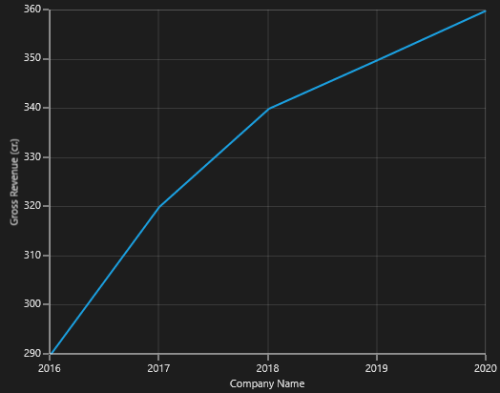

## DateTimeCategoryAxis

[`DateTimeCategoryAxis`](https://help.syncfusion.com/cr/uwp/Syncfusion.UI.Xaml.Charts.DateTimeCategoryAxis.html) is a special type of axis used mainly with financial series. All the data points are plotted with equal spaces, similar to [`CategoryAxis`](https://help.syncfusion.com/cr/uwp/Syncfusion.UI.Xaml.Charts.CategoryAxis.html), thereby removing space for missing dates. Intervals and range for the axis are calculated similar to [`DateTimeAxis`](https://help.syncfusion.com/cr/uwp/Syncfusion.UI.Xaml.Charts.DateTimeAxis.html). There are no visual gaps between points, even when the difference between two points is more than a year.

DateTimeCategoryAxis

<table>
<tr>
<th>
Property</th><th>
Definition</th></tr>
<tr>
<td>
{{'[`Interval`](https://help.syncfusion.com/cr/uwp/Syncfusion.UI.Xaml.Charts.DateTimeCategoryAxis.html#Syncfusion_UI_Xaml_Charts_DateTimeCategoryAxis_Interval)'| markdownify }}</td><td>
Gets or sets the double value that represents the interval between the labels.</td></tr>
<tr>
<td>
{{'[`IntervalType`](https://help.syncfusion.com/cr/uwp/Syncfusion.UI.Xaml.Charts.DateTimeCategoryAxis.html#Syncfusion_UI_Xaml_Charts_DateTimeCategoryAxis_IntervalType)'| markdownify }}</td><td>
Gets or sets the DateTimeIntervalType that represents the type of the interval.</td></tr>
</table>





<syncfusion:SfChart x:Name="Chart"   Margin="5,0,10,0">

            <syncfusion:SfChart.DataContext>

                <local:ViewModel/>

            </syncfusion:SfChart.DataContext>

            <syncfusion:SfChart.PrimaryAxis>

                <syncfusion:DateTimeCategoryAxis Interval="1" LabelFormat="yyyy" IntervalType="Years"  Header="Company Name"/>

            </syncfusion:SfChart.PrimaryAxis>

            <syncfusion:SfChart.SecondaryAxis>

                <syncfusion:NumericalAxis   Header="Gross Revenue (cr.)"/>

            </syncfusion:SfChart.SecondaryAxis>

            <syncfusion:LineSeries x:Name="series1" Label="Company Details"   XBindingPath="Year" YBindingPath="CompanyTurnOver"   ItemsSource="{Binding CompanyDetails}">

            </syncfusion:LineSeries>

        </syncfusion:SfChart>





chart.Margin = new Thickness(5, 0, 10, 0);

chart.DataContext = new ViewModel();

chart.PrimaryAxis = new DateTimeCategoryAxis()
{

    IntervalType = DateTimeIntervalType.Years,

    Interval = 1,

    LabelFormat = "yyyy",

    Header = "Company Name"

};

chart.SecondaryAxis = new NumericalAxis()
{
    Header="Gross Revenue (cr.)"
};

ColumnSeries series = new ColumnSeries()
{

    ItemsSource = new ViewModel().CompanyDetails,

    XBindingPath = "Year",

    YBindingPath = "CompanyTurnOver"

};

chart.Series.Add(series);





## TimeSpanAxis

[`TimeSpanAxis`](https://help.syncfusion.com/cr/uwp/Syncfusion.UI.Xaml.Charts.TimeSpanAxis.html) is used to plot the time span values in the PrimaryAxis. TimeSpanAxis has the advantage of plotting data with milliseconds difference. The limitation of TimeSpanAxis is that it can only accept timespan values (hh:mm:ss) and datetime values are not accepted.

The following APIs are used in [`TimeSpanAxis`](https://help.syncfusion.com/cr/uwp/Syncfusion.UI.Xaml.Charts.TimeSpanAxis.html).

TimeSpanAxis

<table>
<tr>
<th>
Property</th><th>
Definition</th></tr>
<tr>
<td>
{{'[`Interval`](https://help.syncfusion.com/cr/uwp/Syncfusion.UI.Xaml.Charts.TimeSpanAxis.html#Syncfusion_UI_Xaml_Charts_TimeSpanAxis_Interval)'| markdownify }}</td><td>
Gets or sets the double value that represents the interval between the labels.</td></tr>
<tr>
<td>
{{'[`Minimum`](https://help.syncfusion.com/cr/uwp/Syncfusion.UI.Xaml.Charts.TimeSpanAxis.html#Syncfusion_UI_Xaml_Charts_TimeSpanAxis_Minimum)'| markdownify }}</td><td>
Gets or sets the timespan value that represents the minimum value for the Axis.</td></tr>
<tr>
<td>
{{'[`Maximum`](https://help.syncfusion.com/cr/uwp/Syncfusion.UI.Xaml.Charts.TimeSpanAxis.html#Syncfusion_UI_Xaml_Charts_TimeSpanAxis_Maximum)'| markdownify }}</td><td>
Gets or sets the timespan value that represents the maximum value for the Axis. </td></tr>
</table>





 <syncfusion:SfChart x:Name="Chart"   Margin="5,0,10,0">

            <syncfusion:SfChart.DataContext>

                <local:ViewModel/>

            </syncfusion:SfChart.DataContext>

            <syncfusion:SfChart.PrimaryAxis>

                <syncfusion:TimeSpanAxis Interval="00:00:01" Header="Company Name"/>

            </syncfusion:SfChart.PrimaryAxis>

            <syncfusion:SfChart.SecondaryAxis>

                <syncfusion:NumericalAxis   Header="Gross Revenue (cr.)"/>

            </syncfusion:SfChart.SecondaryAxis>

            <syncfusion:LineSeries x:Name="series1" Label="Company Details"   XBindingPath="Year" YBindingPath="CompanyTurnOver"  ItemsSource="{Binding CompanyDetails}">

            </syncfusion:LineSeries>

        </syncfusion:SfChart>





chart.Margin = new Thickness(5, 0, 10, 0);

chart.DataContext = new ViewModel();

chart.PrimaryAxis = new TimeSpanAxis()
{

    Interval = new TimeSpan(00, 00, 01),

    Header = "Company Name"

};

chart.SecondaryAxis = new NumericalAxis()
{
    Header="Gross Revenue (cr.)"
};

ColumnSeries series = new ColumnSeries()
{

    ItemsSource = new ViewModel().CompanyDetails,

    XBindingPath = "Year",

    YBindingPath = "CompanyTurnOver"

};

chart.Series.Add(series);





## LogarithmicAxis

[`LogarithmicAxis`](https://help.syncfusion.com/cr/uwp/Syncfusion.UI.Xaml.Charts.LogarithmicAxis.html) is used to plot the logarithmic scale for the chart. In order to plot the logarithmic scale, you must specify the base value using [`LogarithmicBase`](https://help.syncfusion.com/cr/uwp/Syncfusion.UI.Xaml.Charts.LogarithmicAxis.html#Syncfusion_UI_Xaml_Charts_LogarithmicAxis_LogarithmicBase) Property.

The following APIs are used to customize the [`LogarithmicAxis`](https://help.syncfusion.com/cr/uwp/Syncfusion.UI.Xaml.Charts.LogarithmicAxis.html).

LogarithmicAxis

<table>
<tr>
<th>
Property</th><th>
Definition</th></tr>
<tr>
<td>
{{'[`Interval`](https://help.syncfusion.com/cr/uwp/Syncfusion.UI.Xaml.Charts.LogarithmicAxis.html#Syncfusion_UI_Xaml_Charts_LogarithmicAxis_Interval)'| markdownify }}</td><td>
Gets or sets the double value that represents the interval between the labels</td></tr>
<tr>
<td>
{{'[`Minimum`](https://help.syncfusion.com/cr/uwp/Syncfusion.UI.Xaml.Charts.LogarithmicAxis.html#Syncfusion_UI_Xaml_Charts_LogarithmicAxis_Minimum)'| markdownify }}</td><td>
Gets or sets the double value that represents the minimum value for the Axis.</td></tr>
<tr>
<td>
{{'[`Maximum`](https://help.syncfusion.com/cr/uwp/Syncfusion.UI.Xaml.Charts.LogarithmicAxis.html#Syncfusion_UI_Xaml_Charts_LogarithmicAxis_Maximum)'| markdownify }}</td><td>
Gets or sets the double value that represents the maximum value of the Axis. </td></tr>
<tr>
<td>
{{'[`LogarithmicBase`](https://help.syncfusion.com/cr/uwp/Syncfusion.UI.Xaml.Charts.LogarithmicAxis.html#Syncfusion_UI_Xaml_Charts_LogarithmicAxis_LogarithmicBase)'| markdownify }}</td><td>
Gets or sets the double value that represents the logarithmic base value of the Axis.</td></tr>
</table>





<syncfusion:SfChart x:Name="Chart"   Margin="5,0,10,0">

            <syncfusion:SfChart.DataContext>

                <local:ViewModel/>

            </syncfusion:SfChart.DataContext>

            <syncfusion:SfChart.PrimaryAxis>

                <syncfusion:CategoryAxis   Header="Company Name"/>

            </syncfusion:SfChart.PrimaryAxis>

            <syncfusion:SfChart.SecondaryAxis>

                <syncfusion:LogarithmicAxis LogarithmicBase="10"   Header="Gross Revenue (cr.)"/>

            </syncfusion:SfChart.SecondaryAxis>

            <syncfusion:LineSeries x:Name="series1" Label="Company Details"   XBindingPath="CompanyName" YBindingPath="CompanyTurnOver"   ItemsSource="{Binding CompanyDetails}">

            </syncfusion:LineSeries>

        </syncfusion:SfChart>





chart.Margin = new Thickness(5, 0, 10, 0);

chart.DataContext = new ViewModel();

chart.PrimaryAxis = new CategoryAxis()
{

    Header = "Company Name"

};

chart.SecondaryAxis = new LogarithmicAxis()
{

    Header = "Gross Revenue",

    LogarithmicBase = 10

};

ColumnSeries series = new ColumnSeries()
{

    ItemsSource = new ViewModel().CompanyDetails,

    XBindingPath = "Year",

    YBindingPath = "CompanyTurnOver"

};

chart.Series.Add(series);





Logarithmic Axis does not support zero or negative values.

The following screenshot illustrates the SfChart with LogarithmicAxis.

## Multiple Axes

[`SfChart`](https://help.syncfusion.com/cr/uwp/Syncfusion.UI.Xaml.Charts.SfChart.html) provides a way to arrange multiple series inside the same chart area, giving the chart more space than x-axis and y-axis.These axes can be arranged in a stack or in a side by side pattern. 

By default, all the series are plotted based on Primary and Secondary Axis. You can add more axes by adding additional axis to the series. There are two properties [`XAxis`](https://help.syncfusion.com/cr/uwp/Syncfusion.UI.Xaml.Charts.CartesianSeries.html#Syncfusion_UI_Xaml_Charts_CartesianSeries_XAxis) and [`YAxis`](https://help.syncfusion.com/cr/uwp/Syncfusion.UI.Xaml.Charts.CartesianSeries.html#Syncfusion_UI_Xaml_Charts_CartesianSeries_YAxis) in all the series, except Accumulation Series.





 <syncfusion:ColumnSeries Label="2010" 

     ItemsSource="{Binding Demands}"

     XBindingPath="Demand"

     YBindingPath="Year2010"

     Interior="Green"

     

            <syncfusion:ColumnSeries.XAxis>

                <syncfusion:NumericalAxis Header="Additional X Axis"/>

            </syncfusion:ColumnSeries.XAxis>

            <syncfusion:ColumnSeries.YAxis>

                <syncfusion:NumericalAxis Header="Additional Y Axis"/>

            </syncfusion:ColumnSeries.YAxis>

        </syncfusion:ColumnSeries>

        <syncfusion:LineSeries Label="2011" 

    ItemsSource="{Binding Demands}"

    XBindingPath="Demand"

    YBindingPath="Year2011"

    Interior="Black"

    StrokeThickness="2"/>





ColumnSeries series1 = new ColumnSeries()
{

    ItemsSource = new ViewModel().Demands,

    XBindingPath = "Demand",

    YBindingPath = "Year2010",

    Label ="2010",

    Interior = new SolidColorBrush(Colors.Green)

};

series1.XAxis = new NumericalAxis()
{

    Header = "Additional X Axis"

};

series1.YAxis = new NumericalAxis()
{

    Header = "Additional Y Axis"

};

LineSeries series2 = new LineSeries()
{

    ItemsSource = new ViewModel().Demands,

    XBindingPath = "Demand",

    YBindingPath = "Year2011",

    Label = "2011",

    Interior = new SolidColorBrush(Colors.Black),

    StrokeThickness = 2

};

chart.Series.Add(series1);

chart.Series.Add(series2);





The following screenshot illustrates SfChart with multiple axes.

 The first series is plotting based on additional X & Y axis and second series (or remaining series) is plotting against the Primary and Secondary axis.

### Axis Positioning

By default, the x-axis is arranged horizontally at the bottom of the chart and the y-axis is arranged vertically on the left-side of the chart. You can change the alignment of the axes by setting OpposedPosition to True. It arranges the x-axis at the top and the y-axis on the right-side of the chart. 

The following is the code example for setting the [`OpposedPosition`](https://help.syncfusion.com/cr/uwp/Syncfusion.UI.Xaml.Charts.ChartAxis.html#Syncfusion_UI_Xaml_Charts_ChartAxis_OpposedPosition) property.





<syncfusion:ColumnSeries.XAxis>

            <syncfusion:NumericalAxis Header="Additional X Axis" OpposedPosition="True"/>

        </syncfusion:ColumnSeries.XAxis>

        <syncfusion:ColumnSeries.YAxis>

            <syncfusion:NumericalAxis Header="Additional Y Axis" OpposedPosition="True"/>

        </syncfusion:ColumnSeries.YAxis>
		




columnSeries.XAxis = new NumericalAxis()
{

    Header = "Additional X Axis",

    OpposedPosition = true

};

columnSeries.YAxis = new NumericalAxis()
{

    Header = "Additional Y Axis",

    OpposedPosition = true

};





The following is a screenshot demonstrating y-axis of a chart arranged in [`OpposedPosition`](https://help.syncfusion.com/cr/uwp/Syncfusion.UI.Xaml.Charts.ChartAxis.html#Syncfusion_UI_Xaml_Charts_ChartAxis_OpposedPosition).

## Inversed Axis

[`IsInversed`](https://help.syncfusion.com/cr/uwp/Syncfusion.UI.Xaml.Charts.ChartAxis.html#Syncfusion_UI_Xaml_Charts_ChartAxis_IsInversed) property is used to reverse chart plotting inverse the axis scaling.





<syncfusion:SfChart.PrimaryAxis>

                <syncfusion:CategoryAxis   FontSize="16" IsInversed="True" OpposedPosition="True" />

            </ syncfusion:SfChart.PrimaryAxis>

            <syncfusion:SfChart.SecondaryAxis>

                <syncfusion:NumericalAxis FontSize="16" Minimum="0" Maximum="2000" Interval=”200” IsInversed="True" OpposedPosition="True" />

            </syncfusion:SfChart.SecondaryAxis>





chart.PrimaryAxis = new CategoryAxis()
{

    FontSize = 16,

    OpposedPosition = true,

    IsInversed = true

};

chart.SecondaryAxis = new NumericalAxis()
{

    FontSize = 16,

    Minimum = 0,

    Maximum = 2000,

    Interval = 200,

    IsInversed = true,

    OpposedPosition = true

};





## Axis range and Interval

[`ChartAxis`](https://help.syncfusion.com/cr/uwp/Syncfusion.UI.Xaml.Charts.ChartAxis.html) calculates the range and intervals automatically based on the values of series data points. You can also explicitly specify the range and interval using the Minimum, Maximum and Interval properties. 

T> You cannot specify range for [`CategoryAxis`](https://help.syncfusion.com/cr/uwp/Syncfusion.UI.Xaml.Charts.CategoryAxis.html) instead you can use [`ZoomFactor`](https://help.syncfusion.com/cr/uwp/Syncfusion.UI.Xaml.Charts.ChartAxisBase2D.html#Syncfusion_UI_Xaml_Charts_ChartAxisBase2D_ZoomFactor) and [`ZoomPosition`](https://help.syncfusion.com/cr/uwp/Syncfusion.UI.Xaml.Charts.ChartAxisBase2D.html#Syncfusion_UI_Xaml_Charts_ChartAxisBase2D_ZoomPosition).

 You can force the [`NumericalAxis`](https://help.syncfusion.com/cr/uwp/Syncfusion.UI.Xaml.Charts.NumericalAxis.html) to start range from zero by enabling [`StartRangeFromZero`](https://help.syncfusion.com/cr/uwp/Syncfusion.UI.Xaml.Charts.NumericalAxis.html#Syncfusion_UI_Xaml_Charts_NumericalAxis_StartRangeFromZero). The following is the code example for setting the ChartAxis properties.

 The following is the code sample for setting the [`ChartAxis`](https://help.syncfusion.com/cr/uwp/Syncfusion.UI.Xaml.Charts.ChartAxis.html) properties:

 



<syncfusion:SfChart.PrimaryAxis>

                <syncfusion:CategoryAxis FontSize="14"/>

            </syncfusion:SfChart.PrimaryAxis>

            <syncfusion:SfChart.SecondaryAxis>

                <syncfusion:NumericalAxis FontSize="14"/>

            </syncfusion:SfChart.SecondaryAxis>





chart.PrimaryAxis = new CategoryAxis()
{

    FontSize = 14

};

chart.SecondaryAxis = new NumericalAxis()
{

    FontSize = 14
};





### Range Padding

The [`NumericalAxis`](https://help.syncfusion.com/cr/uwp/Syncfusion.UI.Xaml.Charts.NumericalAxis.html) and [`DateTimeAxis`](https://help.syncfusion.com/cr/uwp/Syncfusion.UI.Xaml.Charts.DateTimeAxis.html) have a [`RangePadding`](https://help.syncfusion.com/cr/uwp/Syncfusion.UI.Xaml.Charts.NumericalAxis.html#Syncfusion_UI_Xaml_Charts_NumericalAxis_RangePadding) property that can be used to add padding to the range of a chart's axes.

### NumericalAxis RangePadding

The following types are available for [`NumericalAxis`](https://help.syncfusion.com/cr/uwp/Syncfusion.UI.Xaml.Charts.NumericalAxis.html): 

* Additional
* None
* Normal
* Round
* RoundStart
* RoundEnd
* PrependInterval
* AppendInterval

By default, the default [`RangePadding`](https://help.syncfusion.com/cr/uwp/Syncfusion.UI.Xaml.Charts.NumericalAxis.html#Syncfusion_UI_Xaml_Charts_NumericalAxis_RangePadding) value for [`PrimaryAxis`](https://help.syncfusion.com/cr/uwp/Syncfusion.UI.Xaml.Charts.SfChart.html#Syncfusion_UI_Xaml_Charts_SfChart_PrimaryAxis) is [`Auto`](https://help.syncfusion.com/cr/uwp/Syncfusion.UI.Xaml.Charts.NumericalPadding.html#Syncfusion_UI_Xaml_Charts_NumericalPadding_Auto) and for [`SecondaryAxis`](https://help.syncfusion.com/cr/uwp/Syncfusion.UI.Xaml.Charts.SfChart.html#Syncfusion_UI_Xaml_Charts_SfChart_SecondaryAxis), the default value is [`Round`](https://help.syncfusion.com/cr/uwp/Syncfusion.UI.Xaml.Charts.NumericalPadding.html#Syncfusion_UI_Xaml_Charts_NumericalPadding_Round).

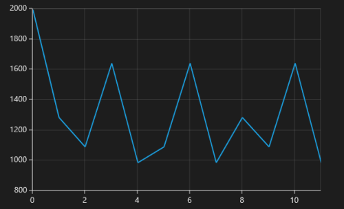

The following screenshot demonstrates [`RangePadding`](https://help.syncfusion.com/cr/uwp/Syncfusion.UI.Xaml.Charts.NumericalAxis.html#Syncfusion_UI_Xaml_Charts_NumericalAxis_RangePadding) as [`None`](https://help.syncfusion.com/cr/uwp/Syncfusion.UI.Xaml.Charts.NumericalPadding.html#Syncfusion_UI_Xaml_Charts_NumericalPadding_None), where no padding is applied for the axis.

[`Normal`](https://help.syncfusion.com/cr/uwp/Syncfusion.UI.Xaml.Charts.NumericalPadding.html#Syncfusion_UI_Xaml_Charts_NumericalPadding_Normal) [`RangePadding`](https://help.syncfusion.com/cr/uwp/Syncfusion.UI.Xaml.Charts.NumericalAxis.html#Syncfusion_UI_Xaml_Charts_NumericalAxis_RangePadding) for a [`NumericalAxis`](https://help.syncfusion.com/cr/uwp/Syncfusion.UI.Xaml.Charts.NumericalAxis.html) is used mostly for the y-axis to have padding based on the Range calculation.

The following screenshot illustrates a chart’s y-axis with [`RangePadding`](https://help.syncfusion.com/cr/uwp/Syncfusion.UI.Xaml.Charts.NumericalAxis.html#Syncfusion_UI_Xaml_Charts_NumericalAxis_RangePadding) set to [`Normal`](https://help.syncfusion.com/cr/uwp/Syncfusion.UI.Xaml.Charts.NumericalPadding.html#Syncfusion_UI_Xaml_Charts_NumericalPadding_Normal).

Round [`RangePadding`](https://help.syncfusion.com/cr/uwp/Syncfusion.UI.Xaml.Charts.NumericalPadding.html#Syncfusion_UI_Xaml_Charts_NumericalPadding_Round) for a [`NumericalAxis`](https://help.syncfusion.com/cr/uwp/Syncfusion.UI.Xaml.Charts.NumericalAxis.html) rounds the range of the chart axis to the nearest possible value.

The following screenshot demonstrates a chart’s x-axis with [`RangePadding`](https://help.syncfusion.com/cr/uwp/Syncfusion.UI.Xaml.Charts.NumericalAxis.html#Syncfusion_UI_Xaml_Charts_NumericalAxis_RangePadding) set to [`Round`](https://help.syncfusion.com/cr/uwp/Syncfusion.UI.Xaml.Charts.NumericalPadding.html#Syncfusion_UI_Xaml_Charts_NumericalPadding_Round).

If [`RangePadding`](https://help.syncfusion.com/cr/uwp/Syncfusion.UI.Xaml.Charts.NumericalAxis.html#Syncfusion_UI_Xaml_Charts_NumericalAxis_RangePadding) for [`NumericalAxis`](https://help.syncfusion.com/cr/uwp/Syncfusion.UI.Xaml.Charts.NumericalAxis.html) is set to [`Additional`](https://help.syncfusion.com/cr/uwp/Syncfusion.UI.Xaml.Charts.NumericalPadding.html#Syncfusion_UI_Xaml_Charts_NumericalPadding_Additional), the interval of the axis is added as padding.

The following screenshot demonstrates a chart’s x-axis with [`RangePadding`](https://help.syncfusion.com/cr/uwp/Syncfusion.UI.Xaml.Charts.NumericalAxis.html#Syncfusion_UI_Xaml_Charts_NumericalAxis_RangePadding) set to [`Additional`](https://help.syncfusion.com/cr/uwp/Syncfusion.UI.Xaml.Charts.NumericalPadding.html#Syncfusion_UI_Xaml_Charts_NumericalPadding_Additional).

If [`RangePadding`](https://help.syncfusion.com/cr/uwp/Syncfusion.UI.Xaml.Charts.NumericalAxis.html#Syncfusion_UI_Xaml_Charts_NumericalAxis_RangePadding) for [`NumericalAxis`](https://help.syncfusion.com/cr/uwp/Syncfusion.UI.Xaml.Charts.NumericalAxis.html) is set to [`RoundStart`](https://help.syncfusion.com/cr/uwp/Syncfusion.UI.Xaml.Charts.NumericalPadding.html#Syncfusion_UI_Xaml_Charts_NumericalPadding_RoundStart) , rounds the range of the chart axis in the start to the nearest possible value.

The following screenshot demonstrates a chart’s x-axis with [`RangePadding`](https://help.syncfusion.com/cr/uwp/Syncfusion.UI.Xaml.Charts.NumericalAxis.html#Syncfusion_UI_Xaml_Charts_NumericalAxis_RangePadding) set to [`RoundStart`](https://help.syncfusion.com/cr/uwp/Syncfusion.UI.Xaml.Charts.NumericalPadding.html#Syncfusion_UI_Xaml_Charts_NumericalPadding_RoundStart) .

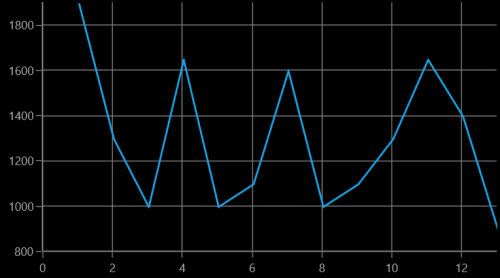

If [`RangePadding`](https://help.syncfusion.com/cr/uwp/Syncfusion.UI.Xaml.Charts.NumericalAxis.html#Syncfusion_UI_Xaml_Charts_NumericalAxis_RangePadding) for [`NumericalAxis`](https://help.syncfusion.com/cr/uwp/Syncfusion.UI.Xaml.Charts.NumericalAxis.html) is set to [`RoundEnd`](https://help.syncfusion.com/cr/uwp/Syncfusion.UI.Xaml.Charts.NumericalPadding.html#Syncfusion_UI_Xaml_Charts_NumericalPadding_RoundEnd) , rounds the range of the chart axis in the end to the nearest possible value.

The following screenshot demonstrates a chart’s x-axis with [`RangePadding`](https://help.syncfusion.com/cr/uwp/Syncfusion.UI.Xaml.Charts.NumericalAxis.html#Syncfusion_UI_Xaml_Charts_NumericalAxis_RangePadding) set to [`RoundEnd`](https://help.syncfusion.com/cr/uwp/Syncfusion.UI.Xaml.Charts.NumericalPadding.html#Syncfusion_UI_Xaml_Charts_NumericalPadding_RoundEnd) .

If [`RangePadding`](https://help.syncfusion.com/cr/uwp/Syncfusion.UI.Xaml.Charts.NumericalAxis.html#Syncfusion_UI_Xaml_Charts_NumericalAxis_RangePadding) for [`NumericalAxis`](https://help.syncfusion.com/cr/uwp/Syncfusion.UI.Xaml.Charts.NumericalAxis.html) is set to [`PrependInterval`](https://help.syncfusion.com/cr/uwp/Syncfusion.UI.Xaml.Charts.NumericalPadding.html#Syncfusion_UI_Xaml_Charts_NumericalPadding_PrependInterval) , the interval of the axis is added in the start as padding.

The following screenshot demonstrates a chart’s x-axis with [`RangePadding`](https://help.syncfusion.com/cr/uwp/Syncfusion.UI.Xaml.Charts.NumericalAxis.html#Syncfusion_UI_Xaml_Charts_NumericalAxis_RangePadding) set to [`PrependInterval`](https://help.syncfusion.com/cr/uwp/Syncfusion.UI.Xaml.Charts.NumericalPadding.html#Syncfusion_UI_Xaml_Charts_NumericalPadding_PrependInterval) .

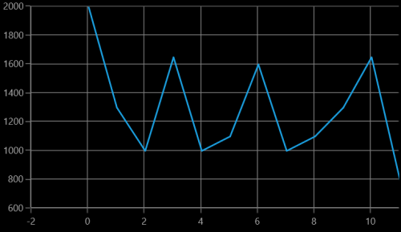

If [`RangePadding`](https://help.syncfusion.com/cr/uwp/Syncfusion.UI.Xaml.Charts.NumericalAxis.html#Syncfusion_UI_Xaml_Charts_NumericalAxis_RangePadding) for [`NumericalAxis`](https://help.syncfusion.com/cr/uwp/Syncfusion.UI.Xaml.Charts.NumericalAxis.html) is set to [`AppendInterval`](https://help.syncfusion.com/cr/uwp/Syncfusion.UI.Xaml.Charts.NumericalPadding.html#Syncfusion_UI_Xaml_Charts_NumericalPadding_AppendInterval) , the interval of the axis is added in the end as padding.

The following screenshot demonstrates a chart’s x-axis with [`RangePadding`](https://help.syncfusion.com/cr/uwp/Syncfusion.UI.Xaml.Charts.NumericalAxis.html#Syncfusion_UI_Xaml_Charts_NumericalAxis_RangePadding) set to [`AppendInterval`](https://help.syncfusion.com/cr/uwp/Syncfusion.UI.Xaml.Charts.NumericalPadding.html#Syncfusion_UI_Xaml_Charts_NumericalPadding_AppendInterval) .

### DateTimeAxis RangePadding

The [`RangePadding`](https://help.syncfusion.com/cr/uwp/Syncfusion.UI.Xaml.Charts.DateTimeAxis.html#Syncfusion_UI_Xaml_Charts_DateTimeAxis_RangePadding) types available in the [`DateTimeAxis`](https://help.syncfusion.com/cr/uwp/Syncfusion.UI.Xaml.Charts.DateTimeAxis.html) are: 

* Additional
* None
* Round
* RoundStart
* RoundEnd
* PrependInterval
* AppendInterval

By default, the [`RangePadding`](https://help.syncfusion.com/cr/uwp/Syncfusion.UI.Xaml.Charts.DateTimeAxis.html#Syncfusion_UI_Xaml_Charts_DateTimeAxis_RangePadding) for a [`DateTimeAxis`](https://help.syncfusion.com/cr/uwp/Syncfusion.UI.Xaml.Charts.DateTimeAxis.html) is [`None`](https://help.syncfusion.com/cr/uwp/Syncfusion.UI.Xaml.Charts.DateTimeRangePadding.html#Syncfusion_UI_Xaml_Charts_DateTimeRangePadding_None).

The following screenshot demonstrates a chart’s x-axis with [`RangePadding`](https://help.syncfusion.com/cr/uwp/Syncfusion.UI.Xaml.Charts.DateTimeAxis.html#Syncfusion_UI_Xaml_Charts_DateTimeAxis_RangePadding) set to [`None`](https://help.syncfusion.com/cr/uwp/Syncfusion.UI.Xaml.Charts.DateTimeRangePadding.html#Syncfusion_UI_Xaml_Charts_DateTimeRangePadding_None). 

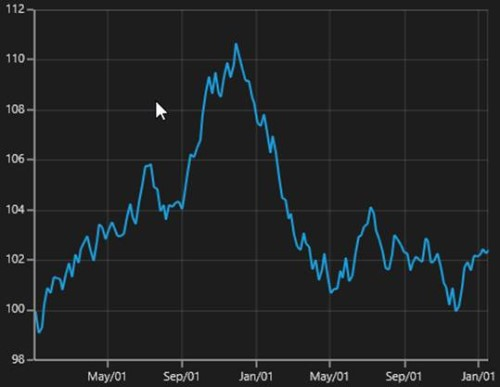

When [`RangePadding`](https://help.syncfusion.com/cr/uwp/Syncfusion.UI.Xaml.Charts.DateTimeAxis.html#Syncfusion_UI_Xaml_Charts_DateTimeAxis_RangePadding) for [`DateTimeAxis`](https://help.syncfusion.com/cr/uwp/Syncfusion.UI.Xaml.Charts.DateTimeAxis.html) is set to [`Additional`](https://help.syncfusion.com/cr/uwp/Syncfusion.UI.Xaml.Charts.DateTimeRangePadding.html#Syncfusion_UI_Xaml_Charts_DateTimeRangePadding_Additional), the DateTime interval of the axis is added as padding, as shown in the following screenshot.

When [`RangePadding`](https://help.syncfusion.com/cr/uwp/Syncfusion.UI.Xaml.Charts.DateTimeAxis.html#Syncfusion_UI_Xaml_Charts_DateTimeAxis_RangePadding) for [`DateTimeAxis`](https://help.syncfusion.com/cr/uwp/Syncfusion.UI.Xaml.Charts.DateTimeAxis.html) is set to [`Round`](https://help.syncfusion.com/cr/uwp/Syncfusion.UI.Xaml.Charts.DateTimeRangePadding.html#Syncfusion_UI_Xaml_Charts_DateTimeRangePadding_Round), the range of the chart axis is rounded off to the nearest possible DateTime value, as shown in the following screenshot.

When [`RangePadding`](https://help.syncfusion.com/cr/uwp/Syncfusion.UI.Xaml.Charts.DateTimeAxis.html#Syncfusion_UI_Xaml_Charts_DateTimeAxis_RangePadding) for [`DateTimeAxis`](https://help.syncfusion.com/cr/uwp/Syncfusion.UI.Xaml.Charts.DateTimeAxis.html) is set to [`RoundStart`](https://help.syncfusion.com/cr/uwp/Syncfusion.UI.Xaml.Charts.DateTimeRangePadding.html#Syncfusion_UI_Xaml_Charts_DateTimeRangePadding_RoundStart), the range of the chart axis is rounded in the start off to the nearest possible DateTime value, as shown in the following screenshot.

When [`RangePadding`](https://help.syncfusion.com/cr/uwp/Syncfusion.UI.Xaml.Charts.DateTimeAxis.html#Syncfusion_UI_Xaml_Charts_DateTimeAxis_RangePadding) for [`DateTimeAxis`](https://help.syncfusion.com/cr/uwp/Syncfusion.UI.Xaml.Charts.DateTimeAxis.html) is set to [`RoundEnd`](https://help.syncfusion.com/cr/uwp/Syncfusion.UI.Xaml.Charts.DateTimeRangePadding.html#Syncfusion_UI_Xaml_Charts_DateTimeRangePadding_RoundEnd), the range of the chart axis is rounded in the end off to the nearest possible DateTime value, as shown in the following screenshot.

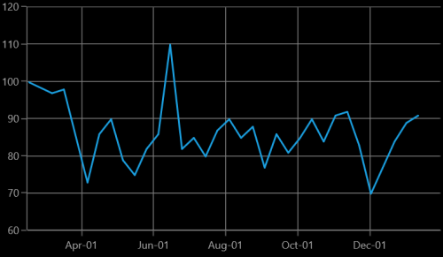

When [`RangePadding`](https://help.syncfusion.com/cr/uwp/Syncfusion.UI.Xaml.Charts.DateTimeAxis.html#Syncfusion_UI_Xaml_Charts_DateTimeAxis_RangePadding) for [`DateTimeAxis`](https://help.syncfusion.com/cr/uwp/Syncfusion.UI.Xaml.Charts.DateTimeAxis.html) is set to [`PrependInterval`](https://help.syncfusion.com/cr/uwp/Syncfusion.UI.Xaml.Charts.DateTimeRangePadding.html#Syncfusion_UI_Xaml_Charts_DateTimeRangePadding_PrependInterval), the DateTime interval of the axis is added in the start as padding, as shown in the following screenshot.

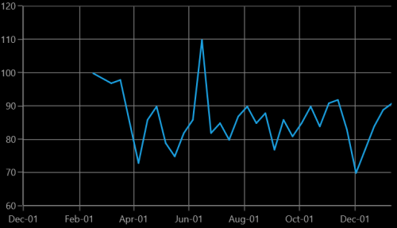

When [`RangePadding`](https://help.syncfusion.com/cr/uwp/Syncfusion.UI.Xaml.Charts.DateTimeAxis.html#Syncfusion_UI_Xaml_Charts_DateTimeAxis_RangePadding) for [`DateTimeAxis`](https://help.syncfusion.com/cr/uwp/Syncfusion.UI.Xaml.Charts.DateTimeAxis.html) is set to [`AppendInterval`](https://help.syncfusion.com/cr/uwp/Syncfusion.UI.Xaml.Charts.DateTimeRangePadding.html#Syncfusion_UI_Xaml_Charts_DateTimeRangePadding_AppendInterval), the DateTime interval of the axis is added in the end as padding, as shown in the following screenshot.

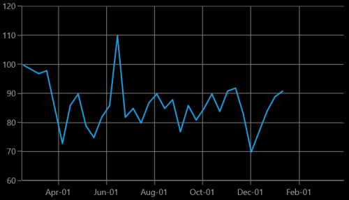

### Applying padding to the axis

The [`PlotOffset`](https://help.syncfusion.com/cr/uwp/Syncfusion.UI.Xaml.Charts.ChartAxis.html#Syncfusion_UI_Xaml_Charts_ChartAxis_PlotOffset) property is used to provide padding to the axis. The following code sample demonstrates the padding applied to both x and y-axes.





<syncfusion:SfChart.PrimaryAxis>

<syncfusion:CategoryAxis  PlotOffset="30">

</syncfusion:CategoryAxis>

</syncfusion:SfChart.PrimaryAxis>

<syncfusion:SfChart.SecondaryAxis>

<syncfusion:NumericalAxis PlotOffset="30">

</syncfusion:NumericalAxis>

</syncfusion:SfChart.SecondaryAxis>





chart.PrimaryAxis = new CategoryAxis()
{

    PlotOffset = 30

};

chart.SecondaryAxis = new NumericalAxis()
{

    PlotOffset = 30

};





### PlotOffsetStart

The [`PlotOffsetStart`](https://help.syncfusion.com/cr/uwp/Syncfusion.UI.Xaml.Charts.ChartAxis.html#Syncfusion_UI_Xaml_Charts_ChartAxis_PlotOffsetStart) property is used to provide padding to the axis at start position. The following code sample demonstrates the padding applied to Start position for both x and y-axes.





<syncfusion:SfChart.PrimaryAxis>

<syncfusion:CategoryAxis  PlotOffsetStart="30">

</syncfusion:CategoryAxis>

</syncfusion:SfChart.PrimaryAxis>

<syncfusion:SfChart.SecondaryAxis>

<syncfusion:NumericalAxis PlotOffsetStart="30">

</syncfusion:NumericalAxis>

</syncfusion:SfChart.SecondaryAxis>





chart.PrimaryAxis = new CategoryAxis()
{

    PlotOffsetStart = 30

};

chart.SecondaryAxis = new NumericalAxis()
{

    PlotOffsetStart = 30

};





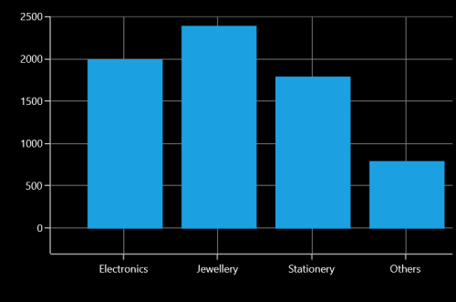

### PlotOffsetEnd

The [`PlotOffsetEnd`](https://help.syncfusion.com/cr/uwp/Syncfusion.UI.Xaml.Charts.ChartAxis.html#Syncfusion_UI_Xaml_Charts_ChartAxis_PlotOffsetEnd) property is used to provide padding to the axis at end position. The following code sample demonstrates the padding applied to end position for both x and y-axes.





<syncfusion:SfChart.PrimaryAxis>

<syncfusion:CategoryAxis  PlotOffsetEnd="30">

</syncfusion:CategoryAxis>

</syncfusion:SfChart.PrimaryAxis>

<syncfusion:SfChart.SecondaryAxis>

<syncfusion:NumericalAxis PlotOffsetEnd="30">

</syncfusion:NumericalAxis>

</syncfusion:SfChart.SecondaryAxis>





chart.PrimaryAxis = new CategoryAxis()
{

    PlotOffsetEnd = 30

};

chart.SecondaryAxis = new NumericalAxis()
{

    PlotOffsetEnd = 30

};





## AutoScrollingDelta

[`AutoScrollingDelta`](https://help.syncfusion.com/cr/uwp/Syncfusion.UI.Xaml.Charts.ChartAxisBase2D.html#Syncfusion_UI_Xaml_Charts_ChartAxisBase2D_AutoScrollingDelta) is used to ensure whether the specified range of data is always visible in the chart. It always shows the recently added data points at the end, and scrolling will be reset to the end of the range whenever a new point is added.

By activating the [`EnableScrollBar`](https://help.syncfusion.com/cr/uwp/Syncfusion.UI.Xaml.Charts.ChartAxisBase2D.html#Syncfusion_UI_Xaml_Charts_ChartAxisBase2D_EnableScrollBar) property of the axis or by adding [`ChartZoomPanBehavior`](https://help.syncfusion.com/cr/uwp/Syncfusion.UI.Xaml.Charts.ChartZoomPanBehavior.html) to the chart, you can scroll to the previous data points.

### AutoScrollingDeltaType

In [`DateTimeAxis`](https://help.syncfusion.com/cr/uwp/Syncfusion.UI.Xaml.Charts.DateTimeAxis.html), you can apply auto scrolling delta value in [`Years`](https://help.syncfusion.com/cr/uwp/Syncfusion.UI.Xaml.Charts.DateTimeIntervalType.html#Syncfusion_UI_Xaml_Charts_DateTimeIntervalType_Years), [`Months`](https://help.syncfusion.com/cr/uwp/Syncfusion.UI.Xaml.Charts.DateTimeIntervalType.html#Syncfusion_UI_Xaml_Charts_DateTimeIntervalType_Months), [`Days`](https://help.syncfusion.com/cr/uwp/Syncfusion.UI.Xaml.Charts.DateTimeIntervalType.html#Syncfusion_UI_Xaml_Charts_DateTimeIntervalType_Days), [`Hours`](https://help.syncfusion.com/cr/uwp/Syncfusion.UI.Xaml.Charts.DateTimeIntervalType.html#Syncfusion_UI_Xaml_Charts_DateTimeIntervalType_Hours), [`Minutes`](https://help.syncfusion.com/cr/uwp/Syncfusion.UI.Xaml.Charts.DateTimeIntervalType.html#Syncfusion_UI_Xaml_Charts_DateTimeIntervalType_Minutes), [`Seconds`](https://help.syncfusion.com/cr/uwp/Syncfusion.UI.Xaml.Charts.DateTimeIntervalType.html#Syncfusion_UI_Xaml_Charts_DateTimeIntervalType_Seconds) and [`Milliseconds`](https://help.syncfusion.com/cr/uwp/Syncfusion.UI.Xaml.Charts.DateTimeIntervalType.html#Syncfusion_UI_Xaml_Charts_DateTimeIntervalType_Milliseconds) by setting the [`AutoScrollingDeltaType`](https://help.syncfusion.com/cr/uwp/Syncfusion.UI.Xaml.Charts.DateTimeAxis.html#Syncfusion_UI_Xaml_Charts_DateTimeAxis_AutoScrollingDeltaType) property. The default value of this property is [`Auto`](https://help.syncfusion.com/cr/uwp/Syncfusion.UI.Xaml.Charts.DateTimeIntervalType.html#Syncfusion_UI_Xaml_Charts_DateTimeIntervalType_Auto), and the delta will be calculated automatically based on range.

 



<chart:SfChart.PrimaryAxis>

    <chart:DateTimeAxis AutoScrollingDelta = "3" AutoScrollingDeltaType = "Days">

</chart:SfChart.PrimaryAxis>





chart.PrimaryAxis = new DateTimeAxis()
{
      AutoScrollingDelta = 3,
	  
      AutoScrollingDeltaType = DateTimeIntervalType.Days
};





### AutoScrollingMode

The [`AutoScrollingMode`](https://help.syncfusion.com/cr/uwp/Syncfusion.UI.Xaml.Charts.ChartAxisBase2D.html#Syncfusion_UI_Xaml_Charts_ChartAxisBase2D_AutoScrollingMode) property is used to determine whether the axis should be scrolled from the start position or end position. The default value of this property is [`End`](https://help.syncfusion.com/cr/uwp/Syncfusion.UI.Xaml.Charts.ChartAutoScrollingMode.html#Syncfusion_UI_Xaml_Charts_ChartAutoScrollingMode_End).

 



<chart:SfChart.PrimaryAxis>

    <chart:DateTimeAxis AutoScrollingDelta = "3" AutoScrollingMode = "Start">

</chart:SfChart.PrimaryAxis>





chart.PrimaryAxis = new DateTimeAxis()
{
      AutoScrollingDelta = 3,
	  
      AutoScrollingMode = ChartAutoScrollingMode.Start
};





## Positioning axis labels

### Label Placement

The [`CategoryAxis`](https://help.syncfusion.com/cr/uwp/Syncfusion.UI.Xaml.Charts.CategoryAxis.html) includes the [`LabelPlacement`](https://help.syncfusion.com/cr/uwp/Syncfusion.UI.Xaml.Charts.CategoryAxis.html#Syncfusion_UI_Xaml_Charts_CategoryAxis_LabelPlacement) property, used to set the labels of the axis between the tick lines or on the tick lines of the category axis. By default the [`LabelPlacement`](https://help.syncfusion.com/cr/uwp/Syncfusion.UI.Xaml.Charts.CategoryAxis.html#Syncfusion_UI_Xaml_Charts_CategoryAxis_LabelPlacement) value for the [`CategoryAxis`](https://help.syncfusion.com/cr/uwp/Syncfusion.UI.Xaml.Charts.CategoryAxis.html) is [`OnTicks`](https://help.syncfusion.com/cr/uwp/Syncfusion.UI.Xaml.Charts.LabelPlacement.html#Syncfusion_UI_Xaml_Charts_LabelPlacement_OnTicks).

There are two types of [`LabelPlacement`](https://help.syncfusion.com/cr/uwp/Syncfusion.UI.Xaml.Charts.CategoryAxis.html#Syncfusion_UI_Xaml_Charts_CategoryAxis_LabelPlacement):

* BetweenTicks
* OnTicks

The following code example and screenshot shows [`LabelPlacement`](https://help.syncfusion.com/cr/uwp/Syncfusion.UI.Xaml.Charts.CategoryAxis.html#Syncfusion_UI_Xaml_Charts_CategoryAxis_LabelPlacement) set to [`OnTicks`](https://help.syncfusion.com/cr/uwp/Syncfusion.UI.Xaml.Charts.LabelPlacement.html#Syncfusion_UI_Xaml_Charts_LabelPlacement_OnTicks).





  <syncfusion:SfChart.PrimaryAxis>

     <syncfusion:CategoryAxis LabelPlacement="OnTicks" 

         FontSize="16"  />

 </syncfusion:SfChart.PrimaryAxis>





chart.PrimaryAxis = new CategoryAxis()
{

    FontSize = 16,

    LabelPlacement = LabelPlacement.OnTicks

};





The following code example and screenshot shows [`LabelPlacement`](https://help.syncfusion.com/cr/uwp/Syncfusion.UI.Xaml.Charts.CategoryAxis.html#Syncfusion_UI_Xaml_Charts_CategoryAxis_LabelPlacement) set to [`BetweenTicks`](https://help.syncfusion.com/cr/uwp/Syncfusion.UI.Xaml.Charts.LabelPlacement.html#Syncfusion_UI_Xaml_Charts_LabelPlacement_BetweenTicks).





  <syncfusion:SfChart.PrimaryAxis>

    <syncfusion:CategoryAxis LabelPlacement="BetweenTicks" 

           FontSize="16"  />

    </syncfusion:SfChart.PrimaryAxis>





chart.PrimaryAxis = new CategoryAxis()
{

    FontSize = 16,

    LabelPlacement = LabelPlacement.BetweenTicks

};





### Label Position 

The [`LabelsPosition`](https://help.syncfusion.com/cr/uwp/Syncfusion.UI.Xaml.Charts.ChartAxis.html#Syncfusion_UI_Xaml_Charts_ChartAxis_LabelsPosition) property is used to position the axis label either [`Inside`](https://help.syncfusion.com/cr/uwp/Syncfusion.UI.Xaml.Charts.AxisElementPosition.html#Syncfusion_UI_Xaml_Charts_AxisElementPosition_Inside) or [`Outside`](https://help.syncfusion.com/cr/uwp/Syncfusion.UI.Xaml.Charts.AxisElementPosition.html#Syncfusion_UI_Xaml_Charts_AxisElementPosition_Outside) the chart plotting area.

The following code example and screenshot illustrate the use of [`LabelsPosition`](https://help.syncfusion.com/cr/uwp/Syncfusion.UI.Xaml.Charts.ChartAxis.html#Syncfusion_UI_Xaml_Charts_ChartAxis_LabelsPosition).





  <syncfusion:SfChart.PrimaryAxis>

    <syncfusion:CategoryAxis  LabelsPosition="Inside" 

           FontSize="16"  />

    </syncfusion:SfChart.PrimaryAxis>





chart.PrimaryAxis = new CategoryAxis()
{

    FontSize = 16,

    LabelsPosition = AxisElementPosition.Inside

};









  <syncfusion:SfChart.PrimaryAxis>

    <syncfusion:CategoryAxis  LabelsPosition="Outside" 

           FontSize="16"  />

    </syncfusion:SfChart.PrimaryAxis>





chart.PrimaryAxis = new CategoryAxis()
{

    FontSize = 16,

    LabelsPosition = AxisElementPosition.Outside

};





### Positioning Edge Labels

[`SfChart`](https://help.syncfusion.com/cr/uwp/Syncfusion.UI.Xaml.Charts.SfChart.html) provides support to customize the edge labels of the axis to adjust its position using the [`EdgeLabelsDrawingMode`](https://help.syncfusion.com/cr/uwp/Syncfusion.UI.Xaml.Charts.ChartAxis.html#Syncfusion_UI_Xaml_Charts_ChartAxis_EdgeLabelsDrawingMode) property. 

The following are the customizing options in [`EdgeLabelsDrawingMode`](https://help.syncfusion.com/cr/uwp/Syncfusion.UI.Xaml.Charts.ChartAxis.html#Syncfusion_UI_Xaml_Charts_ChartAxis_EdgeLabelsDrawingMode).

* Center- Positions the label with tickline as center.
* Fit- Position the gridline inside based on the edge label size.
* Hide- Hides the edge labels.
* Shift- Shifts the edge labels inside to label width.

The following code example and screenshot show [`EdgeLabelsDrawingMode`](https://help.syncfusion.com/cr/uwp/Syncfusion.UI.Xaml.Charts.ChartAxis.html#Syncfusion_UI_Xaml_Charts_ChartAxis_EdgeLabelsDrawingMode) set to [`Center`](https://help.syncfusion.com/cr/uwp/Syncfusion.UI.Xaml.Charts.EdgeLabelsDrawingMode.html#Syncfusion_UI_Xaml_Charts_EdgeLabelsDrawingMode_Center).





  <syncfusion:SfChart.PrimaryAxis>

  <syncfusion:DateTimeAxis    LabelFormat="MM/yy" EdgeLabelsDrawingMode="Center" FontSize="16"  />

    </syncfusion:SfChart.PrimaryAxis>





chart.PrimaryAxis = new CategoryAxis()
{

    FontSize = 16,

    LabelFormat = "MM/yy",

    EdgeLabelsDrawingMode = EdgeLabelsDrawingMode.Center

};





The following code example and screenshot shows [`EdgeLabelsDrawingMode`](https://help.syncfusion.com/cr/uwp/Syncfusion.UI.Xaml.Charts.ChartAxis.html#Syncfusion_UI_Xaml_Charts_ChartAxis_EdgeLabelsDrawingMode) set to [`Fit`](https://help.syncfusion.com/cr/uwp/Syncfusion.UI.Xaml.Charts.EdgeLabelsDrawingMode.html#Syncfusion_UI_Xaml_Charts_EdgeLabelsDrawingMode_Fit).





  <syncfusion:SfChart.PrimaryAxis>

  <syncfusion:DateTimeAxis    LabelFormat="MM/yy" EdgeLabelsDrawingMode="Fit" FontSize="16"  />

    </syncfusion:SfChart.PrimaryAxis>





chart.PrimaryAxis = new CategoryAxis()
{

    FontSize = 16,

    LabelFormat = "MM/yy",

    EdgeLabelsDrawingMode = EdgeLabelsDrawingMode.Fit

};





The following code example and screenshot shows [`EdgeLabelDrawingMode`](https://help.syncfusion.com/cr/uwp/Syncfusion.UI.Xaml.Charts.ChartAxis.html#Syncfusion_UI_Xaml_Charts_ChartAxis_EdgeLabelsDrawingMode) set to [`Hide`](https://help.syncfusion.com/cr/uwp/Syncfusion.UI.Xaml.Charts.EdgeLabelsDrawingMode.html#Syncfusion_UI_Xaml_Charts_EdgeLabelsDrawingMode_Hide).





  <syncfusion:SfChart.PrimaryAxis>

  <syncfusion:DateTimeAxis    LabelFormat="MM/yy" EdgeLabelsDrawingMode="Hide" FontSize="16"  />

    </syncfusion:SfChart.PrimaryAxis>





chart.PrimaryAxis = new CategoryAxis()
{

    FontSize = 16,

    LabelFormat = "MM/yy",

    EdgeLabelsDrawingMode = EdgeLabelsDrawingMode.Hide

};





The following code example and screenshot shows [`EdgeLabelsDrawingMode`](https://help.syncfusion.com/cr/uwp/Syncfusion.UI.Xaml.Charts.ChartAxis.html#Syncfusion_UI_Xaml_Charts_ChartAxis_EdgeLabelsDrawingMode) set to [`Shift`](https://help.syncfusion.com/cr/uwp/Syncfusion.UI.Xaml.Charts.EdgeLabelsDrawingMode.html#Syncfusion_UI_Xaml_Charts_EdgeLabelsDrawingMode_Shift).





  <syncfusion:SfChart.PrimaryAxis>

  <syncfusion:DateTimeAxis    LabelFormat="MM/yy" EdgeLabelsDrawingMode="Shift" FontSize="16"  />

    </syncfusion:SfChart.PrimaryAxis>





chart.PrimaryAxis = new CategoryAxis()
{

    FontSize = 16,

    LabelFormat = "MM/yy",

    EdgeLabelsDrawingMode = EdgeLabelsDrawingMode.Shift

};





### LabelExtent

The [`LabelExtent`](https://help.syncfusion.com/cr/uwp/Syncfusion.UI.Xaml.Charts.ChartAxis.html#Syncfusion_UI_Xaml_Charts_ChartAxis_LabelExtent) property allows us to set the distance between the axis header and the axis label. The following code sample demonstrates the LabelExtent property.





<syncfusion:SfChart.PrimaryAxis>
<syncfusion:CategoryAxis Header="Items" LabelExtent="50"/>
</syncfusion:SfChart.PrimaryAxis>





chart.PrimaryAxis = new CategoryAxis()
{

    Header = "Items",

    LabelExtent = 50

};





## Smart Labels

When a number of axis labels exist, they may overlap with each other. [`SfChart`](https://help.syncfusion.com/cr/uwp/Syncfusion.UI.Xaml.Charts.SfChart.html) provides features to handle the overlapping labels using the [`LabelsIntersectAction`](https://help.syncfusion.com/cr/uwp/Syncfusion.UI.Xaml.Charts.ChartAxis.html#Syncfusion_UI_Xaml_Charts_ChartAxis_LabelsIntersectAction) property.

The following are the options for intersecting action.

* None
* Hide
* MultipleRows

The following code example and screenshot shows [`LabelsIntersectAction`](https://help.syncfusion.com/cr/uwp/Syncfusion.UI.Xaml.Charts.ChartAxis.html#Syncfusion_UI_Xaml_Charts_ChartAxis_LabelsIntersectAction) set to [`None`](https://help.syncfusion.com/cr/uwp/Syncfusion.UI.Xaml.Charts.AxisLabelsIntersectAction.html#Syncfusion_UI_Xaml_Charts_AxisLabelsIntersectAction_None).





  <syncfusion:SfChart.PrimaryAxis>

    <syncfusion:DateTimeAxis   LabelsIntersectAction="None"  

           FontSize="16"  />

    </syncfusion:SfChart.PrimaryAxis>





chart.PrimaryAxis = new CategoryAxis()
{

    FontSize = 16,

    LabelsIntersectAction = AxisLabelsIntersectAction.None

};





The following code example and screenshot shows [`LabelsIntersectAction`](https://help.syncfusion.com/cr/uwp/Syncfusion.UI.Xaml.Charts.ChartAxis.html#Syncfusion_UI_Xaml_Charts_ChartAxis_LabelsIntersectAction) set to [`Hide`](https://help.syncfusion.com/cr/uwp/Syncfusion.UI.Xaml.Charts.AxisLabelsIntersectAction.html#Syncfusion_UI_Xaml_Charts_AxisLabelsIntersectAction_Hide).





  <syncfusion:SfChart.PrimaryAxis>

    <syncfusion:DateTimeAxis   LabelsIntersectAction="Hide"  

           FontSize="16"  />

    </syncfusion:SfChart.PrimaryAxis>





chart.PrimaryAxis = new CategoryAxis()
{

    FontSize = 16,

    LabelsIntersectAction = AxisLabelsIntersectAction.Hide

};





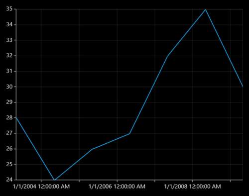

The following code example and screenshot show [`LabelsIntersectAction`](https://help.syncfusion.com/cr/uwp/Syncfusion.UI.Xaml.Charts.ChartAxis.html#Syncfusion_UI_Xaml_Charts_ChartAxis_LabelsIntersectAction) set to [`MultipleRows`](https://help.syncfusion.com/cr/uwp/Syncfusion.UI.Xaml.Charts.AxisLabelsIntersectAction.html#Syncfusion_UI_Xaml_Charts_AxisLabelsIntersectAction_MultipleRows).





  <syncfusion:SfChart.PrimaryAxis>

    <syncfusion:DateTimeAxis   LabelsIntersectAction="MultipleRows"  

           FontSize="16"  />

    </syncfusion:SfChart.PrimaryAxis>





chart.PrimaryAxis = new CategoryAxis()
{

    FontSize = 16,

    LabelsIntersectAction = AxisLabelsIntersectAction.MultipleRows

};





## Custom Labels

SfChart allows user to define the labels for the axis. For defining the axis label you have to set the [`LabelContent`](https://help.syncfusion.com/cr/uwp/Syncfusion.UI.Xaml.Charts.ChartAxisLabel.html#Syncfusion_UI_Xaml_Charts_ChartAxisLabel_LabelContent) and [`Position`](https://help.syncfusion.com/cr/uwp/Syncfusion.UI.Xaml.Charts.ChartAxisLabel.html#Syncfusion_UI_Xaml_Charts_ChartAxisLabel_Position) properties.You can define the labels using [`CustomLabels`](https://help.syncfusion.com/cr/uwp/Syncfusion.UI.Xaml.Charts.ChartAxis.html#Syncfusion_UI_Xaml_Charts_ChartAxis_CustomLabels) property as demonstrated in the following code snippet.





<syncfusion:SfChart.PrimaryAxis>

<syncfusion:CategoryAxis >

<syncfusion:CategoryAxis.CustomLabels>

<syncfusion:ChartAxisLabel Position="0" LabelContent="0-1"/>

<syncfusion:ChartAxisLabel Position="1" LabelContent="1-2"/>

<syncfusion:ChartAxisLabel Position="2" LabelContent="2-3"/>

<syncfusion:ChartAxisLabel Position="3" LabelContent="3-4"/>

<syncfusion:ChartAxisLabel Position="4" LabelContent="4-5"/>

<syncfusion:ChartAxisLabel Position="5" LabelContent="5-5"/>

</syncfusion:CategoryAxis.CustomLabels>

</syncfusion:CategoryAxis>

</syncfusion:SfChart.PrimaryAxis>





CategoryAxis axis = new CategoryAxis();

axis.CustomLabels.Add(new ChartAxisLabel() { Position = 0, LabelContent = "0-1" });

axis.CustomLabels.Add(new ChartAxisLabel() { Position = 1, LabelContent = "1-2" });

axis.CustomLabels.Add(new ChartAxisLabel() { Position = 2, LabelContent = "2-3" });

axis.CustomLabels.Add(new ChartAxisLabel() { Position = 3, LabelContent = "3-4" });

axis.CustomLabels.Add(new ChartAxisLabel() { Position = 4, LabelContent = "4-5" });

axis.CustomLabels.Add(new ChartAxisLabel() { Position = 5, LabelContent = "5-5" });

chart.PrimaryAxis = axis;





You can also directly bind the collection of labels to the [`LabelsSource`](https://help.syncfusion.com/cr/uwp/Syncfusion.UI.Xaml.Charts.ChartAxis.html#Syncfusion_UI_Xaml_Charts_ChartAxis_LabelsSource) property for defining custom labels. The following code example demonstrates how to define a label collection in code behind and binding the property in XAML page.





<syncfusion:SfChart.PrimaryAxis>

<syncfusion:CategoryAxis LabelsSource="{Binding Labels}" ContentPath="Content" PositionPath="Position">

</syncfusion:CategoryAxis>

</syncfusion:SfChart.PrimaryAxis>





chart.PrimaryAxis = new CategoryAxis()
{

    ContentPath ="Content",

    PositionPath = "Position",

    LabelsSource = Labels

};

public List<LabelItem> Labels { get; set; }

Labels = new List<LabelItem>
{

    new LabelItem() {Position=0, Content = "0-1"},

    new LabelItem() {Position=1, Content = "1-2"},

    new LabelItem() {Position=2, Content = "2-3"},

    new LabelItem() {Position=3, Content = "3-4"},

    new LabelItem() {Position=4, Content = "4-5"},

    new LabelItem() {Position=5, Content = "5-6"},

    new LabelItem() {Position=6, Content = "6-7"},

    new LabelItem() {Position=7, Content = "7-8"},

};

public class LabelItem
{

    public string Content { get; set; }

    public int Position { get; set; }

}





## Add units to labels

You can customize the axis label to display its measuring units by adding a prefix or a suffix. This feature can be achieved using the [`PrefixLabelTemplate`](https://help.syncfusion.com/cr/uwp/Syncfusion.UI.Xaml.Charts.ChartAxis.html#Syncfusion_UI_Xaml_Charts_ChartAxis_PrefixLabelTemplate) and [`PostfixLabelTemplate`](https://help.syncfusion.com/cr/uwp/Syncfusion.UI.Xaml.Charts.ChartAxis.html#Syncfusion_UI_Xaml_Charts_ChartAxis_PostfixLabelTemplate) properties.

The following code example and screenshot demonstrate the usage of [`PrefixLabelTemplate`](https://help.syncfusion.com/cr/uwp/Syncfusion.UI.Xaml.Charts.ChartAxis.html#Syncfusion_UI_Xaml_Charts_ChartAxis_PrefixLabelTemplate).





  <DataTemplate x:Key="yPrefix">

     <TextBlock FontSize="15" VerticalAlignment="Center" Text="$"/>

  </DataTemplate>

<syncfusion:SfChart.SecondaryAxis>

       <syncfusion:NumericalAxis FontSize="16" Minimum="0" Maximum="1000" PrefixLabelTemplate="{StaticResource yPrefix}" />

</syncfusion:SfChart.SecondaryAxis>





chart.SecondaryAxis = new NumericalAxis()
{

    FontSize = 16,

    Minimum = 0,

    Maximum = 1000,

    PrefixLabelTemplate = this.Resources["yPrefix"] as DataTemplate

};





The following code example and screenshot demonstrate the usage of [`PostfixLabelTemplate`](https://help.syncfusion.com/cr/uwp/Syncfusion.UI.Xaml.Charts.ChartAxis.html#Syncfusion_UI_Xaml_Charts_ChartAxis_PostfixLabelTemplate).





  <DataTemplate x:Key="yPostfix">

       <TextBlock FontSize="8" VerticalAlignment="Top" Text="0"/>

 </DataTemplate>

<chart:SfChart.SecondaryAxis>

       <chart:NumericalAxis FontSize="16" Minimum="0" Maximum="100" PostfixLabelTemplate="{StaticResource yPostfix}" />

</chart:SfChart.SecondaryAxis>





chart.SecondaryAxis = new NumericalAxis()
{

    FontSize = 16,

    Minimum = 0,

    Maximum = 1000,

    PostfixLabelTemplate = this.Resources["yPrefix"] as DataTemplate

};





## Formatting axis labels

[`SfChart`](https://help.syncfusion.com/cr/uwp/Syncfusion.UI.Xaml.Charts.SfChart.html) provides the [`LabelFormat`](https://help.syncfusion.com/cr/uwp/Syncfusion.UI.Xaml.Charts.ChartAxis.html#Syncfusion_UI_Xaml_Charts_ChartAxis_LabelFormat) property for defining the custom formatting for the axis labels. This property supports all standard formatting type of numerical and date time values.





 <syncfusion:SfChart.PrimaryAxis>

      <syncfusion:DateTimeAxis LabelFormat="hh:mm tt" IntervalType="Hours" Interval="1" Header="Computer sales" />

</syncfusion:SfChart.PrimaryAxis>

<syncfusion:SfChart.SecondaryAxis>

      <syncfusion:NumericalAxis Header="Quantity Sold" LabelFormat="##.00"/>

</syncfusion:SfChart.SecondaryAxis>





chart.PrimaryAxis = new DateTimeAxis()
{

    Header = "Computer sales",

    IntervalType = DateTimeIntervalType.Hours,

    Interval = 1,

    LabelFormat = "hh:mm:tt"

};

chart.SecondaryAxis = new NumericalAxis()
{

    Header = "Quantity Sold",

    LabelFormat ="##:00"

};





## Origin Customization

SfChart allows you to customize the origin. By default the axis will be rendered with(0,0) as origin in x and y-axes.

### ShowAxisNextToOrigin

The [`ShowAxisNextToOrigin`](https://help.syncfusion.com/cr/uwp/Syncfusion.UI.Xaml.Charts.ChartAxis.html#Syncfusion_UI_Xaml_Charts_ChartAxis_ShowAxisNextToOrigin) property is used to move the axis line to the origin value in [`Origin`](https://help.syncfusion.com/cr/uwp/Syncfusion.UI.Xaml.Charts.ChartAxis.html#Syncfusion_UI_Xaml_Charts_ChartAxis_Origin) property based on x or y-axis. The following code example demonstrates how to shift the axis in the origin value in numerical axis.





<syncfusion:SfChart.SecondaryAxis>

<syncfusion:NumericalAxis Origin="3" ShowAxisNextToOrigin="True">

</syncfusion:NumericalAxis>

</syncfusion:SfChart.SecondaryAxis>





chart.SecondaryAxis = new NumericalAxis()
{

    Origin = 3,

    ShowAxisNextToOrigin = true 
    
};





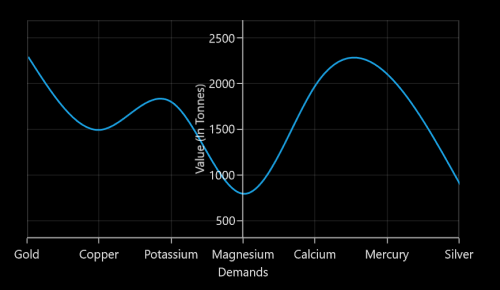

## Styling Header and Labels

[`SfChart`](https://help.syncfusion.com/cr/uwp/Syncfusion.UI.Xaml.Charts.SfChart.html) provides support to customize the axis [`Header`](https://help.syncfusion.com/cr/uwp/Syncfusion.UI.Xaml.Charts.ChartAxis.html#Syncfusion_UI_Xaml_Charts_ChartAxis_Header) and label. The following APIs are used to customize the header and label.

[`HeaderStyle`](https://help.syncfusion.com/cr/uwp/Syncfusion.UI.Xaml.Charts.ChartAxis.html#Syncfusion_UI_Xaml_Charts_ChartAxis_HeaderStyle) and [`LabelStyle`](https://help.syncfusion.com/cr/uwp/Syncfusion.UI.Xaml.Charts.ChartAxis.html#Syncfusion_UI_Xaml_Charts_ChartAxis_LabelStyle)

<table>
<tr>
<th>
Property</th><th>
Definition</th></tr>
<tr>
<td>
HeaderStyle</td><td>
Gets or sets the style for the axis header. The header’s {{'[`Foreground`](https://help.syncfusion.com/cr/uwp/Syncfusion.UI.Xaml.Charts.LabelStyle.html#Syncfusion_UI_Xaml_Charts_LabelStyle_Foreground)'| markdownify }}, {{'[`FontSize`](https://help.syncfusion.com/cr/uwp/Syncfusion.UI.Xaml.Charts.LabelStyle.html#Syncfusion_UI_Xaml_Charts_LabelStyle_FontSize)'| markdownify }} and {{'[`FontFamily`](https://help.syncfusion.com/cr/uwp/Syncfusion.UI.Xaml.Charts.LabelStyle.html#Syncfusion_UI_Xaml_Charts_LabelStyle_FontFamily)'| markdownify }} are customized using this property.</td></tr>
<tr>
<td>
LabelStyle</td><td>
Gets or sets the style for the axis labels. The label’s {{'[`Foreground`](https://help.syncfusion.com/cr/uwp/Syncfusion.UI.Xaml.Charts.LabelStyle.html#Syncfusion_UI_Xaml_Charts_LabelStyle_Foreground)'| markdownify }}, {{'[`FontSize`](https://help.syncfusion.com/cr/uwp/Syncfusion.UI.Xaml.Charts.LabelStyle.html#Syncfusion_UI_Xaml_Charts_LabelStyle_FontSize)'| markdownify }} and {{'[`FontFamily`](https://help.syncfusion.com/cr/uwp/Syncfusion.UI.Xaml.Charts.LabelStyle.html#Syncfusion_UI_Xaml_Charts_LabelStyle_FontFamily)'| markdownify }} are customized using this property.</td></tr>
</table>





<syncfusion:SfChart Height="250" Width="500">

            < syncfusion:SfChart.PrimaryAxis>

                < syncfusion:CategoryAxis  Header="City">

                    < syncfusion:CategoryAxis.LabelStyle>

                        < syncfusion:LabelStyle FontSize="10" FontFamily="Arial" Foreground="Green" ></syncfusion:LabelStyle>

                    </syncfusion:CategoryAxis.LabelStyle>

                </syncfusion:CategoryAxis>

            </syncfusion:SfChart.PrimaryAxis>

            <syncfusion:SfChart.SecondaryAxis>

                <syncfusion:NumericalAxis x:Name="axis" Header="Year" >

                    <syncfusion:NumericalAxis.LabelStyle >

                        <syncfusion:LabelStyle FontSize="10" Foreground="Green" FontFamily="Arial" ></syncfusion:LabelStyle>

                    </syncfusion:NumericalAxis.LabelStyle>

                </syncfusion:NumericalAxis>

            </syncfusion:SfChart.SecondaryAxis>

            <syncfusion:LineSeries XBindingPath="City" YBindingPath="Year1950" ItemsSource="{Binding PopulationPercent}"></syncfusion:LineSeries>

        </syncfusion:SfChart>





SfChart chart = new SfChart();

LabelStyle labelStyle;

chart.PrimaryAxis = new CategoryAxis() { Header = "City" };

labelStyle = new LabelStyle()
{

    FontSize = 10,

    FontFamily = new FontFamily("Arial"),

    Foreground = new SolidColorBrush(Colors.Green)

};

chart.PrimaryAxis.LabelStyle = labelStyle;

chart.SecondaryAxis = new NumericalAxis()
{

    Header = "Year",

};

chart.SecondaryAxis.LabelStyle = labelStyle;

LineSeries series = new LineSeries()
{

    ItemsSource = new ViewModel().PopulationPercent,

    XBindingPath = "City",

    YBindingPath = "Year1950"

};

chart.Series.Add(series);





**Axis Label Border**

[`ChartAxis`](https://help.syncfusion.com/cr/uwp/Syncfusion.UI.Xaml.Charts.ChartAxis.html) provides support to place border around its label.To place the border around axis, we should enable  [`ShowLabelBorder`](https://help.syncfusion.com/cr/uwp/Syncfusion.UI.Xaml.Charts.ChartAxisBase2D.html#Syncfusion_UI_Xaml_Charts_ChartAxisBase2D_ShowLabelBorder) property of axis and it can be set as shown in the below code snippet,





<syncfusion:SfChart.PrimaryAxis>

<syncfusion:CategoryAxis ShowLabelBorder="True"/>

</syncfusion:SfChart.PrimaryAxis>

<syncfusion:SfChart.SecondaryAxis>

<syncfusion:NumericalAxis ShowLabelBorder="True"  />       

</syncfusion:SfChart.SecondaryAxis>





chart.PrimaryAxis = new CategoryAxis()
            
{
     ShowLabelBorder = true,                
};

chart.SecondaryAxis = new NumericalAxis()

{
    ShowLabelBorder = true
};





The border color and width can be customized with [`LabelBorderBrush`](https://help.syncfusion.com/cr/uwp/Syncfusion.UI.Xaml.Charts.ChartAxisBase2D.html#Syncfusion_UI_Xaml_Charts_ChartAxisBase2D_LabelBorderBrush) and [`LabelBorderWidth`](https://help.syncfusion.com/cr/uwp/Syncfusion.UI.Xaml.Charts.ChartAxisBase2D.html#Syncfusion_UI_Xaml_Charts_ChartAxisBase2D_LabelBorderWidth) properties of chart axis and it can be set as shown in the below code snippet,





<syncfusion:SfChart.PrimaryAxis>

<syncfusion:CategoryAxis LabelBorderWidth="3" ShowLabelBorder="True" LabelBorderBrush="Red"/>

</syncfusion:SfChart.PrimaryAxis>

<syncfusion:SfChart.SecondaryAxis>

</syncfusion:NumericalAxis ShowLabelBorder="True"  LabelBorderWidth="3" LabelBorderBrush="Red"/>       

</syncfusion:SfChart.SecondaryAxis>





chart.PrimaryAxis = new CategoryAxis()
            
{
    ShowLabelBorder = true,  

    LabelBorderWidth = 3,

    LabelBorderBrush = new SolidColorBrush(Colors.Red)
           
};

chart.SecondaryAxis = new NumericalAxis()

{
       ShowLabelBorder = true,

       LabelBorderWidth = 3,

       LabelBorderBrush = new SolidColorBrush(Colors.Red),
               
};





## GridLines and TickLines 

### GridLines

By default, gridlines are automatically added to the [`ChartAxis`](https://help.syncfusion.com/cr/uwp/Syncfusion.UI.Xaml.Charts.ChartAxis.html) in its defined intervals. [`SfChart`](https://help.syncfusion.com/cr/uwp/Syncfusion.UI.Xaml.Charts.SfChart.html) supports customization of gridline. You can control the visibility of the gridlines using the [`ShowGridLines`](https://help.syncfusion.com/cr/uwp/Syncfusion.UI.Xaml.Charts.ChartAxis.html#Syncfusion_UI_Xaml_Charts_ChartAxis_ShowGridLines) property. 

The following code example and screenshot show [`ShowGridLines`](https://help.syncfusion.com/cr/uwp/Syncfusion.UI.Xaml.Charts.ChartAxis.html#Syncfusion_UI_Xaml_Charts_ChartAxis_ShowGridLines) set to False.





  <syncfusion:SfChart.PrimaryAxis>

    <syncfusion:CategoryAxis ShowGridLines="False" 

           FontSize="16"  />

    </syncfusion:SfChart.PrimaryAxis>





chart.PrimaryAxis = new CategoryAxis()
{

    ShowGridLines = false,

    FontSize = 16

};





### Ticklines

Ticklines are small markers extending from the gridlines, used to indicate the axis scaling. Tickline can be positioned either inside or outside of the axis line.

The following code example and screenshot illustrate major and small ticklines set to [`Inside`](https://help.syncfusion.com/cr/uwp/Syncfusion.UI.Xaml.Charts.AxisElementPosition.html).





   <syncfusion:SfChart.PrimaryAxis>

<syncfusion:NumericalAxis LabelsPosition="Inside" TickLineSize="10" SmallTickLineSize="5" TickLinesPosition="Inside" SmallTickLinesPosition="Inside" SmallTicksPerInterval="2"  FontSize="16"  />

            </syncfusion:SfChart.PrimaryAxis>





chart.PrimaryAxis = new NumericalAxis()
{

    LabelsPosition = AxisElementPosition.Inside,

    TickLineSize = 10,

    SmallTickLineSize = 5,

    TickLinesPosition = AxisElementPosition.Inside,

    SmallTickLinesPosition = AxisElementPosition.Inside,

    SmallTicksPerInterval = 2,

    FontSize = 16

};





You can customize the appearance of major gridline, minor gridlines and ticklines using the [`MajorTickLineStyle`](https://help.syncfusion.com/cr/uwp/Syncfusion.UI.Xaml.Charts.ChartAxis.html#Syncfusion_UI_Xaml_Charts_ChartAxis_MajorTickLineStyle), [`MinorTickLineStyle`](https://help.syncfusion.com/cr/uwp/Syncfusion.UI.Xaml.Charts.ChartAxis.html#Syncfusion_UI_Xaml_Charts_ChartAxis_MinorTickLineStyle), [`MajorGridLineStyle`](https://help.syncfusion.com/cr/uwp/Syncfusion.UI.Xaml.Charts.ChartAxis.html#Syncfusion_UI_Xaml_Charts_ChartAxis_MajorGridLineStyle) and [`MinorGridLineStyle`](https://help.syncfusion.com/cr/uwp/Syncfusion.UI.Xaml.Charts.ChartAxis.html#Syncfusion_UI_Xaml_Charts_ChartAxis_MinorGridLineStyle) properties. Also axis lines can be customized using [`AxisLineStyle`](https://help.syncfusion.com/cr/uwp/Syncfusion.UI.Xaml.Charts.ChartAxis.html#Syncfusion_UI_Xaml_Charts_ChartAxis_AxisLineStyle) as follows.





<syncfusion:SfChart>

   <syncfusion:SfChart.Resources>

                

                

                

                

                

  </syncfusion:SfChart.Resources>

  <syncfusion:SfChart.PrimaryAxis>

                <syncfusion:DateTimeAxis  MajorGridLineStyle="{StaticResource majorGridLineStyle }"

                    MinorGridLineStyle="{StaticResource minorGridLineStyle}"

                    MajorTickLineStyle="{StaticResource majorTickLineStyle}"

                    MinorTickLineStyle="{StaticResource minorTickLineStyle}"

                    AxisLineStyle="{StaticResource axisLineStyle}"       

                    SmallTicksPerInterval="1" TickLineSize="10"

                    SmallTickLineSize="6" LabelFormat="yyyy"

                   />

            </syncfusion:SfChart.PrimaryAxis>

            <syncfusion:SfChart.SecondaryAxis>

                <syncfusion:NumericalAxis MajorTickLineStyle="{StaticResource majorTickLineStyle}"

                      MajorGridLineStyle="{StaticResource majorGridLineStyle }"

                      MinorGridLineStyle="{StaticResource minorGridLineStyle}"

                      MinorTickLineStyle="{StaticResource minorTickLineStyle}"

                      AxisLineStyle="{StaticResource axisLineStyle}"       

                      SmallTicksPerInterval="1" TickLineSize="10"

                      SmallTickLineSize="5" HorizontalAlignment="Right"  

            </syncfusion:SfChart.SecondaryAxis>

            <syncfusion:FastLineBitmapSeries   XBindingPath="Date" YBindingPath="Value" >

            </syncfusion:FastLineBitmapSeries>

        </syncfusion:SfChart>





chart.PrimaryAxis = new DateTimeAxis()
{

    MajorGridLineStyle = chart.Resources[" majorGridLineStyle"] as Style,

    MinorGridLineStyle = chart.Resources["minorGridLineStyle"] as Style,

    MajorTickLineStyle = chart.Resources["majorTickLineStyle"] as Style,

    MinorTickLineStyle = chart.Resources["minorTickLineStyle"] as Style,

    AxisLineStyle = chart.Resources["axisLineStyle"] as Style,

    TickLineSize = 10,

    SmallTickLineSize = 6,

    SmallTicksPerInterval = 1,

    LabelFormat = "yyyy"

};

chart.SecondaryAxis = new NumericalAxis()
{

    MajorGridLineStyle = chart.Resources[" majorGridLineStyle"] as Style,

    MinorGridLineStyle = chart.Resources["minorGridLineStyle"] as Style,

    MajorTickLineStyle = chart.Resources["majorTickLineStyle"] as Style,

    MinorTickLineStyle = chart.Resources["minorTickLineStyle"] as Style,

    AxisLineStyle = chart.Resources["axisLineStyle"] as Style,

    TickLineSize = 10,

    SmallTickLineSize = 6,

    SmallTicksPerInterval = 1,

    HorizontalAlignment = HorizontalAlignment.Center

};

FastLineBitmapSeries series = new FastLineBitmapSeries()
{

    ItemsSource = new ViewModel().Data,

    XBindingPath = "Date",

    YBindingPath = "Value"

};

chart.Series.Add(series);





## Customize individual axis elements

The [`RangeStyles`](https://help.syncfusion.com/cr/uwp/Syncfusion.UI.Xaml.Charts.ChartAxis.html#Syncfusion_UI_Xaml_Charts_ChartAxis_RangeStyles) can be used to customize the gridlines, ticks and axis labels for a specific region of ChartAxis. The following properties are used to customize the specific range in an axis:

* [`Start`](https://help.syncfusion.com/cr/uwp/Syncfusion.UI.Xaml.Charts.ChartAxisRangeStyle.html#Syncfusion_UI_Xaml_Charts_ChartAxisRangeStyle_Start) - Sets the start range of an axis.
* [`End`](https://help.syncfusion.com/cr/uwp/Syncfusion.UI.Xaml.Charts.ChartAxisRangeStyle.html#Syncfusion_UI_Xaml_Charts_ChartAxisRangeStyle_End) - Sets the end range of an axis.
* [`MajorGridLineStyle`](https://help.syncfusion.com/cr/uwp/Syncfusion.UI.Xaml.Charts.ChartAxisRangeStyle.html#Syncfusion_UI_Xaml_Charts_ChartAxisRangeStyle_MajorGridLineStyle) - Customizes the major grid lines of an axis.
* [`MinorGridLineStyle`](https://help.syncfusion.com/cr/uwp/Syncfusion.UI.Xaml.Charts.ChartAxisRangeStyle.html#Syncfusion_UI_Xaml_Charts_ChartAxisRangeStyle_MinorGridLineStyle)  -  Customizes the minor grid lines of an axis.
* [`MajorTickStyle`](https://help.syncfusion.com/cr/uwp/Syncfusion.UI.Xaml.Charts.ChartAxisRangeStyle.html#Syncfusion_UI_Xaml_Charts_ChartAxisRangeStyle_MajorTickLineStyle) - Customizes the major tick lines of an axis.
* [`MinorTickStyle`](https://help.syncfusion.com/cr/uwp/Syncfusion.UI.Xaml.Charts.ChartAxisRangeStyle.html#Syncfusion_UI_Xaml_Charts_ChartAxisRangeStyle_MinorTickLineStyle) - Customizes the minor tick lines of an axis.
* [`LabelStyle`](https://help.syncfusion.com/cr/uwp/Syncfusion.UI.Xaml.Charts.ChartAxisRangeStyle.html#Syncfusion_UI_Xaml_Charts_ChartAxisRangeStyle_LabelStyle) -  Customizes the axis labels for a specific range.





  <syncfusion:SfChart.Resources>

         

         

</syncfusion:SfChart.Resources>

<syncfusion:SfChart.SecondaryAxis>  

    <syncfusion:NumericalAxis MajorGridLineStyle= "{StaticResource lineStyle}" MajorTickLineStyle="{StaticResource lineStyle}">  
        <syncfusion:NumericalAxis.LabelStyle>
            <syncfusion:LabelStyle Foreground="Green"/>
        </syncfusion:NumericalAxis.LabelStyle>
        <syncfusion:NumericalAxis.RangeStyles>
                <syncfusion:ChartAxisRangeStyleCollection>
                      <syncfusion:ChartAxisRangeStyle Start="18" End="22" MajorGridLineStyle= "{StaticResource RangeLineStyle}" MajorTickLineStyle="{StaticResource RangeLineStyle}">                     <syncfusion:ChartAxisRangeStyle.LabelStyle>
            <syncfusion:LabelStyle Foreground="RoyalBlue" />
          </syncfusion:ChartAxisRangeStyle.LabelStyle>
                     </syncfusion:ChartAxisRangeStyle>
                </syncfusion:ChartAxisRangeStyleCollection>
            </syncfusion:NumericalAxis.RangeStyles>
    </syncfusion:NumericalAxis>

</syncfusion:SfChart.SecondaryAxis>





            NumericalAxis secondaryAxis = new NumericalAxis();

            secondaryAxis.MajorGridLineStyle = chart.Resources["lineStyle"] as Style ;

            secondaryAxis.MajorTickLineStyle = chart.Resources["lineStyle"] as Style;

            secondaryAxis.LabelStyle.Foreground = new SolidColorBrush(Colors.Green);

            ChartAxisRangeStyleCollection axisRangeStyles = new ChartAxisRangeStyleCollection();

            ChartAxisRangeStyle rangeStyle = new ChartAxisRangeStyle() { Start = 18, End = 22 };

            rangeStyle.MajorGridLineStyle = chart.Resources["RangeLineStyle"] as Style ;

            rangeStyle.LabelStyle = new LabelStyle();

            rangeStyle.LabelStyle.Foreground = new SolidColorBrush(Colors.RoyalBlue);

            rangeStyle.MajorTickLineStyle = chart.Resources["RangeLineStyle"] as Style;
            
            axisRangeStyles.Add(rangeStyle);

            secondaryAxis.RangeStyles = axisRangeStyles;

       chart.SecondaryAxis = secondaryAxis;
            





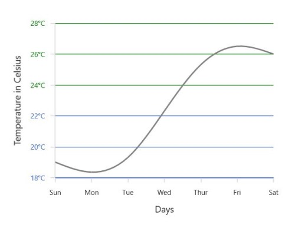

## Multi-level Labels

[`Axis`](https://help.syncfusion.com/uwp/charts/axis) can be customized with multiple levels of label by using its [`MultiLevelLabels`](https://help.syncfusion.com/cr/uwp/Syncfusion.UI.Xaml.Charts.ChartAxisBase2D.html#Syncfusion_UI_Xaml_Charts_ChartAxisBase2D_MultiLevelLabels) property. These labels are placed based on the provided [`Start`](https://help.syncfusion.com/cr/uwp/Syncfusion.UI.Xaml.Charts.ChartMultiLevelLabel.html#Syncfusion_UI_Xaml_Charts_ChartMultiLevelLabel_Start) and [`End`](https://help.syncfusion.com/cr/uwp/Syncfusion.UI.Xaml.Charts.ChartMultiLevelLabel.html#Syncfusion_UI_Xaml_Charts_ChartMultiLevelLabel_End) range values and we can add any number of labels to an axis. The below code snippet shows how to set a multilevel label,





<chart:SfChart.PrimaryAxis>

<chart:CategoryAxis ShowLabelBorder="True">

<chart:CategoryAxis.MultiLevelLabels>

<chart:ChartMultiLevelLabel Start="-0.5" End="2.5" Text="Quarter 1" />

</chart:CategoryAxis.MultiLevelLabels>

</chart:CategoryAxis>

</chart:SfChart.PrimaryAxis>





chart.PrimaryAxis =  new CategoryAxis()
            
{
     ShowLabelBorder = true,
            
};
            
ChartMultiLevelLabel label = new ChartMultiLevelLabel()
           
{
 
       Start = -0.5,

       End = 2.5,

       Text = "Quarter 1"

};

chart.PrimaryAxis.MultiLevelLabels.Add(label);





**Regarding** **Start** **and** **End** **Property**

[`Start`](https://help.syncfusion.com/cr/uwp/Syncfusion.UI.Xaml.Charts.ChartMultiLevelLabel.html#Syncfusion_UI_Xaml_Charts_ChartMultiLevelLabel_Start) and [`End`](https://help.syncfusion.com/cr/uwp/Syncfusion.UI.Xaml.Charts.ChartMultiLevelLabel.html#Syncfusion_UI_Xaml_Charts_ChartMultiLevelLabel_End) properties of [`ChartMultiLevelLabel`](https://help.syncfusion.com/cr/uwp/Syncfusion.UI.Xaml.Charts.ChartMultiLevelLabel.html) are type of objects, we can provide the start and end values for a multi-level label based on its Axis type. It is described  in the following table,

<table>
<tr>
<th>S.No</th>
<th>Axis Type</th>
<th>Start/End value</th>
<th>Example</th>
</tr>
<tr>
<td>1</td>
<td>CategoryAxis</td>
<td>Index-Based</td>
<td>Start=0(zeroth index position) End = 1(first index position)</td>
</tr>
<tr>
<td>2</td>
<td>DateTimeCategoryAxis</td>
<td>Index-Based</td>
<td>Start = 0(zeroth index position) End = 1(first index position)</td>
</tr>
<tr>
<td>3</td>
<td>NumericalAxis</td>
<td>Value-Based</td>
<td>Start= 5( Value) End= 10( Value)</td>
</tr>
<tr>
<td>4</td>
<td>LogarithmicAxis</td>
<td>Value-Based</td>
<td>Start= 10(Value) End= 1000(Value)</td>
</tr>
<tr>
<td>5</td>
<td>DateTimeAxis</td>
<td>Value-Based</td>
<td>Start = "2017/01/01" End="2017/01/02"</td>
</tr>
<tr>
<td>6</td>
<td>TimeSpanAxis</td>
<td>Value-Based</td>
<td>Start = "00:00:01" End="00:00:05"</td>
</tr>
</table>

**Customizing** **multi-level** **labels**

**Border** **Customization**

[`ChartMultiLevelLabel's`](https://help.syncfusion.com/cr/uwp/Syncfusion.UI.Xaml.Charts.ChartMultiLevelLabel.html) border width and color can be customized with [`LabelBorderWidth`](https://help.syncfusion.com/cr/uwp/Syncfusion.UI.Xaml.Charts.ChartAxisBase2D.html#Syncfusion_UI_Xaml_Charts_ChartAxisBase2D_LabelBorderWidth) and [`LabelBorderBrush`](https://help.syncfusion.com/cr/uwp/Syncfusion.UI.Xaml.Charts.ChartAxisBase2D.html#Syncfusion_UI_Xaml_Charts_ChartAxisBase2D_LabelBorderBrush) properties of chart axis.It can be set as shown in the below code snippet,





<chart:SfChart.PrimaryAxis>

<chart:CategoryAxis  LabelBorderBrush="Red" LabelBorderWidth="3"  ShowLabelBorder="True">

<chart:CategoryAxis.MultiLevelLabels>

<chart:ChartMultiLevelLabel Start="-0.5" End="2.5" Text="Quarter 1"  />

</chart:CategoryAxis.MultiLevelLabels>

</chart:CategoryAxis>

</chart:SfChart.PrimaryAxis>





chart.PrimaryAxis =  new CategoryAxis()
            
{
    LabelBorderWidth = 3,

    ShowLabelBorder = true,

    LabelBorderBrush = new SolidColorBrush(Colors.Red),
            
};
            
ChartMultiLevelLabel label = new ChartMultiLevelLabel()
           
{
 
       Start = -0.5,

       End = 2.5,

       Text = "Quarter 1",

       BorderWidth = 4

};

chart.PrimaryAxis.MultiLevelLabels.Add(label);





**Border** **Type**

[`ChartAxis`](https://help.syncfusion.com/cr/uwp/Syncfusion.UI.Xaml.Charts.ChartAxis.html) provides support to various types of border for [`ChartMultiLevelLabels`](https://help.syncfusion.com/cr/uwp/Syncfusion.UI.Xaml.Charts.ChartMultiLevelLabel.html) and it can be applied by using its [`MultiLevelLabelsBorderType`](https://help.syncfusion.com/cr/uwp/Syncfusion.UI.Xaml.Charts.ChartAxisBase2D.html#Syncfusion_UI_Xaml_Charts_ChartAxisBase2D_MultiLevelLabelsBorderType) property.The default [`MultiLevelLabelsBorderType`](https://help.syncfusion.com/cr/uwp/Syncfusion.UI.Xaml.Charts.ChartAxisBase2D.html#Syncfusion_UI_Xaml_Charts_ChartAxisBase2D_MultiLevelLabelsBorderType) is [`Rectangle`](https://help.syncfusion.com/cr/uwp/Syncfusion.UI.Xaml.Charts.BorderType.html#Syncfusion_UI_Xaml_Charts_BorderType_Rectangle). The another supported border types are [`Brace`](https://help.syncfusion.com/cr/uwp/Syncfusion.UI.Xaml.Charts.BorderType.html#Syncfusion_UI_Xaml_Charts_BorderType_Brace),[`None`](https://help.syncfusion.com/cr/uwp/Syncfusion.UI.Xaml.Charts.BorderType.html#Syncfusion_UI_Xaml_Charts_BorderType_None) and [`WithoutTopAndBottomBorder`](https://help.syncfusion.com/cr/uwp/Syncfusion.UI.Xaml.Charts.BorderType.html#Syncfusion_UI_Xaml_Charts_BorderType_WithoutTopAndBottomBorder).

**Rectangle**





<chart:SfChart.PrimaryAxis>

<chart:CategoryAxis  ShowLabelBorder="True">

<chart:CategoryAxis.MultiLevelLabels>

<chart:ChartMultiLevelLabel Start="-0.5" End="2.5"  Text="Quarter 1" />

<chart:ChartMultiLevelLabel Start="2.5" End="5.5" Text="Quarter 2"/>

<chart:ChartMultiLevelLabel Start="5.5" End="8.5" Text="Quarter 3"/>

<chart:ChartMultiLevelLabel Start="8.5" End="11.5" Text="Quarter 4"/>

</chart:CategoryAxis.MultiLevelLabels>

</chart:CategoryAxis>

</chart:SfChart.PrimaryAxis>

<chart:SfChart.SecondaryAxis>

<chart:NumericalAxis  ShowLabelBorder="True">
                    
<chart:NumericalAxis.MultiLevelLabels>
                    
<chart:ChartMultiLevelLabel Start="32" End="36"  Text="Low"/>

<chart:ChartMultiLevelLabel Start="36" End="42" Text="Medium"/>

<chart:ChartMultiLevelLabel Start="42" End="48" Text="High"/>
                    
</chart:NumericalAxis.MultiLevelLabels>

</chart:NumericalAxis>

</chart:SfChart.SecondaryAxis>





chart.PrimaryAxis =  new CategoryAxis()
            
{
     ShowLabelBorder = true,          
};

ChartMultiLevelLabel label1 = new ChartMultiLevelLabel()
            
{
                
     Start = -0.5,

     End = 2.5,

     Text = "Quarter 1",
            
};

chart.PrimaryAxis.MultiLevelLabels.Add(label1);

ChartMultiLevelLabel label2 = new ChartMultiLevelLabel()
           
{
    
    Start = 2.5,
                
    End = 5.5,
                
    Text = "Quarter 2"
            
};

chart.PrimaryAxis.MultiLevelLabels.Add(label2);

ChartMultiLevelLabel label3 = new ChartMultiLevelLabel()

{
     
    Start = 5.5,
                
    End = 8.5,
                
    Text = "Quarter 3"
            
};

chart.PrimaryAxis.MultiLevelLabels.Add(label3);

ChartMultiLevelLabel label4 = new ChartMultiLevelLabel()

{
     Start = 8.5,
               
     End = 11.5,
                
     Text = "Quarter 4"
            
};

chart.PrimaryAxis.MultiLevelLabels.Add(label4);

chart.SecondaryAxis = new NumericalAxis()

{
      ShowLabelBorder = true,
};

ChartMultiLevelLabel label5 = new ChartMultiLevelLabel()
            
{
                
     Start = 32,
                
     End = 36,
     
     Text = "Low"
            
};
            
chart.SecondaryAxis.MultiLevelLabels.Add(label5);
            
ChartMultiLevelLabel label6 = new ChartMultiLevelLabel()

{
    Start = 36,
                
    End = 42,
    
    Text = "Medium"
};

chart.SecondaryAxis.MultiLevelLabels.Add(label6);

ChartMultiLevelLabel label7 = new ChartMultiLevelLabel()

{
     Start = 42,
     
     End = 48,
    
     Text = "High"
};

chart.SecondaryAxis.MultiLevelLabels.Add(label7);





**Brace**





<chart:SfChart.PrimaryAxis>

<chart:CategoryAxis MultiLevelLabelsBorderType="Brace" ShowLabelBorder="True">

<chart:CategoryAxis.MultiLevelLabels>

<chart:ChartMultiLevelLabel Start="-0.5" End="2.5"  Text="Quarter 1"  />

<chart:ChartMultiLevelLabel Start="2.5" End="5.5" Text="Quarter 2"  />

<chart:ChartMultiLevelLabel Start="5.5" End="8.5" Text="Quarter 3"  />

<chart:ChartMultiLevelLabel Start="8.5" End="11.5" Text="Quarter 4" />

</chart:CategoryAxis.MultiLevelLabels>

</chart:CategoryAxis>

</chart:SfChart.PrimaryAxis>

<chart:SfChart.SecondaryAxis>

<chart:NumericalAxis MultiLevelLabelsBorderType="Brace" ShowLabelBorder="True">
                    
<chart:NumericalAxis.MultiLevelLabels>
                    
<chart:ChartMultiLevelLabel Start="32" End="36"  Text="Low" />

<chart:ChartMultiLevelLabel Start="36" End="42" Text="Medium"/>

<chart:ChartMultiLevelLabel Start="42" End="48" Text="High" />
                    
</chart:NumericalAxis.MultiLevelLabels>

</chart:NumericalAxis>

</chart:SfChart.SecondaryAxis>





chart.PrimaryAxis =  new CategoryAxis()
            
{
   ShowLabelBorder = true,
  
   MultiLevelLabelsBorderType = BorderType.Brace
            
};

ChartMultiLevelLabel label1 = new ChartMultiLevelLabel()
            
{
                
     Start = -0.5,

     End = 2.5,

     Text = "Quarter 1",
};

chart.PrimaryAxis.MultiLevelLabels.Add(label1);

ChartMultiLevelLabel label2 = new ChartMultiLevelLabel()
           
{
    
    Start = 2.5,
                
    End = 5.5,
                
    Text = "Quarter 2",
};

chart.PrimaryAxis.MultiLevelLabels.Add(label2);

ChartMultiLevelLabel label3 = new ChartMultiLevelLabel()

{
     
    Start = 5.5,
                
    End = 8.5,
                
    Text = "Quarter 3",
            
};

chart.PrimaryAxis.MultiLevelLabels.Add(label3);

ChartMultiLevelLabel label4 = new ChartMultiLevelLabel()

{
     Start = 8.5,
               
     End = 11.5,
                
     Text = "Quarter 4",
            
};

chart.PrimaryAxis.MultiLevelLabels.Add(label4);

chart.SecondaryAxis = new NumericalAxis()

{
   ShowLabelBorder = true,

   MultiLevelLabelsBorderType = BorderType.Brace
};

ChartMultiLevelLabel label5 = new ChartMultiLevelLabel()
            
{
                
     Start = 32,
                
     End = 36,
     
     Text = "Low",
            
};
            
chart.SecondaryAxis.MultiLevelLabels.Add(label5);
            
ChartMultiLevelLabel label6 = new ChartMultiLevelLabel()

{
    Start = 36,
                
    End = 42,
    
    Text = "Medium",
};

chart.SecondaryAxis.MultiLevelLabels.Add(label6);

ChartMultiLevelLabel label7 = new ChartMultiLevelLabel()

{
     Start = 42,
     
     End = 48,
    
     Text = "High",
};

chart.SecondaryAxis.MultiLevelLabels.Add(label7);





**None**





<chart:SfChart.PrimaryAxis  MultiLevelLabelsBorderType="None" ShowLabelBorder="True">

<chart:CategoryAxis>

<chart:CategoryAxis.MultiLevelLabels>

<chart:ChartMultiLevelLabel Start="-0.5" End="2.5"  Text="Quarter 1" />

<chart:ChartMultiLevelLabel Start="2.5" End="5.5" Text="Quarter 2" />

<chart:ChartMultiLevelLabel Start="5.5" End="8.5" Text="Quarter 3" />

<chart:ChartMultiLevelLabel Start="8.5" End="11.5" Text="Quarter 4" />

</chart:CategoryAxis.MultiLevelLabels>

</chart:CategoryAxis>

</chart:SfChart.PrimaryAxis>

<chart:SfChart.SecondaryAxis>

<chart:NumericalAxis MultiLevelLabelsBorderType="None" ShowLabelBorder="True">
                    
<chart:NumericalAxis.MultiLevelLabels>
                    
<chart:ChartMultiLevelLabel Start="32" End="36"  Text="Low" />

<chart:ChartMultiLevelLabel Start="36" End="42" Text="Medium" />

<chart:ChartMultiLevelLabel Start="42" End="48" Text="High" />
                    
</chart:NumericalAxis.MultiLevelLabels>

</chart:NumericalAxis>

</chart:SfChart.SecondaryAxis>





chart.PrimaryAxis =  new CategoryAxis()
            
{
    ShowLabelBorder = true,          

    MultiLevelLabelsBorderType = BorderType.None
            
};

ChartMultiLevelLabel label1 = new ChartMultiLevelLabel()
            
{
                
     Start = -0.5,

     End = 2.5,

     Text = "Quarter 1"
            
};

chart.PrimaryAxis.MultiLevelLabels.Add(label1);

ChartMultiLevelLabel label2 = new ChartMultiLevelLabel()
           
{
    
    Start = 2.5,
                
    End = 5.5,
                
    Text = "Quarter 2"
            
};

chart.PrimaryAxis.MultiLevelLabels.Add(label2);

ChartMultiLevelLabel label3 = new ChartMultiLevelLabel()

{
     
    Start = 5.5,
                
    End = 8.5,
                
    Text = "Quarter 3"
};

chart.PrimaryAxis.MultiLevelLabels.Add(label3);

ChartMultiLevelLabel label4 = new ChartMultiLevelLabel()

{
     Start = 8.5,
               
     End = 11.5,
                
     Text = "Quarter 4"
            
};

chart.PrimaryAxis.MultiLevelLabels.Add(label4);

chart.SecondaryAxis = new NumericalAxis()

{
    
    ShowLabelBorder = true,          

    MultiLevelLabelsBorderType = BorderType.None

};

ChartMultiLevelLabel label5 = new ChartMultiLevelLabel()
            
{
                
     Start = 32,
                
     End = 36,
     
     Text = "Low"
            
};
            
chart.SecondaryAxis.MultiLevelLabels.Add(label5);
            
ChartMultiLevelLabel label6 = new ChartMultiLevelLabel()

{
    Start = 36,
                
    End = 42,
    
    Text = "Medium"
};

chart.SecondaryAxis.MultiLevelLabels.Add(label6);

ChartMultiLevelLabel label7 = new ChartMultiLevelLabel()

{
     Start = 42,
     
     End = 48,
    
     Text = "High"
};

chart.SecondaryAxis.MultiLevelLabels.Add(label7);





**WithoutTopAndBottomBorder**





<chart:SfChart.PrimaryAxis>

<chart:CategoryAxis   ShowLabelBorder="True" MultiLevelLabelsBorderType="WithoutTopAndBottomBorder">

<chart:CategoryAxis.MultiLevelLabels>

<chart:ChartMultiLevelLabel Start="-0.5" End="2.5"  Text="Quarter 1"/>

<chart:ChartMultiLevelLabel Start="2.5" End="5.5" Text="Quarter 2" />

<chart:ChartMultiLevelLabel Start="5.5" End="8.5" Text="Quarter 3" />

<chart:ChartMultiLevelLabel Start="8.5" End="11.5" Text="Quarter 4" />

</chart:CategoryAxis.MultiLevelLabels>

</chart:CategoryAxis>

</chart:SfChart.PrimaryAxis>

<chart:SfChart.SecondaryAxis>

<chart:NumericalAxis  ShowLabelBorder="True" MultiLevelLabelsBorderType="WithoutTopAndBottomBorder">
                    
<chart:NumericalAxis.MultiLevelLabels>
                    
<chart:ChartMultiLevelLabel Start="32" End="36"  Text="Low" />

<chart:ChartMultiLevelLabel Start="36" End="42" Text="Medium"/>

<chart:ChartMultiLevelLabel Start="42" End="48" Text="High"/>
                    
</chart:NumericalAxis.MultiLevelLabels>

</chart:NumericalAxis>

</chart:SfChart.SecondaryAxis>





chart.PrimaryAxis =  new CategoryAxis()
            
{
   ShowLabelBorder = true,

   MultiLevelLabelsBorderType = BorderType.WithoutTopAndBottomBorder
            
};

ChartMultiLevelLabel label1 = new ChartMultiLevelLabel()
            
{
                
     Start = -0.5,

     End = 2.5,

     Text = "Quarter 1",
            
};

chart.PrimaryAxis.MultiLevelLabels.Add(label1);

ChartMultiLevelLabel label2 = new ChartMultiLevelLabel()
           
{
    
    Start = 2.5,
                
    End = 5.5,
                
    Text = "Quarter 2",
           
};

chart.PrimaryAxis.MultiLevelLabels.Add(label2);

ChartMultiLevelLabel label3 = new ChartMultiLevelLabel()

{
     
    Start = 5.5,
                
    End = 8.5,
                
    Text = "Quarter 3",
            
};

chart.PrimaryAxis.MultiLevelLabels.Add(label3);

ChartMultiLevelLabel label4 = new ChartMultiLevelLabel()

{
     Start = 8.5,
               
     End = 11.5,
                
     Text = "Quarter 4",
};

chart.PrimaryAxis.MultiLevelLabels.Add(label4);

chart.SecondaryAxis = new NumericalAxis()

{
    
    ShowLabelBorder = true,

   MultiLevelLabelsBorderType = BorderType.WithoutTopAndBottomBorder

};

ChartMultiLevelLabel label5 = new ChartMultiLevelLabel()
            
{
                
     Start = 32,
                
     End = 36,
     
     Text = "Low",
            
};
            
chart.SecondaryAxis.MultiLevelLabels.Add(label5);
            
ChartMultiLevelLabel label6 = new ChartMultiLevelLabel()

{
    Start = 36,
                
    End = 42,
    
    Text = "Medium",
};

chart.SecondaryAxis.MultiLevelLabels.Add(label6);

ChartMultiLevelLabel label7 = new ChartMultiLevelLabel()

{
     Start = 42,
     
     End = 48,
    
     Text = "High",
};

chart.SecondaryAxis.MultiLevelLabels.Add(label7);





**Text** **Customization**

[`ChartMultiLevelLabel's`](https://help.syncfusion.com/cr/uwp/Syncfusion.UI.Xaml.Charts.ChartMultiLevelLabel.html) text can be customized with its [`FontSize`](https://help.syncfusion.com/cr/uwp/Syncfusion.UI.Xaml.Charts.ChartMultiLevelLabel.html#Syncfusion_UI_Xaml_Charts_ChartMultiLevelLabel_FontSize), [`FontFamily`](https://help.syncfusion.com/cr/uwp/Syncfusion.UI.Xaml.Charts.ChartMultiLevelLabel.html#Syncfusion_UI_Xaml_Charts_ChartMultiLevelLabel_FontFamily) and [`Foreground`](https://help.syncfusion.com/cr/uwp/Syncfusion.UI.Xaml.Charts.ChartMultiLevelLabel.html#Syncfusion_UI_Xaml_Charts_ChartMultiLevelLabel_Foreground) property and it is shown in below code snippet,





<chart:SfChart.PrimaryAxis>

<chart:CategoryAxis  ShowLabelBorder="True">

<chart:CategoryAxis.MultiLevelLabels>

<chart:ChartMultiLevelLabel Start="-0.5" End="11.5" FontFamily="Algerian" Foreground="Blue" FontSize="14" Text="Year - 2016"/>

</chart:CategoryAxis.MultiLevelLabels>

</chart:CategoryAxis>

</chart:SfChart.PrimaryAxis>





chart.PrimaryAxis =  new CategoryAxis()
            
{
      ShowLabelBorder = true,            
};
            
ChartMultiLevelLabel label = new ChartMultiLevelLabel()
           
{
 
    Start = -0.5,
                
    End = 11.5,
                
    Text = "Year - 2016",
                
    Foreground = new SolidColorBrush(Colors.Blue),
                
    FontSize = 14,
                
    FontFamily = new FontFamily("Algerian")

};

chart.PrimaryAxis.MultiLevelLabels.Add(label);





**Label** **Alignment**

The text of [`ChartMultiLevelLabel`](https://help.syncfusion.com/cr/uwp/Syncfusion.UI.Xaml.Charts.ChartMultiLevelLabel.html) can be aligned with its [`LabelAlignment`](https://help.syncfusion.com/cr/uwp/Syncfusion.UI.Xaml.Charts.ChartMultiLevelLabel.html#Syncfusion_UI_Xaml_Charts_ChartMultiLevelLabel_LabelAlignment) property. The default value of [`LabelAlignment`](https://help.syncfusion.com/cr/uwp/Syncfusion.UI.Xaml.Charts.ChartMultiLevelLabel.html#Syncfusion_UI_Xaml_Charts_ChartMultiLevelLabel_LabelAlignment) property is [`Center`](https://help.syncfusion.com/cr/uwp/Syncfusion.UI.Xaml.Charts.LabelAlignment.html#Syncfusion_UI_Xaml_Charts_LabelAlignment_Center).

**Center**





<chart:SfChart.PrimaryAxis>

<chart:CategoryAxis  ShowLabelBorder="True">

<chart:CategoryAxis.MultiLevelLabels>

<chart:ChartMultiLevelLabel Start="-0.5" End="2.5"  Text="Quarter 1" />

<chart:ChartMultiLevelLabel Start="2.5" End="5.5" Text="Quarter 2"/>

<chart:ChartMultiLevelLabel Start="5.5" End="8.5" Text="Quarter 3"/>

<chart:ChartMultiLevelLabel Start="8.5" End="11.5" Text="Quarter 4"/>

</chart:CategoryAxis.MultiLevelLabels>

</chart:CategoryAxis>

</chart:SfChart.PrimaryAxis>

<chart:SfChart.SecondaryAxis>

<chart:NumericalAxis ShowLabelBorder="True">
                    
<chart:NumericalAxis.MultiLevelLabels>
                    
<chart:ChartMultiLevelLabel Start="32" End="36"  Text="Low"/>

<chart:ChartMultiLevelLabel Start="36" End="42" Text="Medium"/>

<chart:ChartMultiLevelLabel Start="42" End="48" Text="High"/>
                    
</chart:NumericalAxis.MultiLevelLabels>

</chart:NumericalAxis>

</chart:SfChart.SecondaryAxis>





chart.PrimaryAxis =  new CategoryAxis()
            
{
     ShowLabelBorder = true,                       
};

ChartMultiLevelLabel label1 = new ChartMultiLevelLabel()
            
{
                
     Start = -0.5,

     End = 2.5,

     Text = "Quarter 1",
            
};

chart.PrimaryAxis.MultiLevelLabels.Add(label1);

ChartMultiLevelLabel label2 = new ChartMultiLevelLabel()
           
{
    
    Start = 2.5,
                
    End = 5.5,
                
    Text = "Quarter 2"
            
};

chart.PrimaryAxis.MultiLevelLabels.Add(label2);

ChartMultiLevelLabel label3 = new ChartMultiLevelLabel()

{
     
    Start = 5.5,
                
    End = 8.5,
                
    Text = "Quarter 3"
            
};

chart.PrimaryAxis.MultiLevelLabels.Add(label3);

ChartMultiLevelLabel label4 = new ChartMultiLevelLabel()

{
     Start = 8.5,
               
     End = 11.5,
                
     Text = "Quarter 4"
            
};

chart.PrimaryAxis.MultiLevelLabels.Add(label4);

chart.SecondaryAxis = new NumericalAxis()

{
      ShowLabelBorder = true,            
};

ChartMultiLevelLabel label5 = new ChartMultiLevelLabel()
            
{
                
     Start = 32,
                
     End = 36,
     
     Text = "Low"
            
};
            
chart.SecondaryAxis.MultiLevelLabels.Add(label5);
            
ChartMultiLevelLabel label6 = new ChartMultiLevelLabel()

{
    Start = 36,
                
    End = 42,
    
    Text = "Medium"
};

chart.SecondaryAxis.MultiLevelLabels.Add(label6);

ChartMultiLevelLabel label7 = new ChartMultiLevelLabel()

{
     Start = 42,
     
     End = 48,
    
     Text = "High"
};

chart.SecondaryAxis.MultiLevelLabels.Add(label7);





**Near**





<chart:SfChart.PrimaryAxis>

<chart:CategoryAxis ShowLabelBorder="True">

<chart:CategoryAxis.MultiLevelLabels>

<chart:ChartMultiLevelLabel Start="-0.5" End="2.5"  Text="Quarter 1"   LabelAlignment="Near" />

<chart:ChartMultiLevelLabel Start="2.5" End="5.5" Text="Quarter 2"  LabelAlignment="Near"/>

<chart:ChartMultiLevelLabel Start="5.5" End="8.5" Text="Quarter 3"  LabelAlignment="Near"/>

<chart:ChartMultiLevelLabel Start="8.5" End="11.5" Text="Quarter 4"  LabelAlignment="Near"/>

</chart:CategoryAxis.MultiLevelLabels>

</chart:CategoryAxis>

</chart:SfChart.PrimaryAxis>

<chart:SfChart.SecondaryAxis>

<chart:NumericalAxis ShowLabelBorder="True">
                    
<chart:NumericalAxis.MultiLevelLabels>
                    
<chart:ChartMultiLevelLabel Start="32" End="36"  Text="Low"  LabelAlignment="Near"/>

<chart:ChartMultiLevelLabel Start="36" End="42" Text="Medium"  LabelAlignment="Near"/>

<chart:ChartMultiLevelLabel Start="42" End="48" Text="High"  LabelAlignment="Near"/>
                    
</chart:NumericalAxis.MultiLevelLabels>

</chart:NumericalAxis>

</chart:SfChart.SecondaryAxis>





chart.PrimaryAxis =  new CategoryAxis()
            
{
    ShowLabelBorder = true,                       
};

ChartMultiLevelLabel label1 = new ChartMultiLevelLabel()
            
{
                
     Start = -0.5,

     End = 2.5,

     Text = "Quarter 1",
    
     LabelAlignment = LabelAlignment.Near
            
};

chart.PrimaryAxis.MultiLevelLabels.Add(label1);

ChartMultiLevelLabel label2 = new ChartMultiLevelLabel()
           
{
    
    Start = 2.5,
                
    End = 5.5,
                
    Text = "Quarter 2",

    LabelAlignment = LabelAlignment.Near
            
};

chart.PrimaryAxis.MultiLevelLabels.Add(label2);

ChartMultiLevelLabel label3 = new ChartMultiLevelLabel()

{
     
    Start = 5.5,
                
    End = 8.5,
                
    Text = "Quarter 3",

    LabelAlignment = LabelAlignment.Near
            
};

chart.PrimaryAxis.MultiLevelLabels.Add(label3);

ChartMultiLevelLabel label4 = new ChartMultiLevelLabel()

{
     Start = 8.5,
               
     End = 11.5,
                
     Text = "Quarter 4",

     LabelAlignment = LabelAlignment.Near
            
};

chart.PrimaryAxis.MultiLevelLabels.Add(label4);

chart.SecondaryAxis = new NumericalAxis()

{   
    ShowLabelBorder = true,            
};

ChartMultiLevelLabel label5 = new ChartMultiLevelLabel()
            
{
                
     Start = 32,
                
     End = 36,
     
     Text = "Low",

     LabelAlignment = LabelAlignment.Near
            
};
            
chart.SecondaryAxis.MultiLevelLabels.Add(label5);
            
ChartMultiLevelLabel label6 = new ChartMultiLevelLabel()

{
    Start = 36,
                
    End = 42,
    
    Text = "Medium",

    LabelAlignment = LabelAlignment.Near
};

chart.SecondaryAxis.MultiLevelLabels.Add(label6);

ChartMultiLevelLabel label7 = new ChartMultiLevelLabel()

{
     Start = 42,
     
     End = 48,
    
     Text = "High",

     LabelAlignment = LabelAlignment.Near
};

chart.SecondaryAxis.MultiLevelLabels.Add(label7);





**Far**





<chart:SfChart.PrimaryAxis>

<chart:CategoryAxis  ShowLabelBorder="True">

<chart:CategoryAxis.MultiLevelLabels>

<chart:ChartMultiLevelLabel Start="-0.5" End="2.5"  Text="Quarter 1"   LabelAlignment="Far" />

<chart:ChartMultiLevelLabel Start="2.5" End="5.5" Text="Quarter 2"  LabelAlignment="Far"/>

<chart:ChartMultiLevelLabel Start="5.5" End="8.5" Text="Quarter 3"  LabelAlignment="Far"/>

<chart:ChartMultiLevelLabel Start="8.5" End="11.5" Text="Quarter 4"  LabelAlignment="Far"/>

</chart:CategoryAxis.MultiLevelLabels>

</chart:CategoryAxis>

</chart:SfChart.PrimaryAxis>

<chart:SfChart.SecondaryAxis>

<chart:NumericalAxis  ShowLabelBorder="True">
                    
<chart:NumericalAxis.MultiLevelLabels>
                    
<chart:ChartMultiLevelLabel Start="32" End="36"  Text="Low"  LabelAlignment="Far"/>

<chart:ChartMultiLevelLabel Start="36" End="42" Text="Medium"  LabelAlignment="Far"/>

<chart:ChartMultiLevelLabel Start="42" End="48" Text="High" LabelAlignment="Far"/>
                    
</chart:NumericalAxis.MultiLevelLabels>

</chart:NumericalAxis>

</chart:SfChart.SecondaryAxis>





chart.PrimaryAxis =  new CategoryAxis()
            
{
      ShowLabelBorder = true,          
};

ChartMultiLevelLabel label1 = new ChartMultiLevelLabel()
            
{
                
     Start = -0.5,

     End = 2.5,

     Text = "Quarter 1",
    
     LabelAlignment = LabelAlignment.Near
            
};

chart.PrimaryAxis.MultiLevelLabels.Add(label1);

ChartMultiLevelLabel label2 = new ChartMultiLevelLabel()
           
{
    
    Start = 2.5,
                
    End = 5.5,
                
    Text = "Quarter 2",

    LabelAlignment = LabelAlignment.Near
            
};

chart.PrimaryAxis.MultiLevelLabels.Add(label2);

ChartMultiLevelLabel label3 = new ChartMultiLevelLabel()

{
     
    Start = 5.5,
                
    End = 8.5,
                
    Text = "Quarter 3",

    LabelAlignment = LabelAlignment.Near
            
};

chart.PrimaryAxis.MultiLevelLabels.Add(label3);

ChartMultiLevelLabel label4 = new ChartMultiLevelLabel()

{
     Start = 8.5,
               
     End = 11.5,
                
     Text = "Quarter 4",

     LabelAlignment = LabelAlignment.Near
            
};

chart.PrimaryAxis.MultiLevelLabels.Add(label4);

chart.SecondaryAxis = new NumericalAxis()

{
      ShowLabelBorder = true,          
};

ChartMultiLevelLabel label5 = new ChartMultiLevelLabel()
            
{
                
     Start = 32,
                
     End = 36,
     
     Text = "Low",

     LabelAlignment = LabelAlignment.Near
            
};
            
chart.SecondaryAxis.MultiLevelLabels.Add(label5);
            
ChartMultiLevelLabel label6 = new ChartMultiLevelLabel()

{
    Start = 36,
                
    End = 42,
    
    Text = "Medium",

    LabelAlignment = LabelAlignment.Near
};

chart.SecondaryAxis.MultiLevelLabels.Add(label6);

ChartMultiLevelLabel label7 = new ChartMultiLevelLabel()

{
     Start = 42,
     
     End = 48,
    
     Text = "High",

     LabelAlignment = LabelAlignment.Near
};

chart.SecondaryAxis.MultiLevelLabels.Add(label7);





The text of [`ChartMultiLevelLabel`](https://help.syncfusion.com/cr/uwp/Syncfusion.UI.Xaml.Charts.ChartMultiLevelLabel.html) text will automatically trim, when the text width exceeds the width of [`ChartMultiLevelLabel`](https://help.syncfusion.com/cr/uwp/Syncfusion.UI.Xaml.Charts.ChartMultiLevelLabel.html) and it is shown below,





<chart:SfChart.SecondaryAxis>

<chart:NumericalAxis ShowLabelBorder="True">

<chart:NumericalAxis.MultiLevelLabels>

<chart:ChartMultiLevelLabel Start="32" End="36" Text="Low Temperature"/>

<chart:ChartMultiLevelLabel Start="36" End="42" Text="Medium Temperature"/>
                        
<chart:ChartMultiLevelLabel Start="42" End="48" Text="High Temperature"/>

</chart:NumericalAxis.MultiLevelLabels>

</chart:NumericalAxis>

</chart:SfChart.SecondaryAxis>





chart.SecondaryAxis = new NumericalAxis()
            
{
     ShowLabelBorder = true,          
};

ChartMultiLevelLabel label5 = new ChartMultiLevelLabel()
            
{
                
        Start = 32,
        
        End = 36,
        
        Text = "Low Temperature"
};

chart.SecondaryAxis.MultiLevelLabels.Add(label5);

ChartMultiLevelLabel label6 = new ChartMultiLevelLabel()

{
        Start = 36,
                
        End = 42,
        
        Text = "Medium Temperature"
            
};
    
chart.SecondaryAxis.MultiLevelLabels.Add(label6);

ChartMultiLevelLabel label7 = new ChartMultiLevelLabel()

{
                
       Start = 42,
               
       End = 48,
       
       Text = "High Temperature"
 
 };

 chart.SecondaryAxis.MultiLevelLabels.Add(label7);





## Events

### ActualRangeChanged

The [`ActualRangeChanged`](https://help.syncfusion.com/cr/uwp/Syncfusion.UI.Xaml.Charts.ChartAxis.html#Syncfusion_UI_Xaml_Charts_ChartAxis_ActualRangeChanged) event occurs when an axis range is changed. This argument contains the following information.

* [`ActualMinimum`](https://help.syncfusion.com/cr/uwp/Syncfusion.UI.Xaml.Charts.ActualRangeChangedEventArgs.html#Syncfusion_UI_Xaml_Charts_ActualRangeChangedEventArgs_ActualMinimum) - Gets or sets the actual minimum value of axis.
* [`ActualMaximum`](https://help.syncfusion.com/cr/uwp/Syncfusion.UI.Xaml.Charts.ActualRangeChangedEventArgs.html#Syncfusion_UI_Xaml_Charts_ActualRangeChangedEventArgs_ActualMaximum) - Gets or sets the actual maximum value of axis.
* [`VisibleMinimum`](https://help.syncfusion.com/cr/uwp/Syncfusion.UI.Xaml.Charts.ActualRangeChangedEventArgs.html#Syncfusion_UI_Xaml_Charts_ActualRangeChangedEventArgs_VisibleMinimum) - Gets or sets the visible minimum value of axis.
* [`VisibleMaximum`](https://help.syncfusion.com/cr/uwp/Syncfusion.UI.Xaml.Charts.ActualRangeChangedEventArgs.html#Syncfusion_UI_Xaml_Charts_ActualRangeChangedEventArgs_VisibleMaximum) - Gets or sets the visible maximum value of axis.
* [`ActualInterval`](https://help.syncfusion.com/cr/uwp/Syncfusion.UI.Xaml.Charts.ActualRangeChangedEventArgs.html#Syncfusion_UI_Xaml_Charts_ActualRangeChangedEventArgs_ActualInterval) - Gets the actual interval of axis.

### LabelCreated

The [`LabelCreated`](https://help.syncfusion.com/cr/uwp/Syncfusion.UI.Xaml.Charts.ChartAxis.html#Syncfusion_UI_Xaml_Charts_ChartAxis_LabelCreated) event occurs when the axis label is created. This argument contains [`AxisLabel`](https://help.syncfusion.com/cr/uwp/Syncfusion.UI.Xaml.Charts.LabelCreatedEventArgs.html#Syncfusion_UI_Xaml_Charts_LabelCreatedEventArgs_AxisLabel) of [`ChartAxisLabel`](https://help.syncfusion.com/cr/uwp/Syncfusion.UI.Xaml.Charts.ChartAxisLabel.html), which contains the following properties.

* [`LabelContent`](https://help.syncfusion.com/cr/uwp/Syncfusion.UI.Xaml.Charts.ChartAxisLabel.html#Syncfusion_UI_Xaml_Charts_ChartAxisLabel_LabelContent) - Gets or sets the content of label.
* [`Position`](https://help.syncfusion.com/cr/uwp/Syncfusion.UI.Xaml.Charts.ChartAxisLabel.html#Syncfusion_UI_Xaml_Charts_ChartAxisLabel_Position) - Gets or sets the position of label.

### AxisBoundsChanged

The [`AxisBoundsChanged`](https://help.syncfusion.com/cr/uwp/Syncfusion.UI.Xaml.Charts.ChartAxis.html#Syncfusion_UI_Xaml_Charts_ChartAxis_AxisBoundsChanged) event occurs when the bounds of the axis are changed. This argument contains the following information.

* [`NewBounds`](https://help.syncfusion.com/cr/uwp/Syncfusion.UI.Xaml.Charts.ChartAxisBoundsEventArgs.html#Syncfusion_UI_Xaml_Charts_ChartAxisBoundsEventArgs_NewBounds) - Gets the new axis bounds.
* [`OldBounds`](https://help.syncfusion.com/cr/uwp/Syncfusion.UI.Xaml.Charts.ChartAxisBoundsEventArgs.html#Syncfusion_UI_Xaml_Charts_ChartAxisBoundsEventArgs_OldBounds) - Gets the old axis bounds.

### LabelClicked

The [`LabelClicked`](https://help.syncfusion.com/cr/uwp/Syncfusion.UI.Xaml.Charts.ChartAxisBase2D.html#Syncfusion_UI_Xaml_Charts_ChartAxisBase2D_LabelClicked) event is triggered when labels are clicked. Supports for 2D axis. The argument contains [`AxisLabel`](https://help.syncfusion.com/cr/uwp/Syncfusion.UI.Xaml.Charts.AxisLabelClickedEventArgs.html#Syncfusion_UI_Xaml_Charts_AxisLabelClickedEventArgs_AxisLabel) of [`ChartAxisLabel`](https://help.syncfusion.com/cr/uwp/Syncfusion.UI.Xaml.Charts.ChartAxisLabel.html), which contains the following properties.

* [`LabelContent`](https://help.syncfusion.com/cr/uwp/Syncfusion.UI.Xaml.Charts.ChartAxisLabel.html#Syncfusion_UI_Xaml_Charts_ChartAxisLabel_LabelContent) - Gets the content of label.
* [`Position`](https://help.syncfusion.com/cr/uwp/Syncfusion.UI.Xaml.Charts.ChartAxisLabel.html#Syncfusion_UI_Xaml_Charts_ChartAxisLabel_Position) - Gets the position of label.
* [`PrefixLabelTemplate`](https://help.syncfusion.com/cr/uwp/Syncfusion.UI.Xaml.Charts.ChartAxisLabel.html#Syncfusion_UI_Xaml_Charts_ChartAxisLabel_PrefixLabelTemplate) - Gets the prefix template of label.
* [`PostfixLabelTemplate`](https://help.syncfusion.com/cr/uwp/Syncfusion.UI.Xaml.Charts.ChartAxisLabel.html#Syncfusion_UI_Xaml_Charts_ChartAxisLabel_PostfixLabelTemplate) - Gets the postfix template of label.

