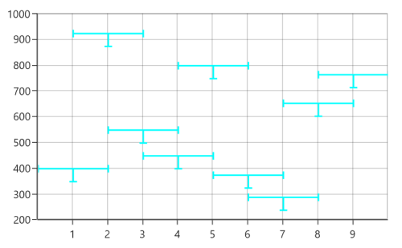

# ErrorBar in UWP Charts (SfChart)

[`ErrorBarSeries`](https://help.syncfusion.com/cr/uwp/Syncfusion.UI.Xaml.Charts.ErrorBarSeries.html) is used to indicate the errors or uncertainty in reported values. This will find the possible variations in measurements, and in Chart control these values are displayed as data points.

The [`HorizontalErrorValue`](https://help.syncfusion.com/cr/uwp/Syncfusion.UI.Xaml.Charts.ErrorBarSeries.html#Syncfusion_UI_Xaml_Charts_ErrorBarSeries_HorizontalErrorValue) and [`VerticalErrorValue`](https://help.syncfusion.com/cr/uwp/Syncfusion.UI.Xaml.Charts.ErrorBarSeries.html#Syncfusion_UI_Xaml_Charts_ErrorBarSeries_VerticalErrorValue) is used to set the error value(variation) to the series.

The following code examples illustrates how to create error bar series:





<chart:ScatterSeries ScatterWidth="20" ScatterHeight="20"  Label="Coal" 

ItemsSource="{Binding EnergyProductions}" Interior="#BCBCBC"

XBindingPath="ID" YBindingPath="Coal">

</chart:ScatterSeries>

<chart:ErrorBarSeries Name="Errorseries"   ItemsSource="{Binding EnergyProductions}" 

XBindingPath="ID" YBindingPath="Coal" 

VerticalErrorValue="50" HorizontalErrorValue="1" >

</chart:ErrorBarSeries>





ScatterSeries series = new ScatterSeries()
{

    ItemsSource = new ViewModel().EnergyProductions,

    XBindingPath = "ID",

    YBindingPath = "Coal",

    ScatterWidth = 20,

    ScatterHeight = 20,

    Label ="Coal",

    ListenPropertyChange=true,

    Interior = new SolidColorBrush(Color.FromRgb(0xBC, 0xBC, 0XBC))

};

ErrorBarSeries errorBar = new ErrorBarSeries()
{

    ItemsSource = new ViewModel().EnergyProductions,

    XBindingPath = "ID",

    YBindingPath = "Coal",

    HorizontalErrorValue = 1,

    VerticalErrorValue = 50

};

chart.Series.Add(series);

chart.Series.Add(errorBar);





## Mode

This [`Mode`](https://help.syncfusion.com/cr/uwp/Syncfusion.UI.Xaml.Charts.ErrorBarSeries.html#Syncfusion_UI_Xaml_Charts_ErrorBarSeries_Mode) property is used to define whether to identify horizontal error or vertical error. By default, the [`Mode`](https://help.syncfusion.com/cr/uwp/Syncfusion.UI.Xaml.Charts.ErrorBarSeries.html#Syncfusion_UI_Xaml_Charts_ErrorBarSeries_Mode) value is [`Both`](https://help.syncfusion.com/cr/uwp/Syncfusion.UI.Xaml.Charts.ErrorBarMode.html#Syncfusion_UI_Xaml_Charts_ErrorBarMode_Both), which will display both horizontal and vertical error values.

### Horizontal

To view horizontal error value, you can set the [`Mode`](https://help.syncfusion.com/cr/uwp/Syncfusion.UI.Xaml.Charts.ErrorBarSeries.html#Syncfusion_UI_Xaml_Charts_ErrorBarSeries_Mode) as [`Horizontal`](https://help.syncfusion.com/cr/uwp/Syncfusion.UI.Xaml.Charts.ErrorBarMode.html#Syncfusion_UI_Xaml_Charts_ErrorBarMode_Horizontal) as shown in the below code example.





<chart:ErrorBarSeries Name="Errorseries"   ItemsSource="{Binding EnergyProductions}" 

XBindingPath="ID" YBindingPath="Coal"                                  

VerticalErrorValue="50" HorizontalErrorValue="1" 

Mode="Horizontal">





ErrorBarSeries errorBar = new ErrorBarSeries()
{

    ItemsSource = new ViewModel().EnergyProductions,

    XBindingPath = "ID",

    YBindingPath = "Coal",

    HorizontalErrorValue = 1,

    VerticalErrorValue = 50,

    Mode = ErrorBarMode.Horizontal

};

chart.Series.Add(errorBar);





### Vertical

To view vertical error value, you can set the [`Mode`](https://help.syncfusion.com/cr/uwp/Syncfusion.UI.Xaml.Charts.ErrorBarSeries.html#Syncfusion_UI_Xaml_Charts_ErrorBarSeries_Mode) as [`Vertical`](https://help.syncfusion.com/cr/uwp/Syncfusion.UI.Xaml.Charts.ErrorBarMode.html#Syncfusion_UI_Xaml_Charts_ErrorBarMode_Vertical) as shown in the below code example.





<chart:ErrorBarSeries Name="Errorseries"   ItemsSource="{Binding EnergyProductions}" 

XBindingPath="ID" YBindingPath="Coal" 

VerticalErrorValue="50" HorizontalErrorValue="1" 

Mode="Vertical">





ErrorBarSeries errorBar = new ErrorBarSeries()
{

    ItemsSource = new ViewModel().EnergyProductions,

    XBindingPath = "ID",

    YBindingPath = "Coal",

    HorizontalErrorValue = 1,

    VerticalErrorValue = 50,

    Mode = ErrorBarMode.Vertical

};

chart.Series.Add(errorBar);





## Direction

ErrorBar series allows you to view the horizontal and vertical error values in both positive and negative directions.

### Horizontal direction

[`HorizontalDirection`](https://help.syncfusion.com/cr/uwp/Syncfusion.UI.Xaml.Charts.ErrorBarSeries.html#Syncfusion_UI_Xaml_Charts_ErrorBarSeries_HorizontalDirection) property of ErrorBarSeries allows you to view the horizontal error value in the following type of directions:

* [`Both`](https://help.syncfusion.com/cr/uwp/Syncfusion.UI.Xaml.Charts.ErrorBarDirection.html#Syncfusion_UI_Xaml_Charts_ErrorBarDirection_Both) – It indicates the actual data point value along with specific amount of positive and negative error values.
* [`Minus`](https://help.syncfusion.com/cr/uwp/Syncfusion.UI.Xaml.Charts.ErrorBarDirection.html#Syncfusion_UI_Xaml_Charts_ErrorBarDirection_Minus) – It indicates the actual data point value along with specific amount of negative error value.
* [`Plus`](https://help.syncfusion.com/cr/uwp/Syncfusion.UI.Xaml.Charts.ErrorBarDirection.html#Syncfusion_UI_Xaml_Charts_ErrorBarDirection_Plus) – It indicates the actual data point value along with specific amount of positive error value.

**Both**

The following code demonstrates how to set the HorizontalDirection value as both.





<syncfusion:ErrorBarSeries Name="Errorseries" HorizontalDirection="Both">

</syncfusion:ErrorBarSeries>





ErrorBarSeries errorBarSeries = new ErrorBarSeries();

errorBarSeries.HorizontalDirection = ErrorBarDirection.Both;

chart.Series.Add(errorBar);





**Minus**

The following code demonstrates how to set the HorizontalDirection value as minus.





<syncfusion:ErrorBarSeries Name="Errorseries" HorizontalDirection="Minus">

</syncfusion:ErrorBarSeries>





ErrorBarSeries errorBarSeries = new ErrorBarSeries();

errorBarSeries.HorizontalDirection = ErrorBarDirection.Minus;

chart.Series.Add(errorBar);





**Plus**

The following code demonstrates how to set the HorizontalDirection value as plus.





<syncfusion:ErrorBarSeries Name="Errorseries" HorizontalDirection="Plus">

</syncfusion:ErrorBarSeries>





ErrorBarSeries errorBarSeries = new ErrorBarSeries();

errorBarSeries.HorizontalDirection = ErrorBarDirection.Plus;

chart.Series.Add(errorBar);





**Vertical direction**

[`VerticalDirection`](https://help.syncfusion.com/cr/uwp/Syncfusion.UI.Xaml.Charts.ErrorBarSeries.html#Syncfusion_UI_Xaml_Charts_ErrorBarSeries_VerticalDirection) property of ErrorBarSeries allows you to view the vertical error value in following type of directions:

* Both - It indicates the actual data point value along with specific amount of positive and negative error values.
* Minus - It indicates the actual data point value along with specific amount of negative error value.
* Plus - It indicates the actual data point value along with specific amount of positive error value.

**Both**

The following code demonstrates how to set the VerticalDirection value as both.





<syncfusion:ErrorBarSeries Name="Errorseries" VerticalDirection="Both" >

</syncfusion:ErrorBarSeries>





ErrorBarSeries errorBarSeries = new ErrorBarSeries();

errorBarSeries.VerticalDirection= ErrorBarDirection.Both;

chart.Series.Add(errorBar);





**Minus**

The following code demonstrates how to set the VerticalDirection value as minus.





<syncfusion:ErrorBarSeries Name="Errorseries" VerticalDirection="Minus" >

</syncfusion:ErrorBarSeries>





ErrorBarSeries errorBarSeries = new ErrorBarSeries();

errorBarSeries.VerticalDirection= ErrorBarDirection.Minus;

chart.Series.Add(errorBar);





**Plus**

The following code demonstrates how to set the VerticalDirection value as plus.





<syncfusion:ErrorBarSeries Name="Errorseries" VerticalDirection="Plus" >

</syncfusion:ErrorBarSeries>





ErrorBarSeries errorBarSeries = new ErrorBarSeries();

errorBarSeries.VerticalDirection= ErrorBarDirection.Plus;

chart.Series.Add(errorBar);





## Type

[`SfChart`](https://help.syncfusion.com/cr/uwp/Syncfusion.UI.Xaml.Charts.SfChart.html) supports the following [`type`](https://help.syncfusion.com/cr/uwp/Syncfusion.UI.Xaml.Charts.ErrorBarSeries.html#Syncfusion_UI_Xaml_Charts_ErrorBarSeries_Type) of error bar series.

* [`Fixed`](https://help.syncfusion.com/cr/uwp/Syncfusion.UI.Xaml.Charts.ErrorBarType.html#Syncfusion_UI_Xaml_Charts_ErrorBarType_Fixed) 
* [`Percentage`](https://help.syncfusion.com/cr/uwp/Syncfusion.UI.Xaml.Charts.ErrorBarType.html#Syncfusion_UI_Xaml_Charts_ErrorBarType_Percentage) 
* [`Standard Deviation`](https://help.syncfusion.com/cr/uwp/Syncfusion.UI.Xaml.Charts.ErrorBarType.html#Syncfusion_UI_Xaml_Charts_ErrorBarType_StandardDeviation)
* [`Standard Error`](https://help.syncfusion.com/cr/uwp/Syncfusion.UI.Xaml.Charts.ErrorBarType.html#Syncfusion_UI_Xaml_Charts_ErrorBarType_StandardErrors)

N> The default error bar series is [`Fixed`](https://help.syncfusion.com/cr/uwp/Syncfusion.UI.Xaml.Charts.ErrorBarType.html#Syncfusion_UI_Xaml_Charts_ErrorBarType_Fixed).

### Fixed





<chart:ErrorBarSeries Name="Errorseries"  

ItemsSource="{Binding EnergyProductions}" 

XBindingPath="ID" 

YBindingPath="Coal" 

VerticalErrorValue="40" HorizontalErrorValue="10" 

Mode="Both" Type="Fixed">





ErrorBarSeries errorBar = new ErrorBarSeries()
{

    ItemsSource = new ViewModel().EnergyProductions,

    XBindingPath = "ID",

    YBindingPath = "Coal",

    HorizontalErrorValue = 1,

    VerticalErrorValue = 50,

    Mode = ErrorBarMode.Both,

    Type = ErrorBarType.Fixed

};

chart.Series.Add(errorBar);





### Percentage





<chart:ErrorBarSeries Name="Errorseries"  

ItemsSource="{Binding EnergyProductions}" 

XBindingPath="ID" 

YBindingPath="Coal" 

VerticalErrorValue="40" HorizontalErrorValue="10" 

Mode="Both" Type="Percentage">





ErrorBarSeries errorBar = new ErrorBarSeries()
{

    ItemsSource = new ViewModel().EnergyProductions,

    XBindingPath = "ID",

    YBindingPath = "Coal",

    HorizontalErrorValue = 1,

    VerticalErrorValue = 50,

    Mode = ErrorBarMode.Both,

    Type = ErrorBarType.Percentage

};

chart.Series.Add(errorBar);





### Standard Deviation





<chart:ErrorBarSeries Name="Errorseries"  

ItemsSource="{Binding EnergyProductions}" 

XBindingPath="ID" 

YBindingPath="Coal" 

VerticalErrorValue="40" HorizontalErrorValue="10" 

Mode="Both" Type="StandardDeviation"/>





ErrorBarSeries errorBar = new ErrorBarSeries()
{

    ItemsSource = new ViewModel().EnergyProductions,

    XBindingPath = "ID",

    YBindingPath = "Coal",

    HorizontalErrorValue = 1,

    VerticalErrorValue = 50,

    Mode = ErrorBarMode.Both,

    Type = ErrorBarType.StandardDeviation

};

chart.Series.Add(errorBar);





### Standard Errors





<chart:ErrorBarSeries Name="Errorseries"  

ItemsSource="{Binding EnergyProductions}" 

XBindingPath="ID" 

YBindingPath="Coal" 

VerticalErrorValue="40" HorizontalErrorValue="10" 

Mode="Both" Type="StandardErrors"/>





ErrorBarSeries errorBar = new ErrorBarSeries()
{

    ItemsSource = new ViewModel().EnergyProductions,

    XBindingPath = "ID",

    YBindingPath = "Coal",

    HorizontalErrorValue = 1,

    VerticalErrorValue = 50,

    Mode = ErrorBarMode.Both,

    Type = ErrorBarType.StandardErrors

};

chart.Series.Add(errorBar);





### Custom

If the [`Type`](https://help.syncfusion.com/cr/uwp/Syncfusion.UI.Xaml.Charts.ErrorBarSeries.html#Syncfusion_UI_Xaml_Charts_ErrorBarSeries_Type) is [`Custom`](https://help.syncfusion.com/cr/uwp/Syncfusion.UI.Xaml.Charts.ErrorBarType.html#Syncfusion_UI_Xaml_Charts_ErrorBarType_Custom), you have to bind [`HorizontalErrorPath`](https://help.syncfusion.com/cr/uwp/Syncfusion.UI.Xaml.Charts.ErrorBarSeries.html#Syncfusion_UI_Xaml_Charts_ErrorBarSeries_HorizontalErrorPath) and [`VerticalErrorPath`](https://help.syncfusion.com/cr/uwp/Syncfusion.UI.Xaml.Charts.ErrorBarSeries.html#Syncfusion_UI_Xaml_Charts_ErrorBarSeries_VerticalErrorPath) as shown in the below code snippet.





<chart:ErrorBarSeries Name="Errorseries"  

ItemsSource="{Binding EnergyProductions}" 

XBindingPath="ID" 

YBindingPath="Coal" 

HorizontalErrorPath="HorizontalErrorValue"

VerticalErrorPath="VerticalErrorValue"

Mode="Both" Type="Custom"/>





ErrorBarSeries errorBar = new ErrorBarSeries()
{

    ItemsSource = new ViewModel().EnergyProductions,

    XBindingPath = "ID",

    YBindingPath = "Coal",

    HorizontalErrorValue = 1,

    VerticalErrorValue = 50,

    Mode = ErrorBarMode.Both,

    Type = ErrorBarType.Custom

};

chart.Series.Add(errorBar);





## Customization 

[`SfChart`](https://help.syncfusion.com/cr/uwp/Syncfusion.UI.Xaml.Charts.SfChart.html) provides customization properties for the error bar lines as in the following section.

### Line Style

You can define the [`LineStyle`](https://help.syncfusion.com/cr/uwp/Syncfusion.UI.Xaml.Charts.LineStyle.html) for the error bar lines using [`HorizontalLineStyle`](https://help.syncfusion.com/cr/uwp/Syncfusion.UI.Xaml.Charts.ErrorBarSeries.html#Syncfusion_UI_Xaml_Charts_ErrorBarSeries_HorizontalLineStyle) and [`VerticalLineStyle`](https://help.syncfusion.com/cr/uwp/Syncfusion.UI.Xaml.Charts.ErrorBarSeries.html#Syncfusion_UI_Xaml_Charts_ErrorBarSeries_VerticalLineStyle) properties as in the below code examples.





<chart:ErrorBarSeries.HorizontalLineStyle>

<chart:LineStyle Stroke="Black"  StrokeThickness="2"  >

</chart:LineStyle>

</chart:ErrorBarSeries.HorizontalLineStyle>





errorBarSeries.HorizontalLineStyle = new LineStyle()
{

    Stroke = new SolidColorBrush(Colors.Black),

    StrokeThickness = 2

};









<chart:ErrorBarSeries.VerticalLineStyle>

<chart:LineStyle Stroke="Black"  StrokeThickness="2"  >

</chart:LineStyle>

</chart:ErrorBarSeries.VerticalLineStyle>





errorBarSeries.VerticalLineStyle = new LineStyle()
{

    Stroke = new SolidColorBrush(Colors.Black),

    StrokeThickness = 2

};





### Line Cap Style

ErrorBar line cap can be customized using [`HorizontalCapLineStyle`](https://help.syncfusion.com/cr/uwp/Syncfusion.UI.Xaml.Charts.ErrorBarSeries.html#Syncfusion_UI_Xaml_Charts_ErrorBarSeries_HorizontalCapLineStyle) and [`VerticalCapLineStyle`](https://help.syncfusion.com/cr/uwp/Syncfusion.UI.Xaml.Charts.ErrorBarSeries.html#Syncfusion_UI_Xaml_Charts_ErrorBarSeries_VerticalCapLineStyle) as in the below code examples.





<chart:ErrorBarSeries.HorizontalCapLineStyle>

<chart:CapLineStyle Stroke="Black" StrokeThickness="2"  

LineWidth="10"></chart:CapLineStyle>

</chart:ErrorBarSeries.HorizontalCapLineStyle>





errorBarSeries.HorizontalCapLineStyle = new CapLineStyle()
{

    Stroke = new SolidColorBrush(Colors.Black),

    StrokeThickness = 2,

    LineWidth = 10

};









<chart:ErrorBarSeries.VerticalCapLineStyle>

<chart:CapLineStyle Stroke="Black" StrokeThickness="3"  

LineWidth="15"></chart:CapLineStyle>

</chart:ErrorBarSeries.VerticalCapLineStyle>





errorBarSeries.VerticalCapLineStyle = new CapLineStyle()
{

    Stroke = new SolidColorBrush(Colors.Black),

    StrokeThickness = 3,

    LineWidth = 15

};





