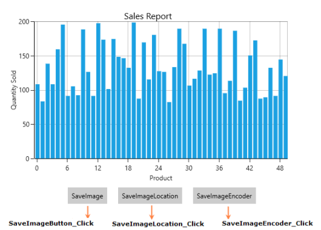

# Exporting in UWP Charts (SfChart)

[`SfChart`](https://help.syncfusion.com/cr/uwp/Syncfusion.UI.Xaml.Charts.SfChart.html) can be exported into the following types of image formats:

* JPG or JPEG
* JPEG-XR
* GIF
* TIFF
* PNG
* BMP

The following example illustrates exporting of the chart.

## Methods

[`SfChart`](https://help.syncfusion.com/cr/uwp/Syncfusion.UI.Xaml.Charts.SfChart.html) contains the following overloading methods for saving a chart as an image.

### Save()

This method will export the chart as image into a desired location by using FileSavePicker.



private void SaveImageButton_Click(object sender, RoutedEventArgs e)
{
    this.SampleChart.Save();
}



### Save(string fileName, StorageFolder folderLocation)

This method will export the chart as image to the specified location. The following code example illustrates the usage of this method.



private void SaveImageLocation_Click(object sender, RoutedEventArgs e)
{
    StorageFolder storageFolder = Windows.Storage.KnownFolders.PicturesLibrary;
    this.SampleChart.Save("ChartImage", storageFolder);
}



If you did not specify any location, the image will be saved to the corresponding application’s bin\x86\Debug\AppX



Chart.Save("Chart", null);



### Save(IRandomAccessStream stream, Guid bitmapEncoderID)

This method allows you to export the chart into a stream. It is described in following code example.



private async void SaveImageEncoder_Click(object sender, RoutedEventArgs e)
{
    StorageFile storageFile = await Windows.Storage.KnownFolders.PicturesLibrary.CreateFileAsync("EncodedChartImage");
    Guid encoder = BitmapEncoder.BmpEncoderId;
    this.SampleChart.Save(await storageFile.OpenAsync(FileAccessMode.ReadWrite), encoder);
}



The following screenshot represents the exported image.

