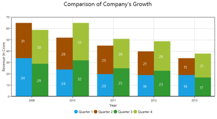

# UWP Charts (SfChart) Overview

[`SfChart`](https://help.syncfusion.com/cr/uwp/Syncfusion.UI.Xaml.Charts.SfChart.html) provides a perfect way to visualize data with a high level of user interactivity that focuses on development, productivity and simplicity of use. [`SfChart`](https://help.syncfusion.com/cr/uwp/Syncfusion.UI.Xaml.Charts.SfChart.html) also provides a wide variety of charting features that are used to visualize large quantities of data, flexible data binding and user customization.

SfChart
{:.caption}

## Key features

* [`SfChart`](https://help.syncfusion.com/cr/uwp/Syncfusion.UI.Xaml.Charts.SfChart.html) supports 38 different types of series, ranging from simple bar series to complex financial charts. Each type of chart represents a unique style of representing data with more user friendly and greater UI visualization.
* Capable of rendering large amount of data within the few milliseconds (ms). 
* Allows you to map data from the specified path, by achieving data binding concept.
* Interactive zooming can be done with touch mode enabled that allows you to explore portions of large charts in more detail, with excellent performance.
* When you need more information about particular segment in a chart, a little mouseover on the series provides much more information by including tooltip, crosshair and track ball behavior.
* Supports 10 different types of technical indicators that determine financial, stock or economic trends by analyzing a set of recorded data. 
* Supports multiple axes that can be stacked and spanned for multiple panes.
* [`SfChart`](https://help.syncfusion.com/cr/uwp/Syncfusion.UI.Xaml.Charts.SfChart.html) provides support for rendering multiple series at same time, with options to compare and visualize two different chart series, simultaneously.
* User friendly and provides various options for you to customize chart features like axis, labels, legends, series, etc and visualize them accordingly. 

