# Series in UWP Charts (SfChart)

[`ChartSeries`](https://help.syncfusion.com/cr/uwp/Syncfusion.UI.Xaml.Charts.ChartSeries.html) is the visual representation of the data. [`SfChart`](https://help.syncfusion.com/cr/uwp/Syncfusion.UI.Xaml.Charts.SfChart.html) offers many types of series ranging from [`LineSeries`](https://help.syncfusion.com/cr/uwp/Syncfusion.UI.Xaml.Charts.LineSeries.html) to [`FinancialSeries`](https://help.syncfusion.com/cr/uwp/Syncfusion.UI.Xaml.Charts.FinancialSeriesBase.html) like [`HiLo`](https://help.syncfusion.com/cr/uwp/Syncfusion.UI.Xaml.Charts.hiloSeries.html) and [`Candle`](https://help.syncfusion.com/cr/uwp/Syncfusion.UI.Xaml.Charts.candleSeries.html). Based on your requirements and specifications, any type of [`Series`](https://help.syncfusion.com/cr/uwp/Syncfusion.UI.Xaml.Charts.SfChart.html#Syncfusion_UI_Xaml_Charts_SfChart_Series) can be added for data visualization. 

The following APIs are common for the most of the series types:

* [`XBindingPath`](https://help.syncfusion.com/cr/uwp/Syncfusion.UI.Xaml.Charts.ChartSeriesBase.html#Syncfusion_UI_Xaml_Charts_ChartSeriesBase_XBindingPath)-A string property that represents the X values for the series.
* [`YBindingPath`](https://help.syncfusion.com/cr/uwp/Syncfusion.UI.Xaml.Charts.XyDataSeries.html#Syncfusion_UI_Xaml_Charts_XyDataSeries_YBindingPath)-A string property that represents the Y values for the series.
* [`Stroke`](https://help.syncfusion.com/cr/uwp/Syncfusion.UI.Xaml.Charts.ChartSeries.html#Syncfusion_UI_Xaml_Charts_ChartSeries_Stroke)-Represents the brush for the series outline.
* [`StrokeThickness`](https://help.syncfusion.com/cr/uwp/Syncfusion.UI.Xaml.Charts.ChartSeries.html#Syncfusion_UI_Xaml_Charts_ChartSeries_StrokeThickness)-Represents the thickness of the for the series outline.
* [`Interior`](https://help.syncfusion.com/cr/uwp/Syncfusion.UI.Xaml.Charts.ChartSeriesBase.html#Syncfusion_UI_Xaml_Charts_ChartSeriesBase_Interior)-Represents the brush to fill the series.
* [`Palette`](https://help.syncfusion.com/cr/uwp/Syncfusion.UI.Xaml.Charts.ChartSeriesBase.html#Syncfusion_UI_Xaml_Charts_ChartSeriesBase_Palette)-Used to define the set of pre-defined or custom colors for the series.

## Column and Bar Charts

### Column

Column charts plot discrete rectangles for the given values. The following code example demonstrates the usage of [`ColumnSeries`](https://help.syncfusion.com/cr/uwp/Syncfusion.UI.Xaml.Charts.ColumnSeries.html).





<chart:ColumnSeries Interior="#7F7F7F" ItemsSource="{Binding SneakersDetail}"           

XBindingPath="Brand" YBindingPath="ItemsCount1"   />





ColumnSeries series = new ColumnSeries()
{

    ItemsSource = new ViewModel().SneakersDetail,

    XBindingPath = "Brand",

    YBindingPath = "ItemsCount1",

    Interior = new SolidColorBrush(Color.FromRgb(0x7F, 0x7F, 0x7F))

};

chart.Series.Add(series);





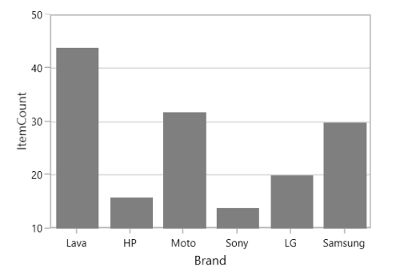

### Bar

Bar series are similar to column series, excepts its orientation. The following code examples shows how to use [`BarSeries`](https://help.syncfusion.com/cr/uwp/Syncfusion.UI.Xaml.Charts.BarSeries.html).





<chart:BarSeries ItemsSource="{Binding CategoricalData}" XBindingPath="Category" 

YBindingPath="Value" Interior="#7F7F7F" />





BarSeries series = new BarSeries()
{

    ItemsSource = new ViewModel().CategoricalData,

    XBindingPath = "Category",

    YBindingPath = "Value",

    Interior = new SolidColorBrush(Color.FromRgb(0x7F, 0x7F, 0x7F))

};





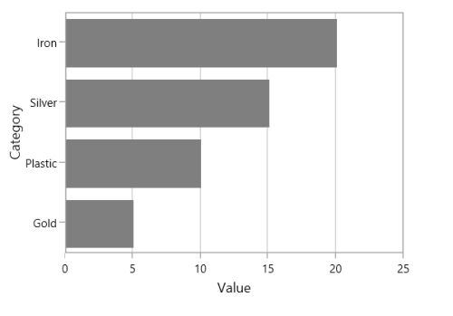

**SegmentSpacing**

The [`SegmentSpacing`](https://help.syncfusion.com/cr/uwp/Syncfusion.UI.Xaml.Charts.ColumnSeries.html#Syncfusion_UI_Xaml_Charts_ColumnSeries_SegmentSpacing) property sets spacing among the segments when multiple series are added to the chart. Its value ranges from 0 to 1. The following code demonstrates how to use the SegmentSpacing property in series.





<syncfusion:ColumnSeries ItemsSource="{Binding Data}" XBindingPath="Item" YBindingPath="Price" SegmentSpacing="0.6">
          
</syncfusion:ColumnSeries>

<syncfusion:ColumnSeries ItemsSource="{Binding Data1}" XBindingPath="Item" YBindingPath="Price" SegmentSpacing="0.6">
             
</syncfusion:ColumnSeries>





SfChart chart = new SfChart();

ColumnSeries series1 = new ColumnSeries()
{

    SegmentSpacing = 0.6,

};

chart.Series.Add(series1);

ColumnSeries series2 = new ColumnSeries()
{

    SegmentSpacing = 0.6

};

chart.Series.Add(series2);





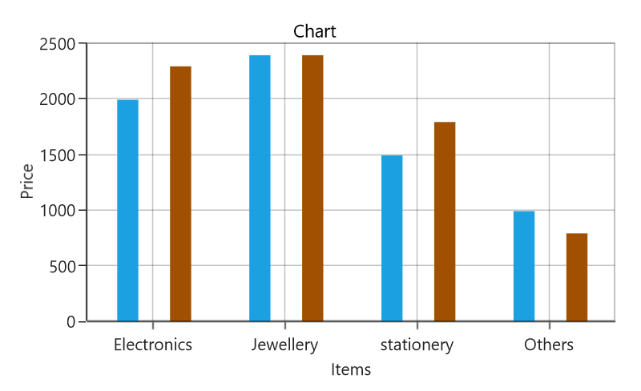

## Line and Spline Charts

### Line

Line series join points on a plot by straight lines, showing data trends at equal intervals. The following code example explains how to create a simple [`LineSeries`](https://help.syncfusion.com/cr/uwp/Syncfusion.UI.Xaml.Charts.LineSeries.html) using given data





<chart:LineSeries  XBindingPath="Year

ItemsSource="{Binding List}" YBindingPath="India"               

Interior="#4A4A4A"/>

<chart:LineSeries  XBindingPath="Year"     

ItemsSource="{Binding List}" YBindingPath="America"               

Interior="#4A4A4A"/>





LineSeries series1 = new LineSeries()
{

    ItemsSource = new ViewModel().List,

    XBindingPath = "Year",

    YBindingPath = "India",

    Interior = new SolidColorBrush(Color.FromRgb(0x4A, 0x4A, 0x4A))

};

LineSeries series2 = new LineSeries()
{

    ItemsSource = new ViewModel().List,

    XBindingPath = "Year",

    YBindingPath = "America",

    Interior = new SolidColorBrush(Color.FromRgb(0x4A, 0x4A, 0x4A))

};

chart.Series.Add(series1);

chart.Series.Add(series2);





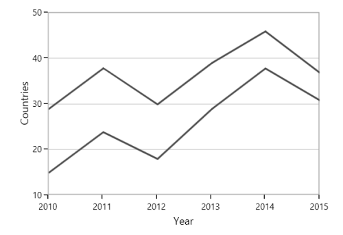

### Spline

[`SplineSeries`](https://help.syncfusion.com/cr/uwp/Syncfusion.UI.Xaml.Charts.SplineSeries.html) resembles line series, but the difference between them is that instead of connecting the data points with line segments, the data points are connected by smooth Bezier curves.





<chart:SplineSeries  XBindingPath="Year"     

ItemsSource="{Binding List}" YBindingPath="India"               

Interior="#4A4A4A"/>

<chart:SplineSeries  XBindingPath="Year"     

ItemsSource="{Binding List}" YBindingPath="America"               

Interior="#4A4A4A"/>





SplineSeries series1 = new SplineSeries()
{

    ItemsSource = new ViewModel().List,

    XBindingPath = "Year",

    YBindingPath = "India",

    Interior = new SolidColorBrush(Color.FromRgb(0x4A, 0x4A, 0x4A))

};

SplineSeries series2 = new SplineSeries()
{

    ItemsSource = new ViewModel().List,

    XBindingPath = "Year",

    YBindingPath = "America",

    Interior = new SolidColorBrush(Color.FromRgb(0x4A, 0x4A, 0x4A))

};

chart.Series.Add(series1);

chart.Series.Add(series2);





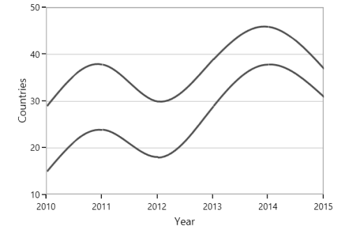

**Dashed Lines**

[`StrokeDashArray`](https://help.syncfusion.com/cr/uwp/Syncfusion.UI.Xaml.Charts.SplineSeries.html#Syncfusion_UI_Xaml_Charts_SplineSeries_StrokeDashArray) property of the [`SplineSeries`](https://help.syncfusion.com/cr/uwp/Syncfusion.UI.Xaml.Charts.SplineSeries.html) is used to render spline series with dashes.





<chart:SplineSeries ItemsSource="{Binding List}" XBindingPath="Year" YBindingPath="India" StrokeDashArray="5,3" />





SplineSeries series = new SplineSeries()
{
    ItemsSource = new ViewModel().List,
    XBindingPath = "Year",
    YBindingPath = "India"
};

DoubleCollection doubleCollection = new DoubleCollection();
doubleCollection.Add(5);
doubleCollection.Add(3);
series.StrokeDashArray = doubleCollection;
chart.Series.Add(series);





**Spline** **rendering** **types**

The [`SplineType`](https://help.syncfusion.com/cr/uwp/Syncfusion.UI.Xaml.Charts.SplineSeries.html#Syncfusion_UI_Xaml_Charts_SplineSeries_SplineType) allows you to change the spline curve in series. 

The following types are used in [`SplineSeries`](https://help.syncfusion.com/cr/uwp/Syncfusion.UI.Xaml.Charts.SplineSeries.html):

* Natural
* Monotonic
* Cardinal
* Clamped

By default, the value of SplineType is [`Natural`](https://help.syncfusion.com/cr/uwp/Syncfusion.UI.Xaml.Charts.SplineType.html#Syncfusion_UI_Xaml_Charts_SplineType_Natural).

**Cardinal**

The following code demonstrates how to set the value of SplineType to [`Cardinal`](https://help.syncfusion.com/cr/uwp/Syncfusion.UI.Xaml.Charts.SplineType.html#Syncfusion_UI_Xaml_Charts_SplineType_Cardinal).





<chart:SplineSeries SplineType="Cardinal">

</chart:SplineSeries>





SplineSeries series = new SplineSeries();

series.SplineType = SplineType.Cardinal;





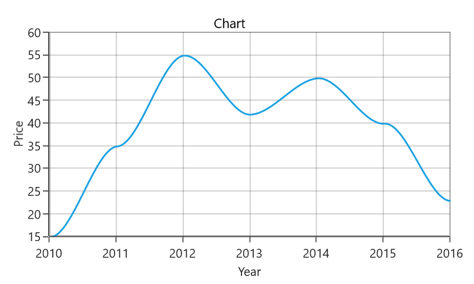

**Monotonic**

The following code demonstrates how to set the value of SplineType to [`Monotonic`](https://help.syncfusion.com/cr/uwp/Syncfusion.UI.Xaml.Charts.SplineType.html#Syncfusion_UI_Xaml_Charts_SplineType_Monotonic).





<chart:SplineSeries SplineType="Monotonic">

</chart:SplineSeries>





SplineSeries series = new SplineSeries();

series.SplineType = SplineType.Monotonic;





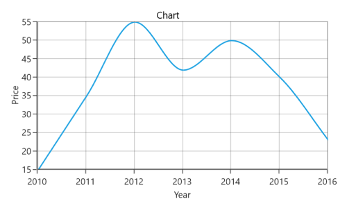

**Clamped**

The following code demonstrates how to set the value of SplineType to [`Clamped`](https://help.syncfusion.com/cr/uwp/Syncfusion.UI.Xaml.Charts.SplineType.html#Syncfusion_UI_Xaml_Charts_SplineType_Clamped).





<chart:SplineSeries SplineType="Clamped">

</chart:SplineSeries>





SplineSeries series = new SplineSeries();

series.SplineType = SplineType.Clamped;





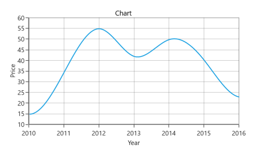

## Bubble and Scatter 

### Bubble

[`BubbleSeries`](https://help.syncfusion.com/cr/uwp/Syncfusion.UI.Xaml.Charts.BubbleSeries.html) is represented by closely packed circles, whose areas are proportional to the quantities. 

The size of the bubble series is relative proportional to the value bind with the series using [`Size`](https://help.syncfusion.com/cr/uwp/Syncfusion.UI.Xaml.Charts.BubbleSeries.html#Syncfusion_UI_Xaml_Charts_BubbleSeries_Size) property. You can set the constraints on this size using [`MinimumRadius`](https://help.syncfusion.com/cr/uwp/Syncfusion.UI.Xaml.Charts.BubbleSeries.html#Syncfusion_UI_Xaml_Charts_BubbleSeries_MinimumRadius) and [`MaximumRadius`](https://help.syncfusion.com/cr/uwp/Syncfusion.UI.Xaml.Charts.BubbleSeries.html#Syncfusion_UI_Xaml_Charts_BubbleSeries_MaximumRadius).





<chart:BubbleSeries  ItemsSource="{Binding Fruits}"  XBindingPath="FruitName" 

YBindingPath="People"   Size="Size" MinimumRadius="5" 

MaximumRadius="10"

Interior="#BCBCBC" />





BubbleSeries series = new BubbleSeries()
{

    ItemsSource = new ViewModel().Fruits,

    XBindingPath = "FruitName",

    YBindingPath = "People",

    Size = "Size",

    MinimumRadius = 5,

    Interior = new SolidColorBrush(Color.FromRgb(0x4A, 0x4A, 0x4A))

};

chart.Series.Add(series);





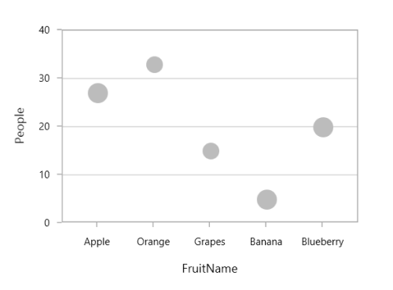

### Scatter

[`ScatterSeries`](https://help.syncfusion.com/cr/uwp/Syncfusion.UI.Xaml.Charts.ScatterSeries.html) is similar to bubble series, where each point being represented by an ellipse with equal size. This size can be defined using [`ScatterHeight`](https://help.syncfusion.com/cr/uwp/Syncfusion.UI.Xaml.Charts.ScatterSeries.html#Syncfusion_UI_Xaml_Charts_ScatterSeries_ScatterHeight) and [`ScatterWidth`](https://help.syncfusion.com/cr/uwp/Syncfusion.UI.Xaml.Charts.ScatterSeries.html#Syncfusion_UI_Xaml_Charts_ScatterSeries_ScatterWidth) property.





<chart:ScatterSeries Interior="#4A4A4A" ScatterHeight="4" ScatterWidth="4" 

ItemsSource="{Binding DataPoints}" XBindingPath="Eruptions" 

YBindingPath="WaitingTime"/>





ScatterSeries series = new ScatterSeries()
{

    ItemsSource = new ViewModel().DataPoints,

    XBindingPath = "Eruptions",

    YBindingPath = "WaitingTime",

    ScatterHeight = 4,

    ScatterWidth = 4,

    Interior = new SolidColorBrush(Color.FromRgb(0x4A, 0x4A, 0x4A))

};

chart.Series.Add(series);





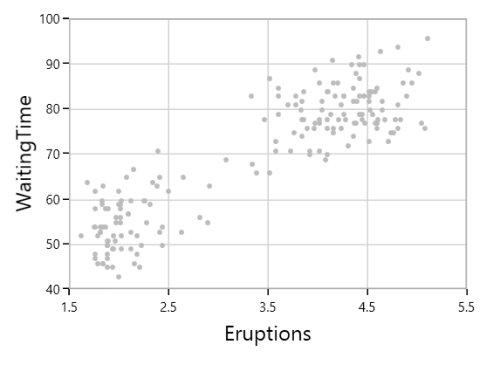

## Area Charts

### Area

[`AreaSeries`](https://help.syncfusion.com/cr/uwp/Syncfusion.UI.Xaml.Charts.AreaSeries.html) is rendered using a collection of line segments connected to form a closed loop area, filled with the specified color.

The following code example initializes the [`AreaSeries`](https://help.syncfusion.com/cr/uwp/Syncfusion.UI.Xaml.Charts.AreaSeries.html):





<chart:AreaSeries XBindingPath="FruitName" Interior="#BCBCBC" 

YBindingPath="People" ItemsSource="{Binding Fruits}" >   





AreaSeries series = new AreaSeries()
{

    ItemsSource = new ViewModel().Fruits,

    XBindingPath = "FruitName",

    YBindingPath = "People",

    Interior = new SolidColorBrush(Color.FromRgb(0xBC, 0xBC, 0xBC))

};

chart.Series.Add(series);





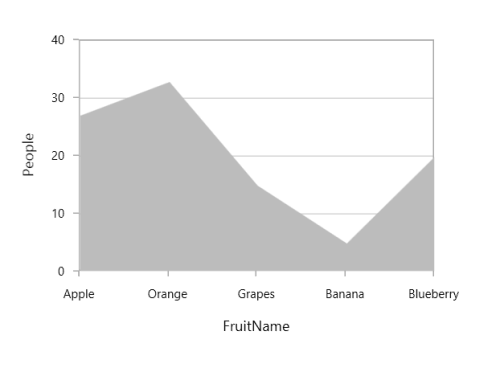

### Spline Area

[`SplineAreaSeries`](https://help.syncfusion.com/cr/uwp/Syncfusion.UI.Xaml.Charts.SplineAreaSeries.html) connects a series of data points using smooth Bezier line curves, with the underlying areas filled. 





<chart:SplineAreaSeries Interior="#7F7F7F"              

ItemsSource="{Binding Products}" XBindingPath="ProdName"     

YBindingPath="Price" />





SplineAreaSeries series = new SplineAreaSeries()
{

    ItemsSource = new ViewModel().Products,

    XBindingPath = "ProdName",

    YBindingPath = "Price",

    Interior = new SolidColorBrush(Color.FromRgb(0x7F, 0x7F, 0x7F))

};

chart.Series.Add(series);





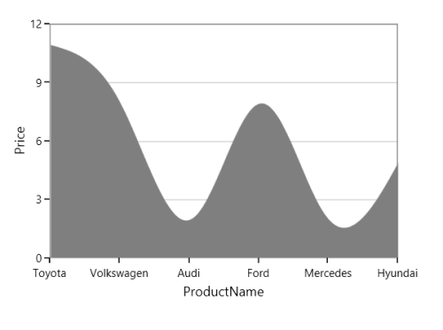

### Step Area

[`StepAreaSeries`](https://help.syncfusion.com/cr/uwp/Syncfusion.UI.Xaml.Charts.StepAreaSeries.html) is similar to [`AreaSeries`](https://help.syncfusion.com/cr/uwp/Syncfusion.UI.Xaml.Charts.AreaSeries.html) but it does not use the shortest distance to connect two data points using Bezier curves. Instead, this [`ChartSeries`](https://help.syncfusion.com/cr/uwp/Syncfusion.UI.Xaml.Charts.ChartSeries.html) uses vertical and horizontal lines to connect the data points in a series forming a step-like progression.





<chart:StepAreaSeries  Interior="#7F7F7F"  

ItemsSource="{Binding SneakersDetail}" XBindingPath="Brand" 

YBindingPath="ItemsCount"/>





StepAreaSeries series = new StepAreaSeries()
{

    ItemsSource = new ViewModel().SneakersDetail,

    XBindingPath = "Brand",

    YBindingPath = "ItemsCount",

    Interior = new SolidColorBrush(Color.FromRgb(0x7F, 0x7F, 0x7F))

};

chart.Series.Add(series);





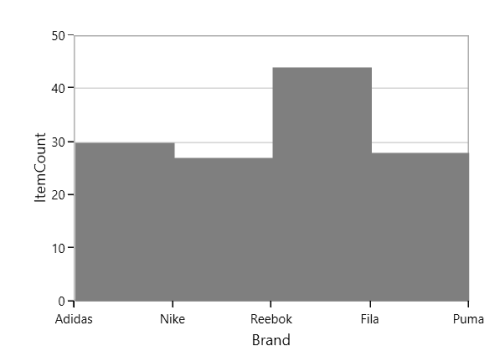

### Closed Area

If you wish to draw the open area series (Area with stroke only at top), [`SfChart`](https://help.syncfusion.com/cr/uwp/Syncfusion.UI.Xaml.Charts.SfChart.html) provides [`IsClosed`](https://help.syncfusion.com/cr/uwp/Syncfusion.UI.Xaml.Charts.AreaSeries.html#Syncfusion_UI_Xaml_Charts_AreaSeries_IsClosed) property. By default, this property is true.





<chart:AreaSeries  IsClosed="False"

XBindingPath="FruitName" Interior="#BCBCBC" 

YBindingPath="People" ItemsSource="{Binding Fruits}" /> 





AreaSeries series = new AreaSeries()
{

    ItemsSource = new ViewModel().Fruits,

    XBindingPath = "FruitName",

    YBindingPath = "People",

    IsClosed = true,

    Interior = new SolidColorBrush(Color.FromRgb(0xBC, 0xBC, 0xBC))

};

chart.Series.Add(series);





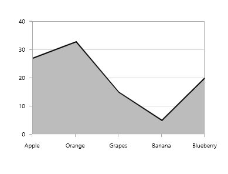

## Pie and Doughnut Charts

### Pie

[`PieSeries`](https://help.syncfusion.com/cr/uwp/Syncfusion.UI.Xaml.Charts.PieSeries.html#) is divided into sectors, illustrating numerical proportion. The following code example illustrates the [`PieSeries`](https://help.syncfusion.com/cr/uwp/Syncfusion.UI.Xaml.Charts.PieSeries.html#).





<chart:PieSeries XBindingPath="Category" 

ItemsSource="{Binding Tax}" 

YBindingPath="Percentage"/>





PieSeries series = new PieSeries()
{

    ItemsSource = new ViewModel().Tax,

    XBindingPath = "Category",

    YBindingPath = "Percentage"

};

chart.Series.Add(series);





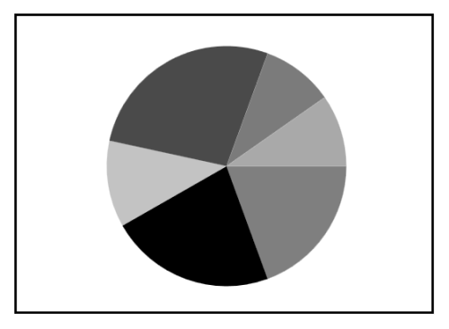

The rendering size of the [`PieSeries`](https://help.syncfusion.com/cr/uwp/Syncfusion.UI.Xaml.Charts.PieSeries.html#) can be controlled using [`PieCoefficient`](https://help.syncfusion.com/cr/uwp/Syncfusion.UI.Xaml.Charts.PieSeries.html#Syncfusion_UI_Xaml_Charts_PieSeries_PieCoefficient) property as in below code example.





<chart:PieSeries PieCoefficient="0.9" 

XBindingPath="Category" 

ItemsSource="{Binding Tax}" 

YBindingPath="Percentage"/>





PieSeries series = new PieSeries()
{

    ItemsSource = new ViewModel().Tax,

    XBindingPath = "Category",

    YBindingPath = "Percentage",

    PieCoefficient = 0.9

};

chart.Series.Add(series);





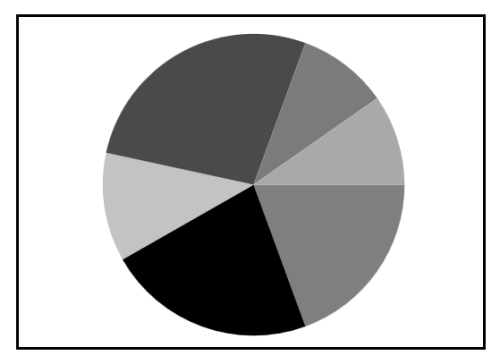

### Doughnut

[`DoughnutSeries`](https://help.syncfusion.com/cr/uwp/Syncfusion.UI.Xaml.Charts.DoughnutSeries.html#) is similar to [`PieSeries`](https://help.syncfusion.com/cr/uwp/Syncfusion.UI.Xaml.Charts.PieSeries.html#). It is used to show the relationship between parts of data and whole data. 

The DoughnutSeries can be added to chart as in below code example:





<chart:DoughnutSeries XBindingPath="Category"

ItemsSource="{Binding Tax}" 

YBindingPath="Percentage"/>





DoughnutSeries series = new DoughnutSeries()
{

    ItemsSource = new ViewModel().Tax,

    XBindingPath = "Category",

    YBindingPath = "Percentage"
};

chart.Series.Add(series);





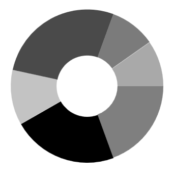

The Doughnut also having coefficient property, [`DoughnutCoefficient`](https://help.syncfusion.com/cr/uwp/Syncfusion.UI.Xaml.Charts.DoughnutSeries.html#Syncfusion_UI_Xaml_Charts_DoughnutSeries_DoughnutCoefficient) which defines the inner circle. Also it has [`DoughnutSize`](https://help.syncfusion.com/cr/uwp/Syncfusion.UI.Xaml.Charts.DoughnutSeries.html#Syncfusion_UI_Xaml_Charts_DoughnutSeries_DoughnutSize), used to define the size for this series like [`PieCoefficient`](https://help.syncfusion.com/cr/uwp/Syncfusion.UI.Xaml.Charts.PieSeries.html#Syncfusion_UI_Xaml_Charts_PieSeries_PieCoefficient) in [`PieSeries`](https://help.syncfusion.com/cr/uwp/Syncfusion.UI.Xaml.Charts.PieSeries.html).





<chart:DoughnutSeries DoughnutCoefficient="0.7"                    

XBindingPath="Category" ItemsSource="{Binding Tax}" 

YBindingPath="Percentage" />





DoughnutSeries series = new DoughnutSeries()
{

    ItemsSource = new ViewModel().Tax,

    XBindingPath = "Category",

    YBindingPath = "Percentage",

    DoughnutCoefficient = 0.9
};

chart.Series.Add(series);





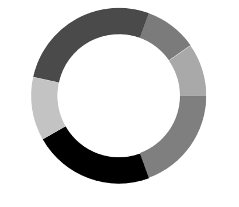

### Semi Pie and Doughnut

By having custom [`StartAngle`](https://help.syncfusion.com/cr/uwp/Syncfusion.UI.Xaml.Charts.CircularSeriesBase.html#Syncfusion_UI_Xaml_Charts_CircularSeriesBase_StartAngle) and [`EndAngle`](https://help.syncfusion.com/cr/uwp/Syncfusion.UI.Xaml.Charts.CircularSeriesBase.html#Syncfusion_UI_Xaml_Charts_CircularSeriesBase_EndAngle), you can draw pie series in different shapes like semicircular or quarter circular series.





<syncfusion:PieSeries StartAngle="180" EndAngle="360"    

XBindingPath="Utilization" 

YBindingPath="ResponseTime"

ItemsSource="{Binding}"/>





PieSeries series = new PieSeries()
{

    ItemsSource = new ViewModel().Value,

    XBindingPath = "Utilization",

    YBindingPath = "ResponseTime",

    StartAngle = 180,

    EndAngle = 360

};

chart.Series.Add(series);





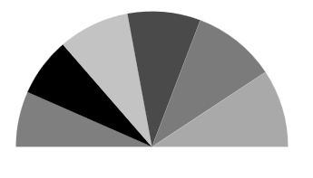





<syncfusion:DoughnutSeries StartAngle="180" EndAngle="360" 

XBindingPath="Utilization"

YBindingPath="ResponseTime" 

ItemsSource="{Binding}"/>





DoughnutSeries series = new DoughnutSeries()
{

    ItemsSource = new ViewModel().Value,

    XBindingPath = "Utilization",

    YBindingPath = "ResponseTime",

    StartAngle = 180,

    EndAngle = 360

};

chart.Series.Add(series);





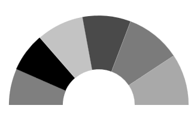

### Explode Segments

The following properties are used to explode the individual segments in Pie, Doughnut, Funnel and Pyramid.

* [`ExplodeAll`](https://help.syncfusion.com/cr/uwp/Syncfusion.UI.Xaml.Charts.AccumulationSeriesBase.html#Syncfusion_UI_Xaml_Charts_AccumulationSeriesBase_ExplodeAll)  - Used to explode all the segments of these series.
* [`ExplodeIndex`](https://help.syncfusion.com/cr/uwp/Syncfusion.UI.Xaml.Charts.AccumulationSeriesBase.html#Syncfusion_UI_Xaml_Charts_AccumulationSeriesBase_ExplodeIndex) - Used to explode any specific segment.
* [`ExplodeRadius`](https://help.syncfusion.com/cr/uwp/Syncfusion.UI.Xaml.Charts.CircularSeriesBase.html#Syncfusion_UI_Xaml_Charts_CircularSeriesBase_ExplodeRadius)- Used to define the explode distance.
* [`ExplodeOnMouseClick`](https://help.syncfusion.com/cr/uwp/Syncfusion.UI.Xaml.Charts.AccumulationSeriesBase.html#Syncfusion_UI_Xaml_Charts_AccumulationSeriesBase_ExplodeOnMouseClick)-Used to explode the segment on mouse click or tap.

**Explode** **Index**





<syncfusion:PieSeries ItemsSource="{Binding}"          

ExplodeIndex="2"

ExplodeRadius="10"

XBindingPath="Utilization" 

YBindingPath="ResponseTime" />





PieSeries series = new PieSeries()
{

    ItemsSource = new ViewModel().Data,

    XBindingPath = "Utilization",

    YBindingPath = "ResponseTime",

    ExplodeIndex = 2,

    ExplodeRadius = 10

};

chart.Series.Add(series);





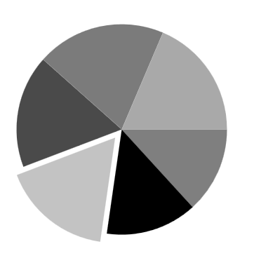

N> We have defined [`ExplodeRadius`](https://help.syncfusion.com/cr/uwp/Syncfusion.UI.Xaml.Charts.CircularSeriesBase.html#Syncfusion_UI_Xaml_Charts_CircularSeriesBase_ExplodeRadius) as 10, by default its value is zero. So you need to define [`ExplodeRadius`](https://help.syncfusion.com/cr/uwp/Syncfusion.UI.Xaml.Charts.CircularSeriesBase.html#Syncfusion_UI_Xaml_Charts_CircularSeriesBase_ExplodeRadius), when you set [`ExplodeIndex`](https://help.syncfusion.com/cr/uwp/Syncfusion.UI.Xaml.Charts.AccumulationSeriesBase.html#Syncfusion_UI_Xaml_Charts_AccumulationSeriesBase_ExplodeIndex) or [`ExplodeAll`](https://help.syncfusion.com/cr/uwp/Syncfusion.UI.Xaml.Charts.AccumulationSeriesBase.html#Syncfusion_UI_Xaml_Charts_AccumulationSeriesBase_ExplodeAll).

**Explode** **All**





<chart:PieSeries ExplodeAll="True"

ExplodeRadius="15"

XBindingPath="Category" 

ItemsSource="{Binding Tax}" 

YBindingPath="Percentage">





PieSeries series = new PieSeries()
{

    ItemsSource = new ViewModel().Tax,

    XBindingPath = "Category",

    YBindingPath = "Percentage",

    ExplodeAll = true,

    ExplodeRadius = 15

};

chart.Series.Add(series);





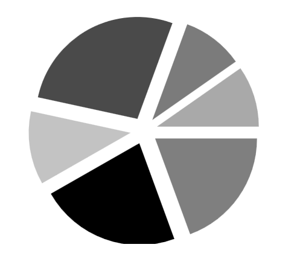

**Stacked** **doughnut**

Doughnut segments can be separated as individual circles using the [`IsStackedDoughnut`](https://help.syncfusion.com/cr/uwp/Syncfusion.UI.Xaml.Charts.DoughnutSeries.html#Syncfusion_UI_Xaml_Charts_DoughnutSeries_IsStackedDoughnut) property. The following properties are used to customize the stacked doughnut chart:

* [`CapStyle`](https://help.syncfusion.com/cr/uwp/Syncfusion.UI.Xaml.Charts.DoughnutSeries.html#Syncfusion_UI_Xaml_Charts_DoughnutSeries_CapStyle) - Specifies the shapes of the start and end points of a circular segment. The supported values are [`BothFlat`](https://help.syncfusion.com/cr/uwp/Syncfusion.UI.Xaml.Charts.DoughnutCapStyle.html#Syncfusion_UI_Xaml_Charts_DoughnutCapStyle_BothFlat), [`BothCurve`](https://help.syncfusion.com/cr/uwp/Syncfusion.UI.Xaml.Charts.DoughnutCapStyle.html#Syncfusion_UI_Xaml_Charts_DoughnutCapStyle_BothCurve), [`StartCurve`](https://help.syncfusion.com/cr/uwp/Syncfusion.UI.Xaml.Charts.DoughnutCapStyle.html#Syncfusion_UI_Xaml_Charts_DoughnutCapStyle_StartCurve), and [`EndCurve`](https://help.syncfusion.com/cr/uwp/Syncfusion.UI.Xaml.Charts.DoughnutCapStyle.html#Syncfusion_UI_Xaml_Charts_DoughnutCapStyle_EndCurve). The default value of the this property is BothFlat.
* [`SegmentSpacing`](https://help.syncfusion.com/cr/uwp/Syncfusion.UI.Xaml.Charts.DoughnutSeries.html#Syncfusion_UI_Xaml_Charts_DoughnutSeries_SegmentSpacing) - Changes the spacing between two individual segments. The default value of spacing is 0, and the value ranges from 0 to 1. Here, 1 represents 100%, and 0 represents 0% of the available space.
* [`MaximumValue`](https://help.syncfusion.com/cr/uwp/Syncfusion.UI.Xaml.Charts.DoughnutSeries.html#Syncfusion_UI_Xaml_Charts_DoughnutSeries_MaximumValue) - Represents the entire span of an individual circle. The default value of the this property is double.NaN.
* [`TrackColor`](https://help.syncfusion.com/cr/uwp/Syncfusion.UI.Xaml.Charts.DoughnutSeries.html#Syncfusion_UI_Xaml_Charts_DoughnutSeries_TrackColor) - Changes the color of the track area.
* [`TrackBorderColor`](https://help.syncfusion.com/cr/uwp/Syncfusion.UI.Xaml.Charts.DoughnutSeries.html#Syncfusion_UI_Xaml_Charts_DoughnutSeries_TrackBorderColor) - Changes the color of the track border.
* [`TrackBorderWidth`](https://help.syncfusion.com/cr/uwp/Syncfusion.UI.Xaml.Charts.DoughnutSeries.html#Syncfusion_UI_Xaml_Charts_DoughnutSeries_TrackBorderWidth) - Changes the width of the track border.





<Syncfusion:DoughnutSeries XBindingPath="Category" YBindingPath="Expenditure" ItemsSource="{Binding ExpenditureData}"
    IsStackedDoughnut="True" CapStyle="BothCurve" SegmentSpacing="0.2"
      MaximumValue="100">
</syncfusion:DoughnutSeries>





SfChart chart = new SfChart();

DoughnutSeries doughnutSeries = new DoughnutSeries()
{
    XBindingPath = "Category",
    YBindingPath = "Expenditure",
    ItemsSource = new ViewModel().ExpenditureData,
    IsStackedDoughnut = true,
    CapStyle = DoughnutCapStyle.BothCurve,
    SegmentSpacing = 0.2,
    MaximumValue = 100
};

chart.Series.Add(doughnutSeries);





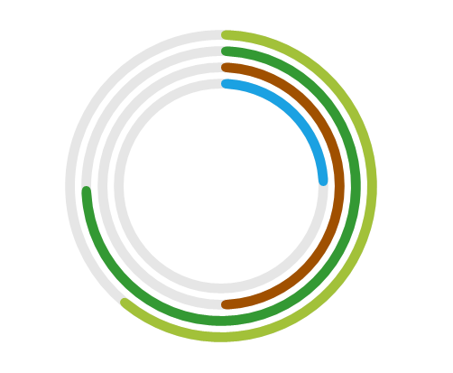

**Add content to the center of doughnut chart**

You can add any content to the center of the doughnut chart using the [`CenterView`](https://help.syncfusion.com/cr/uwp/Syncfusion.UI.Xaml.Charts.DoughnutSeries.html#Syncfusion_UI_Xaml_Charts_DoughnutSeries_CenterView) property of DoughnutSeries. The binding context of the [`CenterView`](https://help.syncfusion.com/cr/uwp/Syncfusion.UI.Xaml.Charts.DoughnutSeries.html#Syncfusion_UI_Xaml_Charts_DoughnutSeries_CenterView) will be the respective DoughnutSeries.





<syncfusion:DoughnutSeries.CenterView>
    <ContentControl HorizontalAlignment="Center" VerticalAlignment="Center" >
    <Image Source="/Image/Person.png" Width="164" Height="164"/>
    </ContentControl>
</syncfusion:DoughnutSeries.CenterView>





ContentControl centerView = new ContentControl()
{
    Content = new Image()
    {
        HorizontalAlignment = HorizontalAlignment.Center,
        VerticalAlignment = VerticalAlignment.Center,
        Source = new BitmapImage(new Uri("Image/Person.png", UriKind.Relative)),
        Width = 164,
        Height = 164
    }
};

doughnutSeries.CenterView = centerView;





## Funnel and Pyramid Charts

### Pyramid

[`PyramidSeries`](https://help.syncfusion.com/cr/uwp/Syncfusion.UI.Xaml.Charts.PyramidSeries.html) has the form of a triangle with lines dividing it into sections and each section has a different width. Depending on the Y co-ordinates, this width indicates a level of hierarchy among other categories.





<chart:PyramidSeries XBindingPath="Category" 

ItemsSource="{Binding Tax}"       

YBindingPath="Percentage"/>





PyramidSeries series = new PyramidSeries()
{

    ItemsSource = new ViewModel().Tax,

    XBindingPath = "Category",

    YBindingPath = "Percentage"

};

chart.Series.Add(series);





The [`PyramidMode`](https://help.syncfusion.com/cr/uwp/Syncfusion.UI.Xaml.Charts.PyramidSeries.html#Syncfusion_UI_Xaml_Charts_PyramidSeries_PyramidMode) is used to define the rendering mode such as [`Surface`](https://help.syncfusion.com/cr/uwp/Syncfusion.UI.Xaml.Charts.ChartPyramidMode.html#Syncfusion_UI_Xaml_Charts_ChartPyramidMode_Surface) or [`Linear`](https://help.syncfusion.com/cr/uwp/Syncfusion.UI.Xaml.Charts.ChartPyramidMode.html#Syncfusion_UI_Xaml_Charts_ChartPyramidMode_Linear) for pyramid segments.

**PyramidMode** **as** **Surface**





<chart:PyramidSeries XBindingPath="Category" 

PyramidMode="Surface"

ItemsSource="{Binding Tax}"        

YBindingPath="Percentage"/>





PyramidSeries series = new PyramidSeries()
{

    ItemsSource = new ViewModel().Tax,

    XBindingPath = "Category",

    YBindingPath = "Percentage",

    PyramidMode = ChartPyramidMode.Surface

};

chart.Series.Add(series);





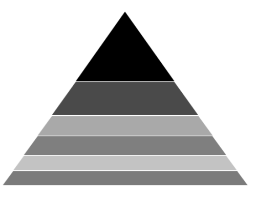

**PyramidMode** **as** **Linear**





<chart:PyramidSeries XBindingPath="Category" 

PyramidMode="Linear"

ItemsSource="{Binding Tax}"          

YBindingPath="Percentage"/>





PyramidSeries series = new PyramidSeries()
{

    ItemsSource = new ViewModel().Tax,

    XBindingPath = "Category",

    YBindingPath = "Percentage",

    PyramidMode = ChartPyramidMode.Linear

};

chart.Series.Add(series);





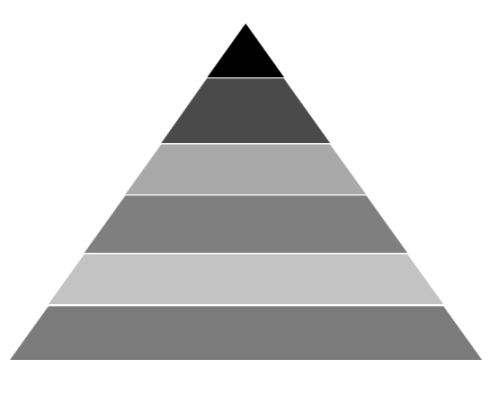

### Funnel

[`FunnelSeries`](https://help.syncfusion.com/cr/uwp/Syncfusion.UI.Xaml.Charts.FunnelSeries.html) is similar to [`PyramidSeries`](https://help.syncfusion.com/cr/uwp/Syncfusion.UI.Xaml.Charts.PyramidSeries.html), displays data in a funnel shape that equals to 100% when totaled. It is a single series, representing data as portions of 100% and does not use any axes. 

The following code example shows how to use the funnel series:





<chart:FunnelSeries XBindingPath="Category" ItemsSource="{Binding list}"  

YBindingPath="Percentage" />





FunnelSeries series = new FunnelSeries()
{

    ItemsSource = new ViewModel().List,

    XBindingPath = "Category",

    YBindingPath = "Percentage",

};

chart.Series.Add(series);





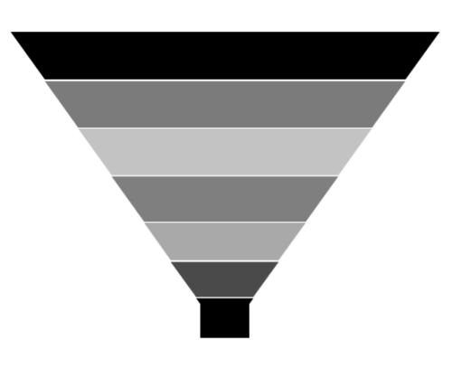

### Funnel Mode

The [`FunnelMode`](https://help.syncfusion.com/cr/uwp/Syncfusion.UI.Xaml.Charts.FunnelSeries.html#Syncfusion_UI_Xaml_Charts_FunnelSeries_FunnelMode) defines a rendering mode for the funnel series which define, where to bind your values (to height or width). The following example demonstrates [`ValueIsHeight`](https://help.syncfusion.com/cr/uwp/Syncfusion.UI.Xaml.Charts.ChartFunnelMode.html#Syncfusion_UI_Xaml_Charts_ChartFunnelMode_ValueIsHeight) and [`ValueIsWidth`](https://help.syncfusion.com/cr/uwp/Syncfusion.UI.Xaml.Charts.ChartFunnelMode.html#Syncfusion_UI_Xaml_Charts_ChartFunnelMode_ValueIsWidth) funnel mode:

**ValueIsHeight**





<chart:FunnelSeries XBindingPath="Category" ItemsSource="{Binding list}"    

FunnelMode="ValueIsHeight" 

YBindingPath="Percentage" />





FunnelSeries series = new FunnelSeries()
{

    ItemsSource = new ViewModel().List,

    XBindingPath = "Category",

    YBindingPath = "Percentage",

    FunnelMode = ChartFunnelMode.ValueIsHeight

};

chart.Series.Add(series);





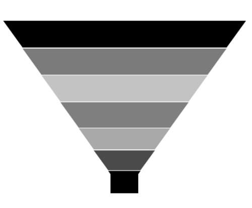

**ValueIsWidth**





<chart:FunnelSeries XBindingPath="Category" ItemsSource="{Binding list}"    

FunnelMode="ValueIsWidth" 

YBindingPath="Percentage" />





FunnelSeries series = new FunnelSeries()
{

    ItemsSource = new ViewModel().List,

    XBindingPath = "Category",

    YBindingPath = "Percentage",

    FunnelMode = ChartFunnelMode.ValueIsWidth

};

chart.Series.Add(series);





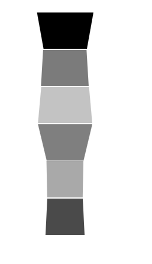

### Explode Segments

The following properties are used to explode the individual segments in Pie, Doughnut, Funnel and Pyramid.

* [`ExplodeAll`](https://help.syncfusion.com/cr/uwp/Syncfusion.UI.Xaml.Charts.AccumulationSeriesBase.html#Syncfusion_UI_Xaml_Charts_AccumulationSeriesBase_ExplodeAll) - Used to explode all the segments of these series.
* [`ExplodeIndex`](https://help.syncfusion.com/cr/uwp/Syncfusion.UI.Xaml.Charts.AccumulationSeriesBase.html#Syncfusion_UI_Xaml_Charts_AccumulationSeriesBase_ExplodeIndex) - Used to explode any specific segment.
* [`ExplodeOffset`](https://help.syncfusion.com/cr/uwp/Syncfusion.UI.Xaml.Charts.TriangularSeriesBase.html#Syncfusion_UI_Xaml_Charts_TriangularSeriesBase_ExplodeOffset)- Used to define the explode distance like ExplodeRadius for Pie.
* [`ExplodeOnMouseClick`](https://help.syncfusion.com/cr/uwp/Syncfusion.UI.Xaml.Charts.AccumulationSeriesBase.html#Syncfusion_UI_Xaml_Charts_AccumulationSeriesBase_ExplodeOnMouseClick)-Used to explode the segment on mouse click or tap.

**Explode** **Offset**





<chart:FunnelSeries XBindingPath="Category" ItemsSource="{Binding list}"   

ExplodeIndex="4"  ExplodeOffset="70" YBindingPath="Percentage" >

</chart:FunnelSeries>





FunnelSeries series = new FunnelSeries()
{

    ItemsSource = new ViewModel().List,

    XBindingPath = "Category",

    YBindingPath = "Percentage",

    ExplodeIndex = 4,

    ExplodeOffset = 70

};

chart.Series.Add(series);





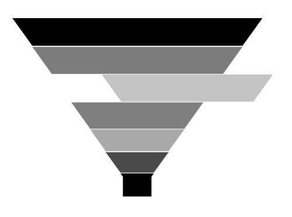

**Gap** **Ratio**

The gap between each segment using [`GapRatio`](https://help.syncfusion.com/cr/uwp/Syncfusion.UI.Xaml.Charts.TriangularSeriesBase.html#Syncfusion_UI_Xaml_Charts_TriangularSeriesBase_GapRatio) property as in the following code example.





<chart:FunnelSeries XBindingPath="Category" ItemsSource="{Binding list}"     

GapRatio="0.5" YBindingPath="Percentage">

</chart:FunnelSeries>





FunnelSeries series = new FunnelSeries()
{

    ItemsSource = new ViewModel().List,

    XBindingPath = "Category",

    YBindingPath = "Percentage",

    GapRatio = 0.5

};

chart.Series.Add(series);





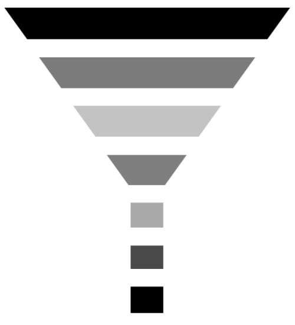

## Radar and Polar Charts

### Radar

[`RadarSeries`](https://help.syncfusion.com/cr/uwp/Syncfusion.UI.Xaml.Charts.RadarSeries.html) represents a collection of data, displayed by quantitative variables, represented on axes starting from the same point. The relative position and angle of the axes is not uniform. 

The following code example illustrates the use of radar series:





<chart:RadarSeries ItemsSource="{Binding PlantDetails}" 

Interior="#BCBCBC"

XBindingPath="Direction"

YBindingPath="Tree" >

</chart:RadarSeries>        





RadarSeries series = new RadarSeries()
{

    ItemsSource = new ViewModel().PlantDetails,

    XBindingPath = "Direction",

    YBindingPath = "Tree",

    Interior = new SolidColorBrush(Color.FromRgb(0xBC, 0xBC, 0XBC))

};

chart.Series.Add(series);





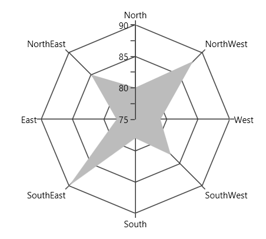

### Polar

[`PolarSeries`](https://help.syncfusion.com/cr/uwp/Syncfusion.UI.Xaml.Charts.PolarSeries.html) displays data points that are grouped by category, on a 360 degree circle. The following code example shows how to use polar series.





<chart:PolarSeries Interior="#4A4A4A" 

ItemsSource="{Binding PlantDetails}"  

XBindingPath="Direction"

YBindingPath="Tree" />                 





PolarSeries series = new PolarSeries()
{

    ItemsSource = new ViewModel().PlantDetails,

    XBindingPath = "Direction",

    YBindingPath = "Tree",

    Interior = new SolidColorBrush(Color.FromRgb(0x4A, 0x4A, 0X4A))

};

chart.Series.Add(series);





The Radar and Polar charts having the following properties in common:

* [`IsClosed`](https://help.syncfusion.com/cr/uwp/Syncfusion.UI.Xaml.Charts.PolarRadarSeriesBase.html#Syncfusion_UI_Xaml_Charts_PolarRadarSeriesBase_IsClosed)
* [`DrawType`](https://help.syncfusion.com/cr/uwp/Syncfusion.UI.Xaml.Charts.PolarRadarSeriesBase.html#Syncfusion_UI_Xaml_Charts_PolarRadarSeriesBase_DrawType)
* [`PolarAngle`](https://help.syncfusion.com/cr/uwp/Syncfusion.UI.Xaml.Charts.ChartAxisBase2D.html#Syncfusion_UI_Xaml_Charts_ChartAxisBase2D_PolarAngle)

### IsClosed

This property used to draw the closed path as below.





<chart:PolarSeries x:Name="series1" Interior="#4A4A4A" 

ItemsSource="{Binding PlantDetails}"  

Label="Amount Spent" DrawType="Line" IsClosed="False" 

XBindingPath="Direction" YBindingPath="Tree" 

StrokeThickness="2" />





PolarSeries series = new PolarSeries()
{

    ItemsSource = new ViewModel().PlantDetails,

    XBindingPath = "Direction",

    YBindingPath = "Tree",

    IsClosed = false,

    DrawType = ChartSeriesDrawType.Line,

    Label = "Amount Spent",

    StrokeThickness = 2,

    Interior = new SolidColorBrush(Color.FromRgb(0x4A, 0x4A, 0X4A))

};

chart.Series.Add(series);





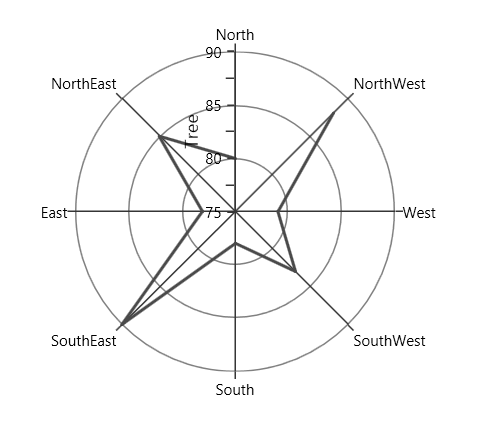

### DrawType

This property defines type of curve, whether its [`Line`](https://help.syncfusion.com/cr/uwp/Syncfusion.UI.Xaml.Charts.ChartSeriesDrawType.html#Syncfusion_UI_Xaml_Charts_ChartSeriesDrawType_Line) or [`Area`](https://help.syncfusion.com/cr/uwp/Syncfusion.UI.Xaml.Charts.ChartSeriesDrawType.html#Syncfusion_UI_Xaml_Charts_ChartSeriesDrawType_Area).

**DrawType** **as** **Area**





<chart:PolarSeries x:Name="series1" Interior="#4A4A4A" 

ItemsSource="{Binding PlantDetails}"  

DrawType="Area" IsClosed="True" 

XBindingPath="Direction" YBindingPath="Tree" />





PolarSeries series = new PolarSeries()
{

    ItemsSource = new ViewModel().PlantDetails,

    XBindingPath = "Direction",

    YBindingPath = "Tree",

    IsClosed = True,

    DrawType = ChartSeriesDrawType.Area,

    Interior = new SolidColorBrush(Color.FromRgb(0x4A, 0x4A, 0X4A))

};

chart.Series.Add(series);





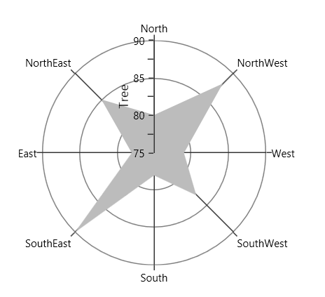

**DrawType** **as** **Line**





<chart:PolarSeries x:Name="series1" Interior="#4A4A4A" 

ItemsSource="{Binding PlantDetails}"  

DrawType="Line" IsClosed="True" 

XBindingPath="Direction" YBindingPath="Tree" 

StrokeThickness="2" />





PolarSeries series = new PolarSeries()
{

    ItemsSource = new ViewModel().PlantDetails,

    XBindingPath = "Direction",

    YBindingPath = "Tree",

    IsClosed = True,

    DrawType = ChartSeriesDrawType.Line,

    StrokeThickness = 2,

    Interior = new SolidColorBrush(Color.FromRgb(0x4A, 0x4A, 0X4A))

};

chart.Series.Add(series);





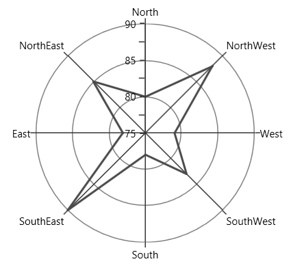

### PolarAngle

[`Chart axis`](https://help.syncfusion.com/cr/uwp/Syncfusion.UI.Xaml.Charts.ChartAxisBase2D.html) provides support to render polar and radar series on 0,90,180 and 270 degree. It can be achieved by its [`PolarAngle`](https://help.syncfusion.com/cr/uwp/Syncfusion.UI.Xaml.Charts.ChartAxisBase2D.html#Syncfusion_UI_Xaml_Charts_ChartAxisBase2D_PolarAngle) property.The [`PolarAngle`](https://help.syncfusion.com/cr/uwp/Syncfusion.UI.Xaml.Charts.ChartAxisBase2D.html#Syncfusion_UI_Xaml_Charts_ChartAxisBase2D_PolarAngle) is type of [`ChartPolarAngle`](https://help.syncfusion.com/cr/uwp/Syncfusion.UI.Xaml.Charts.ChartPolarAngle.html) and its default value is [`Rotate270`](https://help.syncfusion.com/cr/uwp/Syncfusion.UI.Xaml.Charts.ChartPolarAngle.html#Syncfusion_UI_Xaml_Charts_ChartPolarAngle_Rotate270), [`Rotate0`](https://help.syncfusion.com/cr/uwp/Syncfusion.UI.Xaml.Charts.ChartPolarAngle.html#Syncfusion_UI_Xaml_Charts_ChartPolarAngle_Rotate0), [`Rotate90`](https://help.syncfusion.com/cr/uwp/Syncfusion.UI.Xaml.Charts.ChartPolarAngle.html#Syncfusion_UI_Xaml_Charts_ChartPolarAngle_Rotate90) and [`Rotate180`](https://help.syncfusion.com/cr/uwp/Syncfusion.UI.Xaml.Charts.ChartPolarAngle.html#Syncfusion_UI_Xaml_Charts_ChartPolarAngle_Rotate180) are another supported value of [`PolarAngle`](https://help.syncfusion.com/cr/uwp/Syncfusion.UI.Xaml.Charts.ChartAxisBase2D.html#Syncfusion_UI_Xaml_Charts_ChartAxisBase2D_PolarAngle).Both the primary and secondary axes can be rotated individually based on its [`PolarAngle`](https://help.syncfusion.com/cr/uwp/Syncfusion.UI.Xaml.Charts.ChartAxisBase2D.html#Syncfusion_UI_Xaml_Charts_ChartAxisBase2D_PolarAngle) value.

**Rotate0**

The below snippet explains how the axes of series has been rotated when [`PolarAngle`](https://help.syncfusion.com/cr/uwp/Syncfusion.UI.Xaml.Charts.ChartAxisBase2D.html#Syncfusion_UI_Xaml_Charts_ChartAxisBase2D_PolarAngle) value is [`Rotate0`](https://help.syncfusion.com/cr/uwp/Syncfusion.UI.Xaml.Charts.ChartPolarAngle.html#Syncfusion_UI_Xaml_Charts_ChartPolarAngle_Rotate0),





<chart:SfChart.PrimaryAxis>

<chart:CategoryAxis  PolarAngle="Rotate0"/>

</chart:SfChart.PrimaryAxis>

<chart:SfChart.SecondaryAxis>

<chart:NumericalAxis PolarAngle="Rotate0"/>

</chart:SfChart.SecondaryAxis>





 chart.PrimaryAxis = new CategoryAxis()

 {

    PolarAngle = ChartPolarAngle.Rotate0

 };

chart.SecondaryAxis = new NumericalAxis()

{

    PolarAngle = ChartPolarAngle.Rotate0
            
};





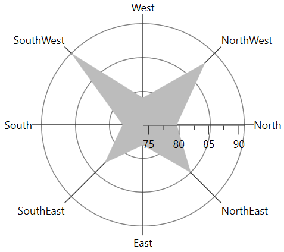

**Rotate90**

The below snippet explains how the axes of series has been rotated when [`PolarAngle`](https://help.syncfusion.com/cr/uwp/Syncfusion.UI.Xaml.Charts.ChartAxisBase2D.html#Syncfusion_UI_Xaml_Charts_ChartAxisBase2D_PolarAngle) value is [`Rotate90`](https://help.syncfusion.com/cr/uwp/Syncfusion.UI.Xaml.Charts.ChartPolarAngle.html#Syncfusion_UI_Xaml_Charts_ChartPolarAngle_Rotate90),





<chart:SfChart.PrimaryAxis>

<chart:CategoryAxis  PolarAngle="Rotate90"/>

</chart:SfChart.PrimaryAxis>

<chart:SfChart.SecondaryAxis>

<chart:NumericalAxis PolarAngle="Rotate90"/>

</chart:SfChart.SecondaryAxis>





 chart.PrimaryAxis = new CategoryAxis()

 {

    PolarAngle = ChartPolarAngle.Rotate90

 };

chart.SecondaryAxis = new NumericalAxis()

{

    PolarAngle = ChartPolarAngle.Rotate90
            
};





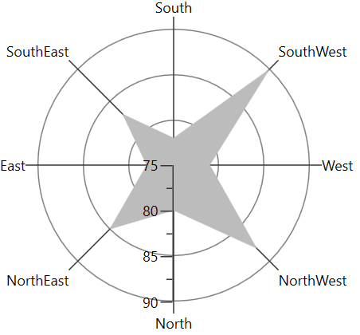

**Rotate180**

The below snippet explains how the axes of series has been rotated when [`PolarAngle`](https://help.syncfusion.com/cr/uwp/Syncfusion.UI.Xaml.Charts.ChartAxisBase2D.html#Syncfusion_UI_Xaml_Charts_ChartAxisBase2D_PolarAngle) value is [`Rotate180`](https://help.syncfusion.com/cr/uwp/Syncfusion.UI.Xaml.Charts.ChartPolarAngle.html#Syncfusion_UI_Xaml_Charts_ChartPolarAngle_Rotate180),





<chart:SfChart.PrimaryAxis>

<chart:CategoryAxis  PolarAngle="Rotate180"/>

</chart:SfChart.PrimaryAxis>

<chart:SfChart.SecondaryAxis>

<chart:NumericalAxis PolarAngle="Rotate180"/>

</chart:SfChart.SecondaryAxis>





 chart.PrimaryAxis = new CategoryAxis()

 {

    PolarAngle = ChartPolarAngle.Rotate180

 };

chart.SecondaryAxis = new NumericalAxis()

{

    PolarAngle = ChartPolarAngle.Rotate180
            
};





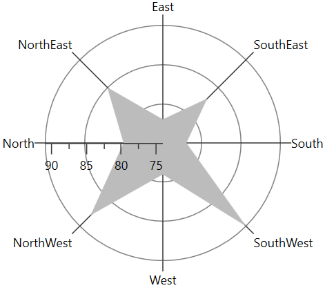

**Rotate270**

The below snippet explains how the axes of series has been rotated, when [`PolarAngle`](https://help.syncfusion.com/cr/uwp/Syncfusion.UI.Xaml.Charts.ChartAxisBase2D.html#Syncfusion_UI_Xaml_Charts_ChartAxisBase2D_PolarAngle) value is [`Rotate270`](https://help.syncfusion.com/cr/uwp/Syncfusion.UI.Xaml.Charts.ChartPolarAngle.html#Syncfusion_UI_Xaml_Charts_ChartPolarAngle_Rotate270),





<chart:SfChart.PrimaryAxis>

<chart:CategoryAxis  PolarAngle="Rotate270"/>

</chart:SfChart.PrimaryAxis>

<chart:SfChart.SecondaryAxis>

<chart:NumericalAxis PolarAngle="Rotate270"/>

</chart:SfChart.SecondaryAxis>





 chart.PrimaryAxis = new CategoryAxis()

 {

    PolarAngle = ChartPolarAngle.Rotate270

 };

chart.SecondaryAxis = new NumericalAxis()

{

    PolarAngle = ChartPolarAngle.Rotate270
            
};





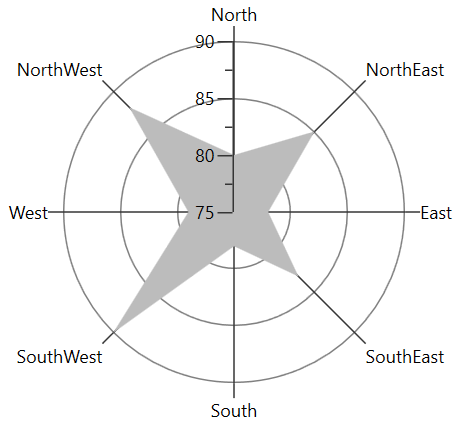

## Financial Charts

### OHLC

[`HiLoOpenCloseSeries`](https://help.syncfusion.com/cr/uwp/Syncfusion.UI.Xaml.Charts.HiLoOpenCloseSeries.html) displays each data point as a group of horizontal and one vertical line. The values for this series can be bind using [`High`](https://help.syncfusion.com/cr/uwp/Syncfusion.UI.Xaml.Charts.FinancialSeriesBase.html#Syncfusion_UI_Xaml_Charts_FinancialSeriesBase_High), [`Low`](https://help.syncfusion.com/cr/uwp/Syncfusion.UI.Xaml.Charts.FinancialSeriesBase.html#Syncfusion_UI_Xaml_Charts_FinancialSeriesBase_Low), [`Open`](https://help.syncfusion.com/cr/uwp/Syncfusion.UI.Xaml.Charts.FinancialSeriesBase.html#Syncfusion_UI_Xaml_Charts_FinancialSeriesBase_Open) and [`Close`](https://help.syncfusion.com/cr/uwp/Syncfusion.UI.Xaml.Charts.FinancialSeriesBase.html#Syncfusion_UI_Xaml_Charts_FinancialSeriesBase_Close) property.

The following code example shows how to use OHLC series:





<chart:HiLoOpenCloseSeries ItemsSource="{Binding StockPriceDetails}" 

XBindingPath="Date"  High="High" Low="Low"                         

Interior="#4A4A4A"

Open="Open" Close="Close"  />





HiLoOpenCloseSeries series = new HiLoOpenCloseSeries()
{

    ItemsSource = new ViewModel().StockPriceDetails,

    XBindingPath = "Date",

    High = "High", Low = "Low",

    Open = "Open", Close = "Close",

    Interior = new SolidColorBrush(Color.FromRgb(0x4A, 0x4A, 0X4A))

};

chart.Series.Add(series);





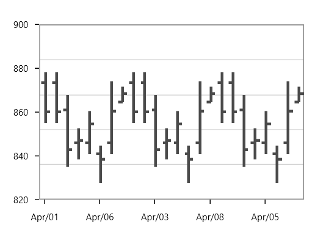

### Candle

[`CandleSeries`](https://help.syncfusion.com/cr/uwp/Syncfusion.UI.Xaml.Charts.CandleSeries.html) displays each data point as a combination of a vertical column and a vertical line. This series is most widely used in decision making places, like the stock market.

The values for this series can be bind using [`High`](https://help.syncfusion.com/cr/uwp/Syncfusion.UI.Xaml.Charts.FinancialSeriesBase.html#Syncfusion_UI_Xaml_Charts_FinancialSeriesBase_High), [`Low`](https://help.syncfusion.com/cr/uwp/Syncfusion.UI.Xaml.Charts.FinancialSeriesBase.html#Syncfusion_UI_Xaml_Charts_FinancialSeriesBase_Low), [`Open`](https://help.syncfusion.com/cr/uwp/Syncfusion.UI.Xaml.Charts.FinancialSeriesBase.html#Syncfusion_UI_Xaml_Charts_FinancialSeriesBase_Open) and [`Close`](https://help.syncfusion.com/cr/uwp/Syncfusion.UI.Xaml.Charts.FinancialSeriesBase.html#Syncfusion_UI_Xaml_Charts_FinancialSeriesBase_Close) property and the following code example shows the usage of candle series.





<chart:CandleSeries ItemsSource="{Binding StockPriceDetails}" 

XBindingPath="Date"  High="High" Open="Open"  

Close="Close" Low="Low"  

Interior="#4A4A4A"/>





CandleSeries series = new CandleSeries()
{

    ItemsSource = new ViewModel().StockPriceDetails,

    XBindingPath = "Date",

    High = "High", Low = "Low",

    Open = "Open", Close = "Close",

    Interior = new SolidColorBrush(Color.FromRgb(0x4A, 0x4A, 0X4A))

};

chart.Series.Add(series);





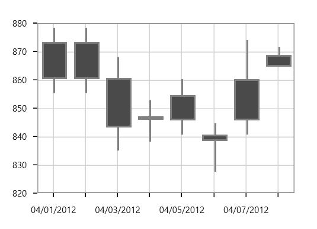

The APIs present in the Candle series are,
* [`High`](https://help.syncfusion.com/cr/uwp/Syncfusion.UI.Xaml.Charts.FinancialSeriesBase.html#Syncfusion_UI_Xaml_Charts_FinancialSeriesBase_High)-Gets or sets the string that describes high value in Y-axis.
* [`Low`](https://help.syncfusion.com/cr/uwp/Syncfusion.UI.Xaml.Charts.FinancialSeriesBase.html#Syncfusion_UI_Xaml_Charts_FinancialSeriesBase_Low)- Gets or sets the string that describes low value in Y-axis.
* [`Open`](https://help.syncfusion.com/cr/uwp/Syncfusion.UI.Xaml.Charts.FinancialSeriesBase.html#Syncfusion_UI_Xaml_Charts_FinancialSeriesBase_Open)-Gets or sets the string that describes open value in Y-axis.
* [`Close`](https://help.syncfusion.com/cr/uwp/Syncfusion.UI.Xaml.Charts.FinancialSeriesBase.html#Syncfusion_UI_Xaml_Charts_FinancialSeriesBase_Close)- Gets or sets the string that describes close value in Y-axis.
* [`BearFillColor`](https://help.syncfusion.com/cr/uwp/Syncfusion.UI.Xaml.Charts.FinancialSeriesBase.html#Syncfusion_UI_Xaml_Charts_FinancialSeriesBase_BearFillColor)-Represents the brush color for the segments that show stock price has gone up in measured time interval.
* [`BullFillColor`](https://help.syncfusion.com/cr/uwp/Syncfusion.UI.Xaml.Charts.FinancialSeriesBase.html#Syncfusion_UI_Xaml_Charts_FinancialSeriesBase_BullFillColor)-Represents that brush color for the segments that show stock price has gone down in measured time interval.





<chart:CandleSeries ItemsSource="{Binding StockPriceDetails}" XBindingPath="Date"   
                    High="High" Open="Open"  Close="Close" Low="Low"  BearFillColor="Black"
                    BullFillColor="#BCBCBC"/>
   



CandleSeries series = new CandleSeries()
{

    ItemsSource = new ViewModel().StockPriceDetails,

    XBindingPath = "Date",

    High = "High", Low = "Low",

    Open = "Open", Close = "Close",

    BearFillColor = new SolidColorBrush(Colors.Black),

    BullFillColor = new SolidColorBrush(Color.FromRgb(0xBC, 0xBC, 0XBC))

};

chart.Series.Add(series);



               

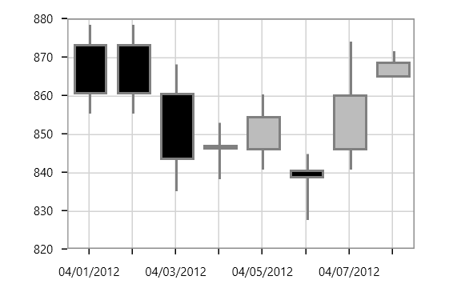

### HiLo

In [`HiLoSeries`](https://help.syncfusion.com/cr/uwp/Syncfusion.UI.Xaml.Charts.HiloSeries.html), each segment is represented by a line. The height of the line depends on the value of the data point, high or low. The values for this series can be bind using [`High`](https://help.syncfusion.com/cr/uwp/Syncfusion.UI.Xaml.Charts.FinancialSeriesBase.html#Syncfusion_UI_Xaml_Charts_FinancialSeriesBase_High) and [`Low`](https://help.syncfusion.com/cr/uwp/Syncfusion.UI.Xaml.Charts.FinancialSeriesBase.html#Syncfusion_UI_Xaml_Charts_FinancialSeriesBase_Low).

The following code example shows the use of HiLo series:





<chart:HiLoSeries Name="series" Interior="#4A4A4A" 

ItemsSource="{Binding StockPriceDetails}" 

XBindingPath="Date" StrokeThickness="3" 

High="High" Low="Low" />





HiLoSeries series = new HiLoSeries()
{

    ItemsSource = new ViewModel().StockPriceDetails,

    XBindingPath = "Date",

    High = "High", Low = "Low",

    StrokeThickness = 3,

    Interior = new SolidColorBrush(Color.FromRgb(0x4A, 0x4A, 0X4A))

};

chart.Series.Add(series);





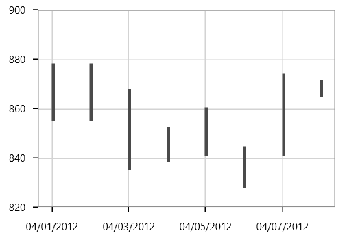

## Stacking Charts

### Stacking Line

[`StackingLineSeries`](https://help.syncfusion.com/cr/uwp/Syncfusion.UI.Xaml.Charts.StackingLineSeries.html) resembles multiple types of series of the [`LineSeries`](https://help.syncfusion.com/cr/uwp/Syncfusion.UI.Xaml.Charts.LineSeries.html). Each series is vertically stacked one above the other. When there is only one series, then it is [`LineSeries`](https://help.syncfusion.com/cr/uwp/Syncfusion.UI.Xaml.Charts.LineSeries.html). 

The following code example illustrates how to use [`StackingLineSeries`](https://help.syncfusion.com/cr/uwp/Syncfusion.UI.Xaml.Charts.StackingLineSeries.html):





<chart:StackingLineSeries  

XBindingPath="MonthlyExpenses"    

YBindingPath="Father" 

Interior="#4A4A4A"

ItemsSource="{Binding Data}"/>

<chart:StackingLineSeries

XBindingPath="MonthlyExpenses" 

YBindingPath="Mother"

Interior="#BCBCBC"

ItemsSource="{Binding Data}"/> 

<chart:StackingLineSeries 

XBindingPath="MonthlyExpenses" 

YBindingPath="Son"

Interior="#7F7F7F"

ItemsSource="{Binding Data}" />





StackingLineSeries series1 = new StackingLineSeries()
{

    ItemsSource = new ViewModel().Data,

    XBindingPath = "MonthlyExpenses",

    YBindingPath ="Father",

    Interior = new SolidColorBrush(Color.FromRgb(0x4A, 0x4A, 0X4A))

};

StackingLineSeries series2 = new StackingLineSeries()
{

    ItemsSource = new ViewModel().Data,

    XBindingPath = "MonthlyExpenses",

    YBindingPath = "Mother",

    Interior = new SolidColorBrush(Color.FromRgb(0xBC, 0xBC, 0XBC))

};

StackingLineSeries series3 = new StackingLineSeries()
{

    ItemsSource = new ViewModel().Data,

    XBindingPath = "MonthlyExpenses",

    YBindingPath = "Son",

    Interior = new SolidColorBrush(Color.FromRgb(0x7F, 0x7F, 0X7F))

};

chart.Series.Add(series1);

chart.Series.Add(series2);

chart.Series.Add(series3);





### Stacking Line 100

[`StackingLine100Series`](https://help.syncfusion.com/cr/uwp/Syncfusion.UI.Xaml.Charts.StackingLine100Series.html) resembles [`StackingLinenSeries`](https://help.syncfusion.com/cr/uwp/Syncfusion.UI.Xaml.Charts.StackingLineSeries.html) but the cumulative portion of each stacked element always comes to a total of 100%. 





<chart:StackingLine100Series ItemsSource="{Binding Data}" 

XBindingPath="MonthlyExpenses" 

YBindingPath="Father" 

Interior="#4A4A4A"
/>

<chart:StackingLine100Series ItemsSource="{Binding Data}"

XBindingPath="MonthlyExpenses"  

YBindingPath="Mother"

Interior="#BCBCBC"/>

<chart:StackingLine100Series ItemsSource="{Binding Data}"

XBindingPath="MonthlyExpenses" 

YBindingPath="Son"

Interior="#7F7F7F"/>





StackingLine100Series series1 = new StackingLine100Series()
{

    ItemsSource = new ViewModel().Data,

    XBindingPath = "MonthlyExpenses",

    YBindingPath = "Father",

    Interior = new SolidColorBrush(Color.FromRgb(0x4A, 0x4A, 0X4A))

};

StackingLine100Series series2 = new StackingLine100Series()
{

    ItemsSource = new ViewModel().Data,

    XBindingPath = "MonthlyExpenses",

    YBindingPath = "Mother",

    Interior = new SolidColorBrush(Color.FromRgb(0xBC, 0xBC, 0XBC))

};

StackingLine100Series series3 = new StackingLine100Series()
{

    ItemsSource = new ViewModel().Data,

    XBindingPath = "MonthlyExpenses",

    YBindingPath = "Son",

    Interior = new SolidColorBrush(Color.FromRgb(0x7F, 0x7F, 0X7F))

};

chart.Series.Add(series1);

chart.Series.Add(series2);

chart.Series.Add(series3);





### Stacking Column

[`StackingColumnSeries`](https://help.syncfusion.com/cr/uwp/Syncfusion.UI.Xaml.Charts.StackingColumnSeries.html) resembles multiple types of series of the [`ColumnSeries`](https://help.syncfusion.com/cr/uwp/Syncfusion.UI.Xaml.Charts.ColumnSeries.html). Each series is vertically stacked one above the other. When there is only one series, then it is [`ColumnSeries`](https://help.syncfusion.com/cr/uwp/Syncfusion.UI.Xaml.Charts.ColumnSeries.html). 

The following code example illustrates how to use [`StackingColumnSeries`](https://help.syncfusion.com/cr/uwp/Syncfusion.UI.Xaml.Charts.StackingColumnSeries.html):





<chart:StackingColumnSeries  

XBindingPath="CountryName"    

YBindingPath="GoldMedals" 

Interior="#4A4A4A"

ItemsSource="{Binding MedalDetails}"/>

<chart:StackingColumnSeries 

Interior="#BCBCBC"

XBindingPath="CountryName" 

YBindingPath="SilverMedals"

ItemsSource="{Binding MedalDetails}"/> 

<chart:StackingColumnSeries 

Interior="#7F7F7F"

XBindingPath="CountryName" 

YBindingPath="BronzeMedals" />





StackingColumnSeries series1 = new StackingColumnSeries()
{

    ItemsSource = new ViewModel().MedalDetails,

    XBindingPath = "CountryName",

    YBindingPath ="GoldMedals",

    Interior = new SolidColorBrush(Color.FromRgb(0x4A, 0x4A, 0X4A))

};

StackingColumnSeries series2 = new StackingColumnSeries()
{

    ItemsSource = new ViewModel().MedalDetails,

    XBindingPath = "CountryName",

    YBindingPath = "SilverMedals",

    Interior = new SolidColorBrush(Color.FromRgb(0xBC, 0xBC, 0XBC))

};

StackingColumnSeries series3 = new StackingColumnSeries()
{

    ItemsSource = new ViewModel().MedalDetails,

    XBindingPath = "CountryName",

    YBindingPath = "BronzeMedals",

    Interior = new SolidColorBrush(Color.FromRgb(0x7F, 0x7F, 0X7F))

};

chart.Series.Add(series1);

chart.Series.Add(series2);

chart.Series.Add(series3);





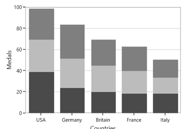

### Stacking Column 100

[`StackingColumn100Series`](https://help.syncfusion.com/cr/uwp/Syncfusion.UI.Xaml.Charts.StackingColumn100Series.html) resembles [`StackingColumnSeries`](https://help.syncfusion.com/cr/uwp/Syncfusion.UI.Xaml.Charts.StackingColumnSeries.html) but the cumulative portion of each stacked element always comes to a total of 100%. 





<chart:StackingColumn100Series  XBindingPath="CountryName" 

YBindingPath="GoldMedals" Interior="#4A4A4A"

ItemsSource="{Binding MedalDetails}"/>

<chart:StackingColumn100Series ItemsSource="{Binding MedalDetails}"

XBindingPath="CountryName"  

YBindingPath="SilverMedals"

Interior="#BCBCBC"/>

<chart:StackingColumn100Series Interior="#7F7F7F"

XBindingPath="CountryName" 

YBindingPath="BronzeMedals"

ItemsSource="{Binding MedalDetails}"/>





StackingColumn100Series series1 = new StackingColumn100Series()
{

    ItemsSource = new ViewModel().MedalDetails,

    XBindingPath = "CountryName",

    YBindingPath = "GoldMedals",

    Interior = new SolidColorBrush(Color.FromRgb(0x4A, 0x4A, 0X4A))

};

StackingColumn100Series series2 = new StackingColumn100Series()
{

    ItemsSource = new ViewModel().MedalDetails,

    XBindingPath = "CountryName",

    YBindingPath = "SilverMedals",

    Interior = new SolidColorBrush(Color.FromRgb(0xBC, 0xBC, 0XBC))

};

StackingColumn100Series series3 = new StackingColumn100Series()
{

    ItemsSource = new ViewModel().MedalDetails,

    XBindingPath = "CountryName",

    YBindingPath = "BronzeMedals",

    Interior = new SolidColorBrush(Color.FromRgb(0x7F, 0x7F, 0X7F))

};

chart.Series.Add(series1);

chart.Series.Add(series2);

chart.Series.Add(series3);





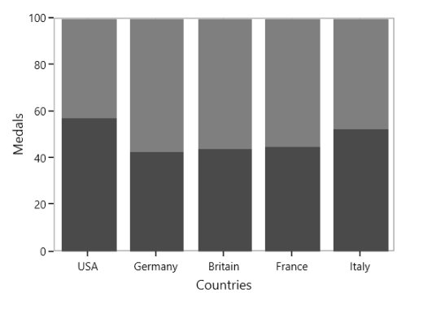

### Stacking Bar

[`StackingBarSeries`](https://help.syncfusion.com/cr/uwp/Syncfusion.UI.Xaml.Charts.StackingBarSeries.html) is a multiple series type of [`BarSeries`](https://help.syncfusion.com/cr/uwp/Syncfusion.UI.Xaml.Charts.BarSeries.html). Each [`BarSeries`](https://help.syncfusion.com/cr/uwp/Syncfusion.UI.Xaml.Charts.BarSeries.html) is then stacked horizontally, side by side to each other. When there exists only one series, it resembles a simple [`BarSeries`](https://help.syncfusion.com/cr/uwp/Syncfusion.UI.Xaml.Charts.BarSeries.html). 





<chart:StackingBarSeries XBindingPath="CountryName"        

Interior="#BCBCBC"

YBindingPath="GoldMedals" 

ItemsSource="{Binding MedalDetails}" >

</chart:StackingBarSeries>

<chart:StackingBarSeries Interior="#4A4A4A"

XBindingPath="CountryName" 

YBindingPath="SilverMedals" 

ItemsSource="{Binding MedalDetails}">

</chart:StackingBarSeries>

<chart:StackingBarSeries Interior="#7F7F7F"

XBindingPath="CountryName" 

YBindingPath="BronzeMedals"

ItemsSource="{Binding MedalDetails}" >

</chart:StackingBarSeries>





StackingBarSeries series1 = new StackingBarSeries()
{

    ItemsSource = new ViewModel().MedalDetails,

    XBindingPath = "CountryName",

    YBindingPath = "GoldMedals",

    Interior = new SolidColorBrush(Color.FromRgb(0x4A, 0x4A, 0X4A))

};

StackingBarSeries series2 = new StackingBarSeries()
{

    ItemsSource = new ViewModel().MedalDetails,

    XBindingPath = "CountryName",

    YBindingPath = "SilverMedals",

    Interior = new SolidColorBrush(Color.FromRgb(0xBC, 0xBC, 0XBC))

};

StackingBarSeries series3 = new StackingBarSeries()
{

    ItemsSource = new ViewModel().MedalDetails,

    XBindingPath = "CountryName",

    YBindingPath = "BronzeMedals",

    Interior = new SolidColorBrush(Color.FromRgb(0x7F, 0x7F, 0X7F))

};

chart.Series.Add(series1);

chart.Series.Add(series2);

chart.Series.Add(series3);





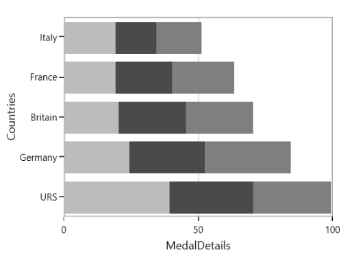

### Stacking Bar 100

[`StackingBar100Series`](https://help.syncfusion.com/cr/uwp/Syncfusion.UI.Xaml.Charts.StackingBar100Series.html) resembles a [`StackingBarSeries`](https://help.syncfusion.com/cr/uwp/Syncfusion.UI.Xaml.Charts.StackingBarSeries.html). [`StackingBar100Series`](https://help.syncfusion.com/cr/uwp/Syncfusion.UI.Xaml.Charts.StackingBar100Series.html) displays multiple series as stacked bars and the cumulative portion of each stacked element is always 100%. 





<chart:StackingBar100Series Interior="#BCBCBC"

XBindingPath="CountryName" 

YBindingPath="GoldMedals" 

ItemsSource="{Binding MedalDetails}" />

<chart:StackingBar100Series Interior="#4A4A4A" 

XBindingPath="CountryName"                          

YBindingPath="SilverMedals" 

ItemsSource="{Binding MedalDetails}" />

<chart:StackingBar100Series Interior="#7F7F7F" 

XBindingPath="CountryName" 

YBindingPath="BronzeMedals" 

ItemsSource="{Binding MedalDetails}" />





StackingBar100Series series1 = new StackingBar100Series()
{

    ItemsSource = new ViewModel().MedalDetails,

    XBindingPath = "CountryName",

    YBindingPath = "GoldMedals",

    Interior = new SolidColorBrush(Color.FromRgb(0x4A, 0x4A, 0X4A))

};

StackingBar100Series series2 = new StackingBar100Series()
{

    ItemsSource = new ViewModel().MedalDetails,

    XBindingPath = "CountryName",

    YBindingPath = "SilverMedals",

    Interior = new SolidColorBrush(Color.FromRgb(0xBC, 0xBC, 0XBC))

};

StackingBar100Series series3 = new StackingBar100Series()
{

    ItemsSource = new ViewModel().MedalDetails,

    XBindingPath = "CountryName",

    YBindingPath = "BronzeMedals",

    Interior = new SolidColorBrush(Color.FromRgb(0x7F, 0x7F, 0X7F))

};

chart.Series.Add(series1);

chart.Series.Add(series2);

chart.Series.Add(series3);





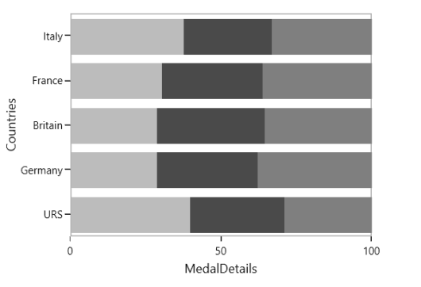

### Stacking Area

[`StackingAreaSeries`](https://help.syncfusion.com/cr/uwp/Syncfusion.UI.Xaml.Charts.StackingAreaSeries.html) is representing areas stacked vertically one above the other. 





<chart:StackingAreaSeries Interior="#BCBCBC" 

XBindingPath="Month" YBindingPath="Bus" 

ItemsSource="{Binding Accidents}" />

<chart:StackingAreaSeries Interior="#4A4A4A"                  

XBindingPath="Month" YBindingPath="Car" 

ItemsSource="{Binding Accidents}" />

<chart:StackingAreaSeries  Interior="#7F7F7FC"                     

XBindingPath="Month" 

YBindingPath="Truck" 

ItemsSource="{Binding Accidents}" />





StackingAreaSeries series1 = new StackingAreaSeries()
{

    ItemsSource = new ViewModel().Accidents,

    XBindingPath = "Month",

    YBindingPath = "Bus",

    Interior = new SolidColorBrush(Color.FromRgb(0x4A, 0x4A, 0X4A))

};

StackingAreaSeries series2 = new StackingAreaSeries()
{

    ItemsSource = new ViewModel().Accidents,

    XBindingPath = "Month",

    YBindingPath = "Car",

    Interior = new SolidColorBrush(Color.FromRgb(0xBC, 0xBC, 0XBC))

};

StackingAreaSeries series3 = new StackingAreaSeries()
{

    ItemsSource = new ViewModel().Accidents,

    XBindingPath = "Month",

    YBindingPath = "Truck",

    Interior = new SolidColorBrush(Color.FromRgb(0x7F, 0x7F, 0X7F))

};

chart.Series.Add(series1);

chart.Series.Add(series2);

chart.Series.Add(series3);





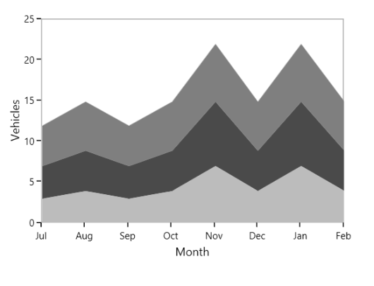

### Stacking Area 100

[`StackingArea100Series`](https://help.syncfusion.com/cr/uwp/Syncfusion.UI.Xaml.Charts.StackingArea100Series.html) is similar to [`StackingAreaSeries`](https://help.syncfusion.com/cr/uwp/Syncfusion.UI.Xaml.Charts.StackingAreaSeries.html), but the cumulative portion of each stacked element always totals 100%. 

The following code example shows the way to add stacking area 100 series:





<chart:StackingArea100Series Interior="#BCBCBC" 

XBindingPath="Month"         

YBindingPath="Bus" 

ItemsSource="{Binding Accidents}" 

/>

<chart:StackingArea100Series Interior="#4A4A4A" 

XBindingPath="Month" YBindingPath="Car" 

ItemsSource="{Binding Accidents}" />

<chart:StackingArea100Series Interior="#7F7F7F" 

XBindingPath="Month" 

YBindingPath="Truck" 

ItemsSource="{Binding Accidents}" />





StackingArea100Series series1 = new StackingArea100Series()
{

    ItemsSource = new ViewModel().Accidents,

    XBindingPath = "Month",

    YBindingPath = "Bus",

    Interior = new SolidColorBrush(Color.FromRgb(0x4A, 0x4A, 0X4A))

};

StackingArea100Series series2 = new StackingArea100Series()
{

    ItemsSource = new ViewModel().Accidents,

    XBindingPath = "Month",

    YBindingPath = "Car",

    Interior = new SolidColorBrush(Color.FromRgb(0xBC, 0xBC, 0XBC))

};

StackingArea100Series series3 = new StackingArea100Series()
{

    ItemsSource = new ViewModel().Accidents,

    XBindingPath = "Month",

    YBindingPath = "Truck",

    Interior = new SolidColorBrush(Color.FromRgb(0x7F, 0x7F, 0X7F))

};

chart.Series.Add(series1);

chart.Series.Add(series2);

chart.Series.Add(series3);





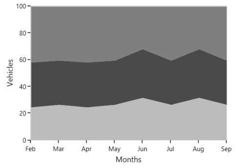

You can draw open curve like Area using this [`IsClosed`](https://help.syncfusion.com/cr/uwp/Syncfusion.UI.Xaml.Charts.StackingAreaSeries.html#Syncfusion_UI_Xaml_Charts_StackingAreaSeries_IsClosed) property.





<chart:StackingAreaSeries  Interior="#BCBCBC" Stroke="Black" StrokeThickness="3"

IsClosed="False" XBindingPath="Month" 

YBindingPath="Bus" 

ItemsSource="{Binding Accidents}"/>

<chart:StackingAreaSeries  Interior="#777777" Stroke="White" StrokeThickness="3"

IsClosed="False"  XBindingPath="Month"             

YBindingPath="Car"

ItemsSource="{Binding Accidents}"/>

<chart:StackingAreaSeries  Interior="#7F7F7F" Stroke="Black"   

StrokeThickness="3" IsClosed="False"   

XBindingPath="Month" 

YBindingPath="Truck" 

ItemsSource="{Binding Accidents}" />





StackingAreaSeries series1 = new StackingAreaSeries()
{

    ItemsSource = new ViewModel().Accidents,

    XBindingPath = "Month",

    YBindingPath = "Bus",

    Stroke = new SolidColorBrush(Colors.Black),

    StrokeThickness = 3,

    IsClosed = false,

    Interior = new SolidColorBrush(Color.FromRgb(0xBC, 0xBC, 0XBC))

};

StackingAreaSeries series2 = new StackingAreaSeries()
{

    ItemsSource = new ViewModel().Accidents,

    XBindingPath = "Month",

    YBindingPath = "Car",

    Stroke = new SolidColorBrush(Colors.White),

    StrokeThickness = 3,

    IsClosed = false,

    Interior = new SolidColorBrush(Color.FromRgb(0x77, 0x77, 0X77))

};

StackingAreaSeries series3 = new StackingAreaSeries()
{

    ItemsSource = new ViewModel().Accidents,

    XBindingPath = "Month",

    YBindingPath = "Truck",

    Stroke = new SolidColorBrush(Colors.Black),

    StrokeThickness = 3,

    IsClosed = false,

    Interior = new SolidColorBrush(Color.FromRgb(0x7F, 0x7F, 0X7F))

};

chart.Series.Add(series1);

chart.Series.Add(series2);

chart.Series.Add(series3);





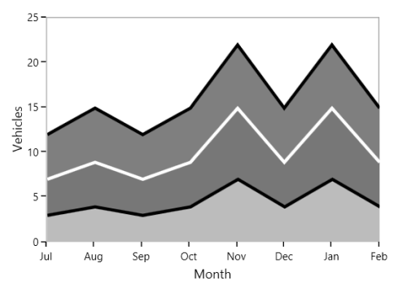

### Grouping Stacked Series

You can group the stacked series using [`GroupingLabel`](https://help.syncfusion.com/cr/uwp/Syncfusion.UI.Xaml.Charts.StackingSeriesBase.html#Syncfusion_UI_Xaml_Charts_StackingSeriesBase_GroupingLabel) property. The following code example shows how to group the stacking series.





<chart:StackingColumnSeries   Interior="#4A4A4A"

GroupingLabel="Group1" 

XBindingPath="Year" 

YBindingPath="Quarter1" 

ItemsSource="{Binding AnnualDetails}"/>

<chart:StackingColumnSeries Interior="#BCBCBC"

GroupingLabel="Group1" 

XBindingPath="Year" 

YBindingPath="Quarter2" 

ItemsSource="{Binding AnnualDetails}"/>

<chart:StackingColumnSeries Interior="#7F7F7F"

XBindingPath="Year" 

GroupingLabel="Group2" 

YBindingPath="Quarter3" 

ItemsSource="{Binding AnnualDetails}"/>

<chart:StackingColumnSeries XBindingPath="Year" 

GroupingLabel="Group2"

Interior="#343434"

YBindingPath="Quarter4" 

ItemsSource="{Binding AnnualDetails}"/>





StackingColumnSeries series1 = new StackingColumnSeries()
{

    ItemsSource = new ViewModel().AnnualDetails,

    XBindingPath = "Year",

    YBindingPath = "Quarter1",

    GroupingLabel="Group1",

    Interior = new SolidColorBrush(Color.FromRgb(0x4A,0x4A,0x4A))

};

StackingColumnSeries series2 = new StackingColumnSeries()
{

    ItemsSource = new ViewModel().AnnualDetails,

    XBindingPath = "Year",

    YBindingPath = "Quarter2",

    GroupingLabel = "Group1",

    Interior = new SolidColorBrush(Color.FromRgb(0xBC, 0xBC, 0xBC))

};

StackingColumnSeries series3 = new StackingColumnSeries()
{

    ItemsSource = new ViewModel().AnnualDetails,

    XBindingPath = "Year",

    YBindingPath = "Quarter3",

    GroupingLabel = "Group2",

    Interior = new SolidColorBrush(Color.FromRgb(0x7F, 0x7F, 0x7F))

};

StackingColumnSeries series4 = new StackingColumnSeries()
{

    ItemsSource = new ViewModel().AnnualDetails,

    XBindingPath = "Year",

    YBindingPath = "Quarter4",

    GroupingLabel = "Group2",

    Interior = new SolidColorBrush(Color.FromRgb(0x34, 0x34, 0x34))

};

chart.Series.Add(series1);

chart.Series.Add(series2);

chart.Series.Add(series3);

chart.Series.Add(series4);





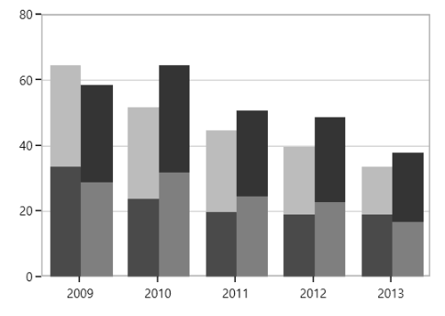

## Range Series

### Range Column

[`RangeColumnSeries`](https://help.syncfusion.com/cr/uwp/Syncfusion.UI.Xaml.Charts.RangeColumnSeries.html) is a collection of vertical columns where positioning and height depends on the high and low values of each data point. [`RangeColumnSeries`](https://help.syncfusion.com/cr/uwp/Syncfusion.UI.Xaml.Charts.RangeColumnSeries.html) is used when minimum and maximum need to be specified for the [`ColumnSeries`](https://help.syncfusion.com/cr/uwp/Syncfusion.UI.Xaml.Charts.ColumnSeries.html).





<chart:RangeColumnSeries  ItemsSource="{Binding FinancialData}" 

XBindingPath="Time" Interior="#4A4A4A"

High="High" Low="Low"  />





RangeColumnSeries series = new RangeColumnSeries()
{

    ItemsSource = new ViewModel().FinancialData,

    XBindingPath = "Time",

    High = "High", Low = "Low",

    Interior = new SolidColorBrush(Color.FromRgb(0x4A, 0x4A, 0x4A))

};

chart.Series.Add(series);





### Range Area

[`RangeAreaSeries`](https://help.syncfusion.com/cr/uwp/Syncfusion.UI.Xaml.Charts.RangeAreaSeries.html) is used to display continuous data points as a set of lines that vary between [`High`](https://help.syncfusion.com/cr/uwp/Syncfusion.UI.Xaml.Charts.RangeSeriesBase.html#Syncfusion_UI_Xaml_Charts_RangeSeriesBase_High) and [`Low`](https://help.syncfusion.com/cr/uwp/Syncfusion.UI.Xaml.Charts.RangeSeriesBase.html#Syncfusion_UI_Xaml_Charts_RangeSeriesBase_Low) values over intervals of time and across different categories. 





<chart:RangeAreaSeries XBindingPath="ProdName" 

High="Stock" Low="Price"   

Interior="#BCBCBC"        

ItemsSource="{Binding Products}" />





RangeAreaSeries series = new RangeAreaSeries()
{

    ItemsSource = new ViewModel().Products,

    XBindingPath = "ProdName",

    High = "Stock", Low = "Price",

    Interior = new SolidColorBrush(Color.FromRgb(0xBC, 0xBC, 0xBC))

};

chart.Series.Add(series);





The APIs present in the RangeArea series are,

* [`HighValueInterior`](https://help.syncfusion.com/cr/uwp/Syncfusion.UI.Xaml.Charts.RangeAreaSeries.html#Syncfusion_UI_Xaml_Charts_RangeAreaSeries_HighValueInterior) -Gets or sets the brush that represents the interior color for the high value data.
* [`LowValueInterior`](https://help.syncfusion.com/cr/uwp/Syncfusion.UI.Xaml.Charts.RangeAreaSeries.html#Syncfusion_UI_Xaml_Charts_RangeAreaSeries_LowValueInterior) - Gets or sets the brush that represents the interior color for the low value data.





<chart:RangeAreaSeries x:Name="RangeAreaSeries" XBindingPath="ProdName" 

High="Stock" Low="Price"   

LowValueInterior="#4A4A4A"

HighValueInterior="#777777"

ItemsSource="{Binding Products}" />





RangeAreaSeries series = new RangeAreaSeries()
{

    ItemsSource = new ViewModel().Products,

    XBindingPath = "ProdName",

    High = "Stock", Low = "Price",

    HighValueInterior = new SolidColorBrush(Color.FromRgb(0x77, 0x77, 0x77)),

    LowValueInterior = new SolidColorBrush(Color.FromRgb(0x4A, 0x4A, 0x4A))

};

chart.Series.Add(series);





### Spline Range Area

[`SplineRangeAreaSeries`](https://help.syncfusion.com/cr/uwp/Syncfusion.UI.Xaml.Charts.SplineRangeAreaSeries.html) is used to display continuous data points as smooth Bezier curves that vary between [`High`](https://help.syncfusion.com/cr/uwp/Syncfusion.UI.Xaml.Charts.RangeSeriesBase.html#Syncfusion_UI_Xaml_Charts_RangeSeriesBase_High) and [`Low`](https://help.syncfusion.com/cr/uwp/Syncfusion.UI.Xaml.Charts.RangeSeriesBase.html#Syncfusion_UI_Xaml_Charts_RangeSeriesBase_Low) values over intervals of time and across different categories. 





<chart:SplineRangeAreaSeries ItemsSource = "{Binding Products}"

                             XBindingPath="ProdName" 

                             High="Stock" 

                             Low="Price"

                             Interior="#BCBCBC" />





SplineRangeAreaSeries splineRangeAreaSeries = new SplineRangeAreaSeries();

splineRangeAreaSeries.ItemsSource = new ViewModel().Products;

splineRangeAreaSeries.XBindingPath = "ProdName";

splineRangeAreaSeries.High = "Stock";

splineRangeAreaSeries.Low = "Price";

splineRangeAreaSeries.Interior = new SolidColorBrush(Color.FromRgb(0xBC, 0xBC, 0xBC));

chart.Series.Add(splineRangeAreaSeries);





### Histogram 

[`HistogramSeries`](https://help.syncfusion.com/cr/uwp/Syncfusion.UI.Xaml.Charts.HistogramSeries.html) is one of the seven basic tools of quality control. [`HistogramSeries`](https://help.syncfusion.com/cr/uwp/Syncfusion.UI.Xaml.Charts.HistogramSeries.html) is often used to plot the density of data.

The following code example shows how to add the [`HistogramSeries`](https://help.syncfusion.com/cr/uwp/Syncfusion.UI.Xaml.Charts.HistogramSeries.html):





<chart:HistogramSeries x:Name="histogramSeries" 

HistogramInterval="5" 

Interior="#BCBCBC"

ItemsSource="{Binding Product}"

XBindingPath="Price" 

YBindingPath="Value"/>





HistogramSeries series = new HistogramSeries()
{

    ItemsSource = new ViewModel().Product,

    XBindingPath = "Price",

    YBindingPath = "Value",

    HistogramInterval = 5,

    Interior = new SolidColorBrush(Color.FromRgb(0xBC, 0xBC, 0xBC))

};

chart.Series.Add(series);





You can customize interval using [`HistogramInterval`](https://help.syncfusion.com/cr/uwp/Syncfusion.UI.Xaml.Charts.HistogramSeries.html#Syncfusion_UI_Xaml_Charts_HistogramSeries_HistogramInterval) property and the normal distribution curve can be collapsed using [`ShowNormalDistributionCurve`](https://help.syncfusion.com/cr/uwp/Syncfusion.UI.Xaml.Charts.HistogramSeries.html#Syncfusion_UI_Xaml_Charts_HistogramSeries_ShowNormalDistributionCurve).





<chart:HistogramSeries x:Name="histogramSeries" 

HistogramInterval="5"

ShowNormalDistributionCurve="False"

Interior="#BCBCBC"

ItemsSource="{Binding Product}"

XBindingPath="Price" 

YBindingPath="Value"/>





HistogramSeries series = new HistogramSeries()
{

    ItemsSource = new ViewModel().Product,

    XBindingPath = "Price",

    YBindingPath = "Value",

    HistogramInterval = 5,

    ShowNormalDistributionCurve = false,

    Interior = new SolidColorBrush(Color.FromRgb(0xBC, 0xBC, 0xBC))

};

chart.Series.Add(series);





**CurveLineStyle**

You can customize the normal distribution curve by using the [`CurveLineStyle`](https://help.syncfusion.com/cr/uwp/Syncfusion.UI.Xaml.Charts.HistogramSeries.html#Syncfusion_UI_Xaml_Charts_HistogramSeries_CurveLineStyle) property.




...

...

<chart:HistogramSeries x:Name="histogramSeries" 

HistogramInterval="5"

ShowNormalDistributionCurve="True"

CurveLineStyle="{StaticResource CurveColorStyle}"

Interior="LightSkyBlue"

ItemsSource="{Binding Product}"

XBindingPath="Price"

YBindingPath="Value"/>





...
HistogramSeries series = new HistogramSeries()
{

    ItemsSource = new ViewModel().Product,

    XBindingPath = "Price",

    YBindingPath = "Value",

    HistogramInterval = 5,

    ShowNormalDistributionCurve = True,

    CurveLineStyle = histogramChart.Resources["CurveColorStyle"] as Style,

    Interior = new SolidColorBrush(new SolidColorBrush(Colors.LightSkyBlue))

};

chart.Series.Add(series);





## Box and Whisker

[`BoxAndWhiskerSeries`](https://help.syncfusion.com/cr/uwp/Syncfusion.UI.Xaml.Charts.BoxAndWhiskerSeries.html) plots a combination of rectangles and lines to show the distribution of data set. The following code demonstrates how to define the series in chart.





<syncfusion:BoxAndWhiskerSeries ItemsSource="{Binding BoxWhiskerData}"  
                          
    XBindingPath="Department" 
                          
    YBindingPath="Age">

</syncfusion:BoxAndWhiskerSeries>





BoxAndWhiskerSeries boxAndWhisker = new BoxAndWhiskerSeries();

boxAndWhisker.ItemsSource = new BoxWhiskerViewModel().BoxWhiskerData;

boxAndWhisker.XBindingPath = "Department";

boxAndWhisker.YBindingPath = "Age";

boxWhiskerChart.Series.Add(boxAndWhisker);





N> By default, the value of the [`BoxPlotMode`](https://help.syncfusion.com/cr/uwp/Syncfusion.UI.Xaml.Charts.BoxAndWhiskerSeries.html#Syncfusion_UI_Xaml_Charts_BoxAndWhiskerSeries_BoxPlotMode) property is Exclusive.

**Customize the series box mode**

The series box plotting mode can be changed using the [`BoxPlotMode`](https://help.syncfusion.com/cr/uwp/Syncfusion.UI.Xaml.Charts.BoxAndWhiskerSeries.html#Syncfusion_UI_Xaml_Charts_BoxAndWhiskerSeries_BoxPlotMode) property of BoxAndWhiskerSeries. The plotting mode of series can be calculated as follows:

* [`Exclusive`](https://help.syncfusion.com/cr/uwp/Syncfusion.UI.Xaml.Charts.BoxPlotMode.html#Syncfusion_UI_Xaml_Charts_BoxPlotMode_Exclusive) – The quartile values are calculated using the formula (N+1) * P (N count, P percentile), and its index value starts from 1 in the list.
* [`Inclusive`](https://help.syncfusion.com/cr/uwp/Syncfusion.UI.Xaml.Charts.BoxPlotMode.html#Syncfusion_UI_Xaml_Charts_BoxPlotMode_Inclusive) – The quartile values are calculated using the formula (N−1) * P (N count, P percentile), and its index value starts from 0 in the list.
* [`Normal`](https://help.syncfusion.com/cr/uwp/Syncfusion.UI.Xaml.Charts.BoxPlotMode.html#Syncfusion_UI_Xaml_Charts_BoxPlotMode_Normal) – The quartile values are calculated by splitting the list and getting the median values.

**Normal**

The following code demonstrates how to define the BoxPlotMode value to Normal.





<syncfusion:BoxAndWhiskerSeries  BoxPlotMode="Normal">

</syncfusion:BoxAndWhiskerSeries>





BoxAndWhiskerSeries boxAndWhisker = new BoxAndWhiskerSeries();

boxAndWhisker.BoxPlotMode = BoxPlotMode.Normal;





**Inclusive**

The following code demonstrates how to define the BoxPlotMode value to Inclusive.





<syncfusion:BoxAndWhiskerSeries  BoxPlotMode="Inclusive">

</syncfusion:BoxAndWhiskerSeries>





BoxAndWhiskerSeries boxAndWhisker = new BoxAndWhiskerSeries();

boxAndWhisker.BoxPlotMode = BoxPlotMode.Inclusive;





**ShowMedian**

The Median values of given data set is viewed by enabling the [`ShowMedian`](https://help.syncfusion.com/cr/uwp/Syncfusion.UI.Xaml.Charts.BoxAndWhiskerSeries.html#Syncfusion_UI_Xaml_Charts_BoxAndWhiskerSeries_ShowMedian) property of BoxAndWhiskerSeries. The following code demonstrates how to enable the [`ShowMedian`](https://help.syncfusion.com/cr/uwp/Syncfusion.UI.Xaml.Charts.BoxAndWhiskerSeries.html#Syncfusion_UI_Xaml_Charts_BoxAndWhiskerSeries_ShowMedian) property.





<syncfusion:BoxAndWhiskerSeries  ShowMedian="True">

</syncfusion:BoxAndWhiskerSeries>





BoxAndWhiskerSeries boxAndWhisker = new BoxAndWhiskerSeries();

boxAndWhisker.ShowMedian = true;





### Outlier

The outlier is used to display the outlier point that lies either below the lower whisker or above the upper whisker line and it is an observation that is numerically distant from the rest of the data. 

**ShowOutlier**

The outlier value in the box plot can be viewed by enabling the [`ShowOutlier`](https://help.syncfusion.com/cr/uwp/Syncfusion.UI.Xaml.Charts.BoxAndWhiskerSeries.html#Syncfusion_UI_Xaml_Charts_BoxAndWhiskerSeries_ShowOutlier) property of [`BoxAndWhiskerSeries`](https://help.syncfusion.com/cr/uwp/Syncfusion.UI.Xaml.Charts.BoxAndWhiskerSeries.html) are are used to customize the visible of the outlier. By default, [ShowOutlier](https://help.syncfusion.com/cr/uwp/Syncfusion.UI.Xaml.Charts.BoxAndWhiskerSeries.html#Syncfusion_UI_Xaml_Charts_BoxAndWhiskerSeries_ShowOutlier) value is true. The following code demonstrates how to disable the [`ShowOutlier`](https://help.syncfusion.com/cr/uwp/Syncfusion.UI.Xaml.Charts.BoxAndWhiskerSeries.html#Syncfusion_UI_Xaml_Charts_BoxAndWhiskerSeries_ShowOutlier) property.





<syncfusion:BoxAndWhiskerSeries  ShowOutlier="False">

</syncfusion:BoxAndWhiskerSeries>





BoxAndWhiskerSeries boxAndWhisker = new BoxAndWhiskerSeries();

boxAndWhisker.ShowOutlier = false;





**OutlierTemplate**

The default appearance of the outlier symbol can be customized using the [`OutlierTemplate`](https://help.syncfusion.com/cr/uwp/Syncfusion.UI.Xaml.Charts.BoxAndWhiskerSeries.html#Syncfusion_UI_Xaml_Charts_BoxAndWhiskerSeries_OutlierTemplate) property of BoxAndWhiskerSeries. The following code demonstrates how to customize the outlier symbol.





<syncfusion:BoxAndWhiskerSeries.OutlierTemplate>

    <DataTemplate>

        <Canvas>

            <Path Stretch="Fill" Height="10" Width="10"  Fill="{Binding Interior}" 
                              
                Canvas.Left="{Binding RectX}" Canvas.Top="{Binding RectY}"
      
                Data="F1 M 145.193,54.8249L 169.315,54.8249L 169.315,
            
                78.9463L 145.193,78.9463L 145.193,103.074L 121.071,
            
                103.074L 121.071,78.9463L 96.946,78.9463L 96.946,
           
                54.8249L 121.071,54.8249L 121.071,
            
                30.6983L 145.193,30.6983L 145.193,54.8249 Z"/>

            </Canvas>

    </DataTemplate>

</syncfusion:BoxAndWhiskerSeries.OutlierTemplate>





## Waterfall Series

[`WaterfallSeries`](https://help.syncfusion.com/cr/uwp/Syncfusion.UI.Xaml.Charts.WaterfallSeries.html) clarifies the cumulative effect of set of provided positive and negative values. The series is represented by rectangles and a connector between the rectangles.

The following code demonstrates how to use the series in chart.





<syncfusion:WaterfallSeries ItemsSource="{Binding RevenueDetails}"  
                      
                       XBindingPath="Category" 
                      
                       YBindingPath="Value">

</syncfusion:WaterfallSeries>





WaterfallSeries waterfallSeries = new WaterfallSeries();

waterfallSeries.ItemsSource = new ViewModel().RevenueDetails;

waterfallSeries.XBindingPath = "Category";

waterfallSeries.YBindingPath = "Value";

chart.Series.Add(waterfallSeries);





**SummaryBindingPath and SummarySegmentBrush**

The [`SummaryBindingPath`](https://help.syncfusion.com/cr/uwp/Syncfusion.UI.Xaml.Charts.WaterfallSeries.html#Syncfusion_UI_Xaml_Charts_WaterfallSeries_SummaryBindingPath) gets or sets the string value that indicates the sum of the previous segments in series.

The summary segment can be differentiated by applying [`SummarySegmentBrush`](https://help.syncfusion.com/cr/uwp/Syncfusion.UI.Xaml.Charts.WaterfallSeries.html#Syncfusion_UI_Xaml_Charts_WaterfallSeries_SummarySegmentBrush) in series.





<syncfusion:WaterfallSeries ItemsSource="{Binding RevenueDetails}"  
                                  
                                   XBindingPath="Category"
                                  
                                   YBindingPath="Value" Interior="Gray"
                                  
                                   SummaryBindingPath="IsSummary"
                                  
                                   SummarySegmentBrush="RoyalBlue">

</syncfusion:WaterfallSeries>





WaterfallSeries waterfallSeries = new WaterfallSeries();

waterfallSeries.ItemsSource = new ViewModel().RevenueDetails;

waterfallSeries.XBindingPath = "Category";

waterfallSeries.YBindingPath = "Value";

waterfallSeries.SummaryBindingPath = "IsSummary";

waterfallSeries.SummarySegmentBrush = new SolidColorBrush(Colors.RoyalBlue);

chart.Series.Add(waterfallSeries);





**NegativeSegmentBrush**

The appearance of the negative segment can be changed using the [`NegativeSegmentBrush`](https://help.syncfusion.com/cr/uwp/Syncfusion.UI.Xaml.Charts.WaterfallSeries.html#Syncfusion_UI_Xaml_Charts_WaterfallSeries_NegativeSegmentBrush) property of series. The following code demonstrates how to change the appearance of the negative segment.





<chart:WaterfallSeries NegativeSegmentBrush="Red">

</chart:WaterfallSeries>





WaterfallSeries waterfallSeries = new WaterfallSeries();

waterfallSeries.NegativeSegmentBrush = new SolidColorBrush(Colors.Red);





**AllowAutoSum**

The summary segment calculation can be changed using the [`AllowAutoSum`](https://help.syncfusion.com/cr/uwp/Syncfusion.UI.Xaml.Charts.WaterfallSeries.html#Syncfusion_UI_Xaml_Charts_WaterfallSeries_AllowAutoSum) property. By default, this property is true. When disabling this property, it renders the segment using the y-value of provided ItemsSource collection.

The following code example demonstrates how the to set value to the AllowAutoSum property.





<syncfusion:WaterfallSeries AllowAutoSum="False"
                       
    SummaryBindingPath="IsSummary"
                       
    SummarySegmentBrush="RoyalBlue">
 
</syncfusion:WaterfallSeries>





WaterfallSeries waterfallSeries = new WaterfallSeries();

waterfallSeries.AllowAutoSum = false;

waterfallSeries.SummaryBindingPath = "IsSummary";

waterfallSeries.SummarySegmentBrush = new SolidColorBrush(Colors.RoyalBlue);

chart.Series.Add(waterfallSeries);





**ConnectorLine**

The connector line of series can be enabled or disabled using its [`ShowConnector`](https://help.syncfusion.com/cr/uwp/Syncfusion.UI.Xaml.Charts.WaterfallSeries.html#Syncfusion_UI_Xaml_Charts_WaterfallSeries_ShowConnector) line property. By default, the value of this property is true.





<syncfusion:WaterfallSeries ShowConnector="False">

</syncfusion:WaterfallSeries>





WaterfallSeries waterfallSeries = new WaterfallSeries();

waterfallSeries.ShowConnector = false;





**Connector line customization**

The connector line can be customized by applying the [`ConnectorLineStyle`](https://help.syncfusion.com/cr/uwp/Syncfusion.UI.Xaml.Charts.WaterfallSeries.html#Syncfusion_UI_Xaml_Charts_WaterfallSeries_ConnectorLineStyle) property of the series. The following code example demonstrates how to apply style to connector line.





<syncfusion:WaterfallSeries.ConnectorLineStyle>

</syncfusion:WaterfallSeries.ConnectorLineStyle>





Style style = new Style(typeof(Line));

style.Setters.Add(new Setter(Line.StrokeProperty, new SolidColorBrush(Colors.Red)));

style.Setters.Add(new Setter(Line.StrokeDashArrayProperty, new DoubleCollection() { 1 }));

style.Setters.Add(new Setter(Line.StrokeThicknessProperty, 2));

WaterfallSeries series = new WaterfallSeries();

series.ConnectorLineStyle = style;





## Fast Charts

### Fast Line

The [`FastLineSeries`](https://help.syncfusion.com/cr/uwp/Syncfusion.UI.Xaml.Charts.FastLineSeries.html) is a special kind of line series that can render a collection with a huge number of datapoints. This was rendered using polyline segment. 





<chart:FastLineSeries x:Name="FastLineSeries" ItemsSource="{Binding Data}"

XBindingPath="Date" Interior="#7F7F7F"

YBindingPath="Value"/>





FastLineSeries series = new FastLineSeries()
{

    ItemsSource = new ViewModel().Data,

    XBindingPath = "Date",

    YBindingPath = "Value",

    Interior = new SolidColorBrush(Color.FromRgb(0x7F, 0x7F, 0x7F))

};

chart.Series.Add(series);





The following line properties are available for FastLineSeries:

* [`Stroke`](https://help.syncfusion.com/cr/uwp/Syncfusion.UI.Xaml.Charts.ChartSeries.html#Syncfusion_UI_Xaml_Charts_ChartSeries_Stroke)
* [`StrokeDashArray`](https://help.syncfusion.com/cr/uwp/Syncfusion.UI.Xaml.Charts.FastLineSeries.html#Syncfusion_UI_Xaml_Charts_FastLineSeries_StrokeDashArray)
* [`StrokeDashOffset`](https://help.syncfusion.com/cr/uwp/Syncfusion.UI.Xaml.Charts.FastLineSeries.html#Syncfusion_UI_Xaml_Charts_FastLineSeries_StrokeDashOffset)
* [`StrokeDashCap`](https://help.syncfusion.com/cr/uwp/Syncfusion.UI.Xaml.Charts.FastLineSeries.html#Syncfusion_UI_Xaml_Charts_FastLineSeries_StrokeDashCap)
* [`StrokeThickness`](https://help.syncfusion.com/cr/uwp/Syncfusion.UI.Xaml.Charts.ChartSeries.html#Syncfusion_UI_Xaml_Charts_ChartSeries_StrokeThickness)

### Fast Line Bitmap 

[`FastLineBitmapSeries`](https://help.syncfusion.com/cr/uwp/Syncfusion.UI.Xaml.Charts.FastLineBitmapSeries.html) displays a series of line segments rendered using WritableBitmap. The advantage of [`FastLineBitmapSeries`](https://help.syncfusion.com/cr/uwp/Syncfusion.UI.Xaml.Charts.FastLineBitmapSeries.html) renders a million data point in a fraction of seconds.

The following code example shows how to use the fast line bitmap series:





<chart:FastLineBitmapSeries ItemsSource="{Binding Data}"

XBindingPath="Date" Interior="#7F7F7F" 

YBindingPath="Value" />





fChart chart = new SfChart();

FastLineBitmapSeries series = new FastLineBitmapSeries()
{

    ItemsSource = new ViewModel().Data,

    XBindingPath = "Date",

    YBindingPath = "Value",

    Interior = new SolidColorBrush(Color.FromRgb(0x7F, 0x7F, 0x7F))

};

chart.Series.Add(series);





Like [`FastLineSeries`](https://help.syncfusion.com/cr/uwp/Syncfusion.UI.Xaml.Charts.FastLineSeries.html), this bitmap series is also having line properties. 

N> As it was rendered using bitmap, there might be some jagged lines at edges. This is can be reduced using [`EnableAntiAliasing`](https://help.syncfusion.com/cr/uwp/Syncfusion.UI.Xaml.Charts.FastLineBitmapSeries.html#Syncfusion_UI_Xaml_Charts_FastLineBitmapSeries_EnableAntiAliasing) property.





<chart:FastLineBitmapSeries x:Name="FastLineSeries" 

XBindingPath="Date" Interior="#7F7F7F" 

StrokeDashArray="5,5"

YBindingPath="Value" EnableAntiAliasing="True"/>





FastLineBitmapSeries series = new FastLineBitmapSeries()
{

    ItemsSource = new ViewModel().Data,

    XBindingPath = "Date",

    YBindingPath = "Value",

    EnableAntiAliasing =true,

    StrokeDashArray =new DoubleCollection() { 5,5},

    Interior = new SolidColorBrush(Color.FromRgb(0x7F, 0x7F, 0x7F))

};

chart.Series.Add(series);





### Fast Column

[`FastColumnBitmapSeries`](https://help.syncfusion.com/cr/uwp/Syncfusion.UI.Xaml.Charts.FastColumnBitmapSeries.html) is used to boost up the performance of the [`ColumnSeries`](https://help.syncfusion.com/cr/uwp/Syncfusion.UI.Xaml.Charts.ColumnSeries.html).





<chart:FastColumnBitmapSeries Interior="#7F7F7F"

ItemsSource="{Binding List}" 

XBindingPath="Date" YBindingPath="Price" />





FastColumnBitmapSeries series = new FastColumnBitmapSeries()
{

    ItemsSource = new ViewModel().List,

    XBindingPath = "Date",

    YBindingPath = "Value",

    Interior = new SolidColorBrush(Color.FromRgb(0x7F, 0x7F, 0x7F))

};

chart.Series.Add(series);





### Fast Bar

[`FastBarBitmapSeries`](https://help.syncfusion.com/cr/uwp/Syncfusion.UI.Xaml.Charts.FastBarBitmapSeries.html) is used to boost up the performance of the series.





<chart:FastBarBitmapSeries ItemsSource="{Binding List}" 

XBindingPath="Date" YBindingPath="Price" 

Interior="#7F7F7F"/>





FastBarBitmapSeries series = new FastBarBitmapSeries()
{

    ItemsSource = new ViewModel().List,

    XBindingPath = "Date",

    YBindingPath = "Value",

    Interior = new SolidColorBrush(Color.FromRgb(0x7F, 0x7F, 0x7F))

};

chart.Series.Add(series);





### Fast Candle

[`FastCandleBitmapSeries`](https://help.syncfusion.com/cr/uwp/Syncfusion.UI.Xaml.Charts.FastCandleBitmapSeries.html) renders using bitmap and it displays each data point as a combination of a vertical column and a vertical line, like [`CandleSeries`](https://help.syncfusion.com/cr/uwp/Syncfusion.UI.Xaml.Charts.CandleSeries.html). 





<chart:FastCandleBitmapSeries ItemsSource="{Binding TestingModel}" 

XBindingPath="X" High="Y" 

Low="Y1" Open="Y2" Close="Y3" 

BullFillColor="#BCBCBC" 

BearFillColor="#4A4A4A"  />





FastCandleBitmapSeries series = new FastCandleBitmapSeries()
{

    ItemsSource = new ViewModel().TestingModel,

    XBindingPath = "X",

    High="Y", Low="Y1",

    Open="Y2", Close="Y3",

    BullFillColor = new SolidColorBrush(Color.FromRgb(0xBC, 0xBC, 0xBC)),

    BearFillColor = new SolidColorBrush(Color.FromRgb(0x4A, 0x4A, 0x4A))

};

chart.Series.Add(series);





### Fast HiLo

[`FastHiLoBitmapSeries`](https://help.syncfusion.com/cr/uwp/Syncfusion.UI.Xaml.Charts.FastHiLoBitmapSeries.html) represents a series of line segments with high and low values rendered using WritableBitmap. 





<chart:FastHiLoBitmapSeries StrokeThickness="5" ItemsSource="{Binding List}"          

Interior="#7F7F7F" XBindingPath="Date" High="Stock"     

Low="Price"/>





FastHiLoBitmapSeries series = new FastHiLoBitmapSeries()
{

    ItemsSource = new ViewModel().List,

    XBindingPath = "Date",

    High = "Stock",Low = "Price",

    Interior = new SolidColorBrush(Color.FromRgb(0x7F, 0x7F, 0X7F)),

    StrokeThickness = 5

};

chart.Series.Add(series);





### Fast OHLC

[`FastHiLoOpenCloseBitmapSeries`](https://help.syncfusion.com/cr/uwp/Syncfusion.UI.Xaml.Charts.FastHiLoOpenCloseBitmapSeries.html) are rendered using WritableBitmap like other bitmap series. The following code example illustrates the use of OHLC bitmap series.





<chart:FastHiLoOpenCloseBitmapSeries ItemsSource="{Binding TestingModel}" 

XBindingPath="X" High="Y" Low="Y1" Open="Y2"        

Close="Y3" BullFillColor="#7F7F7F"      

BearFillColor="#4A4A4A"/>





FastHiLoOpenCloseBitmapSeries series = new FastHiLoOpenCloseBitmapSeries()
{

    ItemsSource = new ViewModel().TestingModel,

    XBindingPath = "X",

    High="Y", Low="Y1",

    Open="Y2", Close="Y3",

    BullFillColor = new SolidColorBrush(Color.FromRgb(0xBC, 0xBC, 0xBC)),

    BearFillColor = new SolidColorBrush(Color.FromRgb(0x4A, 0x4A, 0x4A))

};

chart.Series.Add(series);





### Fast Scatter

[`FastScatterBitmapSeries`](https://help.syncfusion.com/cr/uwp/Syncfusion.UI.Xaml.Charts.FastScatterBitmapSeries.html) used to render high number scatter points. The [`ScatterHeight`](https://help.syncfusion.com/cr/uwp/Syncfusion.UI.Xaml.Charts.FastScatterBitmapSeries.html#Syncfusion_UI_Xaml_Charts_FastScatterBitmapSeries_ScatterHeight) and [`ScatterWidth`](https://help.syncfusion.com/cr/uwp/Syncfusion.UI.Xaml.Charts.FastScatterBitmapSeries.html#Syncfusion_UI_Xaml_Charts_FastScatterBitmapSeries_ScatterWidth) also available as in [`ScatterSeries`](https://help.syncfusion.com/cr/uwp/Syncfusion.UI.Xaml.Charts.ScatterSeries.html). [`ShapeType`](https://help.syncfusion.com/cr/uwp/Syncfusion.UI.Xaml.Charts.FastScatterBitmapSeries.html#Syncfusion_UI_Xaml_Charts_FastScatterBitmapSeries_ShapeType) is used to change the rendering shape of fast scatter bitmap series. The available shapes are [`Cross`](https://help.syncfusion.com/cr/uwp/Syncfusion.UI.Xaml.Charts.ChartSymbol.html#Syncfusion_UI_Xaml_Charts_ChartSymbol_Cross), [`Diamond`](https://help.syncfusion.com/cr/uwp/Syncfusion.UI.Xaml.Charts.ChartSymbol.html#Syncfusion_UI_Xaml_Charts_ChartSymbol_Diamond), [`Ellipse`](https://help.syncfusion.com/cr/uwp/Syncfusion.UI.Xaml.Charts.ChartSymbol.html#Syncfusion_UI_Xaml_Charts_ChartSymbol_Ellipse), [`Hexagon`](https://help.syncfusion.com/cr/uwp/Syncfusion.UI.Xaml.Charts.ChartSymbol.html#Syncfusion_UI_Xaml_Charts_ChartSymbol_Hexagon), [`InvertedTriangle`](https://help.syncfusion.com/cr/uwp/Syncfusion.UI.Xaml.Charts.ChartSymbol.html#Syncfusion_UI_Xaml_Charts_ChartSymbol_InvertedTriangle), [`Pentagon`](https://help.syncfusion.com/cr/uwp/Syncfusion.UI.Xaml.Charts.ChartSymbol.html#Syncfusion_UI_Xaml_Charts_ChartSymbol_Pentagon), [`Plus`](https://help.syncfusion.com/cr/uwp/Syncfusion.UI.Xaml.Charts.ChartSymbol.html#Syncfusion_UI_Xaml_Charts_ChartSymbol_Plus), [`Square`](https://help.syncfusion.com/cr/uwp/Syncfusion.UI.Xaml.Charts.ChartSymbol.html#Syncfusion_UI_Xaml_Charts_ChartSymbol_Square) and [`Triangle`](https://help.syncfusion.com/cr/uwp/Syncfusion.UI.Xaml.Charts.ChartSymbol.html#Syncfusion_UI_Xaml_Charts_ChartSymbol_Triangle).





<chart:FastScatterBitmapSeries Interior="#7F7F7F"   

ItemsSource="{Binding Data}"                         

XBindingPath="Date" 

YBindingPath="Value" ScatterHeight="4"  

ScatterWidth="4"/>





FastScatterBitmapSeries series = new FastScatterBitmapSeries()
{

    ItemsSource = new ViewModel().Data,

    XBindingPath = "Date",

    YBindingPath = "Value",

    ScatterHeight = 4,

    ScatterWidth = 4,

    Interior = new SolidColorBrush(Color.FromRgb(0x7F, 0x7F, 0X7F))

};

chart.Series.Add(series);





### Fast Step Line

[`FastStepLineBitmapSeries`](https://help.syncfusion.com/cr/uwp/Syncfusion.UI.Xaml.Charts.FastStepLineBitmapSeries.html) is the high performance version of [`StepLineSeries`](https://help.syncfusion.com/cr/uwp/Syncfusion.UI.Xaml.Charts.StepLineSeries.html).





<chart:FastStepLineBitmapSeries ItemsSource="{Binding Data}"

XBindingPath="Date"                                 

YBindingPath="Value" Interior="#4A4A4A" />





FastStepLineBitmapSeries series = new FastStepLineBitmapSeries()
{

    ItemsSource = new ViewModel().Data,

    XBindingPath = "Date",

    YBindingPath = "Value",

    Interior = new SolidColorBrush(Color.FromRgb(0x4A, 0x4A, 0X4A))

};

chart.Series.Add(series);





The anti aliasing mode can be enabled using [`EnableAntiAliasing`](https://help.syncfusion.com/cr/uwp/Syncfusion.UI.Xaml.Charts.FastStepLineBitmapSeries.html#Syncfusion_UI_Xaml_Charts_FastStepLineBitmapSeries_EnableAntiAliasing) property of [`FastStepLineBitmapSeries`](https://help.syncfusion.com/cr/uwp/Syncfusion.UI.Xaml.Charts.FastStepLineBitmapSeries.html) as in below code snippet:





<chart:FastStepLineBitmapSeries EnableAntiAliasing="True" ItemsSource="{Binding Data}"

XBindingPath="Date" 

YBindingPath="Value" Interior="#4A4A4A"/>





FastStepLineBitmapSeries series = new FastStepLineBitmapSeries()
{

    ItemsSource = new ViewModel().Data,

    XBindingPath = "Date",

    YBindingPath = "Value",

    EnableAntiAliasing = true ,

    Interior = new SolidColorBrush(Color.FromRgb(0x4A, 0x4A, 0X4A))

};

chart.Series.Add(series);





### Fast Stacking Column

[`FastStackingColumnBitmapSeries`](https://help.syncfusion.com/cr/uwp/Syncfusion.UI.Xaml.Charts.FastStackingColumnBitmapSeries.html) similar to StackingColumnSeries except that it loads faster and provides better performance. 





<chart:FastStackingColumnBitmapSeries StrokeThickness="5"

ItemsSource="{Binding MedalDetails}”       

XBindingPath="CountryName" YBindingPath="GoldMedals"  

Interior="#4A4A4A" />





FastStackingColumnBitmapSeries series = new FastStackingColumnBitmapSeries()
{

    ItemsSource = new ViewModel().MedalDetails,

    XBindingPath = "CountryName",

    YBindingPath = "GoldMedals",

    Interior = new SolidColorBrush(Color.FromRgb(0x4A, 0x4A, 0X4A))

};

chart.Series.Add(series);





### Fast Range Area

[`FastRangeAreaBitmapSeries`](https://help.syncfusion.com/cr/uwp/Syncfusion.UI.Xaml.Charts.FastRangeAreaBitmapSeries.html) is the high performance version of [`RangeAreaSeries`](https://help.syncfusion.com/cr/uwp/Syncfusion.UI.Xaml.Charts.RangeAreaSeries.html). 





<chart:FastRangeAreaBitmapSeries ItemsSource = "{Binding Data}"

                             XBindingPath="Date" 
					 
                             High="HighTemperature" 
					 
                             Low="LowTemperature"        
					                                      
                             Interior="#7F7F7F" />





FastRangeAreaBitmapSeries fastRangeAreaBitmapSeries = new FastRangeAreaBitmapSeries();

fastRangeAreaBitmapSeries.ItemsSource = new ViewModel().Data;

fastRangeAreaBitmapSeries.XBindingPath = "Date";

fastRangeAreaBitmapSeries.High = "HighTemperature";

fastRangeAreaBitmapSeries.Low = "LowTemperature";

fastRangeAreaBitmapSeries.Interior = new SolidColorBrush(Color.FromRgb(0x7F, 0x7F, 0x75));

chart.Series.Add(fastRangeAreaBitmapSeries);





The anti-aliasing mode can be enabled using  [`EnableAntiAliasing`](https://help.syncfusion.com/cr/uwp/Syncfusion.UI.Xaml.Charts.FastRangeAreaBitmapSeries.html#Syncfusion_UI_Xaml_Charts_FastRangeAreaBitmapSeries_EnableAntiAliasing) property of [`FastRangeAreaBitmapSeries`](https://help.syncfusion.com/cr/uwp/Syncfusion.UI.Xaml.Charts.FastRangeAreaBitmapSeries.html) as in below code snippet:





<chart:FastRangeAreaBitmapSeries ItemsSource = "{Binding Data}"

                                 XBindingPath="Date" 

                                 High="HighTemperature" 

                                 Low="LowTemperature" 

                                 EnableAntiAliasing="True" 

                                 Interior="#7F7F7F" />





FastRangeAreaBitmapSeries fastRangeAreaBitmapSeries = new FastRangeAreaBitmapSeries();

fastRangeAreaBitmapSeries.ItemsSource = new ViewModel().Data;

fastRangeAreaBitmapSeries.XBindingPath = "Date";

fastRangeAreaBitmapSeries.High = "HighTemperature";

fastRangeAreaBitmapSeries.Low = "LowTemperature";

fastRangeAreaBitmapSeries.EnableAntiAliasing = true;

fastRangeAreaBitmapSeries.Interior = new SolidColorBrush(Color.FromRgb(0x7F, 0x7F, 0x75));

chart.Series.Add(fastRangeAreaBitmapSeries);





