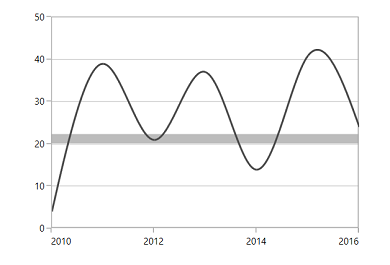
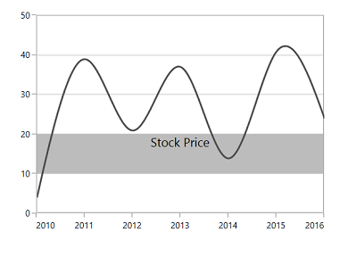
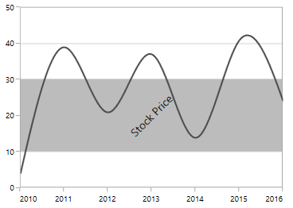
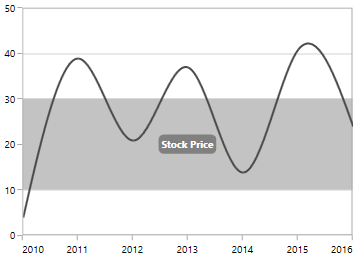
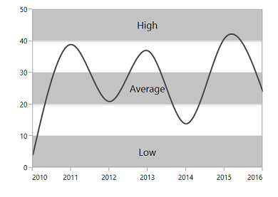
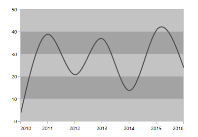
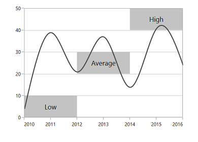
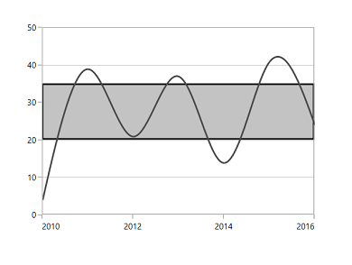
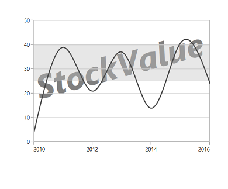

# Striplines in UWP Charts (SfChart)

[`SfChart`](https://help.syncfusion.com/cr/uwp/Syncfusion.UI.Xaml.Charts.SfChart.html) allows you to add [`Striplines`](https://help.syncfusion.com/cr/uwp/Syncfusion.UI.Xaml.Charts.ChartAxisBase2D.html#Syncfusion_UI_Xaml_Charts_ChartAxisBase2D_StripLines) to the chart, which shades the specific region or range in the plot area background at regular or custom intervals. 

## Positioning the Striplines

[`SfChart`](https://help.syncfusion.com/cr/uwp/Syncfusion.UI.Xaml.Charts.SfChart.html) provides [`Start`](https://help.syncfusion.com/cr/uwp/Syncfusion.UI.Xaml.Charts.ChartStripLine.html#Syncfusion_UI_Xaml_Charts_ChartStripLine_Start) and [`Width`](https://help.syncfusion.com/cr/uwp/Syncfusion.UI.Xaml.Charts.ChartStripLine.html#Syncfusion_UI_Xaml_Charts_ChartStripLine_Width) property for defining the Stripline start and end range. These values correspond to the axis values (or range). The Stripline can be filled using brush set in [`Background`](https://help.syncfusion.com/cr/uwp/Syncfusion.UI.Xaml.Charts.ChartStripLine.html#Syncfusion_UI_Xaml_Charts_ChartStripLine_Background) property.





<syncfusion:SfChart.SecondaryAxis>

<syncfusion:NumericalAxis >

<syncfusion:NumericalAxis.StripLines>

<syncfusion:ChartStripLine Start="20" Width="10"  Background="#BCBCBC"/>

</syncfusion:NumericalAxis.StripLines>

</syncfusion:NumericalAxis>

</syncfusion:SfChart.SecondaryAxis>





NumericalAxis axis = new NumericalAxis();

ChartStripLine stripline = new ChartStripLine()
{

    Start = 20, Width = 10,

    Background = new SolidColorBrush(Color.FromRgb(0xBC, 0xBC, 0xBC))

};

axis.StripLines.Add(stripline);

chart.SecondaryAxis = axis;





### Position based on device coordinates

You can specify the stripline width in pixel by enabling [`IsPixelWidth`](https://help.syncfusion.com/cr/uwp/Syncfusion.UI.Xaml.Charts.ChartStripLine.html#Syncfusion_UI_Xaml_Charts_ChartStripLine_IsPixelWidth) Boolean property. By default, this property value is false.

The following code example illustrates the positioning of stripline based on pixels.





<syncfusion:SfChart.SecondaryAxis>

<syncfusion:NumericalAxis >

<syncfusion:NumericalAxis.StripLines>

<syncfusion:ChartStripLine Start="20" Width="10"  

IsPixelWidth="True" Background="#BCBCBC"/>

</syncfusion:NumericalAxis.StripLines>

</syncfusion:NumericalAxis>

</syncfusion:SfChart.SecondaryAxis>





NumericalAxis axis = new NumericalAxis();

ChartStripLine stripline = new ChartStripLine()
{

    Start = 20, Width = 10,

    IsPixelWidth = true,

    Background = new SolidColorBrush(Color.FromRgb(0xBC, 0xBC, 0xBC))

};

axis.StripLines.Add(stripline);

chart.SecondaryAxis = axis;





## Label 

We can define any text inside the stripline using [`Label`](https://help.syncfusion.com/cr/uwp/Syncfusion.UI.Xaml.Charts.ChartStripLine.html#Syncfusion_UI_Xaml_Charts_ChartStripLine_Label) property. Also [`SfChart`](https://help.syncfusion.com/cr/uwp/Syncfusion.UI.Xaml.Charts.SfChart.html) provide various customization options for this label like alignment, templates, etc.

The [`LabelHorizontalAlignment`](https://help.syncfusion.com/cr/uwp/Syncfusion.UI.Xaml.Charts.ChartStripLine.html#Syncfusion_UI_Xaml_Charts_ChartStripLine_LabelHorizontalAlignment) and [`LabelVerticalAlignment`](https://help.syncfusion.com/cr/uwp/Syncfusion.UI.Xaml.Charts.ChartStripLine.html#Syncfusion_UI_Xaml_Charts_ChartStripLine_LabelVerticalAlignment) property can be used for positioning the labels inside the stripline.





<syncfusion:SfChart.SecondaryAxis>

<syncfusion:NumericalAxis>              

<syncfusion:NumericalAxis.StripLines>

<syncfusion:ChartStripLine Start="10" Width="10"  

Label="Stock Price" 

LabelHorizontalAlignment="Center" 

LabelVerticalAlignment="Top"

Background="#BCBCBC"/>

</syncfusion:NumericalAxis.StripLines>

</syncfusion:NumericalAxis>

</syncfusion:SfChart.SecondaryAxis>





NumericalAxis axis = new NumericalAxis();

ChartStripLine stripline = new ChartStripLine()
{

    Start = 20, Width = 10,

    Label = "Stock Price",

    LabelHorizontalAlignment = HorizontalAlignment.Center,

    LabelVerticalAlignment = VerticalAlignment.Top,

    Background = new SolidColorBrush(Color.FromRgb(0xBC, 0xBC, 0xBC))

};

axis.StripLines.Add(stripline);

chart.SecondaryAxis = axis;





### Rotating the label

The label can be rotated to the specified angle using [`LabelAngle`](https://help.syncfusion.com/cr/uwp/Syncfusion.UI.Xaml.Charts.ChartStripLine.html#Syncfusion_UI_Xaml_Charts_ChartStripLine_LabelAngle) property. The following code example explains the rotation of stripline label:





<syncfusion:SfChart.SecondaryAxis>

<syncfusion:NumericalAxis>     

<syncfusion:NumericalAxis.StripLines>

<syncfusion:ChartStripLine Start="10" Width="20"  

Label="Stock Price" 

LabelAngle="-45"

Background="#BCBCBC"/>

</syncfusion:NumericalAxis.StripLines>

</syncfusion:NumericalAxis>

</syncfusion:SfChart.SecondaryAxis>





NumericalAxis axis = new NumericalAxis();

ChartStripLine stripline = new ChartStripLine()
{

    Start = 20, Width = 10,

    Label = "Stock Price",

    LabelAngle = -45,

    Background = new SolidColorBrush(Color.FromRgb(0xBC, 0xBC, 0xBC))

};

axis.StripLines.Add(stripline);

chart.SecondaryAxis = axis;





N> Here, Start and Width of the label is adjusted based on the rotation angle. Stripline won’t adjust its range based on the stripline angle.

### Template support for the label

[`LabelTemplate`](https://help.syncfusion.com/cr/uwp/Syncfusion.UI.Xaml.Charts.ChartStripLine.html#Syncfusion_UI_Xaml_Charts_ChartStripLine_LabelTemplate) property allows you to define the data template for the stripline label like the following code example.



<syncfusion:NumericalAxis>

<syncfusion:NumericalAxis.StripLines>

<syncfusion:ChartStripLine Width="20"

Start="10" 

Label="Stock Price" 

Background="#C3C3C3">

<syncfusion:ChartStripLine.LabelTemplate>

<DataTemplate >

<Border Background="Gray" CornerRadius="5" >

<TextBlock Text="{Binding }" Foreground="White"

FontStyle="Normal" FontSize="10" FontWeight="Bold"

Margin="3">

</TextBlock>                                        

</Border>

</DataTemplate>

</syncfusion:ChartStripLine.LabelTemplate>

</syncfusion:ChartStripLine>

</syncfusion:NumericalAxis.StripLines>

</syncfusion:NumericalAxis>



## Multiple Striplines

You can add multiple number of striplines in the same axis like the following code example,





<syncfusion:SfChart.SecondaryAxis>

<syncfusion:NumericalAxis >

<syncfusion:NumericalAxis.StripLines>

<syncfusion:ChartStripLine 

SegmentStartValue="0" 

Width="10" 

Start="0" Label="Low" Background="#C3C3C3"/>

<syncfusion:ChartStripLine 

Width="10" Start="20"

Label="Average" Background="#C3C3C3"/>

<syncfusion:ChartStripLine 

Width="10" 

Start="40" Label="High" Background="#C3C3C3"/>

</syncfusion:NumericalAxis.StripLines>

</syncfusion:NumericalAxis>

</syncfusion:SfChart.SecondaryAxis>





NumericalAxis axis = new NumericalAxis();

ChartStripLine stripline1 = new ChartStripLine()
{

    SegmentStartValue = 0, Start = 0,

    Width = 10, Label = "Low",

    Background = new SolidColorBrush(Color.FromRgb(0xC3, 0xC3, 0xC3))

};

ChartStripLine stripline2 = new ChartStripLine()
{

    Start = 20, Width = 10,

    Label = "Average",

    Background = new SolidColorBrush(Color.FromRgb(0xC3, 0xC3, 0xC3))

};

ChartStripLine stripline3 = new ChartStripLine()
{

    Start = 40,Width = 10,

    Label = "High",

    Background = new SolidColorBrush(Color.FromRgb(0xC3, 0xC3, 0xC3))

};

axis.StripLines.Add(stripline1);

axis.StripLines.Add(stripline2);

axis.StripLines.Add(stripline3);

chart.SecondaryAxis = axis;





If you want to repeat the same type of stripline at regular intervals, [`SfChart`](https://help.syncfusion.com/cr/uwp/Syncfusion.UI.Xaml.Charts.SfChart.html) provides two properties [`RepeatEvery`](https://help.syncfusion.com/cr/uwp/Syncfusion.UI.Xaml.Charts.ChartStripLine.html#Syncfusion_UI_Xaml_Charts_ChartStripLine_RepeatEvery) and [`RepeatUntil`](https://help.syncfusion.com/cr/uwp/Syncfusion.UI.Xaml.Charts.ChartStripLine.html#Syncfusion_UI_Xaml_Charts_ChartStripLine_RepeatUntil).

N> This can be used to fill plot area background alternatively.





<syncfusion:NumericalAxis.StripLines>

<syncfusion:ChartStripLine RepeatEvery="20" RepeatUntil="50"

Width="10"  Start="0" Background="#C3C3C3"/>

<syncfusion:ChartStripLine RepeatEvery="20" RepeatUntil="50"

Width="10"  Start="10" Background="#A3A3A3"/>

</syncfusion:NumericalAxis.StripLines>





NumericalAxis axis = new NumericalAxis();

ChartStripLine stripline1 = new ChartStripLine()

{

    RepeatEvery = 20,

    RepeatUntil = 50,

    Start = 0, Width = 10,

    Background = new SolidColorBrush(Color.FromRgb(0xC3, 0xC3, 0xC3))

};

ChartStripLine stripline2 = new ChartStripLine()

{

    RepeatEvery = 20,

    RepeatUntil = 50,

    Start = 10, Width = 10,

    Background = new SolidColorBrush(Color.FromRgb(0xA3, 0xA3, 0xA3))

};

axis.StripLines.Add(stripline1);

axis.StripLines.Add(stripline2);

chart.SecondaryAxis = axis;





## Segmented Stripline

[`Striplines`](https://help.syncfusion.com/cr/uwp/Syncfusion.UI.Xaml.Charts.ChartAxisBase2D.html#Syncfusion_UI_Xaml_Charts_ChartAxisBase2D_StripLines) can also be placed in a particular region with respect to segment. You can enable the segment striplines using [`IsSegmented`](https://help.syncfusion.com/cr/uwp/Syncfusion.UI.Xaml.Charts.ChartStripLine.html#Syncfusion_UI_Xaml_Charts_ChartStripLine_IsSegmented) property.

So the start and end value of this type of striplines can be defined using [`SegmentStartValue`](https://help.syncfusion.com/cr/uwp/Syncfusion.UI.Xaml.Charts.ChartStripLine.html#Syncfusion_UI_Xaml_Charts_ChartStripLine_SegmentStartValue) and [`SegmentEndValue`](https://help.syncfusion.com/cr/uwp/Syncfusion.UI.Xaml.Charts.ChartStripLine.html#Syncfusion_UI_Xaml_Charts_ChartStripLine_SegmentEndValue) property.

The following code example demonstrates segmented striplines.





<syncfusion:SfChart.SecondaryAxis>

<syncfusion:NumericalAxis >

<syncfusion:NumericalAxis.StripLines>

<syncfusion:ChartStripLine 

IsSegmented="True" SegmentStartValue="0" 

Width="10" SegmentEndValue="2"                                               

SegmentAxisName="Segment1"  

Start="0" Label="Low" Background="#C3C3C3"/>

<syncfusion:ChartStripLine 

IsSegmented="True" SegmentStartValue="2"

SegmentAxisName="Segment2"  

Width="10" SegmentEndValue="4" Start="20"

Label="Average" Background="#C3C3C3"/>

<syncfusion:ChartStripLine 

IsSegmented="True" SegmentStartValue="4" 

Width="10" SegmentEndValue="6" 

SegmentAxisName="Segment3"  

Start="40" Label="High" Background="#C3C3C3"/>

</syncfusion:NumericalAxis.StripLines>

</syncfusion:NumericalAxis>

</syncfusion:SfChart.SecondaryAxis>





NumericalAxis axis = new NumericalAxis();

ChartStripLine stripline1 = new ChartStripLine()
{

    IsSegmented = true,

    SegmentStartValue = 0,

    SegmentEndValue = 2,

    SegmentAxisName = "Segment1",

    Start = 0, Width = 10,

    Label = "Low",

    Background = new SolidColorBrush(Color.FromRgb(0xC3, 0xC3, 0xC3))

};

ChartStripLine stripline2 = new ChartStripLine()
{
    IsSegmented = true,

    SegmentStartValue = 2,

    SegmentEndValue = 4,

    SegmentAxisName = "Segment2",

    Start = 20, Width = 10,

    Label = "Average",

    Background = new SolidColorBrush(Color.FromRgb(0xC3, 0xC3, 0xC3))
};

ChartStripLine stripline3 = new ChartStripLine()
{

    IsSegmented = true,

    SegmentStartValue = 4,

    SegmentEndValue = 6,

    SegmentAxisName = "Segment3",

    Start = 40, Width = 10,

    Label = "High",

    Background = new SolidColorBrush(Color.FromRgb(0xC3, 0xC3, 0xC3))

};

axis.StripLines.Add(stripline1);

axis.StripLines.Add(stripline2);

axis.StripLines.Add(stripline3);

chart.SecondaryAxis = axis;





## Customization

The background, border brush and border thickness of the stripline can be modified using [`Background`](https://help.syncfusion.com/cr/uwp/Syncfusion.UI.Xaml.Charts.ChartStripLine.html#Syncfusion_UI_Xaml_Charts_ChartStripLine_Background), [`BorderBrush`](https://help.syncfusion.com/cr/uwp/Syncfusion.UI.Xaml.Charts.ChartStripLine.html#Syncfusion_UI_Xaml_Charts_ChartStripLine_BorderBrush) and [`BorderThickness`](https://help.syncfusion.com/cr/uwp/Syncfusion.UI.Xaml.Charts.ChartStripLine.html#Syncfusion_UI_Xaml_Charts_ChartStripLine_BorderThickness) properties  as in the following code example.





<syncfusion:SfChart.SecondaryAxis>

<syncfusion:NumericalAxis >

<syncfusion:NumericalAxis.StripLines>

<syncfusion:ChartStripLine Start="20" Width="15"   

BorderBrush="Black" 

BorderThickness="2"

Background="#C3C3C3"/>

</syncfusion:NumericalAxis.StripLines>

</syncfusion:NumericalAxis>

</syncfusion:SfChart.SecondaryAxis>





NumericalAxis axis = new NumericalAxis();

ChartStripLine stripline = new ChartStripLine()  

{

    Start = 20, Width = 15,

    BorderThickness = new Thickness(2),

    BorderBrush = new SolidColorBrush(Colors.Black),

    Background = new SolidColorBrush(Color.FromRgb(0xC3, 0xC3, 0xC3))

};

axis.StripLines.Add(stripline);

chart.SecondaryAxis = axis;





### Transparency 

You can set the transparency for the striplines using `Opacity` property as in the following code snippets.





<syncfusion:SfChart.SecondaryAxis>

<syncfusion:NumericalAxis >

<syncfusion:NumericalAxis.StripLines>

<syncfusion:ChartStripLine Start="25" Width="15" 

Opacity="0.4" Background="#C3C3C3"/>

</syncfusion:NumericalAxis.StripLines>

</syncfusion:NumericalAxis>

</syncfusion:SfChart.SecondaryAxis>

<syncfusion:SfChart.Watermark>

<syncfusion:Watermark >

<syncfusion:Watermark.Content>

<TextBlock Text="StockValue">

<TextBlock.RenderTransform>

<RotateTransform Angle="345"/>

</TextBlock.RenderTransform>                        

</TextBlock>

</syncfusion:Watermark.Content>

</syncfusion:SfChart.Watermark>





NumericalAxis axis = new NumericalAxis();

ChartStripLine stripline = new ChartStripLine()
{

    Start = 25,Width = 15,

    Opacity = 0.4,

    Background = new SolidColorBrush(Color.FromRgb(0xC3, 0xC3, 0xC3))

};

axis.StripLines.Add(stripline);

chart.SecondaryAxis = axis;

chart.Watermark = new Watermark()
{

    HorizontalAlignment = HorizontalAlignment.Center,

    VerticalAlignment = VerticalAlignment.Center

};

TextBlock textBlock = new TextBlock();

textBlock.Text = "StockValue";

textBlock.FontSize = 70;

textBlock.RenderTransform = new RotateTransform() { Angle = 345 };

chart.Watermark.Content = textBlock;





