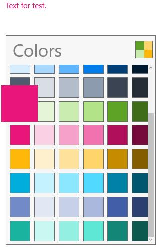

# Dealing with SelectedColor in UWP Color Palette (SfColorPalette)

Colors can be selected in `SfColorPickerPalette` by navigating between swatches

## Selecting Color from palette

`SelectedColor` property is used to get the selected color in `SfColorPickerPalette`. It is a read-only property. The return value is a Color, so ColorToBrushConverter is needed for bounding with brush properties:





<Page xmlns:media="using:Syncfusion.UI.Xaml.Controls.Media"

xmlns:shared="using:Syncfusion.UI.Xaml.Converters">

<Page.Resources>

<shared:ColorToBrushConverter x:Key="ColorToBrushConverter"/>

</Page.Resources>

<Grid>

<TextBlock x:Name="testText" Text="Text for test."
           Foreground="{Binding ElementName=colorPalette,Path=SelectedColor,
		   Converter={StaticResource ColorToBrushConverter} ,Mode=TwoWay}"/>

<media:SfColorPalette x:Name="colorPalette"/>

</Grid>

</Page>









testText.Foreground = new SolidColorBrush() { Color = colorPalette.SelectedColor };





testText.Foreground = New SolidColorBrush() With {.Color = colorPalette.SelectedColor}





## Notifying Color Selection Change

`SelectedColorChanged` event is fired whenever selected color is changed. Here is an example to change the foreground of a text block when selected color changes in `SfColorPalette`:





<StackPanel>

<TextBlock x:Name="testText" Text="Text for test."/>

<media:SfColorPalette x:Name="colorPalette"
                      SelectedColorChanged="colorPalette_SelectedColorChanged"/>

</StackPanel>









private void colorPalette_SelectedColorChanged(object sender, DependencyPropertyChangedEventArgs e)

{

testText.Foreground = new SolidColorBrush() { Color = colorPalette.SelectedColor };

}





Private Sub colorPalette_SelectedColorChanged(ByVal sender As Object, ByVal e As DependencyPropertyChangedEventArgs)

testText.Foreground = New SolidColorBrush() With {.Color = colorPalette.SelectedColor}

End Sub





## Navigation to Swatches

Navigating to swatches can done by clicking on the back button or by programmatically.

### Navigating Back to Swatches

`GoBack` method is used to programmatically navigate backwards in `SfColorPalette`. `CanGoBack` property is used to check whether navigate back is possible or not.





colorPalette.GoBack();





colorPalette.GoBack()





