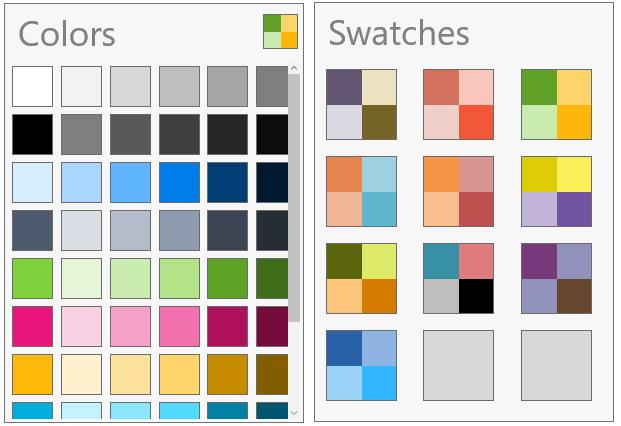

# Getting Started with UWP Color Palette (SfColorPalette)

This section explains how to create a color palette with predefined swatches using `SfColorPalette` control.

## Creating SfColorPalette Control

Create a Universal Windows Platform project in Visual Studio and refer to the following assemblies.

1. Syncfusion.SfColorPickers.UWP
2. Syncfusion.SfRadialMenu.UWP
3. Syncfusion.SfShared.UWP

### Adding SfColorPalette Control through XAML

1.Include the namespace for Syncfusion.SfSfColorPickers.UWP assembly in MainPage.xaml





<Page xmlns="http://schemas.microsoft.com/winfx/2006/xaml/presentation"

xmlns:x="http://schemas.microsoft.com/winfx/2006/xaml"

xmlns:media="using:Syncfusion.UI.Xaml.Controls.Media">





2.Now add the `SfColorPalette` control with a required optimal name using the included namespace





<media:SfColorPalette x:Name="colorPalette">





### Adding SfColorPalette Control through Code-behind

1.Include the namespace for Syncfusion. SfSfColorPickers.UWP assembly in MainPage.xaml.cs





using Syncfusion.UI.Xaml.Controls.Media;





Imports Syncfusion.UI.Xaml.Controls.Media





2.Now add the `SfColorPalette` control with a required optimal name 





SfColorPalette colorPalette = new SfColorPalette();





Dim colorPalette As New SfColorPalette()





