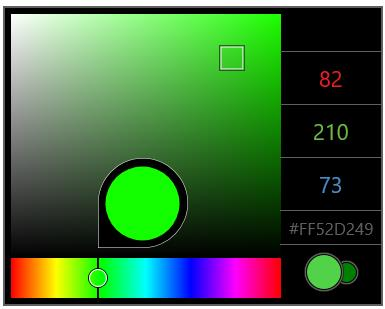

# Adjusting Color Values in UWP Color Picker (SfColorPicker)

## Adjusting the Hue Value

`SfColorPicker` allows to change the hue value by sliding the HueThumb. In WinRT, holding the thumb shows the color tool tip that indicates the current hue color.

## Adjusting RGB Values

RadialSliders are provided to change the RGB values. Sliders can be enabled by touching the R, G & B values.

## Adjusting HexaDecimal Color Code

Hexadecimal color code of the selected color is displayed in the right side panel. It can be copied using context menu in both tablets and Windows Phone device.

