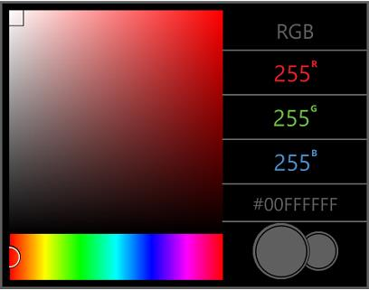

# Getting Started with UWP Color Picker control

This section explains how to create a RGB color model picker using the `SfColorPicker` control.

## Creating SfColorPicker Control

Create a Universal Windows Platform project in Visual Studio and refer to the following assemblies.

1. Syncfusion.SfColorPickers.UWP

2. Syncfusion.SfRadialMenu.UWP

3. Syncfusion.SfShared.UWP

### Adding SfColorPicker Control through XAML

1.Include the namespace for Syncfusion.SfSfColorPickers.UWP assembly in MainPage.xaml





<Page xmlns="http://schemas.microsoft.com/winfx/2006/xaml/presentation"

xmlns:x="http://schemas.microsoft.com/winfx/2006/xaml"

xmlns:media="using:Syncfusion.UI.Xaml.Controls.Media">





2.Now add the `SfColorPicker` control with a required optimal name using the included namespace





<media:SfColorPicker x:Name="colorPicker">





### Adding SfColorPicker Control through Code-Behind

1.Include the namespace for Syncfusion. SfSfColorPickers.UWP assembly in MainPage.xaml.cs





using Syncfusion.UI.Xaml.Controls.Media;





Imports Syncfusion.UI.Xaml.Controls.Media





2.Now add the SfColorPicker control with a required optimal name 





SfColorPicker colorPicker = new SfColorPicker();





Dim colorPicker As New SfColorPicker()





