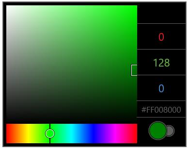
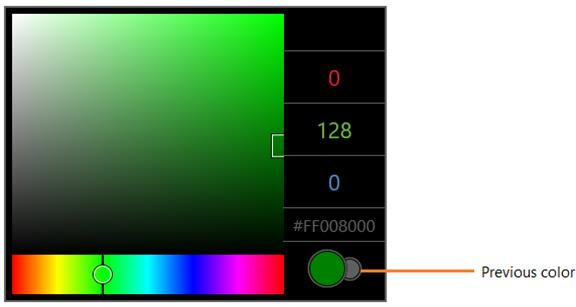

# Selecting Color in UWP Color Picker (SfColorPicker)

## Retrieving the Current Selected Color

`SelectedColor` property is used to get the selected color in `SfColorPicker`. The selected color is marked by the selected color thumb. SelectedColor can also be set using hexadecimal color code.





<media:SfColorPicker SelectedColor="#FF008000"/>









colorPicker.SelectedColor = Colors.Green;





colorPicker.SelectedColor = Colors.Green





## Retrieving the Previous Selected Color

`PreviousColor` property is used to get the previously selected color in `SfColorPicker`. The previous color is displayed in the ellipse placed at right bottom of `SfColorPicker` control.





Color previousColor = colorPicker.PreviousColor;





Dim previousColor As Color = colorPicker.PreviousColor





## Notifying the Selected Color Change

`SelectedColorChanged` event is fired when the selected color is changed in `SfColorPicker`





<media:SfColorPicker x:Name="colorPicker"
                     SelectedColorChanged="colorPicker_SelectedColorChanged"/>









private void colorPicker_SelectedColorChanged(object sender, DependencyPropertyChangedEventArgs e)

{

}





Private Sub colorPicker_SelectedColorChanged(ByVal sender As Object, ByVal e As DependencyPropertyChangedEventArgs)

End Sub





